# DAMO RADAR（*Science* 2026）—— 40 位作者关系图谱

> 调研日期：**2026-09-20**。来源：PubMed E-utilities、Crossref、OpenAlex、ORCID、GitHub / HuggingFace API、美国劳工部 LCA 披露、浙大与浙大一院官网、各县市医院官网、国家卫健委与浙江省卫健委政策原文、中新网 / 浙报集团、Wayback、CNIPA 专利著录，以及 RADAR 仓库源码。
> 中文名查不到的一律留空，不按拼音猜。
> 论文：*An expert-level generalist AI for abdominal CT diagnosis*, **Science 393(6817):eaec6129**, 2026. DOI [10.1126/science.aec6129](https://doi.org/10.1126/science.aec6129) · PMID 42752131 · 代码 [alibaba-damo-academy/damo-radar](https://github.com/alibaba-damo-academy/damo-radar)

## 目录

- [一页概览](#一页概览)
- [15 位核心作者](#15-位核心作者)
- [40 位作者中文名总表](#40-位作者中文名总表)
- [结构：四条腿](#结构四条腿)
- [三条血统线](#三条血统线)
- [为什么是这八家县医院](#为什么是这八家县医院)
- [与 MedSAM 的关系](#与-medsam-的关系)
- [技术底细](#技术底细)
- [与你研究的交集](#与你研究的交集)
- [求职通道](#求职通道)
- [数据缺口](#数据缺口)
- [文件说明](#文件说明)

---

## 一页概览

| | |
|---|---|
| **是什么** | 腹部增强 CT 的全自动诊断视觉-语言模型。输入整卷，输出 **18 个器官 / 146 个征象**的概率。无提示。 |
| **末位通讯** | **梁廷波**（Tingbo Liang）—— 浙大一院**院长、党委副书记**，第十四届全国人大代表，长江学者，杰青 |
| **第一作者** | **章琦**（Qi Zhang）—— 浙大一院肝胆胰外科，**外科医生，不是做 AI 的**；同时是浙大一院党委副书记 |
| **AI 侧资深作者** | **张灵**（Ling Zhang）—— 达摩院 Washington DC，第 39 位（倒数第二） |
| **共同第一作者** | **6 位**（PubMed XML 的 `EqualContrib="Y"` 标在前六位）：章琦、张建鹏、曹维维、Zilin Lu、常琬星、Haonan Ding |
| **作者构成** | 浙大一院 13 · 达摩院+湖畔 11 · 基层医院 9 · 海外学术 3 · 浙大计算机 2 · 宁波二院 1 · 东南大学 1 = **40** |
| **规模** | 训练 424,911 次检查 / 1500 万 anatomy-wise 图文对，**零人工标注**（报告经 Qwen 解析）|
| **核心数字** | 146 征象平均 AUC 0.913（对照 VLM 0.776）· 8 外部中心 0.895 · 病理确诊四种癌 0.891–0.984 · 急腹症（训练时排除）0.904 · 26 位医生 reader study 敏感度 +约 10% |
| **许可** | 代码 Apache-2.0；**权重 CC BY-NC-SA 4.0（禁商用）** |
| **前序** | **PANDA**（*Nature Medicine* 2023, PMID 37985692）—— 两篇共享 4 人，单位一致 |
| **中文名结果** | **28 确认 · 1 可能 · 11 未查到**（未查到的以达摩院初级研究员和在读博士生为主）|

> [!insight] 一句话读懂作者排序
> ==第一作者是外科医生，末位通讯是医院院长，AI 侧资深作者排在倒数第二。==
> 这个排法在中文医学期刊语境里读法很清楚：**临床方拥有这项工作**。

---

## 15 位核心作者

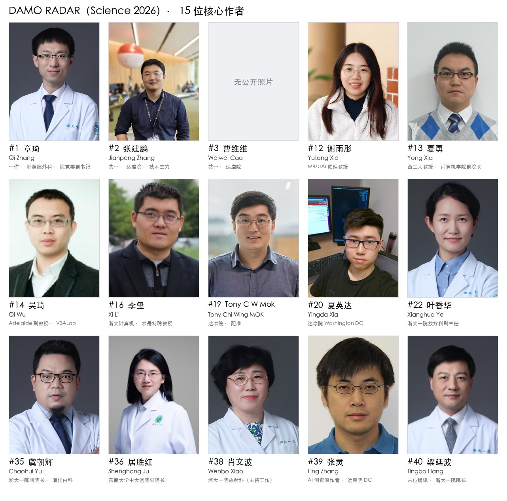

每人一页：画像、在 RADAR 里的位置、履历时间线、研究方向、代表作、师承与关系、学术指标、对你意味着什么。照片只取自所在机构的官方个人页或本人主页，出处记在各页「来源」末行；曹维维没有可确认身份的公开照片。

<!-- MEMBERS:START -->
| 照片 | 姓名 | # | 身份 |
|:---:|---|---:|---|
| 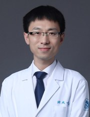 | **[章琦 Qi Zhang](members/01-qi-zhang.md)** | 1 | 浙大一院肝胆胰外科 教授/主任医师/博导；**院党委副书记**。共一 |
| 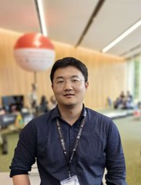 | **[张建鹏 Jianpeng Zhang](members/02-jianpeng-zhang.md)** | 2 | 达摩院 Staff Algorithm Engineer；**西工大夏勇门下**。共一，技术侧主力 |
| — | **[曹维维 Weiwei Cao](members/03-weiwei-cao.md)** | 3 | 达摩院医疗 AI（湖畔）。共一 |
| 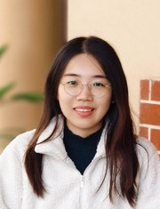 | **[谢雨彤 Yutong Xie](members/12-yutong-xie.md)** | 12 | MBZUAI 计算机视觉系 **助理教授**；西工大 2016 级直博，**导师夏勇** |
| 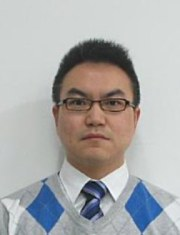 | **[夏勇 Yong Xia](members/13-yong-xia.md)** | 13 | ⚠️ **西北工业大学计算机学院长聘教授、博导、副院长** —— 论文只标了「宁波市第二医院放射科」 |
| 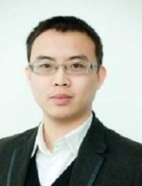 | **[吴琦 Qi Wu](members/14-qi-wu.md)** | 14 | Adelaide AIML 副教授，V3A Lab 主任 |
| 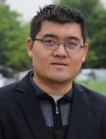 | **[李玺 Xi Li](members/16-xi-li.md)** | 16 | 浙大计算机学院 教授、**求是特聘教授** |
| 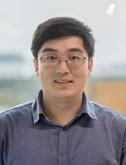 | **[Tony C W Mok](members/19-tony-c-w-mok.md)** | 19 | 香港人，署名 **Tony Chi Wing MOK**；达摩院算法工程师；HKUST 博士（导师 **Pedro Sander + Albert C.S. Chung** 两人） |
| 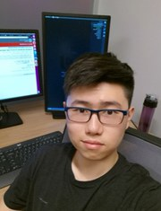 | **[夏英达 Yingda Xia](members/20-yingda-xia.md)** | 20 | 达摩院 **Washington DC**；JHU Alan Yuille 门下 |
| 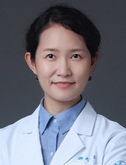 | **[叶香华 Xianghua Ye](members/22-xianghua-ye.md)** | 22 | 浙大一院放疗科 **副主任**、主任医师 |
| 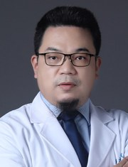 | **[虞朝辉 Chaohui Yu](members/35-chaohui-yu.md)** | 35 | 浙大一院 **副院长**、消化内科主任 |
| 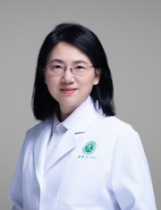 | **[居胜红 Shenghong Ju](members/36-shenghong-ju.md)** | 36 | 东南大学中大医院 **副院长**、医学影像部主任、东南大学首席教授 |
| 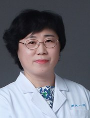 | **[肖文波 Wenbo Xiao](members/38-wenbo-xiao.md)** | 38 | 浙大一院放射科 **副主任（主持工作）**、主任医师 |
| 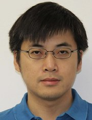 | **[张灵 Ling Zhang](members/39-ling-zhang.md)** | 39 | 达摩院 Washington DC 资深算法专家。AI 侧通讯 |
| 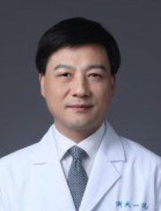 | **[梁廷波 Tingbo Liang](members/40-tingbo-liang.md)** | 40 | 浙大一院 **院长、党委副书记**；全国人大代表。末位通讯 |
<!-- MEMBERS:END -->

其余 25 位作者（达摩院初级研究员与在读学生 8 人、浙大一院临床团队 8 人、外部验证医院 9 人）合在一页：**[members/others.md](members/others.md)**。

---

## 40 位作者中文名总表

把握分三档：**✅ 确认** = 中文权威来源直接看到英↔中对应，或单位+职务+方向三重锁定；**🟡 可能** = 间接证据；**❓ 未知** = 没查到，**留空不猜**。

<!-- NAME-TABLE:START -->
| # | 英文 | 中文 | 把握 | 单位 · 身份 | PANDA |
|---:|---|---|:---:|---|:---:|
| 1 | [Qi Zhang](members/01-qi-zhang.md) | **章琦** | ✅ | 浙大一院肝胆胰外科 教授/主任医师/博导；**院党委副书记**。共一 | ✅ |
| 2 | [Jianpeng Zhang](members/02-jianpeng-zhang.md) | **张建鹏** | ✅ | 达摩院 Staff Algorithm Engineer；**西工大夏勇门下**。共一，技术侧主力 |  |
| 3 | [Weiwei Cao](members/03-weiwei-cao.md) | **曹维维** | ✅ | 达摩院医疗 AI（湖畔）。共一 |  |
| 4 | [Zilin Lu](members/others.md) | — | ❓ | **西工大计算机学院在读博士**，达摩院实习。共一。ORCID 教育栏写 NWPU |  |
| 5 | [Wanxing Chang](members/others.md) | **常琬星** | ✅ | 达摩院算法工程师。共一 |  |
| 6 | [Haonan Ding](members/others.md) | — | ❓ | 浙大一院肝胆胰外科**硕士生**（ORCID employments）。共一 |  |
| 7 | [Cao Chen](members/others.md) | — | ❓ | 浙大一院肝胆胰外科，推断为章琦组研究生/在培医师 |  |
| 8 | [Zhi Li](members/others.md) | **李志** | ✅ | 浙大一院放射科 主治医师 |  |
| 9 | [Xing Xue](members/others.md) | **薛星** | ✅ | 浙大一院放射科（ORCID 自述 2018-08 起受雇） |  |
| 10 | [Sinuo Wang](members/others.md) | — | ❓ | Adelaide AIML 博士生（导师吴琦、谢雨彤），在达摩院实习 |  |
| 11 | [Shaoteng Zhang](members/others.md) | — | ❓ | **西工大计算机学院在读博士**，达摩院实习 |  |
| 12 | [Yutong Xie](members/12-yutong-xie.md) | **谢雨彤** | ✅ | MBZUAI 计算机视觉系 **助理教授**；西工大 2016 级直博，**导师夏勇** |  |
| 13 | [Yong Xia](members/13-yong-xia.md) | **夏勇** | ✅ | ⚠️ **西北工业大学计算机学院长聘教授、博导、副院长** —— 论文只标了「宁波市第二医院放射科」 |  |
| 14 | [Qi Wu](members/14-qi-wu.md) | **吴琦** | ✅ | Adelaide AIML 副教授，V3A Lab 主任 |  |
| 15 | [Zhongyi Shui](members/others.md) | — | ❓ | 浙大-西湖大学联合培养博士生（推断） |  |
| 16 | [Xi Li](members/16-xi-li.md) | **李玺** | ✅ | 浙大计算机学院 教授、**求是特聘教授** |  |
| 17 | [Zhilin Zheng](members/others.md) | — | ❓ | 达摩院算法研究员（2022 起持续正式署名，非实习） |  |
| 18 | [Yanjie Zhou](members/others.md) | — | ❓ | 达摩院算法研究员；论文另写作 Yan-Jie Zhou |  |
| 19 | [Tony C W Mok](members/19-tony-c-w-mok.md) | — | ❓ | 香港人，署名 **Tony Chi Wing MOK**；达摩院算法工程师；HKUST 博士（导师 **Pedro Sander + Albert C.S. Chung** 两人） |  |
| 20 | [Yingda Xia](members/20-yingda-xia.md) | **夏英达** | ✅ | 达摩院 **Washington DC**；JHU Alan Yuille 门下 | ✅ |
| 21 | [Hongkan Wang](members/others.md) | — | ❓ | 浙大一院肝胆胰外科，深度参与早期临床试验（GCP） |  |
| 22 | [Xianghua Ye](members/22-xianghua-ye.md) | **叶香华** | ✅ | 浙大一院放疗科 **副主任**、主任医师 |  |
| 23 | [Tao Ma](members/others.md) | **马涛** | ✅ | 浙大一院肝胆胰外科主任医师；**兵团第一师医院党委副书记兼院长**、中组部第十一批援疆领队 |  |
| 24 | [Jie Peng](members/others.md) | **彭杰** | ✅ | 兵团第一师医院 医学影像中心主任、副主任医师 |  |
| 25 | [Xiaoguang Wang](members/others.md) | **王晓光** | ✅ | 嘉兴一院 **党委委员、副院长**、主任医师 |  |
| 26 | [Jian Ding](members/others.md) | **丁健** | ✅ | 嘉兴一院放射科 **副主任**、副主任医师 |  |
| 27 | [Yuming Gao](members/others.md) | **高玉明** | ✅ | 绩溪县人民医院 **院长**、主任医师 |  |
| 28 | [Huazhen Ye](members/others.md) | **叶华震** | ✅ | 景宁县人民医院放射科 **副主任（主持工作）** |  |
| 29 | [Yiping Liu](members/others.md) | **刘义平** | ✅ | 嵊州市人民医院放射科 **主任**、主任医师 |  |
| 30 | [Dongjie Chen](members/others.md) | **陈东杰** | 🟡 | 海宁市人民医院普外科三（肝胆胰脾疝）。职称未查到 |  |
| 31 | [Zhaomin Ni](members/others.md) | **倪兆敏** | ✅ | 安吉县人民医院放射科 主任医师 |  |
| 32 | [Jianwen Ning](members/others.md) | **宁建文** | ✅ | 浙大一院急诊科；**浙大一院安吉分院党委副书记、院长** |  |
| 33 | [Wei Zhang](members/others.md) | **张微** | ✅ | 浙大一院肝胆胰外科主任医师、肝移植中心副主任；兼良渚分院 |  |
| 34 | [Jian Liu](members/others.md) | **刘剑** | ✅ | 北仑区人民医院（浙大一院北仑分院）**院长**、主任医师 |  |
| 35 | [Chaohui Yu](members/35-chaohui-yu.md) | **虞朝辉** | ✅ | 浙大一院 **副院长**、消化内科主任 |  |
| 36 | [Shenghong Ju](members/36-shenghong-ju.md) | **居胜红** | ✅ | 东南大学中大医院 **副院长**、医学影像部主任、东南大学首席教授 |  |
| 37 | [Jianfeng Zhang](members/others.md) | — | ❓ | 达摩院医学影像研究员（CT-SAM3D、Med-Query 作者）。与达摩院院长张建锋同音，非同一人 |  |
| 38 | [Wenbo Xiao](members/38-wenbo-xiao.md) | **肖文波** | ✅ | 浙大一院放射科 **副主任（主持工作）**、主任医师 |  |
| 39 | [Ling Zhang](members/39-ling-zhang.md) | **张灵** | ✅ | 达摩院 Washington DC 资深算法专家。AI 侧通讯 | ✅ |
| 40 | [Tingbo Liang](members/40-tingbo-liang.md) | **梁廷波** | ✅ | 浙大一院 **院长、党委副书记**；全国人大代表。末位通讯 | ✅ |
<!-- NAME-TABLE:END -->

> [!strategy] 读这张表的正确方式：看职务，不看职称
> ==基层医院那 9 位里，有 4 位是院长或副院长（马涛、王晓光、高玉明、刘剑、宁建文），其余是科室主任或主持工作的副主任。==
> 这不是"找了几个基层医生帮忙标数据"，这是**院级签署的机构合作**。

---

## 结构：四条腿

<picture>
  <source media="(prefers-color-scheme: dark)" srcset="figures/radar-structure.dark.png">
  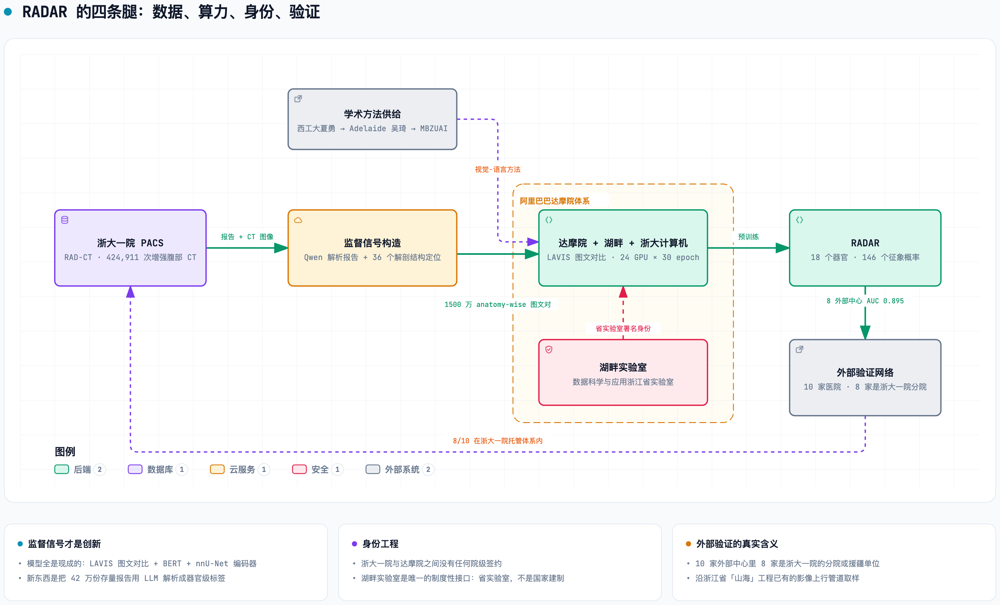
</picture>

> 🖼 上图是静态导出。**交互版（三个导览视图 + 搜索聚焦 + 关系追踪 + 导出）→ [figures/radar-structure.html](figures/radar-structure.html)**（clone 后本地打开）
> 图源 [figures/radar-structure.architecture.json](figures/radar-structure.architecture.json)。改图改 JSON，再跑 `archify deliver` 与 `figures/export-png.py`。

一句话读法：==数据从浙大一院 PACS 出发，经 Qwen 把 42 万份报告解析成器官级标签，在达摩院训练出 RADAR，最后回到浙大一院自己的分院体系做"外部"验证。==

| 腿 | 人数 | 谁 |
|---|---:|---|
| 临床 / 数据 | 13 | 浙大一院：肝胆胰外科（章琦·共一 / 梁廷波·末位通讯）、放射科（肖文波）、消化内科（虞朝辉·副院长）、急诊科、放疗科 |
| AI | 11 | 达摩院杭州 + **湖畔实验室** + 浙大计算机学院（三重挂靠）；张灵、夏英达在 Washington DC |
| 外部验证 | 9 | 10 家医院，**其中 8 家在浙大一院的托管 / 分院 / 对口支援体系内** |
| 学术方法供给 | 5 | 西工大夏勇 → Adelaide 吴琦 → MBZUAI 谢雨彤；浙大计算机李玺 |

---

## 三条血统线

### ① 西北工业大学 · 夏勇门下 —— 这篇论文的技术班底

⚠️ **本次调查最大的一处消歧**：论文给 **Yong Xia** 标的**唯一**单位是"Department of Radiology, Ningbo No. 2 Hospital"，一个字的西工大都没有。

**判定：就是西北工业大学计算机学院的夏勇教授**，长聘教授、博导、计算机学院副院长。证据链：

| 证据 | 内容 |
|---|---|
| 合著网络 | OpenAlex 查 Jianpeng Zhang 的合著，**头号合著者就是 Yong Xia，22 篇共著，机构标 NWPU ×21**；Yutong Xie 第 3 位，NWPU ×18 |
| 师承 | **谢雨彤是西工大 2016 级直博，导师夏勇**，博士论文《有限标注的医学影像分割及分类》 |
| 同单位号的旁证 | **Zilin Lu 的 ORCID（0000-0003-2437-283X）educations 明写 Northwestern Polytechnical University** —— 他和夏勇共享同一个单位编号 #7 |
| 宁波通道已证实 | 夏勇论文里出现过 `Ningbo Institute of Northwestern Polytechnical University`（西北工业大学宁波研究院），见其 2023 DoDNet 期刊版与 2025 PICK |

==所以 #4 Zilin Lu、#11 Shaoteng Zhang、#13 夏勇 三个挂"宁波二院放射科"的人，其实是一条西工大线。== 这个单位号是这条线的落点，不是一群放射科医生。

⚠️ RADAR 在 OpenAlex 与 PubMed 两处的 author-affiliation 记录并不完全一致（谢雨彤在一处记为 MBZUAI、另一处记为 Adelaide）。用本文的 affiliation 字段做推断要带这个保留。

### ② NIH → 平安 PAII → 达摩院 —— AI 侧的整建制迁徙

<picture>
  <source media="(prefers-color-scheme: dark)" srcset="figures/damo-lineage.dark.png">
  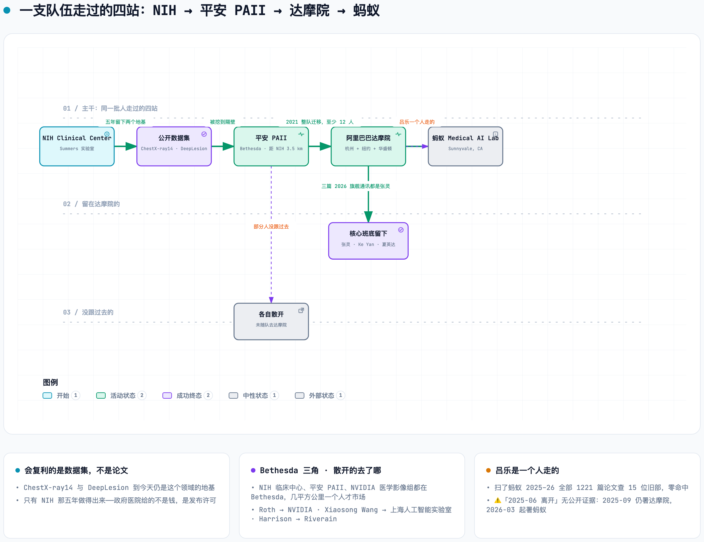
</picture>

> 🖼 上图是静态导出。**交互版（主干四站 / 沿途资产 / 谁走谁留，三个导览视图）→ [figures/damo-lineage.html](figures/damo-lineage.html)**
> 图源 [figures/damo-lineage.lifecycle.json](figures/damo-lineage.lifecycle.json)。

**要点：**

- **Bethesda 三角**：NIH 临床中心、平安 PAII、NVIDIA 医学影像组三家都在 Bethesda，2015–2021 从同一人才池抓人。这不是三次孤立跳槽，是几平方公里内的一个人才市场。PAII 的 Bethesda 点距 NIH 临床中心 3.5 公里 —— 公司明明有硅谷点，却专门为这支队伍在马里兰单开一个。
- **吕乐是一个人走的。** 蚂蚁 2025–26 全部 1221 篇论文的署名里查不到他 15 位旧部中的任何一个。核心班底留在达摩院，三篇 2026 旗舰的通讯作者都是张灵。他 2025-09 仍署达摩院，2026-03 起署蚂蚁（Sunnyvale）。
- **2021 是嫁接，不是建院。** 达摩院 2020 年就有 "HealthTech Division"，方向是生信/基因组；医学影像这条线是 2021 年随 PAII 这批人整体接进来的，迁移名单至少 12 人。
- **达摩院美国现在是两个点并存**：**DC** = 张灵 + 夏英达的平扫 CT 早筛线（*Nature Medicine* / *Science*）；**NY** = Dakai Jin 等 8 人的头颈放疗线（*Radiology*）。
- 中文名：**Le Lu = 吕乐**、**Youbao Tang = 唐有宝**（现 Google 高级软件工程师）。

→ 详见 [sources/damo-lineage.md](sources/damo-lineage.md)

### ③ PANDA → RADAR —— 同一个账户的第二次取款

两篇论文的作者名做精确交集，**只有四人重合，且单位在两篇里一致**：

| | PANDA (*Nat Med* 2023) | RADAR (*Science* 2026) |
|---|---|---|
| **章琦** Qi Zhang | 浙大一院肝胆胰外科（33/36）| 同（1/40，共一）|
| **梁廷波** Tingbo Liang | 浙大一院肝胆胰外科 | 同（40/40，末位通讯）|
| **张灵** Ling Zhang | DAMO Academy, **New York** | DAMO Academy, **Washington DC** |
| **夏英达** Yingda Xia | DAMO Academy, **New York** | DAMO Academy, **Washington DC** |

> [!insight] 这条直接回答"是不是国家支持就能拿到好数据"
> ==424,911 例的数据访问不是第一次取款，是 PANDA 在 2023 年打开的那个账户的第二次。==
> 顺序是**先交付，再拿数据** —— 不是反过来。

---

## 为什么是这八家县医院

外部验证中心全是县级/区级/兵团医院，没有一家协和/华西/中山这一层。**这不是凑数，是沿着一条已经存在的管道取样。**

| 论文单位号 | 医院 | 层级 | 与浙大一院的正式关系 | 起始 |
|---|---|---|---|---|
| 13/14 | 兵团第一师医院（阿克苏）| 兵团师级·三甲 | **对口支援 + 跨省医联体**（浙大 6 家附属医院）| 2016-08 |
| 17 | 安徽绩溪县人民医院 | 县级·二甲 | **浙大一院绩溪分院**，紧密型重点托管，**省外唯一分院** | 2021-09 |
| 18 | 景宁畲族自治县人民医院 | 县级·二级 | **浙大一院民族分院** | 2013 |
| 19 | 嵊州市人民医院 | 县级市·三乙 | **浙大一院嵊州分院**（全面托管）| — |
| 20 | 海宁市人民医院 | 县级市·三乙 | **浙大一院海宁院区**（全面托管）| 2019 |
| 21 | 安吉县人民医院 | 县级·二甲 | **浙大一院安吉分院**（第九家分院）| 2019-01 |
| 23 | 余杭区第一人民医院 | 区级·三级 | **浙大一院良渚分院**（全面运营管理）| 2022-10 |
| 24 | 北仑区人民医院 | 区级·三乙 | **浙大一院首家托管合作医院** | 2008 |
| 15/16 | 嘉兴一院 | 市级·三甲 | ✗ 无托管关系 | — |
| 7 | 宁波二院 | 市级·三甲 | ✗ 无托管关系（是西工大那条线的落点）| — |

**8/10 在体系内。** 这个网络是三层政策叠出来的：

1. **"双下沉、两提升"**（浙江省，2010s 中期起）→ 北仑 2008、景宁 2013、安吉 2019、海宁 2019
2. **医疗卫生"山海"提升工程**（浙江省卫健委，2021-08-30）→ 13 家省市三甲帮扶山区 26 县
3. **长三角一体化跨省帮扶** → 绩溪（安徽），浙大一院省外唯一分院

> [!insight] 被低估的一条线索
> "山海"工程的官方文件把 **"县域影像共享中心"** 和 **"基层检查、上级诊断、区域互认"** 写成了省级硬任务。
> ==也就是说，在 RADAR 做外部验证之前，这些县医院的 CT 数据在**制度上已经是"要往上送给三甲读"的数据流**。==
> 论文的外部验证，某种意义上是沿着这条**已经存在的影像上行管道**取样。

**兵团第一师医院那家不是"外部中心"，是浙大一院的援疆任职点。** #23 **马涛**同挂浙大一院肝胆胰外科 + 兵团第一师医院普外科，不是学术挂名 —— 他是**中组部第十一批援疆领队、一师医院党委副书记兼院长**（2024-11 赴疆）。#32 **宁建文**同理：浙大一院急诊科 + **浙大一院安吉分院院长**。#34 **刘剑**是北仑分院院长。

**产业侧的时间线很说明问题：**

```
2024-01-23  张建锋（达摩院院长、湖畔实验室主任）建议浙江统筹建设高质量医学影像数据集
2024-02-22  阿里"医疗 AI 多癌早筛公益项目"在丽水启动
            首批部署：丽水市中心医院 + 【景宁县人民医院】 ← RADAR 外部中心 #18
2024-11-06  国家卫健委《卫生健康行业人工智能应用场景参考指引》
            4 大领域 84 个场景，【第一条就是"医学影像智能辅助诊断"】
2026-09     RADAR 发表
```

→ 详见 [sources/grassroots-network.md](sources/grassroots-network.md)（原始材料在 [data/raw/ctx-grassroots.md](data/raw/ctx-grassroots.md)）

---

## 与 MedSAM 的关系

**一句话：两个模型之间没有关系；两个团队之间有关系。**

最活的一条 —— ==**Jun Ma 在 RADAR 发布第二天给它做了 demo**==：

```
2026-09-18            jizhang02 在 damo-radar 开 issue #1 "Online tool?"
2026-09-19 03:17:41Z  JunMa11 创建 HF Space  junma/RADAR-demo
2026-09-19 03:49:16Z  JunMa11 回帖贴出链接   ← 建完 32 分钟
```

人事链（首跳是真实共同署名）：

```
Bo Wang / Jun Ma ─[FLARE22 报告, Lancet Digital Health 2024, Crossref 37 人表：
                    #1 Jun Ma · #33 Heng Guo · #37 Bo Wang]─
Heng Guo（达摩院）─[Med-Query, IEEE JBHI 2024, 五位作者全挂 DAMO Academy Hangzhou]─
Jianfeng Zhang = RADAR 第 37 位作者 ─ RADAR
```

→ 完整内容（含两种路线的结构对比、能不能合流的技术判断、Bo Wang 2025 去 Xaira 的重大人事变动）见 **[sources/radar-vs-medsam.md](sources/radar-vs-medsam.md)**

---

## 技术底细

<picture>
  <source media="(prefers-color-scheme: dark)" srcset="figures/radar-model.dark.png">
  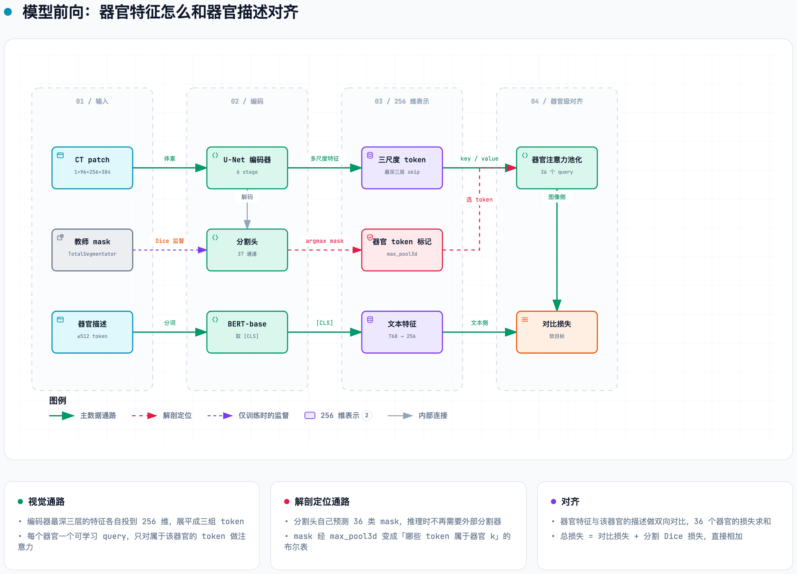
</picture>

RADAR = **一个 3D U-Net 编码器 + 一个 BERT**，做图文对比学习。对齐单位不是"整卷 ↔ 整份报告"，而是"**一个器官的图像特征 ↔ 报告里写这个器官的那几句话**"。

| | |
|---|---|
| **训练** | 24 张 A100 / H20，每卡 batch 2（总 48），fp32，30 epoch，lr 1e-4 cosine |
| **推理** | 单张 A100 / H20；滑窗 `96×256×384`、重叠 0.25；零样本，靠正负提示词集成打分 |
| **视觉分支** | nnU-Net 式 `PlainConvUNetLightD`，6 stage，自带 37 通道分割头（36 器官 + 背景），约 5,200 万参数 |
| **文本分支** | 旗舰用 `bert-base-chinese`；公开的 MERLIN 分支用 `bert-base-uncased` |
| **预处理** | 图像侧 TotalSegmentator v1.5.7（104 类 → 36 类，仅离线造标签）；文本侧 Qwen 三步解析（提没提 → 抽描述 → 正常/异常）|
| **输入** | 重采样 `1×1×5 mm`，HU 钳到 [−300, 400]，逐体 min-max |
| **方法贡献** | 对比损失里的**软目标**：同一器官"都正常"或文本相同的两例记为正例，"都异常"的按文本相似度给软权重 —— 专治报告监督里铺天盖地的伪负例 |

公开可复现的数字：旗舰模型直接在斯坦福 **MERLIN** 测试集上零样本 **AUC 0.883**；最低两项是骨折 0.683 和肺不张 0.709 —— 正好对上 400 HU 天花板和 −300 HU 地板。

MERLIN（*Nature* 652:1318–1328, 2026，通讯 **Akshay S. Chaudhari**）是 RADAR 全部公开可复现性的载体：42 万例 RAD-CT 放不出来，他们用这个公开数据集把整条流水线完整演示了一遍。

→ 设备清单、预处理 / 模型 / 推理三张流程图、**损失函数的逐步推导（InfoNCE → 软目标 → Dice，含手算算例）**、训练配方、自己跑一遍的最短路径，见 **[sources/radar-technical-teardown.md](sources/radar-technical-teardown.md)**

---

## 与你研究的交集

**① 可以偷的：anatomy-token 技巧，零成本。**
RADAR 最值钱的工程 trick 不是 VLM，是"用现成的自动分割器把整卷 CT 切成解剖单元，所有下游量都在解剖单元上算"。这个 trick 不含任何学习参数。你几百例的材料分解数据可以照做，把 water/lipid/protein 分数、噪声、误差预算按解剖结构汇总而非按手画 ROI。==统计功效从"几百个 ROI"放大到"几百 × N 个解剖单元"，同时消除读者间变异。==

**② 绝不能偷的：它对分割质量的态度。**
RADAR 把 mask 池化到 40×32×32 mm 还照样工作，因为它只要"这堆 token 属于肝"。你做材料分解，==**边界就是 partial volume effect，边界就是信号本身**==。

**③ 你处在 RADAR 的反面，而这是优势。**
RADAR 全部设计在回答"我有海量数据但没有标签"；你的处境是"我有少量数据但**有真值**"（phantom 已知浓度、已知材料、已知 keV）。==已知真值在小数据上的信息密度，远高于 42 万份报告里的弱标签。==
✗ 任何让你放弃 phantom 真值去追"大数据自监督"的建议都是在往下走。

**④ 真正该抄的是验证形式，不是模型。**
独立金标准子集（病理／体模真值）+ 多读者 reader study + 外部中心 —— 这三件事在几百例规模上照样立得住。
和 Slomka EAT pipeline 上得出的是同一条：**copy the evaluation form, not the model.**

**⑤ 一条顺带的人脉信息。** MERLIN 的通讯作者是 **Akshay S. Chaudhari**（斯坦福）—— 就是你之前 PI scouting 里评过的那位。RADAR 能有公开可复现路径，靠的是他那个组的开放数据。

---

---

## 求职通道

达摩院美国那条**不用考虑**：`Alibaba Group (US) Inc` 的 `RESEARCH SCIENTIST` 头衔在 **2022 年之后彻底消失**（2019:5 → 2020:7 → 2021:2 → 2022:1 → 0），Washington DC 在 2026 年的研究岗 LCA 申报**只有一条**。它是几个资深研究员的据点，不是能投简历的机构。

真正对口且在办身份的是**设备厂**：

```
🟢 United Imaging（Houston）  2026 年 5–6 月五周内连办 7 个 research scientist，三个岗名带 "CT"
🟢 Canon（Vernon Hills IL）   Reconstruction Scientist，2026-05-08
🟢 GE HealthCare（Waukesha）  Lead Scientist - Clinical Physics，2026-04
🟡 Elucid / HeartFlow / Cleerly   冠脉 CT 定量三家，和 PCAT/FAI 同构，但岗位名是 engineer
⛔ Philips（Orange OH）       技术上最贴合，JD 白纸黑字拒绝任何"now or in the future"需要 sponsorship 的人
```

→ 完整分级与薪资申报数据见 **[sources/damo-hiring.md](sources/damo-hiring.md)**

## 数据缺口

不要当成已知：

- **11 位作者的中文名查不到**（Zilin Lu、Haonan Ding、Cao Chen、Sinuo Wang、Shaoteng Zhang、Zhongyi Shui、Zhilin Zheng、Yanjie Zhou、Tony C W Mok、Hongkan Wang、Jianfeng Zhang）。以达摩院初级研究员和在读博士生为主，中文互联网没有公开痕迹。**按规则留空，没有按拼音猜。**
- **Science 正文与补充材料在付费墙后。** 技术细节全部来自代码与仓库文档；扫描协议、设备型号、RAD-CT 的构成与伦理批件号只写在 Methods 里，这里没有。
- **湖畔实验室的省财政拨款比例**、是否有独立法人登记 —— 无公开资料。
- **夏勇与宁波二院放射科的具体关系**（任命 / 兼职 / 客座）未找到直接记载。
- 除病理确诊子集外，**测试标签是否也由 LLM 从报告解析** —— 推断，未获一手确认。
- 多位基层医院医生的**职称**只见于媒体报道，未见官方人事文件。

---

## 文件说明

```
README.md                          本文件 —— 总图
sources/                           各专题的结论页
  radar-technical-teardown.md      RADAR 是怎么做出来的：设备、数据、模型、损失、训练、推理
  radar-vs-medsam.md               与 MedSAM 的关系
  authors-affiliations.md          40 位作者的单位结构分析
  damo-lineage.md                  NIH → 平安 PAII → 达摩院 的整建制迁徙
  academic-pipeline.md             西工大 → Adelaide → MBZUAI 学术供给线
  zju-hospital.md                  浙大一院 × 梁廷波：424,911 例怎么拿到的
  hupan-lab.md                     湖畔实验室是什么
  grassroots-network.md            外部验证网络：为什么是这几家医院
  damo-hiring.md                   达摩院美国实体现状 + 这个圈子的求职通道
members/                           15 位核心作者每人一页 + others.md（其余 25 位，由 _parts/build.py 从 6 个片段生成）
photos/                            头像（出处见各成员页「来源」）· others/ · face-sheet.jpg · thumbs/ · build_face_sheet.py
figures/                           六张图：*.json 是图源，*.html 是交互版，*.png 是内嵌用的静态导出
data/
  names-final.json                 ★ 中文名的唯一真源（含把握等级）
  authors-meta.json                ★ 单位 / 身份 / PANDA 标记的唯一真源
  build_name_table.py              README 名表由上面两个 JSON 生成，不要手改表格
  pubmed-*.xml · authors-raw.json · radar-authors.tsv     PubMed 原始记录与结构化作者表
  raw/                             取证存档：各专题的完整 URL 清单；raw/people/ 是成员页的写作输入
```

> [!strategy] 约定
> - 改中文名或身份：改 `data/names-final.json` / `data/authors-meta.json`，再跑 `python3 data/build_name_table.py`。
> - 改图：改 `figures/*.json`，再跑 `archify deliver` 和 `python3 figures/export-png.py <名字>`。
> - 正文以 `sources/` 为准；`data/raw/` 只是存档，需要某条结论的原始 URL 时再去翻。
