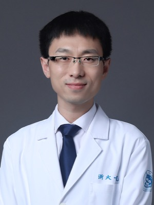

# 章琦 Qi Zhang — 把一家医院的数据接到达摩院算法上的那个外科医生

> RADAR 第 1 / 40 位作者 · 浙大一院肝胆胰外科 / 浙江省胰腺病研究重点实验室 / 教育部胰腺疾病国际合作联合实验室（论文单位 1、2、3）· **共同第一作者**（6 人之首）

## 一句话画像

**外科医生，不是做 AI 的。** 本业是肝癌与胰腺癌的转化研究 —— 肿瘤微环境、免疫、代谢，湿实验加临床队列；同时是浙大一院党委副书记。

值得记住的一点：在**达摩院 × 浙大一院**这条医工管道上，==他是那个不换的临床接口人==。PANDA（2023，共同通讯）→ 肝脏恶性肿瘤 AI（2026，共同通讯）→ RADAR（2026，共同第一作者），三篇连着挂他，位次一路往前。

## 在 RADAR 里的位置

- **作者位次 1 / 40**，六位共同第一作者之首；论文给他标的三个单位（肝胆胰外科 + 浙江省胰腺病研究重点实验室 + 教育部胰腺疾病国际合作联合实验室）正是浙大一院这边的全套牌子。
- **承担的角色（推断）**：临床侧总负责人。依据是位次 + 单位 + 行政职务 + 他在 PANDA 里的同类角色 —— 40 位作者里排第一却出自外科（不是放射科、不是计算机），最省事的解释是他把医院这批数据和临床标签体系组织了起来。具体可拆四块：
  1. **数据来源与治理**。RAD-CT 共 424,911 次检查，主力来自浙大一院；科研数据出库、伦理审批、回顾性队列调取正是他历任的科研部副主任那个岗位的职权。
  2. **临床标签体系与疾病谱设计**。146 种**影像征象**（imaging findings，不是 146 种病）、18 个解剖结构的临床定义、纳排标准、阳性判据 —— 算法团队定不了这些。
  3. **reader study 的组织**。26 位放射科医生的对照阅片、AI 辅助后敏感度提升约 10%，需要在院内调动放射科；院内搭档是 [肖文波](38-wenbo-xiao.md)（#38，浙大一院放射科主任）。
  4. **多中心外部验证的落地**。作者名单末尾那一长串县市医院几乎全在浙大一院的托管 / 分院 / 对口支援体系内 —— 这是医院行政能力，不是算法团队能力。详见 [../sources/grassroots-network.md](../sources/grassroots-network.md)。
- **他不负责的**：模型架构、视觉-语言对齐训练、代码。这些归 [张建鹏](02-jianpeng-zhang.md)、[曹维维](03-weiwei-cao.md)、Zilin Lu、常琬星那一侧。但**别把这条推太硬** —— 他 2020–2021 已是多篇 IEEE JBHI 医学影像 AI 论文的第 2 作者 / 合著者，对算法侧并非完全外行。
- **与 PANDA 的重合**：PANDA（*Nature Medicine* 2023, PMID 37985692）里他是**第 33 / 36 位、共同通讯之一**（同篇通讯还有邵成伟、施昱、[梁廷波](40-tingbo-liang.md)、[张灵](39-ling-zhang.md)、陆建平）。
- **达摩院 × 浙江这条线上他一共三篇**（PubMed 检索 `(DAMO Academy[Affiliation]) AND (Zhang Q[Author]) AND (Zhejiang[Affiliation])` 恰好返回 3 篇，无遗漏无多余，2026-09-20 抓取）：PANDA 2023、肝脏恶性肿瘤 AI *Nat Med* 2026（PMID 42618635）、RADAR 2026。三篇的固定班底是临床侧章琦 + 梁廷波、算法侧张灵。

## 背景与履历

| 时间 | 单位 · 职位 | 备注 |
|---|---|---|
| 约 2010–2015（**推断**） | 浙江大学医学院 / 浙大二院 肝胆胰外科 · 博士 | 官网只写"最高学历、学位：研究生、博士"。院校、专业、毕业年份、导师**均无公开记录**；此处系从最早论文（2012 年起单位即浙大二院、2013 首篇一作）反推 |
| 2012–2019 | 浙江大学医学院附属**第二医院** 肝胆胰外科 | 部分论文兼挂浙二"肿瘤防治研究教育部重点实验室"。此期论文末位通讯几乎清一色是梁廷波 |
| 2013 | 首篇第一作者论文 *Carcinogenesis*（1/11） | Wnt/β-catenin 与缺氧诱导 EMT；单位浙大二院 |
| 约 2016/2017–2020 | 美国 NIH：NINDS Surgical Neurology Branch + NCI Neuro-Oncology Branch（Bethesda） | 与浙大单位并列署名，PI 为庄正平（Zhengping Zhuang），主题是肿瘤代谢（脂肪酸氧化、线粒体生物合成）。**性质（访问学者 / 博士后）与确切起止年份无公开记录** |
| 2018-12 | —— | 梁廷波由浙大二院调任**浙大一院党委书记** |
| 2019 起 | 浙江大学医学院附属**第一医院** 肝胆胰外科 | 论文单位随之切换（*Gut* 2019、*Cancer Immunol Res* 2019 等为最早一批） |
| 2020–2021 | 医工合作起点：之江实验室 / 浙大生物医学工程与仪器科学学院 **李劲松** 线 | IEEE JBHI 2020 胰腺自动分割、IEEE JBHI 2021 肿瘤微坏死深度学习量化（第 2 作者）、IEEE JBHI 2021 EHR 知识图谱、IEEE JBHI 2023 胰腺切除术后新发糖尿病预测。==他碰医学影像 AI 比达摩院这条线早两三年== |
| 2022 起 | 浙大一院 · 独立带队发文 | 以其机构通讯邮箱检索 PubMed 得 26 篇（2022–2026），刊于 *Nat Med* ×2、*Nature*、*Gut*、*Nat Commun* ×3、*Cancer Lett*、*Cell Rep*、*EMBO Mol Med*、*Oncogene*、*J Control Release*、*NPJ Precis Oncol* 等 |
| 快照 A（较早，见于学术会议专家页） | 浙大一院 · **副**教授、**副**主任医师、博导；院长助理、科研部副主任；浙江省胰腺病研究重点实验室副主任；浙江省肝胆胰疾病临床医学研究中心办公室主任 | **各次任命的具体年月未见任何公开记录** |
| 2023-11 | PANDA（*Nat Med*）共同通讯 | 达摩院线的起点 |
| 2026 | Science RADAR 第一作者 | 同年另有 *Nature* ×2、*Nat Med* ×1、*Nat Commun* ×2、*Gut* ×1 —— 密度相当高 |
| 2026-09（官网现状） | 浙大一院 · **教授、主任医师、博导**；院内职务 **党委副书记** | 官网"现任领导"页列于顾国煜（党委书记）、梁廷波（院长、党委副书记）、邵浙新、陈君芳之后。该任命必在 2025-07 那轮班子调整之后（**推断**） |

## 研究方向

- **主线（本业）：肝细胞癌与胰腺导管腺癌的肿瘤微环境、免疫与代谢。** 缺氧信号（HIF-1α / HIF-2α）与 EMT、巨噬细胞极化与脂肪酸氧化 / 脂代谢（FAO、DGAT1、蛋白乳酸化）、外泌体与转移、多组学免疫分型。
- **个人学术标签：肿瘤微坏死（tumor micronecrosis）。** 这不是顺带一提的子题 —— 他 2022–2026 的 26 篇通讯论文里有 5 篇是这个主题（*Int J Surg* 2022、*BMC Cancer* 2023、*Cancer Lett* 2024、*NPJ Precis Oncol* 2025、*Hepatobiliary Pancreat Dis Int* 2026），跨病理 → 深度学习 → 影像组学。
- **递送与治疗**：mRNA 疫苗、纳米脂质体、FAP-ADC、胰腺靶向脂质纳米颗粒。官网"研究方向"原文落在"肝癌的细胞治疗、胰腺癌肿瘤疫苗治疗、肝胆胰恶性肿瘤的创新药物开发"。
- **临床影像 AI 的临床侧**：PANDA（平扫 CT 胰腺癌早筛）→ 肝脏恶性肿瘤 AI 诊断 → RADAR（腹部增强 CT 通用模型）。
- **临床擅长（官网原文）**："肝胆胰疾病的外科与综合治疗、早期诊断与全程管理。"
- ==注意"早筛"这个词同时出现在临床擅长和 AI 合作里 —— 这不是巧合。== 他把外科医生的临床痛点（胰腺癌发现太晚）直接对接到了算法能力上。

## 代表作

| 论文 | 期刊 · 年份 | 作者位次 |
|---|---|---|
| An expert-level generalist AI for abdominal CT diagnosis（**RADAR**） | *Science* 393(6817):eaec6129, 2026 | **1 / 40，共同第一** |
| Large-scale pancreatic cancer detection via non-contrast CT and deep learning（**PANDA**） | *Nature Medicine* 29:3033-3043, 2023（PMID 37985692） | 33 / 36，**共同通讯** |
| Large-scale AI-guided liver malignancy diagnosis: multicenter study and a single-arm trial | *Nature Medicine* 2026（PMID 42618635） | 24 / 28，**共同通讯**（全篇 8 位通讯，含 King's College London 的 Sébastien Ourselin 与 EURECOM 的 Maria A Zuluaga —— 这条欧洲影像计算线是达摩院版图里容易被漏掉的一角） |
| 增强 CT 影像组学预测肝癌微坏死 | *NPJ Precision Oncology* 2025（PMID 41238794，27 位作者） | 通讯之一（李劲松 / 梁廷波 / 章琦）。==方法论上比 RADAR 更贴近"从影像推一个组织学量"== |
| Method of Tumor Pathological Micronecrosis Quantification Via Deep Learning From Label Fuzzy Proportions | *IEEE JBHI* 2021（PMID 33822729） | 2 / 10，末位通讯李劲松 —— 他医工合作的**真正起点** |
| Pancreatic-targeted lipid nanoparticles based on organ capsule filtration | *Nature* 2026（PMID 41741655） | 15 / 17，**共同通讯**（另两位通讯：梁廷波、清华化学系于国粲） |
| Integrated multiomic analysis reveals comprehensive heterogeneity and novel immunophenotypic classification in hepatocellular carcinomas | *Gut* 68(11):2019-31, 2019 | 1 / 25，共同第一 —— 官网代表论文列表之首 |
| Fatty acid oxidation contributes to IL-1β secretion in M2 macrophages and promotes macrophage-mediated tumor cell migration | *Mol Immunol* 94:27-35, 2018（PMID 29248877） | 1 / 8，单位 NIH（NINDS + NCI）+ 浙大二院，末位通讯庄正平 |

## 师承与关系

**主谱系：[梁廷波](40-tingbo-liang.md)（#40）学派 —— 浙江大学肝胆胰外科 + 器官移植体系。**

- **师承是推断，不是查实。** 2012–2019 年他可检索到的论文里末位通讯几乎全是梁廷波，成名作（*Gut* 2019、*Hepatology* 2018、*Mol Cancer* 2017）无一例外；两人同科室、同迁移路径。但**没有任何公开页面写明师生关系**。证据还要再弱一档：首篇一作 *Carcinogenesis* 2013 里梁廷波的单位字段是空的，通讯身份靠的是位次而非邮箱字段。
- **机构迁移 —— 他是"跟着人走"的典型。** 梁廷波 2011-11 由浙大一院副院长调任浙大二院副院长（兼肝胆胰外科主任、器官移植中心主任）；章琦 2012–2019 全部论文单位是浙大二院；梁廷波 2018-12 回任浙大一院党委书记；章琦 2019 起单位切换为浙大一院。⚠️ 至于"整建制团队搬迁""白雪莉等同批迁移"这类说法，==找不到直接来源，属叙事性外推==，此处不作断言。
- **自主度的天花板在这里。** 在他 2022–2026 的 26 篇通讯论文抽查中，**没有一篇他是唯一通讯作者** —— 梁廷波几乎总在旁边（包括那篇末位署名的 *Nat Commun* 2026 CD19⁺ 巨噬细胞，实为两人共同通讯）。"已独立 PI 化"这个判断要按这个事实打折。

**第二谱系（海外）：NIH 庄正平组**（Surgical Neurology Branch, NINDS / Neuro-Oncology Branch, NCI CCR）。2018–2020 有 4–5 篇论文同时挂 NIH 与浙大双单位，主题是肿瘤代谢。他回国后主打的"脂代谢 + 巨噬细胞"方向直接是从这段带回来的 —— 一条清晰的方法论移植路径。

**第三谱系（医工）：先浙大系，后达摩院。**

- 2020–2021 的对手方是**李劲松**（之江实验室 / 浙大生物医学工程与仪器科学学院）—— IEEE JBHI 系列；这条线至今还在（*NPJ Precis Oncol* 2025）。
- 2023 起接上达摩院：固定对手方是 [张灵](39-ling-zhang.md)（达摩院 Washington DC，三篇全在）与 [张建鹏](02-jianpeng-zhang.md)（湖畔实验室高级算法专家）。所以更准确的叙事不是"达摩院把一个纯临床医生拉了进来"，而是==**一个已有三年医工合作经验的外科医生，在 2023 年把合作对象换成了达摩院**==。管道全貌见 [../sources/damo-lineage.md](../sources/damo-lineage.md)、[../sources/zju-hospital.md](../sources/zju-hospital.md)。

**院内关系**：[肖文波](38-wenbo-xiao.md)（#38，放射科主任）是 reader study 与影像端的搭档；白雪莉（Xue-Li Bai）是同科室高频合著者。学科上游是郑树森院士（科室奠基人），但郑树森与梁廷波的师承关系未见可靠来源，不作断言。

## 学术指标

**引用数与 h-index：留白，没有可用数字。** 理由写清楚：

- **Google Scholar 无法获取** —— 作者检索接口强制跳转登录，且未见他在任何中文页面挂出 Scholar 主页链接。不给估算值。
- **OpenAlex / Semantic Scholar 对 "Qi Zhang" 的作者消歧已经失效，数字一个都不能用**（2026-09-20 抓取）：OpenAlex A5101429850 给 works 194 / 被引 2313 / h = 24，但其单位列表混入昆明理工大学、天津中医药大学、上海大学、同济大学、南京中医药大学；另一簇 A5100360313 给 works 603 / 被引 10130 / h = 52，单位里甚至有 "Medical Council of Canada (1991–1993)"；Semantic Scholar 给 RADAR 第一作者的 authorId 2262194848 只有 535 次被引 / h = 8，明显是碎片簇。==同名污染极严重，凡看到 "Qi Zhang" 的文献计量数字都要先问是哪一簇。==

**ORCID：`0000-0002-6096-0690`**（RADAR 登记）。person / employment 栏极稀疏（只有一条 "Zhejiang University"，2025-07 最后修改），但 **works 有 16 条，全部是胰腺外科 + 肝胆 + 胰腺影像 AI + 微坏死**，与他的公开画像完全同构 —— 这是身份闭环里最硬的一环，因为它不经过中文名与拼音的人工比对。

**可自行复现的硬检索**（2026-09-20）：

| 检索 | 结果 |
|---|---|
| PubMed，按其机构通讯邮箱 | 26 篇（2022–2026），单位无一例外是浙大一院肝胆胰外科 |
| `(DAMO Academy[Affiliation]) AND (Zhang Q[Author]) AND (Zhejiang[Affiliation])` | 恰好 3 篇：42752131 / 42618635 / 37985692 |
| `(Zhang Q[Author]) AND (Second Affiliated Hospital[Affiliation]) AND (Hepatobiliary[Affiliation]) AND (Zhejiang[Affiliation])`，限 2000–2014 | 13 篇，最早 22781398（*Cancer Lett* 2012，第 7 位） |

**官网列出的奖项与人才称号**（浙大一院官网，可作第二来源）：浙江省杰出青年基金获得者、浙江省科协"育才工程"入选者、浙江大学医学院临床青年拔尖人才；主持国家自然科学基金 2 项、省卫生厅课题 3 项；**浙江省科技进步一等奖（2019，胰腺疾病诊治关键技术研究及其推广应用）**、**浙江省自然科学一等奖（2017，肝癌微环境与癌细胞耐药）**。

**只见于自述性页面、没有第二来源的**：国家高层次青年人才计划入选者、国家重点研发计划青年首席科学家、"以第一/通讯（含共同）发表 SCI 论文 50 余篇"、"主持国家级项目 5 项、省部级重点重大项目 5 项"、"作为主要完成人获省部级一等奖 3 项"。

**学术兼职**（官网）：中华医学会肿瘤学分会青年委员、中国研究型医院协会胰腺疾病专委会青年委员、中国研究型医院协会消化道肿瘤专委会青年委员、浙江省抗癌协会肿瘤病因专委会委员、浙江省医师协会胰腺病专委会秘书。

## 对 Shu 意味着什么

**不列入投递名单。** 他在杭州，实验室做的是湿实验（肿瘤免疫、代谢、纳米递送）加临床回顾队列，没有任何探测器物理、能谱分解、光子计数 CT、重建算法的产出 —— 材料分解 / 水脂分解 / 冠脉周围脂肪这套手艺在那里没有工位；并且真正做模型的也不是他。顺着 RADAR 找机会的优先级应是 [张灵](39-ling-zhang.md)（达摩院 Washington DC，在美，做医学影像 AI）> [夏英达](20-yingda-xia.md) > [张建鹏](02-jianpeng-zhang.md) > 章琦。

**列入"范式参考"名单，理由很具体。** 他是"临床医生如何成为医工合作中不可替代的一方"的教科书案例：筹码不是写代码，而是数据出口 + 临床标签定义权 + reader study 的组织能力 + 医联体多中心落地网络；而且==起点不是 Nature 级合作，是 2020 年一篇 IEEE JBHI==，五年走到 *Science* 一作。对应到 Shu 的 PVAT / FAI 精度工作，一直缺的正是那层"临床说服力外壳"：26 位医生的对照阅片试验、AI 辅助后敏感度 +约 10%、单臂前瞻试验 —— 这套**评价形式**可以直接借鉴（与 Slomka EAT pipeline 那条笔记同理：抄评价形式，不抄模型）。

**一个真实但很窄的远期接口。** 他近年通讯的脂代谢与微坏死工作，本质是"测肿瘤组织的脂质含量 / 组成与坏死比例"这类组织学量；Shu 的双能 / 光子计数水-脂-蛋白分解恰好是**在体无创测同一类量**。那篇 *NPJ Precis Oncol* 2025（增强 CT 影像组学预测微坏死）在方法论上比 RADAR 更贴近 Shu 的活儿，也说明他手里有"影像 ↔ 组织学金标准 + 标本"这一对。若哪天要写"CT 材料分解测量肿瘤脂质分数"的提案，他是能提供金标准那一侧的人 —— 但要诚实：这得 Shu 主动去搭，对方不会找过来。

## 未解决

- **教育经历几乎全空**：本硕博院校、专业、毕业年份、导师姓名均无公开记录；官网只写"研究生、博士"。`person.zju.edu.cn/zhangqi` 页面存在但显示"该教师个人中文主页暂未开放"。表中"约 2010–2015 在浙大 / 浙二读博"是推断。
- **"导师是梁廷波"**：合著关系铁证，师生关系无直接来源，只有推断；也未找到反证。
- **NIH 阶段**：访问学者还是博士后、哪年去哪年回，均未查实。
- **职务时间线只有快照，没有年月**：副教授→教授、副主任医师→主任医师，以及科研部副主任 / 院长助理 / 浙江省胰腺病研究重点实验室副主任 / 党委副书记的任职年份，均未找到任前公示或任职新闻。学术会议专家页与医院官网是不同时期的快照，两边职务不一致。因此"RADAR 数据出库期间他在科研部"这一步在时间上并未锚定。
- **出生年份**：无任何来源。
- **RADAR 的通讯作者构成不可得**：PubMed efetch 与 Crossref 两处记录里都没有通讯作者邮箱字段，science.org 全文页返回 403，author contributions 拿不到。所以本页「在 RADAR 里的位置」一节的角色划分整段是推断。
- **引用数与 h-index**：见「学术指标」，无可用数字。
- 官网"现任领导"页他的**简介与分工栏为空**。
- 科室医生名单页为 JS 渲染，无法穷举，"浙大一院肝胆胰外科不存在第二位拼音为 Qi Zhang 的医生"只是**未发现**，不是已穷举。

## 来源

- https://www.zy91.com/department/doctor/74/354 — 浙大一院官网 章琦 专家介绍页（中文名 ↔ 英文署名的决定性绑定；职称、院内职务、代表论文、奖项、兼职）
- https://www.zy91.com/general/leader — 浙大一院官网 现任领导页（章琦 党委副书记；顾国煜 党委书记；梁廷波 院长、党委副书记）
- https://www.zy91.com/department/doctor_list?dept_id=5 — 浙大一院肝胆胰外科医生名单
- https://www.sciconf.cn/cn/person-detail/50?user_id=C8ewgxJtSIsym_jIED5PlLQ_d_d — 学术会议专家页（较早快照：副教授 / 院长助理 / 科研部副主任；自述指标）
- https://www.haodf.com/doctor/6964470323.html — 好大夫在线 章琦
- https://m.youlai.cn/yyk/docindex/430095/doctorinfo.html — 有来医生 章琦
- https://person.zju.edu.cn/zhangqi — 浙江大学个人主页（"该教师个人中文主页暂未开放"）
- https://pubmed.ncbi.nlm.nih.gov/42752131/ — RADAR, *Science* 2026
- https://pubmed.ncbi.nlm.nih.gov/37985692/ — PANDA, *Nat Med* 2023
- https://pubmed.ncbi.nlm.nih.gov/42618635/ — Large-scale AI-guided liver malignancy diagnosis, *Nat Med* 2026
- https://pubmed.ncbi.nlm.nih.gov/41741655/ — Pancreatic-targeted lipid nanoparticles, *Nature* 2026
- https://pubmed.ncbi.nlm.nih.gov/41238794/ — 增强 CT 影像组学预测肝癌微坏死, *NPJ Precis Oncol* 2025
- https://pubmed.ncbi.nlm.nih.gov/33822729/ — 肿瘤微坏死深度学习量化, *IEEE JBHI* 2021
- https://pubmed.ncbi.nlm.nih.gov/29248877/ — *Mol Immunol* 2018，NIH + 浙大二院双单位
- https://orcid.org/0000-0002-6096-0690 — 本人 ORCID（works 16 条，身份闭环的最硬一环）
- https://pub.orcid.org/v3.0/0000-0002-6096-0690/works — 上述 ORCID 的作品列表（API）
- https://github.com/alibaba-damo-academy/damo-radar — RADAR 开源代码
- https://ori.hangzhou.com.cn/ornews/content/2026-09/19/content_9311231.htm — 杭州网 RADAR 报道（张建鹏、肖文波的中英对应）
- http://js.zjol.com.cn/ycxw_zxtf/201812/t20181217_9013586.shtml — 浙江在线 2018-12-17「浙一"换帅"！梁廷波任党委书记」（团队迁移的时间锚点）
- https://zh.wikipedia.org/wiki/梁廷波 — 梁廷波履历（2011–2018 浙二副院长 → 2018–2025 浙一党委书记 → 2025 至今院长）
- 照片：https://www.zy91.com/department/doctor/74/354
