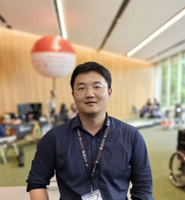

# 张建鹏 Jianpeng Zhang — RADAR 算法侧的第一责任人

> RADAR 第 2 / 40 位作者 · 阿里巴巴达摩院（杭州）+ 湖畔实验室 + 浙江大学计算机科学与技术学院 · **共同第一作者**（6 人共一中排位最前的技术侧作者）

## 一句话画像

西北工业大学[夏勇](13-yong-xia.md)门下出来、经阿德莱德沈春华线、2022 年进达摩院医疗 AI 实验室的技术骨干，现为达摩院 Staff Algorithm Engineer。方法论主线从头到尾只有一个问题：**标注不够怎么办**——先用部分标注和自监督解决三维分割，再用临床报告当监督信号解决通用诊断。==RADAR 摘要里那句 "15 million anatomy-wise image-text pairs"，就是这条线走到头的产物。==

## 在 RADAR 里的位置

- **作者位次 2 / 40**，PubMed XML 的 `EqualContrib` 标在前六位，顺序为 Qi Zhang、Jianpeng Zhang、Weiwei Cao、Zilin Lu、Wanxing Chang、Haonan Ding。[章琦](01-qi-zhang.md)（肝胆胰外科）代表临床侧，张建鹏代表算法侧——典型的「临床 1 号位 + 算法 1 号位」配置。
- **论文标注单位三段**：Alibaba DAMO Academy, Hangzhou + Hupan Laboratory, Hangzhou + College of Computer Science and Technology, Zhejiang University。与个人主页自述逐条对应。
- **方法核心可直接归属**：凤凰网报道称该研究「在国际上首次采用**器官级细粒度对齐**策略」并直接引述本人「由于 CT 数据信号稀疏，常规的视觉-语言学习效果不佳」；网易报道则写作「**解剖级的细粒度对齐**」，并描述这条思路是「先把影像和报告按照器官分割起来，再对比学习，让 AI 从『全文学习』变成『逐句学习』」。论文摘要用词 anatomy-wise，与后者更接近。**两家中文媒体用词不同，引用时分别标明出处。**
- **直接技术前身是 fVLM**（ICLR 2025 Spotlight，通讯作者），RADAR 代码仓库 [alibaba-damo-academy/damo-radar](https://github.com/alibaba-damo-academy/damo-radar) 基于 LAVIS + nnU-Net + MONAI 构建，正是这一套熟悉的技术栈。
- **在 RADAR 中带人，有据**：arXiv 2501.14548（fVLM）作者块脚注原文为 "Correspondence to Jianpeng Zhang. The work was done during Zhongyi's internship at DAMO Academy."——RADAR 第 15 作者 Zhongyi Shui 是其实习生。曹维维（[#3](03-weiwei-cao.md)，共一）是 CVPR 2024 / ICCV 2025 两篇的第一作者、张建鹏任通讯。
- 【推断】负责整体模型架构、预训练目标设计与训练流程，统筹算法组；**不是通讯作者**（通讯位由[张灵](39-ling-zhang.md)与[梁廷波](40-tingbo-liang.md)承担），署名政治上是「技术执行的第一责任人」而非项目最终负责人。*Science* 正文的 Author Contributions 段落未能取得，该分工未直接核实。
- **与 PANDA 无重合**：PMID 37985692 全 36 位作者名单中没有 Jianpeng Zhang。走的是另一条支线：**肺结节 → 肠癌 COCA → 通用多模态 RADAR**。与 RADAR 重合的 PANDA 作者是[章琦](01-qi-zhang.md)（33/36）、[梁廷波](40-tingbo-liang.md)（34/36）、[张灵](39-ling-zhang.md)（35/36）。
- **与其他达摩院 × 浙大一院论文的重合**：*Annals of Oncology* 2026 结直肠癌（DAMO COCA，PMID 42025761）第 3 位共同第一作者；*Nature Medicine* 2025 急性主动脉综合征（iAorta，PMID 40835970）第 33 位 / 共 46 位，单位与 RADAR 完全相同，同篇还有 [Tony C W Mok](19-tony-c-w-mok.md)、[张灵](39-ling-zhang.md)、[肖文波](38-wenbo-xiao.md)。

## 作者表里被隐去的一条血脉

RADAR 的 26 个单位里**完全没有出现西北工业大学**。[夏勇](13-yong-xia.md)（#13）在该文的唯一单位是 Department of Radiology, Ningbo No. 2 Hospital；同属这一脉的 Zilin Lu（#4，共一）和 Shaoteng Zhang（#11）也挂 DAMO + 宁波二院放射科。三位计算机背景的人同时挂一家市级医院放射科而母校缺席。

这位 Yong Xia 的 ORCID 为 0000-0001-9273-2847，用该 ORCID 反查 PubMed 全库命中 6 篇，除 RADAR 外的 5 篇（*Nat Commun* 2025 FeTS challenge、*Radiology* 2023、COVID-19-20 Lung CT challenge 等）中单位**全部**是西北工业大学计算机学院。==所以作者表照着读会完全看不出西工大这条血脉，读的时候要绕过去。==单位编号如此安排的原因未见任何来源解释。相关脉络另见 [../sources/academic-pipeline.md](../sources/academic-pipeline.md)。

## 背景与履历

| 时间 | 单位 · 职位 | 备注 |
|---|---|---|
| 约 2015/2016–2018（推断） | 西北工业大学 计算机学院 · 硕士，导师[夏勇](13-yong-xia.md) | 曾获陕西省计算机学会优秀硕士论文奖（年份未查到）。第一作者 *MedIA* 2019、IEEE *TMI* 2019 两篇出自这一时期，论文单位为 NWPU 空天地海一体化大数据应用技术国家工程实验室 |
| 2018 秋–2022（推断） | 西北工业大学 计算机学院 · 博士，导师[夏勇](13-yong-xia.md) | 博士论文《面向少量或部分标注的三维医学影像分割研究》，入选 **2024 年度 CSIG 博士学位论文激励计划**（优博）。2021 年获宝钢奖学金、西工大研究生标兵、研究生学术之星 |
| 约 2020–2021 | 阿德莱德大学 计算机学院 · 联合培养博士生，联培导师沈春华 | 2021-01 VALSE 简介写「目前在……联合培养」。DoDNet（CVPR 2021）与 CoTr（MICCAI 2021）的末位作者正是沈春华与夏勇的组合 |
| 约 2022（起止未查实） | 阿德莱德大学 Australian Institute for Machine Learning (AIML) · Research Fellow | 合作者 Johan Verjans（个人主页自述） |
| 2022 | 阿里巴巴达摩院 医疗 AI 实验室 | 认领「肠癌 AI 小分队」，主导 DAMO COCA（非增强 CT 结直肠癌筛查） |
| 约 2022/2023–2025（推断） | 浙江大学 · 博士后研究员 | 2024-10 获浙江省博士后择优资助。与达摩院任职并行（推断，无官方文件） |
| 2024–2026 | 达摩院，技术路线从单病种转向通用模型 | CVPR 2024 三篇 → ICLR 2025 Spotlight（fVLM，通讯）→ ICCV 2025（通讯）→ ICML 2026 / ACL 2026（末位通讯） |
| 现职（2026-09） | 阿里巴巴达摩院 · **Staff Algorithm Engineer** | 中文媒体称「高级算法专家」，VALSE 2025 手册称「算法专家、浙江大学博士后研究员」。MICCAI 2024 / 2025、CVPR 2026、ICLR 2026 领域主席（Area Chair）。主页 News 更新至 2026-05，仍在招实习生 |

本科院校与专业未查到，**留白，不按「大概率也是西工大」去猜**。

## 研究方向

- **有限标注下的三维医学影像分割**——多器官与肿瘤联合分割（MOTS benchmark + 动态按需模型 DoDNet）、从多个部分标注数据集学习。这是博士论文主题，也是整条线的起点。
- **自监督与预训练**：DeSD、UniMiSS、ReFs；CNN-Transformer 混合分割 CoTr。
- **医学视觉-语言预训练（VLP）**——现阶段主线。核心动作是**从全局图文对齐转向解剖级 / 器官级细粒度对齐**，代表作 fVLM（ICLR 2025 Spotlight）、Bootstrapping Chest CT（CVPR 2024）、Disease-Centric VLP（ICML 2026）。
- **肿瘤早筛的单病种模型**：肺结节恶性度预测（MICCAI 2023）、结直肠癌非增强 CT 筛查（DAMO COCA）。
- **CT 报告生成的评测基准**：CT-FineBench（ACL 2026）。
- 早期还做过皮肤病变分类、胸片异常检测（TMI 2019 / 2020）。

## 代表作

| 论文 | 期刊 · 年份 | 作者位次 |
|---|---|---|
| An expert-level generalist AI for abdominal CT diagnosis（**RADAR**） | *Science* 393(6817):eaec6129, 2026 | 第 2 位，6 位共同第一作者之一 |
| Large-scale and Fine-grained Vision-language Pre-training for Enhanced CT Image Understanding（**fVLM**） | ICLR 2025 **Spotlight (Top 5.1%)** | 第 2 位，**通讯作者** |
| Colorectal cancer detection using non-contrast CT and deep learning（**DAMO COCA**） | *Annals of Oncology* 2026 | 第 3 位，共同第一作者之一（署名 J P Zhang） |
| **DoDNet**: Learning to segment multi-organ and tumors from multiple partially labeled datasets | CVPR 2021 | 第 1 位，与[谢雨彤](12-yutong-xie.md)并列共同第一作者 |
| Viral Pneumonia Screening on Chest X-rays Using Confidence-Aware Anomaly Detection | IEEE *TMI* 2020 | 第 1 位，共同第一作者（ESI 高被引） |
| Medical image classification using synergic deep learning | *Medical Image Analysis* 2019 | 第 1 位 |
| Disease-Centric Vision-Language Pretraining with Hybrid Visual Encoding for 3D CT | ICML 2026 | 末位，**通讯作者** |
| Towards a single unified model for ... eight major cancers using a large collection of CT scans | ICCV 2023 | 第 5 位（达摩院上一代「通用肿瘤模型」） |

其他：IEEE *TPAMI* 2023 "Learning from partially labeled data for multi-organ and tumor segmentation"（第 2 位）；*Computer Science Review* 2025 注意力机制综述（**第一作者**，末位为导师夏勇）；ICCV 2025 Anatomy Normality Modeling（第 2 位，通讯）；ACL 2026 主会 CT-FineBench（末位，通讯）；MICCAI 2023 Parse and Recall 肺结节（第 1 位，合作者含[叶香华](22-xianghua-ye.md)、吕乐、[张灵](39-ling-zhang.md)）。

## 师承与关系

**第一层 · 西北工业大学[夏勇](13-yong-xia.md)组。** 硕士、博士都在这个组。夏勇为西工大计算机学院长聘教授、博导、副院长，空天地海一体化大数据应用技术国家工程实验室成员，方向「医学影像智能计算」；VALSE 2025 手册记其谷歌引用 1.6 万余次、H-index 60。该组的招牌问题就是「医学影像小数据深度学习」，与博士论文题目严丝合缝。

**第二层 · 阿德莱德沈春华线。** 夏勇组有一条稳定的联合培养通道送人去阿德莱德，2020–2021 走的就是这条；之后短暂留在 AIML 做 Research Fellow，合作者换成临床背景的 Johan Verjans。[吴琦](14-qi-wu.md)（#14，Adelaide AIML，V3ALab 主任）是阿德莱德侧的固定合作者。

**同门网络（可互证）：**
- [谢雨彤](12-yutong-xie.md)（#12）——同门，DoDNet 共同第一作者，合作横跨 CoTr、UniMiSS、ReFs、TPAMI 2023 直到今天；现为 MBZUAI 助理教授。这是全文最清晰的一条「一起迁移」轨迹：西工大 → 阿德莱德 → 分道（MBZUAI vs 达摩院）但仍共同署名。VALSE 2025 手册里谢雨彤的方向写作「有限标注下医学数据的高效分析和解读」，与张建鹏 VALSE 2021 简介的措辞几乎逐字相同——**同门共享问题意识的文本证据。**
- Shaoteng Zhang（#11）——MICCAI 2023 TPRO 第一作者，作者表为 Shaoteng Zhang, Jianpeng Zhang, Yong Xia, Yutong Xie，是夏勇组学生 + 张建鹏带教的典型结构。Zilin Lu（#4，共一）同属这一脉。两位均为夏勇在读博士生、在达摩院实习。
- **圈子是活的**：2025 年 6 月 VALSE 2025 的「多模态学习助力智慧医疗」Workshop 由谢雨彤、雷柏英、夏勇组织，Panel 嘉宾同时包含张建鹏与夏勇——师徒三代同台。

**第三层 · 达摩院医疗 AI。** 这条线顶端是[张灵](39-ling-zhang.md)（#39，达摩院 Washington DC）与吕乐，学术谱系来自 NIH Clinical Center + Johns Hopkins 一脉，PANDA 与统一癌症模型都出自这里。2022 年入职后，实质上成为这条线在杭州侧「多模态 / 视觉-语言预训练」方向的技术负责人：fVLM、CVPR 2024、ICCV 2025、ICML 2026、ACL 2026 几乎都是**张灵末位、张建鹏通讯**的结构——已经从被带的人变成带人的人。详见 [../sources/damo-lineage.md](../sources/damo-lineage.md)。

一句话：**「西工大夏勇组 × 阿德莱德沈春华线」培养出来、被达摩院（Hopkins / NIH 谱系）吸收的技术骨干**，身上同时带着中国高校医学影像分割传统和澳洲计算机视觉的训练。

## 学术指标

| 指标 | 数值 | 说明 |
|---|---|---|
| Google Scholar 总引用 | **8,221**（2021 年至今 7,570） | 账号 `KBIydr4AAAAJ`，2026-09-20 抓取 |
| h-index | **36**（2021 年至今 35） | 同上 |
| i10-index | **49** | 同上 |
| ORCID | 0009-0001-5077-0500 | 来自 RADAR 的 PubMed 记录 |

- **账号归属靠 URL 而非姓名匹配**：个人主页 jianpengz.github.io 上的 [Google Scholar] 链接直接指向该账号；账号验证邮箱域为 `alibaba-inc.com`（机构验证），单位标注 Alibaba DAMO Academy。
- **增长轨道自洽**：2021-01 VALSE 简介写「引用近 700 次」→ 2025-06 VALSE 2025 手册写「被引用 5000 余次」→ 2026-09 实测 8,221，三点落在同一条曲线上。
- ==ORCID 档案几乎为空==：创建于 2025-01，works 只有 RADAR 一条，employment 只填 Zhejiang University，无教育经历。ORCID 官方检索另有 20+ 个同名 Jianpeng Zhang（伊犁师范、广西大学、华南师大、西安交大二附院等），**均非本人**。该 ORCID 只能当作「RADAR 这一篇的作者标识符」，不能反向检索其他工作。
- VALSE 2025 手册称「连续三年入选全球前 2% 科学家榜单」，该句出自手册中的**本人简介**，榜单原始数据未独立核验。

## 对 Shu 意味着什么

**方向明确错位，但有一个真实的互补论点可用。** 这位完全不碰重建、能谱、材料分解、噪声建模、光子计数——输入是已经重建好的 CT 体数据加放射报告，水脂分解、光电效应/康普顿基分解、PCCT、噪声传播那一套对这条线来说是「数据进来之前的事」。主页明写在招「multi-modal large language models」方向的实习生，照 CT 成像物理的画像投过去不匹配。

**真正可用的是这一点**：RADAR 做的是 18 个解剖结构 + 146 种病症的**定性诊断**，监督信号来自报告里写了什么；而 FAI、脂肪成分、水/脂/蛋白分数这些**报告里从来不写**。报告监督的模型学不到报告里没有的东西——这句话可以直接写进 research statement，当作「为什么定量物理成像在大模型时代反而更重要」的论据，比去联系本人有用得多。若真要对话，切入点是「把物理可量化的影像生物标志物接到大模型读片的下游」，而不是比拼预训练规模（也没有 40 万例增强 CT 和配套报告可比）。

**第三点是路径样本**：西工大博士 → 阿德莱德联培 → AIML Research Fellow → 浙大博士后（浙江省择优资助）+ 达摩院算法专家双挂 → 四年内做到 *Science* 共同一作。如果在评估「回国做工业界联合博后」这条备选路径的天花板和时间常数，这是一个 2022→2026 的完整、可验证的计时样本。另外，作为 MICCAI 2024/2025、CVPR 2026、ICLR 2026 的 AC，是了解达摩院 / 湖畔实验室招聘节奏时比在 Washington DC 的[张灵](39-ling-zhang.md)更容易触达的节点——但 DC 那条美国本土岗的线归张灵与吕乐，不归这里。参见 [../sources/damo-hiring.md](../sources/damo-hiring.md)。

## 未解决

- **本科院校与专业**：无任何可靠来源，留白。
- **博士毕业年份 2022 为推断**（据 2021-01 的「博士三年级」+ 2022 年入职达摩院）。学位授予年份无直接来源，知网 / 万方学位论文库未能访问。
- **三段任职的起止年份与先后顺序存在矛盾，未解决**：个人主页把「浙江大学博士后」排在 AIML Research Fellow 之后、达摩院之前；网易报道称 2022 年加入达摩院；VALSE 2025 手册（2025-06）同时写「达摩院算法专家、浙江大学博士后研究员」。博士毕业（推断 2022）、AIML、达摩院三次机构转换挤在同一年。「浙大博后与达摩院并行」是一种合理解释，但无官方文件支持，**此处保留矛盾本身**。
- **职级表述三说不一**：Staff Algorithm Engineer（主页自述）/ 达摩院高级算法专家（凤凰网、网易）/ 算法专家（VALSE 2025 手册）。阿里内部职级未查实，三者可能是同一职位的不同译法。
- **硕士论文题目**未见于任何核到的来源，不写。硕士阶段奖项只有「陕西省计算机学会优秀硕士论文奖」一条，无年份。
- **RADAR 单位表中为何无西北工业大学**，三位计算机背景作者为何同挂宁波二院放射科，未找到解释来源。
- **RADAR 的 Author Contributions** 未能读取（science.org 返回 403），算法组内部分工只能从署名结构推断。
- 「连续三年全球前 2% 科学家榜单」仅有本人简介一处来源。

## 来源

- https://jianpengz.github.io — 个人主页（Staff Algorithm Engineer @ Alibaba DAMO Academy，News 更新至 2026-05）
- https://jianpengz.github.io/publications.html
- https://scholar.google.com/citations?user=KBIydr4AAAAJ — 引用 8,221 / h-index 36 / i10 49，2026-09-20 抓取
- https://orcid.org/0009-0001-5077-0500
- https://valser.org/article-402-1.html — VALSE Student Webinar 第 229 期（2021-01-28，主持人夏勇）：「张建鹏……导师为夏勇教授……个人主页 https://jianpengz.github.io」
- https://valser.org/2025/static/VALSE2025_HYSC.pdf — VALSE 2025 会议手册，Workshop 2 讲者与 Panel 简介
- https://m.csig.org.cn/23/202411/52239.html — CSIG 2024 年度博士学位论文激励计划名单（论文题目、培养单位、导师）
- https://tech.ifeng.com/c/8wWQLPUWXu1 — 凤凰网 RADAR 报道（「器官级细粒度对齐」）
- https://www.163.com/dy/article/L74O5TP20511DPVD.html — 网易 RADAR 报道（「解剖级的细粒度对齐」、肠癌 AI 小分队）
- https://pubmed.ncbi.nlm.nih.gov/42752131/ — RADAR, *Science* 2026
- https://pubmed.ncbi.nlm.nih.gov/42025761/ — DAMO COCA, *Annals of Oncology* 2026
- https://pubmed.ncbi.nlm.nih.gov/40835970/ — iAorta, *Nature Medicine* 2025
- https://pubmed.ncbi.nlm.nih.gov/37985692/ — PANDA, *Nature Medicine* 2023（比对确认无本人）
- https://github.com/alibaba-damo-academy/damo-radar — RADAR 代码仓库
- https://arxiv.org/abs/2501.14548 — fVLM，作者块脚注 "Correspondence to Jianpeng Zhang"
- https://arxiv.org/abs/2011.10217 — DoDNet
- https://teacher.nwpu.edu.cn/yongxia.html — 夏勇主页（未能抓取，列作待查）
- 照片：https://jianpengz.github.io （图片文件 https://jianpengz.github.io/pic/cv_photo.png）
