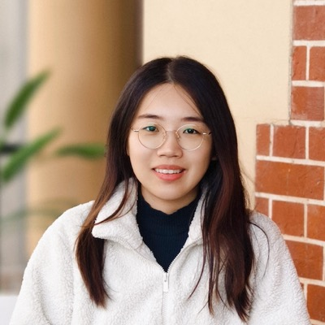

# 谢雨彤 Yutong Xie — MBZUAI 计算机视觉系助理教授，RADAR 里唯一的中东单位

> RADAR 第 12 / 40 位作者 · Department of Computer Vision, Mohamed bin Zayed University of Artificial Intelligence（阿布扎比）· 方法侧合作者，非共同一作、非通讯

## 一句话画像

西工大夏勇门下的直博生，2021 年毕业，经阿德莱德 AIML 四年博后，2025 年 1 月到 MBZUAI 独立建组。研究主线是**有限标注下的医学影像分析**，近四年重心转到**医学视觉-语言**（影像-报告对齐、报告引导掩码建模、报告生成）——这正是 RADAR 方法内核的同一条技术线。==全文 40 位作者里唯一一个既不在达摩院 / 湖畔实验室、也不在任何医院、更不在浙大体系内的人。==

## 在 RADAR 里的位置

- 作者位次 **12 / 40**，论文标的单位只有一个：MBZUAI 计算机视觉系。共同第一作者是前 6 位（章琦、[张建鹏](02-jianpeng-zhang.md)、曹维维、Zilin Lu、常琬星、Haonan Ding），通讯在 [张灵](39-ling-zhang.md) / [梁廷波](40-tingbo-liang.md) 一侧，均不含谢雨彤。
- 不承担数据采集、也不承担临床读片与外部验证——单位决定了这一点。
- **【推断】** 承担的是方法学层面的共同设计与技术路线把关，尤其是"细粒度图文对齐"这一机制：UniMiSS（跨维度自监督）、MedIM（报告引导掩码）、PairAug（图文对增强）、X-RGen（报告生成）正好是过去四年的主攻方向，与 RADAR 的"拆解剖单元 + 自适应对比学习对齐诊断报告 + 免人工标注"同源。Science 正文与 Author Contributions 在付费墙内，未能读到原文。
- **【推断】** 另一重角色是"桥"：同时连接达摩院一侧的同门 [张建鹏](02-jianpeng-zhang.md)（共同一作）、西工大一侧的 [夏勇](13-yong-xia.md) / Zilin Lu（#4）/ Shaoteng Zhang（#11），以及阿德莱德一侧的 [吴琦](14-qi-wu.md) / Sinuo Wang（#10）。这三群人同时出现在 RADAR 上，而与三者都有长期共同署名历史的只有这一位。
- **不在 PANDA 作者列表内**（36 位逐一比对）。PANDA 与 RADAR 的共同作者是 [夏英达](20-yingda-xia.md)、[张灵](39-ling-zhang.md)、章琦、[梁廷波](40-tingbo-liang.md)。在其代表作与高被引条目里也未见署达摩院 / 湖畔实验室单位的论文——与达摩院的连接是**人脉性的**，不是建制性的。相关背景见 [达摩院医疗 AI 谱系](../sources/damo-lineage.md)、[学术输送管线](../sources/academic-pipeline.md)。

## 背景与履历

| 时间 | 单位 · 职位 | 备注 |
|---|---|---|
| 2012.09 | 西北工业大学 计算机学院（本科） | 考入 |
| 约 2013 | 西北工业大学 航天学院 | 大二转入；家人从事航天领域 |
| 2016 | 西北工业大学 计算机学院 2016 级直博生 | 跨专业保研转回计算机；被"导引系统原理"课里用图像处理追踪飞机的内容吸引。导师 **夏勇**；入门课题为胸部 CT 肺结节良恶性辅助诊断 |
| 2020.01–2021.04 | University of Adelaide 联合培养 | 国家公派；导师 **沈春华**、**Johan Verjans** |
| 2020 | — | 西北工业大学 2020 年度研究生标兵、国家奖学金、研究生"学术之星" |
| 2021 | 西北工业大学 工学博士 | 博士论文《面向有限标注的医学影像分割及分类方法研究》 |
| 2021.04– | University of Adelaide / AIML，Research Fellow | 合作导师 **吴琦**（AIML 副教授） |
| 2023.12 | — | 入选 CSIG 博士学位论文激励计划（全国 10 人） |
| 2025.01– | **MBZUAI 计算机视觉系，Assistant Professor** | 独立 PI，开始招生；ORCID 就业记录与 Google Scholar 的 MBZUAI 机构邮箱验证一致 |
| 2025–2026 | — | 组织 MICCAI 2024/2025 MBH-Seg、ACM MM 2024 MMIS 挑战赛；CVPR 2026 CV4Clinical、MICCAI 2026 MI4MedFM workshop |

出版商存档（Crossref 按 ORCID 过滤）的机构字段独立复现了这条迁移：IEEE-TMI 2022 与 IEEE-TPAMI 2023 署西北工业大学计算机学院 → ACM MM 2024 / IEEE-TPAMI 2024 / IEEE-TMI 2025–2026 署 AIML, University of Adelaide → Science 2026 署 MBZUAI。

**组的规模**：个人主页 News（2025.05–2026.07）里以导师身份致谢的学生 / 成员至少 18 人次，2026 年内产出覆盖 ICML 2026、ICLR 2026、ACL 2026 main（oral）+ findings、NeurIPS 2025 ×2、CVPR 2026 ×2、MICCAI 2026 ×7、IJCV、Scientific Data。==已经不是空组，进去是加入一台在跑的机器。==

## 研究方向

- **标注高效学习**：自监督 / 半监督 / 弱监督 / 部分标注（DoDNet、TransDoDNet、UniSeg、PEFAT）
- **跨维度自监督预训练**：2D X-ray 与 3D CT 非配对联合预训练（UniMiSS / UniMiSS+）
- **医学视觉-语言**：影像-报告对齐、报告引导掩码建模、放射报告生成、图文对增强（MedIM、PairAug、X-RGen、MAVL）——与 RADAR 同源的那条线
- **医学多模态大模型 / 基础模型**；可信与公平的医疗 AI；标注者偏好与标签噪声建模
- 覆盖部位胸 / 腹 / 脑 / 皮肤 / 腺体 / 眼 / 口腔；模态 X-ray、CT、MRI、皮肤镜、病理、眼底、报告文本、临床结构化数据
- ==不碰物质分解、光子计数 CT、谱 CT 物理、定量成像校准。==

## 代表作

作者位次以 Crossref 出版商存档的署名顺序为准；引用数为 Google Scholar 2026-09-20 抓取。

| 论文 | 期刊 · 年份 | 作者位次 |
|---|---|---|
| TransUNet: Rethinking the U-Net architecture design ... through the lens of transformers | Medical Image Analysis 2024 | 中间作者（约第 8 位），引用 1747（单篇最高） |
| CoTr: Efficiently Bridging CNN and Transformer for 3D Medical Image Segmentation | MICCAI 2021 | **第一作者**，引用 1139 |
| Viral Pneumonia Screening on Chest X-rays Using Confidence-Aware Anomaly Detection | IEEE-TMI 2021 | 第二作者（一作 Jianpeng Zhang），引用 1126 |
| Knowledge-based Collaborative Deep Learning for Benign-Malignant Lung Nodule Classification | IEEE-TMI 2019 | **第一作者**，ESI 高被引，引用 599（博士入门课题） |
| A Mutual Bootstrapping Model for Automated Skin Lesion Segmentation and Classification | IEEE-TMI 2020 | **第一作者**，ESI 高被引，引用 465 |
| UniMiSS: Universal Medical Self-Supervised Learning via Breaking Dimensionality Barrier / UniMiSS+ | ECCV 2022 / IEEE-TPAMI 2024 | **第一作者**（通讯 Qi Wu） |
| Learning from Partially Labelled Data for Multi-organ and Tumor Segmentation (TransDoDNet) | IEEE-TPAMI 2023 | **第一作者**（通讯 Yong Xia + Chunhua Shen） |
| PairAug: What Can Augmented Image-Text Pairs Do for Radiology? | CVPR 2024 | **第一作者**（通讯 Qi Wu；合作者含 RADAR 作者 Sinuo Wang、Yong Xia） |
| DoDNet: Learning to Segment Multi-organ and Tumors from Multiple Partially Labeled Datasets | CVPR 2021 | 第二作者（一作 Jianpeng Zhang），引用 277 |
| An expert-level generalist AI for abdominal CT diagnosis（RADAR） | Science 393(6817):eaec6129, 2026 | 第 12 / 40 |

## 师承与关系

- **博士导师 [夏勇](13-yong-xia.md)**（西北工业大学计算机学院长聘教授、博导、副院长）。谱系上溯到**张艳宁**——空天地海一体化大数据应用技术国家工程实验室的带头人，在 CSIG 获奖感言里被单独点名。即 张艳宁 → 夏勇 → 谢雨彤。
- **联培导师**（2020.01–2021.04，阿德莱德）：**沈春华**（稠密预测 / 视觉骨干网络学派，后回浙江大学）与 **Johan Verjans**（Adelaide / SAHMRI，心内科医生兼 AI 研究者）。这解释了早期论文里 Chunhua Shen 频繁作为共同通讯。
- **博后合作导师**（2021.04 起）：**[吴琦](14-qi-wu.md)**，出身视觉-语言（VQA / image captioning），AIML 的 V3ALab 主任。==这是研究重心从"分割 / 分类"转向"医学视觉-语言与多模态大模型"的转折点：UniMiSS、MedIM、PairAug、X-RGen 的通讯都是吴琦。==
- **同门**：[张建鹏](02-jianpeng-zhang.md) 是从本科起的长期合作者（Attention Residual Learning、DoDNet、CoTr、UniMiSS、ConResNet 等十余篇），现在达摩院，是 RADAR 的共同第一作者；RADAR 上的 Zilin Lu（#4，共同一作）与 Shaoteng Zhang（#11）也都是夏勇组成员，TPRO 一文的署名就是 Shaoteng Zhang, Jianpeng Zhang, Yutong Xie, Yong Xia。
- **跨国合作网络**（悉尼一侧）：David Dagan Feng、Michael Fulham（核医学医生）、Weidong (Tom) Cai、Yang Song；阿德莱德一侧另有 Zhibin Liao、Hao Lu、Minh-Son To、Lingqiao Liu、Anton van den Hengel。
- **Sinuo Wang（RADAR #10）**：单位是 AIML，与谢雨彤在 PairAug 等论文上共同署名。**【推断】** 从个人主页 News 多次以导师口吻致谢的写法看，更可能是谢雨彤自己（共同）指导的学生，而非吴琦的学生——若成立，则 RADAR 上的这条连线是**把自己的学生带进去**，而不是靠博后导师被带进去。无直接来源。
- 学术血统整体是"中国工科院校 CV + 澳洲 AIML 视觉语言"混血，**不属于美国医学影像物理体系**。

## 学术指标

| 项 | 值 |
|---|---|
| Google Scholar（ID ddDL9HMAAAAJ，MBZUAI 机构邮箱已验证，2026-09-20 抓取） | 总引用 **10,473**（2021 年以来 9,811）；**h-index 41**（近五年 40）；i10-index 72 |
| ORCID | 0000-0002-6644-1250（登记 39 件作品，2017–2026 全覆盖；就业记录仅 MBZUAI 2025-01 起一项） |
| 论文数 | 个人主页自述 80 余篇。MBZUAI 官网个人页写"50+ 篇 / 5000+ 引用"且 Education 栏连博士学历都没列，只能用来确认职称 |
| 荣誉 | Stanford / Elsevier 全球前 2% 科学家（主页写 2022–2025，MBZUAI 官网写 2022–2024）；CSIG 博士学位论文激励计划（2023，全国 10 人）；AAAI-26 SPC Outstanding Service Award；IEEE-TMI Distinguished Reviewer（2023）；CVPR 2023 Outstanding Reviewer；ICLR 2025 Notable Reviewer |
| 学术服务 | MICCAI 2023/2024/2025、ECCV 2026、NeurIPS 2026、WACV 2027 Area Chair；AAAI 2026/2027 SPC；Visual Intelligence 副编辑 |

**同名污染提示**：OpenAlex 上的 "Yutong Xie" 作者实体（A5011835422）混进了 Michigan、Cornell、Johns Hopkins、北京同仁医院等无关机构，不能用作指标来源；连本人的 ORCID 档案里都自动并进了一条无关作品（JACC 2017 的一篇睡眠-心血管流行病学会议摘要）。指标一律取 Google Scholar 本人验证页。

## 对 Shu 意味着什么

**可以记进名单，但不是主攻目标。** 交集有限：做的是 VLM、自监督、分割、报告生成，不碰物质分解、光子计数 CT、谱 CT 物理、定量成像校准。要接近，唯一诚实的卖点是把"CT 成像物理 + 定量图（水 / 脂 / 蛋白分解、VMI）"当作其数据侧的补足——把物质分解通道作为额外输入喂进视觉-语言模型，或者给基础模型的输出加物理一致性与不确定性约束。==这是讲故事，不是现成契合，代价是把身份从"成像物理"往"医学影像 AI"挪一格。==

两个仍然成立的现实理由：一，主页明确挂着在招博士生、硕士生和访问学生，组在 2025–2026 已经跑起来（18 人次学生、2026 年一串顶会），招人窗口是真的；二，MBZUAI 在阿联酋，全奖 + 生活费，完全绕开 H-1B / 绿卡链条和 J-1→F-1 的历史包袱——阿布扎比的社会环境是另一件需要自己单独评估的事。真要接触，切入点是 CVPR 2026 CV4Clinical / MICCAI 2026 MI4MedFM 这类自己在组织的场子，不是冷邮件谈 CT 物理。

## 未解决

- **RADAR 里的具体分工**：Science 正文、Author Contributions、Acknowledgments 均在付费墙后，本页所有分工描述都标了「推断」。
- **本科学位**：只知道大二转航天学院、大四被"导引系统原理"课吸引后跨专业保研回计算机，学位最终由哪个学院授予、专业全称是什么，查不到任何来源。
- **联培时长两处来源不一致**：个人主页写 "about two years at UoA during her PhD"，CSIG 专访第一人称写 2020 年 1 月–2021 年 4 月（约 15 个月），差近一年。本页采用专访的日期。
- **博后结束时间无来源**：硬数据只有 ORCID 就业记录里 MBZUAI 起于 2025-01；CSIG 专访（2024-04）当时仍写"至今"。
- **一批荣誉只有个人主页自述、无第二来源**：CoTr 获 MICCAI 2021 Oral 与 "Best of MICCAI 2021"、CVPR 2024 四篇、博士论文创新基金重点项目（PI）、陕西省第十四届自然科学优秀学术论文三等奖、MICCAI 2020 MyoPS Challenge 荣誉提名、ISICDM 2020 肺组织分割挑战赛二等奖、IEEE-TMI 杰出审稿人 2022–2024 连续（MBZUAI 官网只确认 2023 一年）。未写入履历表。
- **Sinuo Wang 的师承关系无直接来源**，上文相应判断标了「推断」。
- **同门与合作者的中文名未查证**：Jianpeng Zhang、Zilin Lu、Shaoteng Zhang、Sinuo Wang、Yiwen Ye、Zehui Liao、Shishuai Hu 等一律只用拼音，不做字形推测。有中文原文直接支撑的只有夏勇、沈春华、吴琦、张艳宁四人。
- **与达摩院的合作未做穷尽比对**：只对照了 PANDA 全部 36 位作者与其高被引 / 代表作条目的单位字段，没有逐篇扫描 80 余篇论文。

## 来源

- https://ytongxie.github.io/ （本人学术主页：About / News / Publications / Services / Honors）
- https://www.csig.org.cn/67/202404/51784.html （CSIG 专访《2023年度CSIG博士学位论文激励计划入选者谢雨彤》，2024-04-28，第一人称履历与致谢名单）
- https://www.csig.org.cn/21/202312/51527.html （CSIG 2023 年度博士学位论文激励计划遴选结果公告，第 8 位：谢雨彤 / 西北工业大学 / 导师夏勇）
- https://www.thepaper.cn/newsDetail_forward_10270908 （西工大《又见雨彤！》，2020-12-04，2016 级直博生、两次转专业、研究生标兵）
- https://scholar.google.com/citations?user=ddDL9HMAAAAJ&hl=en （Google Scholar，MBZUAI 机构邮箱已验证；2026-09-20 抓取：10,473 / h-index 41 / i10 72）
- https://orcid.org/0000-0002-6644-1250 （ORCID：MBZUAI Assistant Professor 2025-01 起，39 件作品）
- https://api.crossref.org/works?filter=orcid:0000-0002-6644-1250 （Crossref 按 ORCID 过滤：出版商存档的机构字段，NPU → Adelaide/AIML → MBZUAI）
- https://mbzuai.ac.ae/study/faculty/yutong-xie/ （MBZUAI 官方教员页：Assistant Professor of Computer Vision）
- https://github.com/YtongXie （本人 GitHub：CoTr / UniMiSS-code / MB-DCNN / MV-KBC / MedIM / PairAug / X-RGen）
- https://www.science.org/doi/10.1126/science.aec6129 （RADAR，Science 393(6817):eaec6129，2026-09-17；正文付费墙）
- https://pubmed.ncbi.nlm.nih.gov/42752131/ （RADAR PubMed 记录：单位仅 MBZUAI 计算机视觉系，第 12 / 40 位）
- https://pubmed.ncbi.nlm.nih.gov/37985692/ （PANDA, Nat Med 2023，36 位作者全量比对）
- https://github.com/alibaba-damo-academy/damo-radar （RADAR 代码仓库）
- 照片：https://ytongxie.github.io/ （本人主页作者栏头像，图片地址 https://ytongxie.github.io/images/android-chrome-512x512.png）
