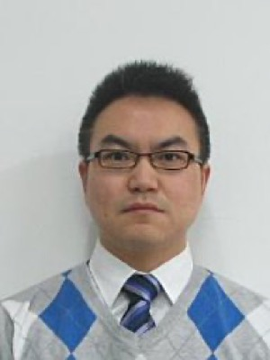

# 夏勇 Yong Xia — 西工大医学影像智能计算课题组负责人，RADAR 算法班底的上游

> RADAR 第 13 / 40 位作者 · 论文标注单位「宁波市第二医院放射科」· 实际单位：西北工业大学计算机学院 · 非共同一作、非通讯

## 一句话画像

西北工业大学计算机学院**长聘教授、博导、副院长**，空天地海一体化大数据应用技术国家工程实验室成员，方向是医学影像智能计算（分割、分类、医学视觉-语言预训练）。在 RADAR 里排第 13、不是通讯作者，但==这篇论文的算法班底几乎全是从这个组里走出去的人==：共同一作兼通讯的[张建鹏](02-jianpeng-zhang.md)（#2）、[谢雨彤](12-yutong-xie.md)（#12）都出自其门下，共同一作 Zilin Lu（#4）与 Shaoteng Zhang（#11）是在读博士生、在达摩院实习。**不做成像物理**——340 项成果里没有一篇涉及重建、能谱、材料分解或噪声建模。

## 在 RADAR 里的位置

- **作者位次**：第 13 / 40。不在 6 位共同第一作者（章琦、张建鹏、曹维维、Zilin Lu、常琬星、Haonan Ding）之列，也不是通讯作者。
- **论文标注单位**：`Department of Radiology, Ningbo No. 2 Hospital, Ningbo, Zhejiang, China.` —— science.org 作者栏、Crossref、PubMed 三处一致，说明来自 AAAS 同一份投稿元数据。==论文全篇 26 个单位里没有「西北工业大学」==；RADAR 里共用这个宁波二院单位号的另两人 Zilin Lu、Shaoteng Zhang，其 ORCID 的 education / employment 栏填的都是 Northwestern Polytechnical University。
- **身份已锁死**：Science 给第 13 位 Yong Xia 绑定的 ORCID 是 `0000-0001-9273-2847`；用该 ORCID 反查 PubMed 共 6 篇，除 RADAR 外的 5 篇（2017 BioMed Res Int、2018 J Healthc Eng、2021 Res Sq、2023 *Radiology*、2025 *Nat Commun*）单位**全部**是西北工业大学计算机学院。另：PubMed 上「西工大 × 宁波二院」的共同署名记录为 **0 篇**——宁波二院不是既有合作单位。这位 Yong Xia 就是西工大夏勇，无疑问；至于宁波这个署名怎么来的，见「未解决」。
- **承担的角色**（**推断**）：方法学把关 + 人才输送方，不是项目负责人、数据方或工程实现方。据 science.org 作者栏，CRediT 分工为 Formal analysis / Investigation / Methodology / Visualization，与[谢雨彤](12-yutong-xie.md)、[吴琦](14-qi-wu.md)完全相同，三人构成一个外部学术方法学小组；无 Software、无 Data curation、无 Supervision、无 Funding acquisition。RADAR 开源仓库 `alibaba-damo-academy/damo-radar` 的 contributors 只有三人（曹维维 34 次提交、张建鹏 10 次、常琬星 1 次），不含夏勇。
- **与 PANDA 无交集**：逐一核对 PANDA（*Nat Med* 2023）全部 36 位作者，无 Yong Xia。RADAR 与 PANDA 共享的 4 人是[夏英达](20-yingda-xia.md)、[章琦](01-qi-zhang.md)、[梁廷波](40-tingbo-liang.md)、[张灵](39-ling-zhang.md)，夏勇不在其中。
- **与达摩院的另一条线**：UAE（*Medical Image Analysis* 2025），一作是其学生白晓宇，第 8 作者是达摩院闫轲（Ke Yan），夏勇末位。这条线走的是达摩院中国侧（闫轲 / 吕乐体系），不是 RADAR 的浙大一院线。该文还有[叶香华](22-xianghua-ye.md)（RADAR #22）共同署名，说明与浙大一院的联系早于 RADAR。

## 背景与履历

本硕博一校 + 海外博后 + 青年千人回国建组的典型路径，不是跟着某个人迁移。

| 时间 | 单位 · 职位 | 备注 |
|---|---|---|
| 1997 | 西北工业大学 教育实验学院（实验班） | 入学 |
| 1997–2001 | 西北工业大学 计算机学院 · 工学学士 | 计算机及其应用 |
| 2001–2004 | 西北工业大学 计算机学院 · 工学硕士 | 计算机应用技术 |
| 2003.05–2003.11 | 香港理工大学 电子资讯工程系 · 访问研修 | |
| 2004.11–2006.01 | 悉尼大学 信息技术学院 · 访问研修 | 博士在读期间 |
| 2004–2007 | 西北工业大学 计算机学院 · 工学博士 | 计算机科学与技术；**博导赵荣椿**。学位论文获 2007 年度中国计算机学会（CCF）优秀博士学位论文奖 + 全国优秀博士学位论文提名奖 |
| 2007.01–2007.10 | 悉尼大学 信息技术学院 · 研究助理 | |
| 2007.10–2013.12 | 悉尼大学 计算机学院 BMIT 实验室 · 博士后 | **合作导师冯大淦（David Dagan Feng）院士**，共约 7 年 |
| 2013 | 国家「青年海外人才」计划（青年千人）入选 | |
| 2013.12 | 西北工业大学 计算机学院 · 教授（后长聘教授、博导） | 回国建组 |
| 约 2021 起 | 西北工业大学 计算机学院 · **副院长** | 最早可查记录为学院官方杰出院友页（2021-12-24 发布） |
| 2026.09.17 | *Science* RADAR 第 13 / 40 作者 | |

**其他**：曾获国防科学技术奖；主持国家自然科学基金面上项目三项；主讲《数字图像处理（英）》《Artificial Neural Network and Its Application》；指导学生获 ISBI 2019「急性白血病恶性 B-淋巴母细胞分类竞赛」第一名、MICCAI 2020 胶质瘤分割竞赛（BraTS 2020）第二名。社会兼职：中国体视学学会理事；CCF 数字医学分会常委；中国抗癌协会肿瘤影像专委会人工智能学组副组长；陕西省计算机学会人工智能专委会主任；中国图象图形学学会视觉大数据专委会常委。IEEE-TMI Guest AE；ISBI 2017、MICCAI 2019/2020/2025、ICASSP 2023、IJCAI 2025 的 Session Chair / Area Chair。

## 研究方向

- **有限标注学习**：半监督、弱监督、部分标注多器官分割（DoDNet、Mutual Consistency Learning）。组里最成体系的一条线，也是 RADAR「从无人工标注的临床报告里学」思路的方法学祖先。
- **架构设计**：CNN–Transformer 混合（CoTr）、注意力机制（Attention Residual、Triple Attention、Thorax-Net）、Mamba / 3D 分割综述。
- **多模态与视觉-语言**：医学 VLP、医学 VQA、报告驱动的预训练，近年扩到 MLLM。==这条线就是 RADAR 的方法学来源==。
- **具体器官 / 病种**：皮肤镜病变、肺结节良恶性、视网膜血管、前列腺 MRI、脑肿瘤（BraTS）、肾脏（KiTS / KiPA）、鼻咽癌（SegRap）、胰腺、肝肿瘤。2026 年仍在西工大持续发文（青光眼 STAGE 挑战赛、SegRap2025、CT 影像组学基础模型、组织微结构估计）。
- **不碰的东西**：==没有任何成像物理工作==——无材料分解、无双能 / 光子计数 CT、无能谱、无重建算法、无噪声传播建模、无剂量。处理的对象始终是「已经重建好的 CT/MR 图像」。

## 代表作

引用数为 Google Scholar 2026-09-20 抓取。

| 论文 | 期刊 · 年份 | 作者位次 |
|---|---|---|
| CoTr: Efficiently Bridging CNN and Transformer for 3D Medical Image Segmentation | MICCAI 2021 | 4/4（末位）· GS 1139 · 一作谢雨彤，三作沈春华 |
| Viral Pneumonia Screening on Chest X-Rays Using Confidence-Aware Anomaly Detection | IEEE Trans. Medical Imaging 40(3):879–890（2021 年刊，2020 线上预发表） | 11/11（末位）· GS 1120 · 一作张建鹏 |
| Attention Residual Learning for Skin Lesion Classification | IEEE Trans. Medical Imaging 2019, 38(9):2092–2103 | 3/4 · GS 674 · 张建鹏 / 谢雨彤 / 夏勇 / 沈春华 |
| Knowledge-based Collaborative Deep Learning for Benign-Malignant Lung Nodule Classification on Chest CT | IEEE Trans. Medical Imaging 38(4):991–1004 | 2/7 · GS 599 · 与悉尼班底（Yang Song、D. Feng、M. Fulham、W. Cai）合作 |
| Medical image classification using synergic deep learning | Medical Image Analysis 2019, 54:10–19 | 4/4（末位）· GS 540 · 与[吴琦](14-qi-wu.md)最早的共同署名 |
| DoDNet: Learning to Segment Multi-Organ and Tumors from Multiple Partially Labeled Datasets | CVPR 2021 | 3/4 · GS 277 · 一作张建鹏 · RADAR「从异构弱标注学习」的直接前身 |
| UAE: Universal Anatomical Embedding on multi-modality medical images | Medical Image Analysis 2025 | 9/9（末位通讯位）· 一作白晓宇（西工大），第 8 作者闫轲（达摩院） |
| An expert-level generalist AI for abdominal CT diagnosis（RADAR） | Science 2026, 393(6817):eaec6129 | 13/40 |

另有两条超大规模挑战赛共同署名（BraTS 报告、FeTS *Nat Commun* 2025 第 129/347 位），引用数高但不代表个人贡献。

## 师承与关系

**上游（两代）**
- **博士导师赵荣椿**，西北工业大学（CCF 2007 优博获奖页原文「培养单位：西北工业大学。导师：赵荣椿教授」）。早期论文署名「陕西省语音与图像信息处理重点实验室（SAIIP）」。
- **博士后合作导师冯大淦（David Dagan Feng）院士**，悉尼大学 BMIT 实验室，2007.01–2013.12。同实验室的 Weidong (Tom) Cai 是长期合著者，Royal Prince Alfred Hospital 核医学主任 Michael Fulham 是临床侧合作者。

一句话：**西工大赵荣椿图像处理学派 × 悉尼大学冯大淦生物医学影像信息学派的交汇点**。回国后把 BMIT 那套「影像 + 临床合作 + 大规模数据」的做法搬回了西安。

**横向**
- **沈春华（Chunhua Shen）**：CoTr / DoDNet / Attention Residual / Mutual Bootstrapping 等一批高引论文都是「夏勇的学生一作 + 沈春华 + 夏勇末位」的固定四人结构。这条「西工大—阿德莱德」通道是其学派最重要的对外出口，也是 RADAR 里 Adelaide AIML（[吴琦](14-qi-wu.md)、Sinuo Wang）出现的原因。与吴琦的共同署名可回溯到 2019 年。

**下游（RADAR 的真正故事）**
- [张建鹏](02-jianpeng-zhang.md)（#2）：RADAR 共同一作兼通讯，现达摩院 Staff Algorithm Engineer。夏勇的博士生（依据是夏勇本人招生页原文「博士生张建鹏获评『2021 年度宝钢奖学金』」等，非从合著倒推——张建鹏自己的主页与 ORCID 都不提博士就读单位）。
- [谢雨彤](12-yutong-xie.md)（#12）：夏勇的博士生，博士论文《面向有限标注的医学影像分割及分类方法研究》入选 2023 年度中国图象图形学学会博士学位论文激励计划；2025-01 起任 MBZUAI 助理教授。
- **Zilin Lu**（#4，共同一作）、**Shaoteng Zhang**（#11）：夏勇在读的博士生，在达摩院实习，两人在 RADAR 里同时挂达摩院。
- **白晓宇**：UAE（MedIA 2025）一作，与达摩院闫轲的合作线。
- 其他可查学生：潘永生（*Radiology* 2023 第 2 作者，现西工大）、胡诗帅、廖泽慧、叶艺文、陈梓杨、王志松、路梦康、王天倚、冯宇、景朝晖、王妍、杨玺。主页自述「先后推荐所指导的 5 名学生赴海外著名高校攻读博士学位」。

**结论**：RADAR 里的达摩院医疗 AI 算法团队，其人员供给上游就是西工大夏勇组。分工是——达摩院（[张灵](39-ling-zhang.md) / [夏英达](20-yingda-xia.md)，美国 DC）出资源与产品化，浙大一院（[梁廷波](40-tingbo-liang.md)、[肖文波](38-wenbo-xiao.md)）出数据与临床，西工大（夏勇）出方法学与人。参见 [../sources/academic-pipeline.md](../sources/academic-pipeline.md)、[../sources/damo-lineage.md](../sources/damo-lineage.md)。

## 学术指标

| 口径 | 引用 | h-index | 其他 |
|---|---|---|---|
| Google Scholar（全部） | 22,157 | 72 | i10 = 229 |
| Google Scholar（Since 2021） | 18,478 | 63 | i10 = 198 |
| Scopus / NWPU Pure 门户 | 13,472 | 61 | 成果 340 项（期刊 171 / 会议稿件 150 / 会议文章 6 / 短评 5 / 综述 4 / 社论 2 / 章节 1 / 论文 1 / 其他 8），跨度 2004–2026 |

Google Scholar 与 Pure 数字均为 **2026-09-20 抓取**。GS 主页经 `nwpu.edu.cn` 邮箱验证，页面同时标注 Northwestern Polytechnical University 与 medical image analysis，无同名污染。

**ORCID**：`0000-0001-9273-2847`。该记录本人基本不维护——employments 与 educations 两栏均为空，works 栏只有 RADAR 一条（出版社自动推送）。但正是靠它在 PubMed 上反查出的 6 篇，锁死了身份。

⚠️ **「Yong Xia / 夏勇」是极高频重名**。OpenAlex 的 author entity `A5100670074` 被严重合并污染（混入中国烟草、中国电建、新疆天文台、汇丰、苏黎世大学等约 90 个机构），其报告的 526 works / 20,601 cites / h = 62 ==不可引用==。PubMed 上按姓名检索 `Xia Y` 同样混入材料 / 能源领域的同名者。任何指标都必须带 NWPU 机构或该 ORCID 过滤。

## 对 Shu 意味着什么

**方向不匹配，人脉极其匹配。** 夏勇做的是重建之后的图像判别任务，Shu 的整套核心资产（BC-MMD、水/脂/蛋白分解、噪声条件化的 GLS、PVAT 边界问题、40 keV 虚拟单能量图像作为真正第三通道）在这套语言体系里不存在，会被当成「上游数据处理」而非研究；作为博士后 PI 的相关度约 3/10，加上在西安、经费走国自然体系，实际可行性更低。但这是一位**批量输出人的 PI**，输出的目的地恰好是 Shu 找工作会撞上的地方。

- **该联系的不是夏勇本人，而是下游**：[谢雨彤](12-yutong-xie.md)（MBZUAI，无签证壁垒、正在扩医学影像组，对 J-1→F-1 处境是实打实的优势）和[张建鹏](02-jianpeng-zhang.md)（达摩院，主页明写在招实习生）年轻、在招人、是这条线的实际用人方。另见 [../sources/damo-hiring.md](../sources/damo-hiring.md)。
- **真实互补点**：夏勇组缺的正是物理上有意义的输入通道。一份「光子计数 CT 的材料分解能给下游视觉-语言模型提供什么额外通道」的合作提案是真互补，不是硬凑。
- **RADAR 对 Shu 有用的是评估形式而非模型**：146 个 finding、8 个外部中心、26 位放射科医生的 reader study、病理确认子队列。这套「多中心 + reader study + 病理金标准」骨架，正是 PVAT / 水脂分解工作从「phantom 上好看」走到「临床可信」所缺的。与 Slomka EAT pipeline 的结论一致：抄评估形式，不抄模型。参见 [../sources/radar-technical-teardown.md](../sources/radar-technical-teardown.md)。

**不要做的事**：不要向夏勇本人发套磁信谈材料分解；不要把夏勇当成 CT 物理专家引用。

## 未解决

- **「宁波市第二医院放射科」这个署名从何而来**，没有定论。两种解释同样自洽：(a) 投稿元数据把西工大整体覆盖掉了（全篇 26 个单位无西工大；PubMed 上两家单位从无共同署名）；(b) 宁波二院是本研究的外部站点，三人以驻点单位署名而主动未列西工大。出版方未就此出过任何说明，Supplementary Materials 在付费墙后，无法判定。==可以确定的只有「这位 Yong Xia 就是西工大夏勇」这一条。==
- **博士起算年份冲突**：官方履历正文为「2001、2004、2007 年分获学士、硕士、博士」，另一份逐年履历写「2003–2007 博士」，与 2004 年获硕士重叠一年（可能是硕博连读起算）。本页取 2004–2007。
- **CRediT 分工与通讯作者名单只有 science.org 作者栏一个来源**，该站有 Cloudflare 拦截，未能二次复核；能独立证实的只有「前 6 位作者标注同等贡献」。
- **「Deputy Dean (Postgraduate)」这个分管研究生的具体口径**只见于英文个人主页；`teacher.nwpu.edu.cn` 有 WAF 防护且 2022 年后无网页存档，未能直接访问渲染。「计算机学院副院长」本身由学院官方杰出院友页独立坐实。
- **斯坦福「全球前 2% 顶尖科学家」终身榜单**：仅见个人主页自述，未核对原始榜单文件。
- **Zilin Lu、Shaoteng Zhang 的中文名未查到**，不做猜测（Shaoteng Zhang 在自己的 ORCID 上把姓名填成 "st zhang"）。
- **国自然 92474301 的项目负责人**未在 NSFC 数据库核实，不排除属浙大方。
- **沈春华现职**未核实。

## 来源

- https://pure.nwpu.edu.cn/zh/persons/yong-xia （西工大官方 Pure 门户，页内 schema.org JSON-LD 原文 `"name": "夏 勇"` + `"affiliation": "计算机学院"`，与页面标题 `Yong Xia` 同页对应；Scopus 13,472 引用 / h = 61 / 340 成果）
- https://teacher.nwpu.edu.cn/yongxia.html ／ https://teacher.nwpu.edu.cn/en/yongxia （西工大官方教师个人主页中 / 英双版，同一 slug；该站有 WAF，直接访问返回 412）
- https://scholar.google.com/citations?user=Usw1jeMAAAAJ&hl=en （Google Scholar，nwpu.edu.cn 验证邮箱；22,157 引用 / h = 72 / i10 = 229，2026-09-20 抓取）
- https://orcid.org/0000-0001-9273-2847 ／ https://pub.orcid.org/v3.0/0000-0001-9273-2847/record （ORCID，身份锚点）
- https://eutils.ncbi.nlm.nih.gov/entrez/eutils/esearch.fcgi?db=pubmed&term=0000-0001-9273-2847[auid] （PubMed ORCID 反查，返回 6 篇：42752131、40628696、37581504、34100010、30515285、28357398）
- https://www.ccf.org.cn/Awards/Awards_Recipients/2007/Doctoral_Dissertation/2007-02-20/581905.shtml （CCF 2007 优秀博士学位论文奖，原文「培养单位：西北工业大学。导师：赵荣椿教授」）
- https://honors.nwpu.edu.cn/info/1026/2598.htm （西工大教育实验学院杰出院友页，原文「1997 级 夏勇（西工大计算机学院副院长）……曾获国防科学技术奖」；原站有防火墙，经 Wayback 2026-06-10 快照 http://web.archive.org/web/20260610191246/https://honors.nwpu.edu.cn/info/1026/2598.htm 读取）
- https://baike.baidu.com/item/%E5%A4%8F%E5%8B%87/17622337 （百度百科「夏勇（西北工业大学计算机学院教师）」，逐年教育 / 工作经历；已与官方来源互证）
- http://jsinfo.kaoyanzhongdian.cn/a/shanxi/nwpu/3346/ （西工大主页内容镜像，含完整履历、学生获奖名单、教学与项目信息；非权威源，仅作交叉验证）
- https://www.science.org/doi/10.1126/science.aec6129 （RADAR 原文，Authors Info & Affiliations 栏给出各作者单位与 CRediT 角色）
- https://api.crossref.org/works/10.1126/science.aec6129 （Crossref 元数据，Yong Xia 单位仅 `Department of Radiology, Ningbo No. 2 Hospital`；全篇 26 个单位无西北工业大学）
- https://github.com/alibaba-damo-academy/damo-radar （RADAR 代码仓库，contributors 仅 fjcaoww / jianpengz / changwxx）
- https://jianpengz.github.io/ （张建鹏个人主页）
- https://pub.orcid.org/v3.0/0000-0003-2437-283X/record （Zilin Lu 的 ORCID，education = Northwestern Polytechnical University）
- https://pub.orcid.org/v3.0/0009-0005-4976-6351/record （Shaoteng Zhang 的 ORCID，employment = Northwestern Polytechnical University）
- 照片：https://scholar.google.com/citations?user=Usw1jeMAAAAJ&hl=en
