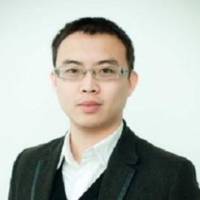

# 吴琦 Qi Wu — 视觉语言导航的共同开创者，RADAR 里的视觉-语言方法学资深作者

> RADAR 第 14 / 40 位作者 · Australian Institute for Machine Learning (AIML), Adelaide University · 方法侧学术合作方（既不属于达摩院，也不属于浙大一院）

## 一句话画像

Adelaide University 副教授、V3A Lab（Vision, Ask, Answer, Act）主任，==CVPR 2018 那篇开创视觉语言导航（VLN）子领域的论文第二作者==，Google Scholar h-index 72。在 RADAR 里是全文仅有的两个 AIML Adelaide 署名之一，另一个是自己的在读博士生 Sinuo Wang。最值得记的一点：**这是一条"外国教授临时挂名"看上去最像、实际上最不像的线** —— 医学影像自监督与报告监督这条支线，吴琦已经做了近十年，且几乎每一篇都坐末位资深作者位。

## 在 RADAR 里的位置

- **作者位次第 14 / 40**。论文标注的唯一单位是 Australian Institute for Machine Learning, Adelaide University, Adelaide SA, Australia。
- 全文 **AIML Adelaide 这个单位只出现两次**：第 10 位 Sinuo Wang 和第 14 位吴琦。Sinuo Wang 是 V3A Lab 的在读博士生，官方个人页写明由 A/Prof. Qi Wu 与 Dr. Yutong Xie 共同指导，博士课题正是 **medical domain 的视觉-语言预训练** —— 与 RADAR 的技术内核（从临床报告直接学习、无需人工标注的解剖感知图文对）是同一件事。
- 位次紧跟在 Sinuo Wang（#10）、[谢雨彤](12-yutong-xie.md)（#12）、[夏勇](13-yong-xia.md)（#13）之后，是典型的「学生在前、指导老师在后」成组排法。
- 【**推断**】承担的是 **视觉-语言预训练的方法学指导（资深作者角色）**，经由在读博士生 Sinuo Wang 落地、与前博后谢雨彤共同把关；不参与临床、数据采集与部署。依据是作者位次、单位分布、师生关系三条线。**Science 的 author contributions 在付费墙后，逐人分工没有原文可依**。
- **反证一并记下**：位次停在第 14 而不是末尾通讯位，说明不是本项目负责人 —— 项目归属明确在达摩院（[张灵](39-ling-zhang.md) #39）与浙大一院（[梁廷波](40-tingbo-liang.md) #40）。
- **PANDA（*Nat Med* 2023, PMID 37985692）不在作者列表**，36 位作者全名单逐一核过，也没有任何 Adelaide 单位的作者。RADAR 是与达摩院医疗线的**第一次**正式合作，进入通道是 [张建鹏](02-jianpeng-zhang.md) 与 [谢雨彤](12-yutong-xie.md) 两条个人学术关系，不是机构级合作。浙大一院—达摩院这条线在 PANDA 时代就已存在（[章琦](01-qi-zhang.md)、[梁廷波](40-tingbo-liang.md) 都在 PANDA 里），RADAR 新进来的只有 Adelaide 这一支。
- 相关背景见 [../sources/academic-pipeline.md](../sources/academic-pipeline.md) 与 [../sources/radar-technical-teardown.md](../sources/radar-technical-teardown.md)。

## 背景与履历

| 时间 | 单位 · 职位 | 备注 |
|---|---|---|
| 2006–2010 | 中国计量大学（杭州）· 理学学士 | ORCID 记专业为 Mathematics，中文报道记为「信息与计算科学」；在中国属数学类专业，同一专业的两种说法 |
| 2010–2011 | University of Bath（英国巴斯大学）· 硕士 | 学位名称见「未解决」 |
| 2011–2015 | University of Bath · 计算机科学博士 | 导师 **Prof. Peter Hall**（Bath 官方研究门户论文记录直接写明 Supervisor）；论文《Modelling Visual Objects Regardless of Depictive Style》，2015-04-02 授予 |
| 2014 | Lenovo · 研究实习 | Adelaide 官方 profile 记为「2014–ongoing」，疑为页面长期未更新 |
| 2015–2017 | University of Adelaide · **Senior Research Associate** | 学术转折期：与 Chunhua Shen、Anton van den Hengel、Anthony Dick、Peng Wang、Lingqiao Liu 密集产出 image captioning 与 VQA 的奠基工作 |
| 2017–2018 | **Australian Centre for Robotic Vision (ACRV)**, University of Adelaide · ARC Senior Research Associate | 与 Peter Anderson、Damien Teney、Niko Sünderhauf、Ian Reid、Stephen Gould 合作，CVPR 2018 开创 VLN |
| 2018–2022 | University of Adelaide · Senior Lecturer | 正式留校任教，创建 V3A Lab，开始独立带组 |
| 2023–至今 | Adelaide University / AIML · **Associate Professor**，V3A Lab Director | 学校 **2026-01-29** 起与南澳大学合并、改名 Adelaide University；早期材料写 The University of Adelaide，是同一所学校 |

**没有迁移过**：2015 年到 Adelaide 之后十一年没换过机构，ACRV → School of Computer Science and Information Technology → AIML 都是校内建制变动。不属于"跟着某个大佬迁移"的类型，反而是别人跟着走。

Adelaide 官方 profile 注明有资格作为 Principal Supervisor 独立带硕士与博士，但原文写着「currently at capacity」（已招满）。

## 研究方向

主线是 vision-language，三级演进清晰：

- **跨绘画风格的物体识别（cross-depiction）** —— 博士期（Bath）。照片 / 素描 / 油画之间共享的视觉结构。这个出身解释了后来为什么一直盯「语义抽象层」而不是像素层。
- **图像描述 + 视觉问答 + referring expression**（2015–2018，Adelaide）—— 把「显式高层语义属性 + 外部知识库」注入 captioning/VQA 这条路线的主要开创者之一。
- **视觉语言导航 VLN**（2018 起）→ **具身智能 / VLA**（2023 起）—— V3A Lab 现在的主攻方向是通用导航框架与具身大模型。
- **医学支线（与 RADAR 直接相关，稳定产出近十年，几乎全部坐末位资深作者位）**：
  - 跨维度无配对自监督预训练（2D X 光 ↔ 3D CT 共享编码器）：UniMiSS / UniMiSS+
  - 报告引导的医学表征学习：MedIM、Rethinking masked image modelling for medical image representation
  - 医学视觉-语言与 medical VQA：Multi-modal Adapter for Medical Vision-and-Language Learning、按病理描述分解的病灶检测
- 换句话说，对 RADAR 这类「==用临床报告当监督信号训练 CT 视觉-语言模型==」的范式，有六七年的方法学积累打底。

## 代表作

| 论文 | 期刊 · 年份 | 作者位次 |
|---|---|---|
| Vision-and-Language Navigation: Interpreting Visually-Grounded Navigation Instructions in Real Environments | CVPR 2018 | 第 2 / 9（首位 Peter Anderson）· **2507 次引用，VLN 领域的起点论文，也是被引最高的一篇** |
| FVQA: Fact-Based Visual Question Answering | TPAMI 2018 | 第 2 / 5 · 约 736 次引用 |
| REVERIE: Remote Embodied Visual Referring Expression in Real Indoor Environments | CVPR 2020 | 第 2 / 7 · 约 636 次引用 |
| Visual Question Answering: A Survey of Methods and Datasets | CVIU 2017 | 第 1 / 6 · 约 620 次引用 |
| NavGPT: Explicit Reasoning in Vision-and-Language Navigation with LLMs | AAAI 2024 | 末位第 3 / 3（通讯）· 约 619 次引用；续作 NavGPT-2（ECCV 2024）同为末位 |
| Image Captioning and Visual Question Answering Based on Attributes and External Knowledge | TPAMI 2018 | 第 1 / 5 · 约 595 次引用 |
| **【医学线】** Medical image classification using synergic deep learning | Medical Image Analysis 2019 | 第 3 / 4（张建鹏、谢雨彤、吴琦、夏勇）· 404 次引用 —— **与 [张建鹏](02-jianpeng-zhang.md) 合作的起点** |
| **【医学线】** UniMiSS: Universal Medical Self-supervised Learning via Breaking Dimensionality Barrier | ECCV 2022；扩展版 UniMiSS+ TPAMI 2024 | 两版均为末位第 4 / 4 |
| **【医学线】** MedIM: Boost Medical Image Representation via Radiology Report-Guided Masking | MICCAI 2023；期刊版 Medical Image Analysis 2024 | 两版均为末位第 6 / 6 |
| **【本文】** An expert-level generalist AI for abdominal CT diagnosis (RADAR) | *Science* 393(6817):eaec6129, 2026 | 第 14 / 40 |

## 师承与关系

**主干师承**：**Peter Hall**（University of Bath）→ 吴琦。Hall 做 cross-depiction（跨绘画风格的视觉理解），博士论文就是这个题目。从一开始受训的就是「把视觉抽象成可跨域的结构 / 概念」，而不是做像素。

**第二重血统：Adelaide 的 ACVT / ACRV 谱系**。2015 年到 Adelaide 后进入 Anton van den Hengel + Chunhua Shen + Anthony Dick + Ian Reid 这一脉，2015–2018 的全部代表作都是这套班底署名。这是学术上的"二次出生"：从 cross-depiction 转到 vision-to-language。【**推断**】Chunhua Shen 与 Anton van den Hengel 是这段时期的实际指导者 —— 官方履历不记 supervisor，这是从署名倒推的。

**与 Peter Anderson 的关系是合作者，不是师生** —— CVPR 2018 那篇由 Peter Anderson 领衔、吴琦列第 2 位，两人在 ACRV 期间共事。V3A Lab 的 alumni 名单里没有 Peter Anderson。

**自己开枝散叶**：2018 年建 V3A Lab，现有博后 4 人（Qi Chen、Sihao Lin、Xinyu Yan、Shan Wang）+ 博士生 7 人 + MPhil 2 人，alumni 11 人（含 Yicong Hong、Gengze Zhou、Chaorui Deng → 阿里巴巴、Mahdi Kazemi Moghaddam，以及博后 Yuankai Qi、Yanyuan Qiao、Cristian Rodriguez-Opazo、Xinyu Wang、[谢雨彤](12-yutong-xie.md)）。VLN 这个子领域今天的主要活跃人员里有相当一部分出自这个组。

**与 RADAR 直接相关的血统 —— 西北工业大学 [夏勇](13-yong-xia.md) 谱系 × Adelaide 的交汇点**（这条解释了为什么一位澳洲 CV 教授会出现在一篇达摩院腹部 CT 论文里）：

| 人 | 与吴琦的关系 | 走向 |
|---|---|---|
| [张建鹏](02-jianpeng-zhang.md)（#2，共同一作） | 夏勇在西工大的博士生，读博期间与 Adelaide 双挂；自 2017 年起与吴琦长期合著 | → 达摩院 |
| [谢雨彤](12-yutong-xie.md)（#12） | 夏勇在西工大的博士生（2021 博士）；2020-01 起公派 Adelaide 联合培养（沈春华、Johan Verjans）；**2021-04 起 AIML 博士后，合作导师吴琦**；医学支线的核心搭档 | → 2025-01 起 MBZUAI 助理教授 |
| Sinuo Wang（#10，无单独页面） | **现在的在读博士生**，与谢雨彤共同指导；课题 = 医学视觉-语言预训练。Adelaide 本硕（2021 BEng 电子电气工程自主系统方向、2023 MSc 人工智能与机器学习），2023 年随 RoboBreizh 队获 RoboCup@Home SSPL 世界冠军 | 在读 |

「西工大血统 → 达摩院」和「西工大血统 → Adelaide 吴琦组 → MBZUAI」这两条支流，在吴琦这里合流。医学线的起点论文（*Med Image Anal* 2019）的原始单位坐实了机制：张建鹏、谢雨彤当时都是「西工大 + University of Adelaide」双挂，吴琦挂 Adelaide，夏勇挂西工大 —— **西工大学生赴 Adelaide 联培 → 与吴琦结识**。

**与达摩院的其他交集**：未发现与 [张灵](39-ling-zhang.md)、[夏英达](20-yingda-xia.md)、Le Lu、Jiawen Yao 的合著（检索库为 Google Scholar 与 OpenAlex，后者聚类被同名污染，否定性结论只能算"未发现"而非"没有"）。与阿里巴巴另有若干非医疗合作（Sketch, Ground and Refine / CVPR 2021、Prompt Switch / ICCV 2023 等），都是学生毕业去阿里后带出来的 CV/NLP 工作。参见 [../sources/damo-lineage.md](../sources/damo-lineage.md)。

## 学术指标

| 指标 | 数值 |
|---|---|
| Google Scholar 总引用 | **21,548**（2021 年以来 18,976） |
| h-index | **72**（2021 年以来 70） |
| i10-index | 168（2021 年以来 166） |
| ORCID | 0000-0003-3631-256X |
| DBLP 标识 | Qi Wu 0001 |

以上 Google Scholar 数字为 **2026-09-20 抓取**，来自标注「Verified email at adelaide.edu.au」的认证主页。

⚠️ **同名污染必须记一笔**。"Qi Wu" / "吴琦" 都是高频重名：

- **文献库层面**：OpenAlex 的作者记录虽然挂着正确的 ORCID，但 affiliations 里混进了十余个无关机构（悉尼科技大学、浙江中医药大学、江苏大学、澳国立、华侨大学、佐治亚理工、中南大学、山东大学……），其中 **2003 年的条目早于本科入学（2006）**，是决定性的污染证据。Semantic Scholar 端搜索 "Qi Wu" 返回四千余条候选、全是碎片聚类。==这两个库的任何计量数字、以及任何「没有与某人合著过」的否定性结论都不可直接使用。==
- **身份锁定链条是闭合的**：论文原文单位（AIML, Adelaide University）→ Adelaide 官方 profile → 带 adelaide.edu.au 验证邮箱的 Google Scholar（Top 5 高被引全是 VLN / FVQA / REVERIE / VQA Survey / NavGPT）→ ORCID（Bath 博士 + 中国计量大学本科）。四者互锁。
- **中文检索必须带限定词**（阿德莱德 / VLN / V3A / AIML）：单查「吴琦」会立刻混入文学杂志《单读》主编吴琦等他人。

## 对 Shu 意味着什么

**价值等级：间接、中低。作为直接去处不合适，但这条线上挂着一个具体可用的引线。**

**为什么直接价值低**：方向不对口 —— 吴琦的医学工作全部停留在「表征学习 + 报告监督」这一层，处理的是已经重建好的 DICOM 和文字报告；Shu 的核心资产（材料分解、水脂分解、光子计数谱学、噪声传播模型）在这套技术栈里连输入都不是，进去等于从头做多模态、物理那套直接失效。加上 V3A Lab 明确写着「currently at capacity」，以及 **I-539（J-1 → F-1）审理中不能出境**，任何需要离境办签证的澳洲岗位在 2026 年内都不可行。这一条本身就排除了 Adelaide。

**真正有价值的三点**：

1. **[谢雨彤](12-yutong-xie.md)（MBZUAI 计算机视觉系助理教授，2025-01 起）才是这 40 人里对 Shu 最现实的一个去处** —— 吴琦的前博后、专做医学影像自监督与多模态，刚起步建组，学校全额资助、主动招国际人才、签证由学校办。新组对「能带来别人没有的模态知识」的人有实际需求，而谱学 CT / 材料分解在医学 AI 圈子里恰好稀缺。**建议把她单独立一条去深挖。**
2. **读法层面**：吴琦这条线说明，RADAR 这类论文的「方法学资深作者位」是靠近十年小圈子合作换来的，不是靠投简历。想进医学基础模型这个圈子，路径是先与某个方法学 PI 产生真实的联合产出（例如用 Shu 的物理仿真数据给别人的自监督模型做一份新的预训练语料），而不是申请。
3. **技术上可借的**：UniMiSS / UniMiSS+ 的「**跨维度无配对自监督**」（2D 投影 ↔ 3D 体数据共享编码器）与 Shu 手上「多能量通道 / 多材料基图像之间共享表征」的问题在结构上同构，值得读一遍做方法参考 —— 但这是读文献的价值，不是找人的价值。

## 未解决

- **硕士学位名称有两种记法**：ORCID 记「MSc in Computer Science」，Adelaide 官方 profile 记「Global Computing and Media Technology」。两处都是一手来源，本页只写"巴斯大学硕士"。
- **在 AIML 内部是否另有「视觉与语言方向实验室主任」职务**：仅见于一篇中文媒体专访。Adelaide 官方 profile 无此职务，V3A Lab 官网只写 V3A 的 Director。单一来源，本页不采信。
- **2015–2018 年 Adelaide 时期的博后指导人**：官方履历不记 supervisor，Chunhua Shen / Anton van den Hengel 是从署名倒推的推断。
- **与张建鹏、谢雨彤的确切合著篇数**：只能从被同名污染的聚类里数，数字不可靠，本页只写"长期合著"。
- **RADAR 里的逐人分工**：Science 正文与 author contributions 在付费墙后，未读到原文。
- **2026 年的现职可能已变**：Adelaide 官方 profile 内容明显陈旧（bio 里还写着 2015 年的 MS COCO 挑战赛成绩，Lenovo 实习写成「2014–ongoing」）。Google Scholar 与 ORCID 在 2026-09-20 仍记为 Associate Professor，本页据此记，但不排除已晋升而各页未更新。
- **未能检索到**（是没查到，不是查到没有）：中国计量大学的校友报道、ARC DECRA / Future Fellowship 记录、编委与领域主席任职、获奖记录。
- **中文名的来源等级**：Adelaide 无中文教师页，中文名的三个来源分别是雷峰网 2025-04-29 专访、VALSE 官方 bilibili 短教程（2021-08-16）、V3A 实验室介绍系列视频（2025-12），三者互相独立，且与四份一手英文记录在单位、职称、实验室名、本科校、博士校、代表方向六项上无一冲突。若按"必须是官网中文页"的最严标准，则只能算 likely。

## 来源

- https://researchers.adelaide.edu.au/profile/qi.wu01 — Adelaide University 官方 researcher profile（职称、学历、职业时间线）
- https://v3alab.github.io/ — V3A Lab 主页（Vision, Ask, Answer, Act）
- https://v3alab.github.io/people/ — V3A Lab 成员页（Director: Qi Wu, Associate Professor；现员与 alumni 全名单）
- https://v3alab.github.io/author/qi-wu/ — V3A Lab 个人页
- https://v3alab.github.io/author/sinuo-wang/ — Sinuo Wang 个人页（原文写明由 A/Prof. Qi Wu 与 Dr. Yutong Xie 指导，课题为医学领域视觉-语言预训练）
- https://v3alab.github.io/author/yutong-xie/ — 谢雨彤个人页（西工大博士、Adelaide 联培、AIML 博后）
- https://scholar.google.com/citations?user=aKXe1FEAAAAJ — Google Scholar（Verified email at adelaide.edu.au），2026-09-20 抓取
- https://orcid.org/0000-0003-3631-256X — ORCID（中国计量大学本科、Bath 硕博）
- https://researchportal.bath.ac.uk/en/studentTheses/modelling-visual-objects-regardless-of-depictive-style — Bath 博士论文记录，Supervisor: Peter Hall，授予日 2015-04-02
- https://www.leiphone.com/category/ai/H3WlLzSmX8M1Bg49.html — 雷峰网 2025-04-29 专访「阿德莱德大学吴琦：VLN 仍是 VLA 的未竟之战」，中文名主证据
- https://www.bilibili.com/video/BV13g41157yL — VALSE_Webinar「20210816【VALSE短教程】《视觉语言导航》特邀讲师：吴琦副教授（澳大利亚阿德莱德大学）」，中文名第二来源
- https://www.bilibili.com/video/BV18eqqBLE5e — 「吴琦老师视觉语言导航VLN硬核报告（〇）V3A实验室简介」，把中文名直接绑到 V3A 实验室
- https://pubmed.ncbi.nlm.nih.gov/42752131/ — RADAR PubMed 条目（40 位作者；Qi Wu 单位为 AIML, Adelaide University）
- https://pubmed.ncbi.nlm.nih.gov/37985692/ — PANDA (*Nat Med* 2023)，36 位作者全名单已核，无 Qi Wu
- https://pubmed.ncbi.nlm.nih.gov/30818161/ — *Med Image Anal* 2019 医学线起点论文的原始单位（张建鹏、谢雨彤为西工大 + Adelaide 双挂）
- https://github.com/alibaba-damo-academy/damo-radar — RADAR 代码库（Acknowledgements 列出 LAVIS、nnU-Net、MONAI、3D-ResNets-PyTorch）
- https://en.wikipedia.org/wiki/Adelaide_University — 校名沿革：2024-03-08 设立，2026-01-29 正式开学，由 University of Adelaide 与 University of South Australia 合并
- 照片：https://v3alab.github.io/people/ （V3A Lab 官方成员页 Director 头像；与 Google Scholar 认证主页头像为同一张照片）
