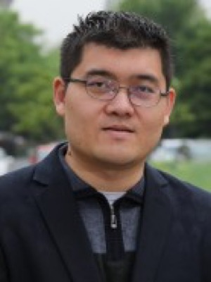

# 李玺 Xi Li — 通用计算机视觉出身的浙大教授，RADAR 里浙大计算机学院一侧的资深署名

> RADAR 第 16 / 40 位作者 · 浙江大学计算机科学与技术学院（论文单位 6，唯一单位）· 学院侧资深作者（非共同一作、非通讯）

## 一句话画像

做通用计算机视觉和多模态大模型的浙大教授、求是特聘教授、国家杰出青年科学基金获得者，学术血统是「中科院自动化所 → 阿德莱德 → 浙大人工智能研究所」。==在 RADAR 里，李玺是整张作者表上极少数只挂一个纯学术单位、不挂达摩院也不挂医院的人==。与达摩院腹部 CT 这条线的公开合作始于 2025 年年中，之前一篇都没有 —— 是新进入者，不是老盟友。

## 在 RADAR 里的位置

- **作者位次 16 / 40**，论文标注单位只有一个：浙江大学计算机科学与技术学院。不挂阿里达摩院，不挂[湖畔实验室](../sources/hupan-lab.md)，不挂浙大一院。作者表里同属「纯浙大计算机学院」这一档的只有第 15 位 Zhongyi Shui（水中易）——两人连号。相比之下，[张建鹏](02-jianpeng-zhang.md)、[曹维维](03-weiwei-cao.md)、Yanjie Zhou 虽然也挂浙大计算机学院，但同时挂着达摩院加湖畔实验室。
- 不在 6 位共同第一作者（位次 1–6）之列，也不在末尾通讯位（[肖文波](38-wenbo-xiao.md)、[张灵](39-ling-zhang.md)、[梁廷波](40-tingbo-liang.md)）。
- **承担的角色（推断）**：浙大计算机学院一侧的学术指导与挂靠，而不是技术执行者。依据有三：位次与单位组合；姊妹论文 arXiv:2508.03742（ICCV 2025）里排第 6、紧接吕乐（Le Lu）之前，是明确的资深位；本人的视觉-语言与多模态表征方法储备（FcaNet、LayoutDiffusion、MovieChat+ 一路下来）正好是 RADAR 那套细粒度图文对齐的上游。**没有任何证据显示参与了数据采集、临床标注、读者研究或多中心验证**——那部分由浙一及[基层网络](../sources/grassroots-network.md)的医生作者承担。
- **与 PANDA 无重合。** PANDA（*Nat Med* 2023）36 位作者中第 12 位署名 `Li X`，单位是「上海长海医院胰腺疾病研究所放射科」，是同名的另一人。
- **与达摩院其他论文的重合只有一篇**：arXiv:2508.03742 / ICCV 2025，*Boosting Vision Semantic Density with Anatomy Normality Modeling for Medical Vision-language Pre-training*，作者班底与 RADAR 几乎同一拨。同组更早的 CT 视觉-语言预训练论文 fVLM（arXiv:2501.14548，ICLR 2025）里，资深位是西湖大学杨林（Lin Yang），**名单里没有李玺**。==也就是说，李玺是 2025 年年中才接进这条腹部 CT 线的==，至今公开合作就这两篇。

## 背景与履历

| 时间 | 单位 · 职位 | 备注 |
|---|---|---|
| 2000.09–2004.07 | 北京航空航天大学 电子工程系 | 学士 |
| 2004.09–2009.01 | 中国科学院自动化研究所 模式识别国家重点实验室（NLPR） | 博士，081203 计算机应用技术；导师**推断**为胡卫明 |
| 2009.02–2009.05 | 中国科学院自动化研究所 NLPR | 研究助理 |
| 2009.06–2010.06 | 法国国家科学院 巴黎电信大学（主页原文用词） | 博士后 |
| 2010.09–2014.02 | 澳大利亚阿德莱德大学 计算机视觉研究中心 | 高级研究员（Senior Research Fellow） |
| 2014 | 浙江大学 计算机科学与技术学院 **人工智能研究所** | 获聘教授并入职；同期入选第五批国家「青年千人计划」 |
| 约 2021 起 | 浙江大学上海高等研究院 副院长（兼） | 单一来源口径，写法在「副院长 / 专聘副院长」间不一 |
| — | 浙江大学-每日互动数据智能研发中心 主任（兼） | 单一来源 |
| 2024.08.12 | 浙江大学人工智能学院挂牌（加挂于计算机学院），2025.07 独立运行 | 个人主页单位已改为「人工智能学院」，Google Scholar 仍写 College of Computer Science —— 论文单位与现职单位不一致的原因 |
| 2025 | ICCV 2025 / arXiv:2508.03742，与达摩院 × 浙一班底首次同框 | 单位仍只写浙大计算机学院 |
| 2026.03.13 | 2025 年度华为公司优秀技术合作项目奖 | 学院喜报称是「浙江大学第一位四次获得华为火花价值奖的教师」 |
| 2026.09.17 | RADAR 发表于 *Science* 393(6817):eaec6129，署名第 16 位 | |

**头衔与荣誉**（主要取自本人浙大主页与 CCF 讲者简介，多为单一来源）：浙江大学求是特聘教授；国家杰出青年科学基金获得者；IAPR / IET / AAIA / AIIA Fellow，IEEE Senior Member，CCF 与 CSIG 杰出会员；科技创新 2030「新一代人工智能」重大项目首席科学家；浙江省杰出青年科学基金、浙江省特聘专家、杭州市钱江特聘专家；Elsevier「中国高被引学者」（2023–2025）。学术服务方面是 IEEE TNNLS / TMM / TCSVT / TCDS 与 Neurocomputing 的 Associate Editor，CVPR 2020、ICCV 2019、ECCV 2020、ACM MM 2020–2021 的 Area Chair。

早期奖项（2014 年本人主页自述）：ACCV 2010 与 DICTA 2012 最佳论文奖，北京市自然科学技术奖一等奖与二等奖各一项，中国专利优秀奖一项。

## 研究方向

- **主线是通用计算机视觉与机器学习，不是医学影像。** 主页自述方向为「人工智能、计算机视觉、机器学习、模式识别、数据挖掘」。
- 早期（自动化所 + 阿德莱德）：视觉跟踪与外观模型（Log-Euclidean 黎曼子空间、增量张量子空间学习）、显著性检测。
- 浙大前期（2016–2022）：深度显著性检测、行人重识别、通道注意力（FcaNet）、车道线检测、骨架动作识别、小样本增量学习。
- 近期（2023–2026）：生成式与多模态——布局可控扩散、长视频问答、相机可控图生视频、混合专家视觉语言模型的不确定性路由、GUI 与具身智能体、AI 生成图检测。
- **医学影像只是一条细支**：2019 年 IEEE TMI 的 CT 胰腺分割（深度 Q 学习驱动的几何感知 U-Net），加上 2025 年起与达摩院的医学视觉-语言预训练。胰腺恰好是这条线（浙一肝胆胰外科）的临床锚点，但单凭一篇七年前的分割论文不足以说明是医学影像专家。

## 代表作

| 论文 | 期刊 · 年份 | 作者位次 |
|---|---|---|
| An expert-level generalist AI for abdominal CT diagnosis | *Science* 393(6817):eaec6129, 2026 | 16 / 40 |
| FcaNet: Frequency Channel Attention Networks | ICCV 2021 | 末位（通讯位），1930 引 |
| Deeply-Learned Part-Aligned Representations for Person Re-Identification | ICCV 2017 | 第 2 位，995 引 |
| A survey of appearance models in visual object tracking | ACM TIST 4(4), 2013 | 第 1 位，966 引 |
| Ultra Fast Structure-Aware Deep Lane Detection | ECCV 2020（期刊版 TPAMI 2022） | 末位，803 引 |
| DeepSaliency: Multi-task deep neural network model for salient object detection | IEEE TIP 25(8), 2016 | 第 1 位，635 引 |
| LayoutDiffusion: Controllable Diffusion Model for Layout-to-image Generation | CVPR 2023 | 末位（通讯位），442 引 |
| Deep Q learning driven CT pancreas segmentation with geometry-aware U-Net | IEEE TMI 38(8):1971–1980, 2019 | 第 4 位，203 引 —— 与腹部 CT 的最早接点 |
| Boosting Vision Semantic Density with Anatomy Normality Modeling for Medical VLP | ICCV 2025 / arXiv:2508.03742 | 第 6 位（共 11 位，紧接吕乐之前） |

引用数为 Google Scholar 2026-09-20 抓取值。

## 师承与关系

- **博士导师推断为胡卫明**（中科院自动化所 NLPR 研究员，视频内容安全团队负责人）。支撑是三条间接证据：Google Scholar 合作者列表首屏即有 Weiming Hu；读博期间及之后的长期连续合著（ACM TIST 2013 综述、TPAMI 2012、IJCV）；CSIG 2021 年度自然科学奖二等奖的完成人名单为「李玺、吴飞、庄越挺、王井东、胡卫明」。**没有找到写明这层师生关系的直接材料**，也没有找到指向其他导师的反证。
- **一条闭环的谱系**：胡卫明本人 1995–1998 在浙江大学计算机系读博，导师是何志均（浙大计算机系与人工智能研究室的创建者），随后 1998–2000 在北京大学计算机科学技术研究所做博士后，合作导师王选。而李玺 2014 年落地的正是浙大计算机学院**人工智能研究所**——从谱系上说是回到了师门源头。
- **浙大内部属吴飞—庄越挺一系**。Google Scholar 合作者首位是吴飞；也是 *Nature Machine Intelligence* 2020 那篇中国新一代人工智能综述的合著者之一。
- **与阿德莱德同源**。2010–2014 在阿德莱德的计算机视觉研究中心（后演化为 Australian Institute for Machine Learning），合作者包括 Anton van den Hengel、Anthony Dick、沈春华。RADAR 里第 10 位 Sinuo Wang 与第 14 位 [吴琦](14-qi-wu.md) 挂的正是 AIML，第 12 位 [谢雨彤](12-yutong-xie.md) 也出自这条[澳洲中转线](../sources/academic-pipeline.md)。==但「澳洲同源」更像背景巧合而非入局机制==：2025 年与达摩院的首次合作里同框的澳洲侧只有 Sinuo Wang 一人，吴琦并不在；而这几位本来就是[达摩院医疗 AI](../sources/damo-lineage.md) 的长期合作方。
- **与阿里生态的建制化关系**：中国电子信息年会「创新团队奖」的一支获奖团队名单里有吴飞、杨红霞、周靖人、李玺、赵洲等人，周靖人与杨红霞、林伟均为阿里系。Google Scholar 合作者中还有赵利民（Liming Zhao，现阿里达摩院），即 ICCV 2017 行人重识别论文的一作。
- **与第 15 位 Zhongyi Shui 的关系未证实**。Shui 的博士导师是西湖大学杨林（2022–2027），论文主线是计算病理，长期资深合著者也是杨林；与李玺的合著只有 RADAR 与 arXiv:2508.03742 两篇，都在 2025 年之后、都由达摩院主导。联合培养需要浙大一侧导师，但没有任何材料写明这个人是李玺。
- **带的学生出口高度集中在互联网大厂**：主页点名博士生秦泽群（FcaNet 与 Ultra Fast Lane Detection 一作，CSIG 优博），其余学生流向字节跳动 Seed、阿里、华为。==学生名单里没有一个做医学影像的==。

## 学术指标

| 指标 | 数值（2026-09-20 抓取） |
|---|---|
| Google Scholar 总引用 | 19,131 |
| h-index | 70（2021 年起 53） |
| i10-index | 194（2021 年起 155） |
| 账号状态 | Verified email at zju.edu.cn，本人已认领 RADAR 该条目 |
| ORCID | 未找到可确认的本人 ORCID |

增长曲线可以看出重心完全在浙大这十二年：2014 年本人主页自述「发表 40 余篇、他引 600 余次」，2019 年前后英文主页写「约 150 篇、约 4600 引」，到 2026 年是 19,131 引。

⚠️ **「Xi Li」是中文学界重名密度最高的名字之一。** OpenAlex 的 Xi Li 作者实体 A5100407758 把几十位同名人揉成了一个，机构历史横跨十余家单位，别名里甚至混进了完全无关的条目，其 works / citations / h-index 全部是污染值，==不可引用==。Semantic Scholar 对 RADAR 的 Xi Li 未分配 authorId。PubMed / Europe PMC 对该文 `Li X` 的 ORCID 为空（40 位作者中 22 位有 ORCID）。唯一可靠的指标入口是上面那个已验证浙大邮箱的 Google Scholar 账号。

## 对 Shu 意味着什么

**直接价值很低，不建议投入精力。** 方向不重合：这边是通用视觉与多模态大模型（注意力机制、扩散模型、视频问答、智能体），Shu 做的是双能与光子计数 CT 的物理反演——基材料分解、噪声传播、校准。李玺唯一沾 CT 的工作是把 CT 当图像看的分割，不是当测量看，两边的「CT」不是同一个 CT。招生渠道也对不上：实验室常年招的是浙大计算机 / 工程师 / 软件学院体系内的硕博，没有迹象表明招国际博士后，更谈不上签证路径。

想接触达摩院医疗 AI 这条线，绕过这里、直接看[张灵](39-ling-zhang.md)与吕乐那条脉更有效——李玺是 2025 年才接进来的学院侧挂靠，不是资源节点。

**唯一可以拿走的东西与人脉无关**：FcaNet 的论证结构——先证明「通道注意力其实是离散余弦变换最低频分量的特例」，再放开约束做推广。这跟 Shu 在 WLP / VMI 工作里「先证明 40 keV 才是真正的第三通道、三能量广义最小二乘会失败」的写法是同一类套路，作为写作范式值得看一眼。记进作者谱系图即可，不必联系。

## 未解决

- **博士导师**：胡卫明这条只有合著关系与获奖名单的间接支撑，中科院大学导师页现行版本已不展示学生名册，历史快照也调不出来。标为推断。
- **与 Zhongyi Shui 的师生关系**：未证实。也无法判定李玺在这个项目里的浙大挂靠对象究竟是谁（Weiwei Cao、Yanjie Zhou 同样可能）。
- **RADAR 里的具体分工**：论文的作者贡献声明在付费墙后，未能读到原文，本页所有角色判断都是推断。
- **「美国国家人工智能科学院院士（NAAI Member）」**：只见于本人主页自述与 CCF 讲者页，未做独立核验，且该机构本身有争议。
- **华为奖项次数**：学院喜报写「四次火花价值奖」，其他口径写五项，未能统一。
- **上海高等研究院副院长是否仍在任**：最新旁证是 2026 年的会议讲者介绍，职务名称在不同来源里写法不一。
- **生年 1981**：仅见于百科类摘要，浙大官网未载，无第二独立来源。
- **CSIG 2021 获奖名单、各类 Fellow 头衔、求是特聘教授、华为奖喜报**：均为单一来源，本轮未能逐条复核。
- 与达摩院「公开合作仅两篇」这一结论，穷举窗口是 2025–2026，更早年份未逐条排查。

## 来源

- https://person.zju.edu.cn/xilics — 浙江大学官方个人主页（中文），「李玺／教授｜博士生导师／单位 人工智能学院」，更新时间 2026-06-22
- https://person.zju.edu.cn/en/xilics — 同一 slug 的英文主页，「XI LI Ph.D. / Professor | Doctoral supervisor」
- http://web.archive.org/web/20141016035519/http://mypage.zju.edu.cn/xilics/0.html — 2014 年主页快照，自述「入选第五批中国国家『青年千人计划』，2014 年获聘浙江大学教授，并入职浙江大学计算机学院人工智能研究所」
- http://web.archive.org/web/20170222234000/http://person.zju.edu.cn/xilics/672641.html — 「教育和研究经历」栏官方快照，四段学历与工作经历原文
- https://scholar.google.com/citations?user=TYNPJQMAAAAJ&hl=en — Google Scholar 本人已验证主页（2026-09-20 抓取：19,131 引 / h=70 / i10=194），论文列表按年份排序可见 RADAR 与 ICCV 2025 那篇
- https://people.ucas.ac.cn/~huweiming — 中国科学院大学 胡卫明导师页（师承推断的一端；现行版本不展示学生名册）
- https://ccf.org.cn/speaker_d_3042 — CCF 讲者简介「李玺，浙江大学求是特聘教授，Fellow of IAPR/IET/AAIA/AIIA，国家杰出青年科学基金项目获得者」
- http://www.cs.zju.edu.cn/ — 浙大计算机科学与技术学院官网，2026-03-13 华为奖喜报
- https://ai.zju.edu.cn/ — 浙江大学人工智能学院官网（2024-08-12 挂牌、2025-07 独立运行）
- http://sias.zju.edu.cn/ — 浙江大学上海高等研究院「人才队伍」页
- https://www.csig.org.cn/ — 中国图象图形学会 2021 年度自然科学奖二等奖公示（完成人：李玺、吴飞、庄越挺、王井东、胡卫明）
- https://arxiv.org/abs/2508.03742 — ICCV 2025，与达摩院 × 浙一班底的另一篇合著（第 6 位）
- https://arxiv.org/abs/2501.14548 — fVLM（ICLR 2025），同组更早的 CT 视觉-语言预训练论文，作者中无李玺
- https://www.science.org/doi/10.1126/science.aec6129 — RADAR 原文页（付费墙，作者贡献声明不可读）
- https://www.ebi.ac.uk/europepmc/webservices/rest/search?query=EXT_ID:42752131%20AND%20SRC:MED&resultType=core&format=json — RADAR 逐作者单位与 ORCID
- https://www.ebi.ac.uk/europepmc/webservices/rest/search?query=EXT_ID:37985692%20AND%20SRC:MED&resultType=core&format=json — PANDA 逐作者单位（其 `Li X` 属上海长海医院胰腺疾病研究所放射科）
- https://openreview.net/profile?id=~Zhongyi_Shui1 — Zhongyi Shui 档案，博士导师记为 Lin Yang（2022–2027）
- 照片：https://person.zju.edu.cn/xilics
