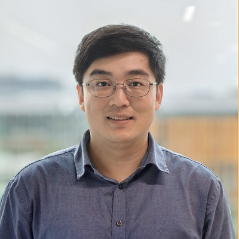

# Tony C. W. Mok — 达摩院医疗 AI 线的配准专职算法工程师

> RADAR 第 19 / 40 位作者 · 阿里巴巴达摩院（杭州）+ 湖畔实验室（论文单位 4、5）· 算法侧技术贡献者，非通讯、非共同一作

全名 Tony Chi Wing MOK，香港人，HKUST 计算机系本硕博一条线出身。公开一手来源（本人主页、ORCID、HKUST 学位记录、PubMed、GitHub）全部只给粤语拼音，==中文名无可靠来源，本页一律用英文名==。

## 一句话画像

医学图像**配准（registration）**领域的实战型选手：LapIRN 一系列工作是 Learn2Reg 挑战赛多年的事实标准 baseline，2020、2021、2023 三届 Learn2Reg 加 2022 届 BraTS-Reg，四次拿下第一名。2022 年从 HKUST 博士毕业后直接进阿里巴巴达摩院当算法工程师，在 RADAR 这类几十人规模的临床 AI 大论文里稳定承担"空间对齐"这一层工具型底座，位次居中。==是达摩院医疗 AI 线的技术件供应方，不是 PI，不带学生，没有招聘权。==

## 在 RADAR 里的位置

- 作者位次 **19 / 40**，署名单位是达摩院 + [湖畔实验室](../sources/hupan-lab.md)，属算法侧，不在 26 家医院的临床侧。
- 前后紧邻的是第 18 位 Yan-Jie Zhou 与第 20 位 [夏英达](20-yingda-xia.md)——这一段是达摩院的老算法班底连号。末位通讯 [梁廷波](40-tingbo-liang.md)、AI 侧资深作者 [张灵](39-ling-zhang.md)。
- **不在 PANDA 作者名单里**（*Nat Med* 2023，36 位作者，逐一比对无此人）。最早的达摩院署名成果是 2023 年年中的几篇 MICCAI / MLMI，与 PANDA 发表几乎同期——「推断」是 PANDA 立项之后才进入这条产品线的。
- 与达摩院 × 浙大一院的其他联名论文有重合：**iAorta**（平扫 CT 诊断急性主动脉综合征，*Nat Med* 2025，第 34/46 位），同篇里还有 [张建鹏](02-jianpeng-zhang.md) 与 [肖文波](38-wenbo-xiao.md)。
- 具体分工「推断」：RADAR 的 1,500 万 anatomy-aware 图文对要求把每一例 CT 放进统一的解剖参考系，增强腹部 CT 又天然涉及多期相之间的对齐——这正对应其 LapIRN / C2FViT / SAMConvex / UniReg 的能力链。**Science 正文的 Author Contributions 未取得，模块归属没有直接证据**，详见 [技术拆解](../sources/radar-technical-teardown.md)。
- 参照：在自己主导的配准论文里永远是第 1 作者；RADAR 不是本人的项目。

## 背景与履历

| 时间 | 单位 · 职位 | 备注 |
|---|---|---|
| 约 2013–2017（入学年「推断」） | 香港科技大学 计算机科学及工程学系（HKUST CSE）· 本科 BS | Dean's List 2016、2017；2017 年一等荣誉（First Class Honors）毕业 |
| 2017 年春起 | HKUST CSE · 助教 | MSBD5010 图像处理与分析；此后 COMP4421 图像处理、CSIT5410 识别系统，一路带到 2019-20 学年 |
| 2017（「推断」）–2022 | HKUST CSE · 博士 | 学位论文《Unsupervised affine and deformable medical image registration with convolutional neural networks》，2022 年；学位记录著者名 "Mok, Chi Wing" |
| 2018 | —— | 第一篇一作（MICCAI BrainLes 工作坊，脑肿瘤分割数据增强 GAN，Oral）；同年第 3 作者出 IEEE TIP |
| 2020 | —— | CVPR 2020（SYMNet）+ MICCAI 2020（LapIRN，Oral）双发；10 月 **Learn2Reg 2020 第一名** |
| 2021 | —— | MICCAI 2021 early accept + Oral（cLapIRN）；**Learn2Reg 2021 第一名**；MICCAI Student Travel Award、Outstanding Reviewer（荣誉提名） |
| 2022 | —— | CVPR 2022（C2FViT）+ MICCAI 2022（DIRAC）；**BraTS-Reg 2022 第一名**；MICCAI 2022 Outstanding Reviewer（1242 名评审中前 12）；同年完成学位论文 |
| 2022 下半年–2023 上半年（「推断」） | 阿里巴巴达摩院（杭州）· 算法工程师 | 硬边界只有两条：学位论文 Issue Date 2022；最早带达摩院合作者的 arXiv 是 2023-06 / 2023-07。入职公告未见 |
| 2023 | 达摩院 | 以 LapIRN 拿 **Learn2Reg 2023 两个赛道第一**（与 Zi Li 合作），配准挑战赛四连冠；ICCV 2023 Outstanding Reviewer |
| 2024 | 达摩院 | CVPR 2024 一作（模态无关结构表示学习）+ AAAI 2024 + CVPR 2024 另两篇；个人主页 News 停在 2024-03 |
| 2025 | 达摩院 + 湖畔实验室 | iAorta（*Nat Med*）第 34/46；UniReg 第 4/10；OncoReg 挑战赛论文；MICCAI 2025 鼻咽癌 GTV 分割 |
| 2026 | 达摩院 + 湖畔实验室 | **RADAR（*Science*）第 19/40**；TumorChain 第 18/25；HounsWorld 多模态世界模型 第 5/8 |

## 研究方向

- **主线：可变形与仿射医学图像配准。** 核心手法是把形变场约束在微分同胚（diffeomorphic）空间内，再用拉普拉斯金字塔做由粗到细的大形变估计。
- **LapIRN 系列**（MICCAI 2020 / 2021）：最有名的工作。cLapIRN 把正则化超参数做成网络的条件输入，==一次训练、测试时任意调平滑度==，省掉为每个平滑度重训一遍。
- **SYMNet**（CVPR 2020）：同时估计正向与逆向变换的对称配准。
- **C2FViT**（CVPR 2022）：仿射配准的 Transformer 化，常被当作可变形配准之前的预对齐模块。
- **DIRAC**（MICCAI 2022）：处理"缺失对应关系"的配准——术前 / 复发后脑肿瘤 MRI 里，肿瘤区在另一幅图上根本没有对应点。
- **模态无关的结构表示学习**（CVPR 2024）与 **UniReg**（2025）：把多模态配准的问题推到表示层，并统一成一个条件模型。
- 进达摩院后外扩到**大规模临床 CT 诊断系统**：通用解剖结构分割（AAAI 2024）、平扫 CT 主动脉综合征筛查、鼻咽癌 GTV 分割、腹部 CT 通用诊断（RADAR）。这些项目里的角色是技术贡献者，不是 lead。
- 可观察的行为特征：主页 Honors 栏逐条列着四个 1st place，每条 Selected Publication 下面也挂一行 "Ranked 1st place in ..."——**公开挑战赛排名是这份履历的主要展示货币**。

## 代表作

| 论文 | 期刊 · 年份 | 作者位次 | GS 引用（2026-09-20 抓取） |
|---|---|---|---|
| Large Deformation Diffeomorphic Image Registration with Laplacian Pyramid Networks（LapIRN） | MICCAI 2020（Oral） | 第 1 / 共 2 | 500 |
| Learn2Reg: Comprehensive Multi-Task Medical Image Registration Challenge, Dataset and Evaluation | IEEE Trans. Medical Imaging 2023, 42(3):697-712 | 第 3 / 共 53 | 403 |
| Fast Symmetric Diffeomorphic Image Registration with CNNs（SYMNet） | CVPR 2020 | 第 1 / 共 2 | 387 |
| Affine Medical Image Registration with Coarse-to-Fine Vision Transformer（C2FViT） | CVPR 2022 | 第 1 / 共 2 | 164 |
| Conditional Deformable Image Registration with CNN（cLapIRN） | MICCAI 2021（Oral, early accept） | 第 1 / 共 2 | 155 |
| Modality-Agnostic Structural Image Representation Learning for Deformable Multi-Modality Registration | CVPR 2024 | 第 1 / 共 12（合著者全是达摩院医疗 AI 线：Zi Li、张建鹏、Yan-Jie Zhou、Ke Yan、Dakai Jin、Le Lu、张灵） | 54 |
| Unsupervised Deformable Image Registration with Absent Correspondences（DIRAC） | MICCAI 2022 | 第 1 / 共 2 | 53 |
| AI-based diagnosis of acute aortic syndrome from noncontrast CT（iAorta） | *Nature Medicine* 2025 | 第 34 / 共 46 | — |
| An expert-level generalist AI for abdominal CT diagnosis（RADAR） | *Science* 2026, 393(6817):eaec6129 | 第 19 / 共 40 | — |
| UniReg: Conditional Unified Model for Medical Image Registration | 2025 | 第 4 / 共 10 | — |

## 师承与关系

**博士导师是两位**，HKUST 学位记录的 Supervisor 字段依次为 **Pedro Sander**（HKUST CSE 计算机图形学教授）与 **Albert Chi Shing Chung**。本人主页只提 Chung 一人（"My Ph.D. advisor is Prof. Albert Chi Shing CHUNG."）。

Chung 这一支的履历（其主页可逐字核）：香港大学计算机工程 B.Engg 一等荣誉 1995 → 1996 入 HKUST、1998 获 M.Phil. → 1998–2001 牛津大学 Oriel College，**Medical Vision Laboratory, Robotics Research Group**，2001 年 D.Phil.，Croucher 学者 → 2001-09 至 2002-02 MIT AI Lab 访问学者 → 2002 年 BMVA Sullivan 最佳博士论文奖 → 2005–2021 创办并主持 HKUST **Lo Kwee-Seong 医学图像分析实验室** → 2020-01 至 2021-12 工学院副院长 → **2022-01 至 2023-08 赴英国 Exeter 大学任 Chair in AI** → 2023-08 回 HKUST，2023-11 起任 Research Center for Medical Imaging and Analysis 主任。Chung 的牛津博士导师姓名各页面均未写明；其 1999 年 MICCAI 论文与 **J. Alison Noble** 共同署名（Crossref 可核），据此「推断」Noble（可能与 Michael Brady 共同）为导师，仅此一条旁证。

时间上的两件事并排放着：Chung 于 2022 年 1 月离港赴 Exeter，Mok 恰在 2022 年提交学位论文、随后进达摩院；Chung 主页 2023 年底的在组博士生只剩两位，已无此人。**两者之间的因果没有任何来源支持，只是时间相邻。**

**第二段血统在工业界**：进达摩院后进入 Le Lu / [张灵](39-ling-zhang.md) / Ke Yan / Dakai Jin / [夏英达](20-yingda-xia.md) 这条医疗 AI 线（谱系是 NIH Clinical Center → 平安 PAII → 达摩院，详见 [达摩院血统](../sources/damo-lineage.md)）。达摩院时期的每一篇都固定与 Zi Li、[张建鹏](02-jianpeng-zhang.md)、Yan-Jie Zhou、Ke Yan、Dakai Jin、Le Lu、张灵 中的若干人共同署名，**Zi Li 是最稳定的搭档**（Learn2Reg 2023 两人合作夺冠、SAMConvex、CVPR 2024、UniReg）。

**配准这条线在达摩院内部的 lead 已经换人**：2020–2024 年的配准论文里一直是第 1 作者，最后一次是 CVPR 2024；2025 年的 UniReg 一作是 Zi Li，Mok 退到第 4/10（同篇还有 [叶香华](22-xianghua-ye.md)）。

**唯一的外部学术社群纽带**：MICCAI 2023 的 Unsupervised 3D registration through optimization-guided cyclical self-training，合著者是德国 Lübeck 大学的 Alexander Bigalke、Lasse Hansen、Mattias P. Heinrich——**Heinrich 与 Hansen 正是 Learn2Reg 挑战赛的组织方**。到 2025 年仍在 Learn2Reg 2024 基准论文的作者表里。

## 学术指标

- **Google Scholar**（user=DglezXoAAAAJ，2026-09-20 抓取）：总引用 **2,373**（since 2021: 2,324），**h-index 18**，**i10-index 21**。显示单位 "Alibaba DAMO Academy"，验证邮箱仍是 HKUST 校友域，homepage 字段直指 cwmok.github.io——三重绑定，这份 profile 确属本人。
- **ORCID：0000-0002-4779-9337**，researcher-url 指向本人主页。
- ⚠️ **同名污染极重，是这个名字最大的陷阱**：医学文献里的 "Tony Mok" 绝大多数指 **Tony S. K. Mok（莫树锦）**，香港中文大学临床肿瘤学讲座教授、肺癌 EGFR-TKI 领域的世界级权威，==与本人毫无关系==。检索时必须先看中间名缩写：**C. W. = 本人，S. K. = 莫树锦**。
- **Semantic Scholar 的聚合数字不可用**：同一人被拆成 id 7288503（HKUST 时期）与 id 2293172594（达摩院时期）两个档；另一个 "T. Mok" 档里混进了 *Radiotherapy and Oncology*、*J Thoracic Oncology*、IJROBP 的香港临床肿瘤 / 放疗论文，同时又吞掉了本人的一篇 Learn2Reg 论文。
- OpenAlex 的作者级数字本次未能取得可用响应，不引用。
- GitHub：**github.com/cwmok**，5 个论文代码仓库 + 主页仓库。

## 对 Shu 意味着什么

**评分约 4/10：是工具提供者和路径样本，不是去向。** 方向完全不交叉——Mok 做配准与表示学习，不碰能谱、不碰噪声模型、不碰重建物理；又是算法工程师、不带学生、无招聘权，对 2026 年 9 月之后的博后 / PhD 去向没有直接价值。真正值得现在就用的是代码：TNC vs CCTA 的脂肪内碘差值统计、PCAT/FAI 的纵向随访，都要先做同一病人跨期相的体素级对齐，而这几个仓库是该领域的事实标准 baseline（==注意这是几何对齐，不是平滑，与"不做高斯平滑"的立场不冲突==）：

- `cwmok/Conditional_LapIRN` — 一次训练、测试时扫正则化强度，正对应"既别抹掉真实差异、又别留残余错配"的两难（87 stars，最后 push 2024-05）
- `cwmok/LapIRN` — 大形变微分同胚配准（145 stars，2023-07）
- `cwmok/C2FViT` — 仿射预对齐（155 stars，2023-11）
- `cwmok/DIRAC` — 存在无对应关系区域时的配准，对应"增强期出现了平扫期没有的结构"（49 stars，2023-07）
- `cwmok/Fast-Symmetric-Diffeomorphic-Image-Registration-with-Convolutional-Neural-Networks` — SYMNet（157 stars，2022-07）

==论文代码自 2024-05 起再无更新，可以直接拿来用，但不要指望维护或 issue 回复。== 找工作角度，这是一个干净的样本：非医学物理出身，靠四个公开挑战赛第一名加 CVPR×3 / MICCAI×4 的一作直接进大厂——**工业界医疗 AI 看的是可复现的公开排名加一作顶会，不是引用总数**（h-index 18 在学界只算中等），可以对照 [达摩院招人](../sources/damo-hiring.md) 与两条求职轨道一起看。反面提醒同样具体：进了大厂医疗 AI，个人署名会从"一作"滑到 40 人表的中段，主页两年不更新。真要联系达摩院这条线，该找的是张灵、Le Lu、夏英达，Mok 只适合当技术层面的对话人。

## 未解决

- **中文名**：所有一手来源（主页、ORCID other-names 为空、HKUST 学位记录、PubMed、GitHub、导师主页）只有粤语拼音 "Tony Chi Wing MOK" / "Mok, Chi Wing"。中文搜索入口在多次尝试中全部被验证码或反爬拦截，且 "Tony Mok + 医学" 的中文检索几乎必然先命中莫树锦。姓氏"莫"是拼音反推，不作结论。可能的突破口：CNIPA 里达摩院医学图像配准专利的中文发明人名，再用同族 US/WO 公开文本的英文发明人名做严格对应。
- 本科入学年份（按港校四年制反推 2013）、博士起止（2017–2022）、入职达摩院的时间（2022 下半年–2023 上半年）均为「推断」，无直接来源。
- RADAR 里的具体分工无直接证据，Author Contributions 未取得。
- ORCID 上于 2026-02-26 由本人账号新增一条 HKUST 的 employment 记录，**无起止日期、无职称**；同一 ORCID 上没有任何阿里巴巴的 employment 记录，唯一的 employment 就是 HKUST。含义不明，更像补登母校——2025 年的 *Nature Medicine* 与 2026 年的 *Science* 署名都还是达摩院 + 湖畔实验室，**未见任何离开达摩院的证据**。
- Albert Chung 的牛津博士导师姓名无直接来源（ora.ox.ac.uk 检索 404）。
- 主页 HTML 里残留着 Adrian Dalca（MIT）网页模板的原始内容——剑桥地址与 MIT 邮箱。**那不是本人的信息，与 MIT 无任何关联**，自动抓取工具容易误归。

## 来源

- https://cwmok.github.io/ — 本人主页（唯一一手自述；注意含 Adrian Dalca 模板残留）
- https://orcid.org/0000-0002-4779-9337 — ORCID
- https://scholar.google.com.hk/citations?user=DglezXoAAAAJ&hl=en — Google Scholar（2,373 引用 / h=18 / i10=21，2026-09-20 抓取）
- https://github.com/cwmok — 论文代码（LapIRN / Conditional_LapIRN / C2FViT / DIRAC / SYMNet）
- https://hdl.handle.net/1783.1/150297 — HKUST 学位论文记录（2022，Supervisor: Sander, Pedro；Chung, Albert Chi Shing）
- https://repository.hkust.edu.hk/ir/Search/Results?lookfor=%22Mok%2C+Chi+Wing%22&type=AllFields — HKUST 机构库该姓名全部记录
- https://cse.hkust.edu.hk/~achung/ — Albert C. S. Chung 主页（完整履历与共同获奖记录）
- https://cse.hkust.edu.hk/News/Learn2Reg2021/ — HKUST CSE 新闻：Learn2Reg 2021 第一名
- https://cse.hkust.edu.hk/News/Learn2Reg2020/ — HKUST CSE 新闻：Learn2Reg 2020 第一名
- https://arxiv.org/abs/2006.16148 — LapIRN（MICCAI 2020）
- https://arxiv.org/pdf/2106.12673 — Conditional LapIRN（MICCAI 2021）
- https://arxiv.org/pdf/2402.18933 — Modality-Agnostic Structural Image Representation Learning（CVPR 2024）
- https://pubmed.ncbi.nlm.nih.gov/42752131/ — RADAR, *Science* 2026（第 19/40，达摩院 + 湖畔实验室）
- https://pubmed.ncbi.nlm.nih.gov/40835970/ — iAorta, *Nature Medicine* 2025（第 34/46）
- https://pubmed.ncbi.nlm.nih.gov/37985692/ — PANDA, *Nature Medicine* 2023（36 位作者，无此人）
- https://github.com/alibaba-damo-academy/damo-radar — RADAR 官方代码库
- 照片：https://cwmok.github.io/
