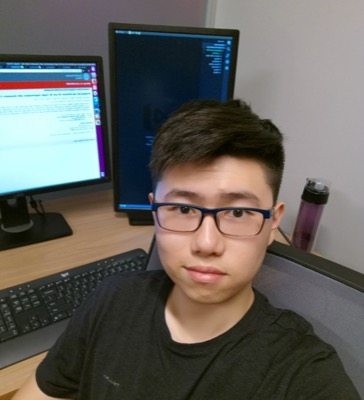

# 夏英达 Yingda Xia — 达摩院医疗 AI 美国组的算法一号位，PANDA / GRAPE 共同第一作者

> RADAR 第 20 / 40 位作者 · 阿里巴巴达摩院（Alibaba DAMO Academy, Washington, DC, USA，论文 11 号单位）· 算法侧资深研究者，非临床、非教职

## 一句话画像

清华本科 → Johns Hopkins 计算机博士（导师 Alan Yuille）→ 阿里巴巴达摩院美国。达摩院医疗 AI 从胰腺、胃、肝到八癌种统一模型再到通才影像模型这条五年演进路线上，每一站都在，作者位置从共同一作逐步挪到通讯位——**这个人本身就是那条线的技术连续性**。==RADAR 里只排第 20 位，但这不是衡量的尺子：PANDA（第 2/36，共同一作）和 GRAPE（第 2/58，共同一作）才是。==

## 在 RADAR 里的位置

- 第 **20 / 40** 位，单位为论文 11 号单位「Alibaba DAMO Academy, Washington, DC, USA」。==全篇 40 人里只有两个人挂这个单位：第 20 位与第 39 位 [张灵](39-ling-zhang.md)。== 达摩院美国这条线在 RADAR 上就这两个名字。
- 位次卡在达摩院 / 浙大算法组与各地临床医生组的交界处。RADAR 的共同第一作者是前六位（[章琦](01-qi-zhang.md)、[张建鹏](02-jianpeng-zhang.md)、[曹维维](03-weiwei-cao.md)、Zilin Lu、常琬星、Haonan Ding）；开源仓库 `alibaba-damo-academy/damo-radar` 的全部提交者只有三人——fjcaoww（34 次）、jianpengz（10 次）、changwxx（1 次），其中没有这一位。
- 【推断】承担的是**美国组的方法学把关与评测设计**，不是工程实现。可迁移的是 PANDA / GRAPE 两代攒下的两样东西：用配准过来的增强 CT 标注去监督平扫 CT；多中心外部验证与读者研究怎么设计才顶得住 *Science* / *Nature Medicine* 的审稿。2024 年的 CT-GLIP（3D 图文接地预训练）与 RADAR「从报告文本学习」的路线是直接前身。论文未公开 author contributions，以上均为推断。
- RADAR 摘要里可查的人机协作结果：26 位放射科医师在 RADAR 辅助下诊断敏感性提升约 10%。
- **与 PANDA 的重合**：PANDA（*Nature Medicine* 2023，36 位作者）与 RADAR 共享 4 人——本人（2/36）、[章琦](01-qi-zhang.md)（33/36）、[梁廷波](40-tingbo-liang.md)（34/36）、[张灵](39-ling-zhang.md)（35/36）。另一个少被注意的连接点：GRAPE 第 3 位共同一作 Zhilin Zheng 就是 RADAR 第 17 位。

## 背景与履历

| 时间 | 单位 · 职位 | 备注 |
|---|---|---|
| 2013—2017 | 清华大学软件学院（2013 级）· 本科 B.E. | 2015 年秋「计算机系统软件」课程项目 XV6 中带 GUI 组 |
| 2017 | 微软亚洲研究院（MSRA）· 实习 | |
| 2017-09—2021 | Johns Hopkins University 计算机科学系 · 博士生 | 导师 Alan L. Yuille（Bloomberg Distinguished Professor），CCVL 实验室；主页 news 原文「2017.09: Hi Hopkins!」 |
| 2018-06 | NVIDIA · 实习 | 主页明写合作者为 Holger Roth、Daguang Xu、Le Lu（吕乐）——与吕乐的第一次交汇 |
| 年份不详（2019 年年中之后） | PAII Inc.（平安美国研究院，Bethesda）· 实习 | 当时该实验室负责人是吕乐 |
| 2021 | 阿里巴巴达摩院美国 · 入职 | JHU CCVL 校友页记「Former PhD student (2021); Now at Alibaba」；早期论文单位标 New York, NY |
| 2022 | JHU 博士学位 | 本人主页写 2022 年获学位。【推断】2021 年离校入职、2022 年正式授位 |
| 2022—2023 | 达摩院（New York） | PANDA 主力，*Nature Medicine* 2023 共同一作；同期 ICCV / CVPR / IPMI 开始坐通讯位，从执行者转为带人 |
| 2024—2025 | 达摩院（Washington, DC），部分论文并挂[湖畔实验室](../sources/hupan-lab.md) | 重心从单病种检测转向 CT 视觉-语言模型 |
| 2025-06 | GRAPE 胃癌平扫 CT 筛查，*Nature Medicine* 共同一作 | 同月吕乐离开达摩院赴蚂蚁 Medical AI Lab（Sunnyvale）；达摩院美国这条线由[张灵](39-ling-zhang.md)守着 |
| 2026 | *Science*（RADAR，20/40）、*Nature Communications*（脂肪肝，7/22）、*Radiology: AI*（胃肿瘤，2/20 共同一作）、*Medical Image Analysis*（内镜，通讯） | 同一年单位标注同时出现华盛顿（RADAR、Nat Commun）与杭州 + 湖畔实验室（MedIA） |
| 2026-09-20 | 在职 | Google Scholar 自填「Staff Scientist, Alibaba DAMO Academy USA」；2024-08 主页自述为「staff algorithm engineer at Alibaba DAMO Academy USA」 |

## 研究方向

- **阶段一（JHU，2017—2021）：3D 医学影像分割的方法学。** coarse-to-fine 框架、2D/3D 融合、半监督与不确定度（UMCT）、域自适应、分割失败检测与分布外定位（Synthesize-then-Compare）。问题意识是「标注太贵 + 模型会悄悄失败」。同期还有一条联邦学习支线（CVPR 2023 数据异构，第 4/8 位，是其 Google Scholar 引用第三高的论文）。
- **阶段二（达摩院，2021—2024）：大规模癌症早筛。** 胰腺（PANDA）、胃（GRAPE）、肝肿瘤（PLAN）、八癌种统一模型（CancerUniT）、结直肠分割、胰腺癌术后生存预测。==技术底牌只有一张：拿配准过来的增强 CT 标注去监督平扫 CT 训练，再在平扫上推理==，以此绕开「平扫 CT 上人眼标不出病灶」这个死结。
- **阶段三（2024—2026）：CT 的视觉-语言模型与通才影像 AI。** CT-GLIP、报告文本监督的检测，以及 OmniCT、TumorChain、BreastGPT、EndoVLM、SeVeR、E-MRL 等预印本。转向是「不再逐病种标注，直接从临床报告学习，一个模型覆盖多器官多病症」——RADAR 是这条路线的期刊化成果。
- **作者位置的迁移本身是一条信息**：2018—2021 一作，2023 年起坐通讯位（MaxQuery、CancerUniT、IPMI 2023），2025—2026 的多模态大模型系列一律列末位或倒数第二位。
- **与 CT 成像物理最近的一条支线**：2026 *Nature Communications* 的脂肪肝（steatotic liver disease）多模态机会性筛查——从常规 CT 做肝脂肪分期与进展风险分层。

## 代表作

| 论文 | 期刊 · 年份 | 作者位次 |
|---|---|---|
| Large-scale pancreatic cancer detection via non-contrast CT and deep learning（PANDA） | *Nature Medicine* 2023（PMID 37985692） | 第 2/36，**共同第一作者**（7 人并列）；并列名于论文利益冲突声明所列的专利受益人（CN 202210575258.9 / US 18046405，与 L.Z.、J.Y.、L. Lu、X. Hua 同列） |
| AI-based large-scale screening of gastric cancer from noncontrast CT imaging（GRAPE） | *Nature Medicine* 2025（PMID 40555751） | 第 2/58，**共同第一作者**（前 7 位并列） |
| An expert-level generalist AI for abdominal CT diagnosis（RADAR） | *Science* 393(6817):eaec6129, 2026（PMID 42752131） | 第 20/40 |
| Multi-modal AI for opportunistic screening, staging and progression risk stratification of steatotic liver disease | *Nature Communications* 2026（PMID 41672973） | 第 7/22 —— 与 CT 成像物理侧最相关的一篇 |
| Gastric Neoplasm Detection at Contrast-enhanced CT with Deep Learning | *Radiology: Artificial Intelligence* 2026（PMID 41295087） | 第 2/20，**共同第一作者** |
| Towards a Single Unified Model for ... Eight Major Cancers（CancerUniT） | ICCV 2023 | 第 2/25，共同通讯作者（来源为本人主页自标） |
| Uncertainty-aware multi-view co-training for semi-supervised medical image segmentation and domain adaptation（UMCT） | *Medical Image Analysis* 2020（PMID 32623276） | 第 1/10，347 次引用 |
| Synthesize then Compare: Detecting Failures and Anomalies for Semantic Segmentation | ECCV 2020（Oral） | 第 1/5，221 次引用 |

另：MaxQuery（CVPR 2023 Highlight，第 2/16，通讯）、内镜幽门螺杆菌诊断（*Medical Image Analysis* 2026，PMID 42685436，第 14/16，Elsevier 标注为通讯作者）、结直肠癌分割（IEEE TNNLS 2025，PMID 38687670，第 2/14）、胰腺癌术后总生存预测（*Annals of Surgery* 2023，PMID 35781511，第 5/23）。

## 师承与关系

**学术血统 —— JHU CCVL 胰腺线。** 导师 Alan L. Yuille，Johns Hopkins Bloomberg Distinguished Professor，CCVL（Computational Cognition, Vision, and Learning）实验室负责人；CCVL 2016 年后大幅转向医学影像，与 JHU 放射科 Elliot K. Fishman 结成「Yuille × Fishman 胰腺联盟」——早期几乎所有论文（VFN、3D coarse-to-fine、Multi-scale PDAC screening、Alignment Ensemble）的末位合作者都是 Fishman。同门（医学影像一支）：Zhuotun Zhu、Fengze Liu、Qihang Yu、Yuyin Zhou、Wei Shen、Zongwei Zhou、Jieneng Chen、Yutong Bai。这批人后来散入 NVIDIA、Google、UCSC、JHU 教职与中国各大厂，走进阿里的是这一支中的这一位。

**工业血统 —— 吕乐（Le Lu）链条。** 吕乐的路径是 NIH Clinical Center → 平安 PAII Bethesda（2018-06 至 2021-07）→ 达摩院全球医疗 AI 负责人 → 蚂蚁 Medical AI Lab（Sunnyvale）。三次交汇：2018-06 NVIDIA 实习的合作者里明写有吕乐；PAII 实习期间吕乐正是该实验室负责人；2021 年博士毕业后入职达摩院美国。==时间重合是事实，「跟着吕乐走」是推断==——双方都没有公开陈述过这层因果。展开见 [达摩院医疗 AI 血统](../sources/damo-lineage.md)。

**直接上级 —— [张灵](39-ling-zhang.md)（#39）。** 达摩院医疗 AI 实验室肿瘤早筛与影像智能算法负责人，PANDA 与 GRAPE 的通讯作者，RADAR 的 AI 侧资深作者，同样是 NIH / PAII 出身。RADAR 的 11 号单位就这两人。

**与本文其他作者。** 与 [章琦](01-qi-zhang.md)、[梁廷波](40-tingbo-liang.md)、[张灵](39-ling-zhang.md) 同时是 PANDA 与 RADAR 的作者；RADAR 的执行主力 [张建鹏](02-jianpeng-zhang.md)、[曹维维](03-weiwei-cao.md) 在杭州侧。RADAR 的作者结构因此读出一个信号：==重心由美国转向杭州，美国保留方法学话语权==。

## 学术指标

- **Google Scholar**（2026-09-20 抓取）：总引用 **5,670**；2021 年至今 5,424（96% 的引用集中在近五年）；**h-index 27**（近五年 25）；i10-index 40（近五年 39）。自填单位「Staff Scientist, Alibaba DAMO Academy USA」，绑定阿里巴巴机构验证邮箱域，标签 AI for Science / AI for Medicine。
- 单篇引用最高的是 The Medical Segmentation Decathlon（*Nature Communications* 2022，2,100 余次），但那是 58 人的大规模 benchmark 协作、列第 52 位，不代表主导工作。真正代表方法学影响力的是 UMCT（347 次，一作）与 Synthesize-then-Compare（221 次，一作）。
- **ORCID 0000-0002-7478-4392**：记录极简——教育仅「Johns Hopkins University | PhD | Computer Science」一条且无起止年，任职仅「Alibaba Group (United States)」一条且无职称，收录作品 7 条，无传记。不能当履历用。
- **重名提示**：==PubMed 把 RADAR 第 13 位 Yong Xia（[夏勇](13-yong-xia.md)）和第 20 位 Yingda Xia 都缩写成 "Xia Y"==，任何按缩写抓取的脚本都会把两人混在一起。中文网络另有同名的主播，与本人无关。PubMed 收录 12 篇，arXiv 收录 35 篇。

## 对 Shu 意味着什么

==不是读博导师，是工业界目标单位加一个方法论对照组。== 达摩院美国的雇主实体（Alibaba Group (US) Inc）确实在办 H-1B —— Washington DC 在 2026-04 申报过一个 Senior Algorithm Engineer —— 但它**不公开招聘**：美国劳工部的 LCA 披露里 DC 的研究岗全年只有这一条，"Research Scientist"头衔 2022 年之后归零，岗位语言是 LLM / VLM 而不是成像物理。所以这是一个**只能定向联系、不能投简历**的去处，优先级排在设备厂的研究岗之后（详见 [达摩院求职通道](../sources/damo-hiring.md)）。技术上最近的交集不是胰腺是**脂肪**：2026 *Nature Communications* 那篇从常规 CT 做肝脂肪分期，和水/脂分解、PCAT 脂肪量化是同一个临床问题的两条路——端到端回归脂肪程度，对上从衰减物理解出体积分数；前者换扫描仪就要重训、给不出可传递的不确定度，后者有基矩阵、有噪声传播、有误差预算。冷邮件的钩子应当写这个落差（「你们缺 ground truth 的可迁移性，我缺规模」），而不是写"我也做 CT"。**局限要说清**：非 faculty、不招博士生；整条达摩院医疗 AI 线都是「给定重建好的图像做诊断」，探测器、重建、材料分解那一层在那边是黑盒，Shu 最硬的那部分能力在其评价体系里不产生分数。另可留意一点语气：2025-06 的中文报道里写过「夏英达就被自己约翰霍普斯金大学博士期间合作医生一票否决过，"用平扫CT来看胰腺癌，完全不可能"」——对"被临床说不可能然后硬做出来"这件事是有共情的。

## 未解决

- **博士毕业年份三源不一**：本人主页写 2022 年获学位，JHU CCVL 校友页写「Former PhD student (2021)」。本页按「2021 离校入职、2022 授位」的推断写。
- **清华院系为间接证据**：本人所有自述只写「B.E. at Tsinghua University in 2017」，从未写院系；「软件学院 2013 级」来自其 GitHub 账号下的清华课程项目组织描述与项目名单。具体专业名（软件工程）无官方材料，属推断。
- **PAII 实习年份不详**：2019-06 的主页快照只列 Nvidia (2018)、MSRA (2017)，2024 年快照才加上 PAII 且无年份，只能定位在 2019 年年中之后。
- **此刻的准确职级/职称无法断言**：主页自述（2024-08）与 Google Scholar 自填（2026-09-20）用词不同，中文报道又是第三种说法。
- **RADAR 内部分工全部是推断**：论文未公开 author contributions，本页的角色判断只基于位次、单位隔离与代码库提交者名单三条间接证据。
- **2026 年的单位标注同时出现华盛顿与杭州**，常驻地不明。
- **CancerUniT 的共同通讯身份只有本人主页一个来源**，ICCV 论文正文未核。
- **无可访问的个人主页**：yingdaxia.xyz 域名已过期（现跳转域名待售页），yingdaxia.github.io 跳向该域名；本页引用的主页内容全部来自 Wayback 快照（2019-06-26、2024-08-27 两版）。
- 华东师大两条学术报告通知页本次不可访问（HTTP 502），未做逐字核对。

## 来源

- https://web.archive.org/web/20190626141717/http://yingdaxia.xyz/ （本人主页 2019 快照，"Yingda Xia 夏英达" 同行并列，含导师与 news 时间线）
- https://web.archive.org/web/20240827050026/https://yingdaxia.xyz/ （本人主页 2024 快照，含 bio、代表作与作者角色自标）
- https://github.com/THSS13/XV6 （清华软件学院 2013 级课程项目，README 含「夏英达组」；组织描述 "School of Software 2013, Tsinghua University"）
- https://github.com/YingdaXia （本人 GitHub）
- https://scholar.google.com/citations?user=_eqVp1AAAAAJ （Google Scholar，2026-09-20 抓取）
- https://orcid.org/0000-0002-7478-4392 （ORCID）
- https://ccvl.jhu.edu/team/ （JHU CCVL 团队与校友页）
- https://www.ncbi.nlm.nih.gov/pmc/articles/PMC10719100/ （PANDA 全文，共同一作声明与专利受益人名单）
- https://pubmed.ncbi.nlm.nih.gov/37985692/ （PANDA, *Nat Med* 2023）
- https://www.nature.com/articles/s41591-025-03785-6 与 https://pubmed.ncbi.nlm.nih.gov/40555751/ （GRAPE, *Nat Med* 2025）
- https://www.science.org/doi/10.1126/science.aec6129 （RADAR, *Science* 2026）
- https://github.com/alibaba-damo-academy/damo-radar （RADAR 代码库，提交者名单）
- https://huggingface.co/radar-generalist 与 https://zenodo.org/records/21271172 （RADAR 权重与代码存档）
- https://pubmed.ncbi.nlm.nih.gov/41672973/ （脂肪肝多模态 AI, *Nat Commun* 2026）
- https://pubmed.ncbi.nlm.nih.gov/41295087/ （胃肿瘤增强 CT 检测, *Radiology: AI* 2026）
- https://pubmed.ncbi.nlm.nih.gov/42685436/ （内镜幽门螺杆菌, *MedIA* 2026，标注为通讯作者）
- https://pubmed.ncbi.nlm.nih.gov/38687670/ （结直肠癌分割, IEEE TNNLS 2025）· https://pubmed.ncbi.nlm.nih.gov/35781511/ （胰腺癌生存预测, *Ann Surg* 2023）· https://pubmed.ncbi.nlm.nih.gov/36624800/ （联邦学习数据异构, CVPR 2023）
- https://news.qq.com/rain/a/20250625A0413C00 · https://m.thepaper.cn/newsDetail_forward_31040678 · https://finance.sina.com.cn/tech/roll/2025-06-25/doc-infchkcq2522826.shtml （2025-06 中文报道，GRAPE 发布）
- https://podcasts.apple.com/gb/podcast/id1778349074?i=1000718198369 （《菠萝健康派》vol.47，2025-07-20，嘉宾栏写「夏英达 阿里巴巴达摩院医疗AI实验室算法工程师」）
- https://www.cee.ecnu.edu.cn/12/66/c4179a594534/page.htm · http://www.cee.ecnu.edu.cn/0a/b5/c4170a592565/page.htm （华东师大学术报告通知，本次不可访问）
- https://www.linkedin.com/in/yingda-xia-16114b117/ · https://www.alphaxiv.org/@yingda-xia · https://dblp.org/pid/211/6798.html · https://www.researchgate.net/profile/Yingda-Xia （聚合页）
- http://health.people.com.cn/n1/2026/0918/c14739-40801368.html （人民网 2026-09-18，RADAR 开源报道）
- 照片：https://web.archive.org/web/20240827050026/https://yingdaxia.xyz/ （本人主页快照上的 photo.jpg，alt 文本为 "Yingda Xia"；同一张图亦是其 Google Scholar 头像）
