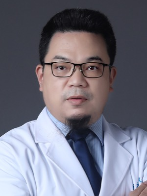

# 虞朝辉 Chaohui Yu — 浙大一院副院长、消化内科主任，RADAR 里唯一的消化内科医生

> RADAR 第 35 / 40 位作者 · 浙江大学医学院附属第一医院 消化内科（论文标注单位 25）· 临床资源与临床可信度的背书人

## 一句话画像

主战场是**脂肪性肝病**的临床科主任兼内镜医生，1999 年入职浙大一院至今 27 年没换过单位，现任**副院长、消化内科主任**。在 RADAR 40 位作者里是**唯一的消化内科作者**，位次 35 紧跟在一串外部协作医院临床医生之后——==这是"病例准入 + 临床标签把关"的位置，不是研究的智力主体==。整条履历没有任何成像物理、算法或影像 AI 内容，RADAR 是与达摩院唯一的一次交集。

## 在 RADAR 里的位置

- **第 35 / 40 位**。论文给的单位只有一个：浙大一院消化内科，==没有任何 Alibaba / DAMO / 湖畔字样==（论文里的达摩院作者都显式挂 Alibaba DAMO Academy）。
- **位次上下文**：第 25–34 位是嘉兴、绩溪、景宁、嵊州、海宁、安吉、余杭、北仑等外部协作医院的临床医生；紧随其后是本人，再往后是 [居胜红](36-shenghong-ju.md)（东南大学中大医院放射科）、Jianfeng Zhang（达摩院）、[肖文波](38-wenbo-xiao.md)（浙大一院放射科）。若是算法侧研究员，位次应落在前段的达摩院作者块里。
- **全文唯一的消化内科作者**。其余临床作者全是肝胆胰外科、放射科、放疗科、急诊科、普外科。RADAR 的病理确诊评估覆盖肝 / 胰 / 胃 / 结直肠四种癌，正是消化内科的地盘。
- **承担内容（以下全部为推断**，Science 正文与 Author contributions 在付费墙后，无法读到原文）：
  1. 消化系统疾病（肝脂肪变、肝硬化、胃与结直肠病变）的临床标签定义与诊断金标准把关——把内镜 / 病理确诊结果与 CT 报告对齐，是 146 种征象标签体系里最需要消化内科拍板的一块；
  2. 浙大一院侧的病例准入、伦理与跨科室协调——副院长身份是把 424,911 例腹部 CT 与报告从院内调出来的行政条件之一（见 [../sources/zju-hospital.md](../sources/zju-hospital.md)）；
  3. **不承担任何算法、模型、训练或统计工作**。
- **与 PANDA 无重合**：PANDA（*Nat Med* 2023, PMID 37985692）36 位作者名单里没有这一位。两篇共享的 4 人是 [夏英达](20-yingda-xia.md)、[章琦](01-qi-zhang.md)、[梁廷波](40-tingbo-liang.md)、[张灵](39-ling-zhang.md)。
- **可交叉验证的同型先例**：*Gut* 2023 质谱流式多中心早期肿瘤检测（PMID 36113977），同样由[梁廷波](40-tingbo-liang.md)通讯，本人第 **28 / 30** 位。==35/40 与 28/30 是同一种"院内高级临床背书人"位次模式。==

## 背景与履历

| 时间 | 单位 · 职位 | 备注 |
|---|---|---|
| 1992–1999 | 浙江大学医学院 七年制临床医学系 | 期间在浙大基础医学院生理学教研室受基础科研训练。**单一来源** |
| 1999-07 | 获医学硕士学位（内科学） | 另一来源写 1999-08，差一个月 |
| 1999-08 | 浙大一院 消化内科 住院医师 | 此后 27 年未换单位 |
| 2001-11 | 主治医师 | |
| 2002-05 | 第 26 届国际内科大会 Young Investigator's Award | |
| 2006-12 | 副主任医师 | |
| 2008 | 浙江大学 医学博士 | 在职攻读 |
| 2009-09 – 2011-01 | 美国国立卫生研究院（NIH）博士后 | 所属研究所 / 实验室 / 合作导师均未查到 |
| 2011-12 | 主任医师 | |
| 2013 | 教育部新世纪优秀人才支持计划 | |
| 2015 | 教育部高等学校科学研究优秀成果奖 **一等奖（排名第一）** | 官网"近五年主要成果"栏唯一一条 |
| 2016 | 浙江大学 内科学教授；浙江省 151 人才第一层次、浙江省卫生高层次创新人才 | 151 人才为先后入选第二层次、第一层次及重点资助 |
| 不晚于 2021-01 | 浙大一院 消化内科主任 | 2021-01-27 更新的浙大个人主页"职务"栏已写此职 |
| **推断** 2021 年之后 | 浙大一院 **副院长** | 2021-01 版个人主页未写副院长，当前医院官网医生页与现任领导页均写"副院长、消化内科科主任" |

**人才称号**：国家"万人计划"科技创新领军人才、科技部中青年科技创新领军人才、教育部新世纪优秀人才、浙江省 151 人才、浙江省卫生高层次创新人才。

**学会兼职**（医院官网逐字）：中华医学会内科学分会常委 · 中华医学会消化病学分会青年委员 · 中国医师协会内镜医师分会委员 · 中华医学会消化内镜学分会消化内镜隧道技术协作组副组长 · 中华医学会肝病学分会脂肪肝和酒精性肝病学组副组长 · 中国老年医学学会消化分会常委 · 浙江省医学会消化内镜分会副主任委员。

**主持项目**：国家重点研发计划、国家自然科学基金、973 计划子课题等。

## 研究方向

- **非酒精性脂肪性肝病（NAFLD / MASLD）——绝对主线**：血尿酸 → NLRP3 炎症小体 → 肝脂肪变与胰岛素抵抗这条机制线（*J Hepatol* 2009 / 2016 一串）；**ZJU index** 人群预测模型；miR-34a / PPARα；甲状腺功能、生长激素、HbA1c 与脂肪肝的人群关联。
- **酒精性肝病与乙醇代谢酶基因多态性**（ADH2 / ADH3 / ALDH2 基因芯片）：2000–2006 年的起家方向，直接承自厉有名。
- **肠道菌群—肝脏轴**：*Nature* 2022 肠道细菌降解尼古丁缓解吸烟相关 NASH。
- **炎症性肠病分子机制**：MPST / H₂S、OTUD5-STAT1/2-IFNγ。
- **幽门螺杆菌**：左氧氟沙星耐药检测、根除方案、23S rRNA 基因芯片筛查。
- **临床内镜**（官网逐字）：消化道早癌 ESD、贲门失弛缓症 POEM、食管胃底曲张静脉治疗、激光共聚焦内镜。
- ==没有任何影像 AI、算法或成像物理方向的独立研究线。==

## 代表作

被引数为 Europe PMC 口径，**2026-09-20 抓取**。

| 论文 | 期刊 · 年份 | 作者位次 |
|---|---|---|
| Gut bacteria alleviate smoking-related NASH by degrading gut nicotine | *Nature* 2022（PMID 36261549）· 被引 181 | 22 / 24，**共同通讯**（另有 NIH/NCI 的 Frank J. Gonzalez、北大姜长涛） |
| Uric acid regulates hepatic steatosis and insulin resistance through the NLRP3 inflammasome-dependent mechanism | *J Hepatol* 2016（PMID 26639394）· 被引 **311，最高** | **10 / 10 末位通讯**，厉有名第 9 |
| Effect of miR-34a in regulating steatosis by targeting PPARα expression in NAFLD | *Sci Rep* 2015（PMID 26330104）· 被引 223 | 第二高被引 |
| Association of serum uric acid level with non-alcoholic fatty liver disease | *J Hepatol* 2009（PMID 19299029）· 被引 215 | 3 / 5，厉有名居首 |
| The associations between modifiable risk factors and NAFLD: a comprehensive Mendelian randomization study | *Hepatology* 2023（PMID 35971878）· 被引 193 | 5 / 7 |
| Fatty acids promote fatty liver disease via the dysregulation of MPST / hydrogen sulfide | *Gut* 2018（PMID 28877979）· 被引 128 | 末位，厉有名倒数第二 |
| Mass cytometry-based peripheral blood analysis for early detection of solid tumours（多中心） | *Gut* 2023（PMID 36113977） | 28 / 30，[梁廷波](40-tingbo-liang.md)通讯 |
| **An expert-level generalist AI for abdominal CT diagnosis** | *Science* 393(6817):eaec6129, 2026（PMID 42752131） | **35 / 40** |

## 师承与关系

- **导师：厉有名（Youming Li）——【推断】**，浙大一院消化内科"酒精性肝病 / 脂肪肝"学派。没有任何权威来源明写"导师"二字，但客观痕迹很密：
  1. PubMed 共同发表 **169 篇**——这是同一课题组的量级，不是一般合作；
  2. 位次模式：最早的英文代表作 *Chin Med J* 2002「Genotype of ethanol metabolizing enzyme genes by oligonucleotide microarray in alcoholic liver disease」作者序为 **Yu C, Li Y, Chen W, Yue M**（第一作者，厉有名第二）；此后 2008–2016 的 *J Hepatol* / *Sci Rep* / *Gut* 一连串脂肪肝论文，作者串尾部固定是"…, Li Y, Yu C"或"…, Yu C, Li Y"；
  3. 研究主线全盘继承：乙醇代谢酶基因多态性 → 酒精性肝病 → 非酒精性脂肪肝；
  4. **职位继承**：现任的消化内科主任、中华医学会内科学分会常委两个头衔，正是厉有名当年的两个头衔。
- **NIH 博士后（2009-09 – 2011-01）**：双源确认确有其事，但研究所、实验室、合作导师全部未知。==不能因为 *Nature* 2022 的共同通讯里有 NIH/NCI 的 Frank J. Gonzalez 就推断师出该实验室==——两人 PubMed 共同发表仅此 1 篇，且发表在离开 NIH 十一年之后。
- **机构迁移：几乎没有。** 1999 年入职浙大一院至今，只有 2009–2011 一段 NIH 外派。典型的"一院终身型"中国临床学科带头人，不是跟着某个 PI 迁移的类型。
- **与本文其他作者的共同发表量**（PubMed，2026-09-20）：[梁廷波](40-tingbo-liang.md) 2 篇、[章琦](01-qi-zhang.md) 2 篇（均为 RADAR + *Gut* 2023）；[张灵](39-ling-zhang.md)、[夏英达](20-yingda-xia.md)、[居胜红](36-shenghong-ju.md)、[肖文波](38-wenbo-xiao.md) **各 1 篇，就是 RADAR 本身**。
- 结论：==不属于达摩院医疗 AI 的常驻临床合作者==（对照之下 [章琦](01-qi-zhang.md)、[梁廷波](40-tingbo-liang.md) 是 PANDA→RADAR 的连续性人物）。是被院长从院内拉进来的临床资源方。见 [../sources/damo-lineage.md](../sources/damo-lineage.md)。

## 学术指标

**2026-09-20 抓取**。

| 口径 | 数字 | 说明 |
|---|---|---|
| Google Scholar | **不报** | 作者检索页被登录墙拦截，无法确认是否有 Scholar 主页 |
| Europe PMC 自算（`AUTH:"Yu Chaohui" AND AFF:"Zhejiang" AND AFF:"Gastroenterology"`） | **176 篇 / 总被引 5706 / h-index 42** | 英文 SCI 子集，篇级单位过滤会漏掉论文，==属下界==。前十被引 311/223/215/193/181/163/157/151/147/131 |
| PubMed 计数 | 289（全库）→ 270（+Zhejiang）→ 246（+Gastroenterology） | 未去重名 |
| 百度学术学者卡片 | 368 篇 / 被引 2782 | 聚合数据，中文文献权重高，可能含同名污染 |
| ORCID | **0000-0002-6535-8236** | 单位字段完全吻合，但 0 works、无传记，注册后未维护的空壳，只算弱旁证 |

> [!warning] 同名警告
> 达摩院另有一位 **Chaohui Yu**（ORCID 0000-0002-7852-4491）做域适应与 3D 视觉，且是 3D CT 报告生成基础模型 **Astra** 预印本（Research Square 2026, DOI 10.21203/rs.3.rs-10034289/v1）的作者之一、与 RADAR 第 38 位作者[肖文波](38-wenbo-xiao.md)共署——==同名、同赛道、同合著者、同机构生态，但与本页这位消化内科医生不是同一人==：RADAR 第 35 位作者的单位只写浙大一院消化内科，中英文名的绑定靠的是本人在多篇论文通讯项登记的浙大机构邮箱，不是拼音反推。

## 对 Shu 意味着什么

**职业路径上无直接关系**：纯临床消化内科 / 肝病学家兼内镜医生，不做成像物理、重建、材料分解，不在美国，也不在成像物理圈——不是潜在 PI、不是推荐信来源、不是博后接收方。

**唯一的技术接口是肝脏脂肪定量**。主战场 NAFLD / MASLD 的诊断与分层，输出的正是"脂肪分数"这个量，而 CT 侧一直缺可信的定量端点（临床金标准是 MRI-PDFF）。如果 water/lipid 分解将来从冠周脂肪（PCAT/PVAT）推广到肝脂肪分数，==这类人就是端点定义者与终端用户的画像==——由这一层人决定"多少脂肪分数算 S1/S2/S3 脂肪变"，肝穿刺病理对照队列也握在这一层手里。这只是人群画像，不是建议联系本人。

**更实用的一条结构性观察**：一个完全不做算法的临床科主任，靠"病例准入 + 数据出院 + 临床标签把关"拿到 *Science* 第 35/40 的署名。读"医院 × 大厂"这类论文、或将来自己组织多中心验证时，可以直接套这个**位次—角色映射**判断谁是真正该联系的技术对口人——RADAR 里是 [张建鹏](02-jianpeng-zhang.md)、[曹维维](03-weiwei-cao.md)、[张灵](39-ling-zhang.md)，不是这一位。顺藤摸瓜找影像方向对口人的话，[肖文波](38-wenbo-xiao.md) 这条线（浙大一院放射科 × 达摩院 Astra）比本页这位近得多。

## 未解决

- **导师**：无任何来源明写。"厉有名"是推断（依据见上）。
- **NIH 博士后细节**：所属研究所（NCI？NIDDK？）、实验室、合作导师全部未查到。
- **硕士学位月份**：两个来源分别写 1999-07 与 1999-08，差一个月；入职时间两源一致为 1999-08。
- **1992–1999 七年制本科**：仅单一中文百科来源，未获第三方独立确认（与 1999 年授硕士在学制上自洽）。
- **副院长上任年份**：未查到，只能推断在 2021 年之后。**消化内科主任上任年份**：未查到，只能说不晚于 2021 年初。
- **RADAR 中的具体分工**：Science 正文 NO ACCESS，Author contributions 与致谢均无法读到；代码仓库 README 也不含 contributions。本页"承担内容"全部是推断。
- **2005 年乙醇代谢酶基因多态性检测芯片专利**的共署顺序未能独立核实（本轮无专利库访问）。
- **Science 论文页只暴露前四位与末位作者的 ORCID**，无法核对本人在该文登记的 ORCID。

## 来源

- https://person.zju.edu.cn/1199046 — 浙江大学个人主页「虞朝辉 博士 / 教授 | 博士生导师 / 单位 医学院 / 职务 消化内科科主任 / 研究方向 脂肪性肝病·炎症性肠病·幽门螺杆菌」，更新时间 2021-01-27
- https://www.zy91.com/department/doctor/74/605 — 浙大一院官网医生页「虞朝辉 / 消化内科（一）/ 主任医师、教授 / 院内职务：副院长、消化内科科主任」，含个人简介、专业擅长、研究方向、成果奖项、社会任职全文
- https://www.zy91.com/general/leader — 浙大一院现任领导页：党委书记顾国煜；院长、党委副书记梁廷波；副院长名单含虞朝辉
- https://www.dayi.org.cn/doctor/1134729.html — 中国医药信息查询平台「虞朝辉」词条，含教育经历与工作经历完整时间线
- https://www.dayi.org.cn/doctor/1134543.html — 同平台「厉有名」词条（师承核对）
- https://pubmed.ncbi.nlm.nih.gov/42752131/ — RADAR, *Science* 2026，40 位作者与单位全表（本人第 35 位）
- https://pubmed.ncbi.nlm.nih.gov/37985692/ — PANDA, *Nat Med* 2023，36 位作者全表（无本人）
- https://pubmed.ncbi.nlm.nih.gov/36261549/ — *Nature* 2022 肠道菌群降解尼古丁缓解吸烟相关 NASH，本人共同通讯
- https://pubmed.ncbi.nlm.nih.gov/36113977/ — *Gut* 2023 质谱流式多中心早期肿瘤检测，梁廷波通讯，本人第 28/30 位
- https://pubmed.ncbi.nlm.nih.gov/42570690/ — *J Adv Res* 2026，本人末位通讯（中英文名绑定的关键证据）
- https://orcid.org/0000-0002-6535-8236 — ORCID「Chaohui Yu, Department of Gastroenterology, Zhejiang University School of Medicine First Affiliated Hospital」（0 works）
- https://orcid.org/0000-0002-7852-4491 — ORCID「Chaohui Yu, Alibaba Group (China)」，同名者，非本文作者
- https://doi.org/10.21203/rs.3.rs-10034289/v1 — Astra（3D CT 报告生成基础模型）预印本，同名者与肖文波共署
- https://xueshu.baidu.com/ — 百度学术学者卡片「虞朝辉 浙江大学医学院附属第一医院」（368 篇 / 被引 2782）
- https://www.science.org/doi/10.1126/science.aec6129 — Science 原文页（NO ACCESS）
- 照片：https://www.zy91.com/department/doctor/74/605
