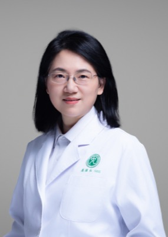

# 居胜红 Shenghong Ju — 中大医院副院长，RADAR 里唯一的江苏单位、建制内的腹部影像权威

> RADAR 第 36 / 40 位作者 · 智能影像与介入医学国家级重点实验室培育建设点（东南大学）＋东南大学附属中大医院放射科 · 外部资深临床作者

## 一句话画像

滕皋军的嫡传弟子，1987 年入学南京铁道医学院，此后三十余年只离开过本院不到两年（印第安纳大学博士后）；2023-11 起任东南大学附属中大医院副院长、医学影像部主任，2026-03 当选中华医学会放射学分会副主任委员。在 RADAR 里坐第 36 位——资深作者的尾巴，不是中段的干活位，也是全文唯一的江苏机构。最值得记住的一点：==本行是脂肪与代谢的定量影像==，MR 侧的 PDFF / fat fraction 那条线，与 Shu 在 CT 上做 water/lipid 分解是同一个科学问题的两种模态。

## 在 RADAR 里的位置

- **位次 36 / 40。** 论文著录单位原文：*Nurturing Center of Jiangsu Province for State Laboratory of AI Imaging & Interventional Radiology (Southeast University); Department of Radiology, Zhongda Hospital, Medical School of Southeast University, Nanjing, Jiangsu, China*。40 位作者里唯一的江苏单位。日常论文更常署的是「江苏省分子影像与功能影像重点实验室 · 中大医院放射科」，RADAR 换了另一块牌子。
- **邻座**：37 Jianfeng Zhang（达摩院）、38 [肖文波](38-wenbo-xiao.md)（浙大一院放射科）、39 [张灵](39-ling-zhang.md)（达摩院，通讯）、40 [梁廷波](40-tingbo-liang.md)（浙大一院，通讯）。
- **不在 PANDA 名单里。** PANDA（*Nat Med* 2023, PMID 37985692）36 位作者已逐条比对，无 Ju；RADAR 与 PANDA 共享的是 [章琦](01-qi-zhang.md)、梁廷波、张灵、[夏英达](20-yingda-xia.md) 那条老线，不包括这里。
- **与达摩院确实没有历史。** PubMed 上 `"DAMO Academy"[AD] AND "Southeast University"[AD]` 只命中 RADAR 本篇；`Ju SH[AU] AND Alibaba[AD]` 为 0 条。RADAR 是公开文献上与达摩院的**第一次**合作。
- **但进 RADAR 的通道是放射科对放射科的旧线，不是空降。** *Radiology* 2023《Predicting Microvascular Invasion in Hepatocellular Carcinoma Using CT-based Radiomics Model》（PMID 37097141）共 16 位作者：第 15 位 Wen-Bo Xiao（ORCID 0000-0001-7124-1096，浙大一院放射科）、第 16 位末位通讯 Sheng-Hong Ju（ORCID 0000-0001-5041-7865）。==RADAR 第 38 位作者肖文波的 ORCID 与之完全相同==，即同一人。而这篇正是 Europe PMC 上被引最高（208 次）的一篇。中大医院与浙大一院之间是**放射科主任级的同行私交**，不是通过达摩院搭线。
- **承担的角色为「推断」**：外部资深临床 / 评测侧，而非算法或数据工程。依据三条——组里没有可查的深度学习工程输出；本人的 AI 工作停在影像组学与预测模型（肝癌 MVI、卒中预后），与 RADAR 的视觉-语言大模型路线不同源；同时是中华医学会放射学分会副主委、亚洲腹部影像学会执委，临床专长正是腹部 CT / MR 诊断。要把「expert-level」写进 *Science* 标题，作者栏里需要中国腹部影像建制内的权威署名——2026-03 刚升任放射学分会副主委、论文 2026-09 发表，这个时间点上这层意义未必比提供的数据小（==推断==）。
- 相关背景见 [../sources/zju-hospital.md](../sources/zju-hospital.md)、[../sources/damo-lineage.md](../sources/damo-lineage.md)。

## 背景与履历

| 时间 | 单位 · 职位 | 备注 |
|---|---|---|
| 1970-07 | 出生，江苏 | 东南大学生科院个人页与百科口径一致 |
| 1987-09 – 1992-07 | 南京铁道医学院 医疗系 · 本科 | 该校 2000 年并入东南大学，成为今东南大学医学院 |
| 1992-08 – 2000-04 | 南京铁道医学院附属医院影像科 · 助教、住院医师 | 本科毕业留校 |
| 2000-05 – 2006-04 | 东南大学附属中大医院放射科 · 讲师、主治医师 | 同期在职读硕（2000-09 – 2002-12）与读博（2003-03 – 2006-04），影像医学与核医学，导师滕皋军 |
| 2006-05 – 2011-04 | 中大医院放射科 · 副教授、副主任医师 | |
| 2006-11 – 2008-07 | 美国印第安纳大学医学院影像学系 · 博士后 | 三十余年里唯一一段离开本院的经历 |
| 2011-05 | 中大医院放射科 · 教授、主任医师 | |
| 2015 | 国家杰出青年科学基金 | 项目 81525014「分子影像和功能影像」，2016-01 – 2020-12 |
| 2016-05 | 中大医院放射科 · 科主任 | 同年入选江苏省「333 工程」第二层次、东南大学特聘教授；获中华放射学会首届金奖「杰出青年奖」 |
| 2017 | 江苏省科教强卫工程 · 医学重点人才 | |
| 2018 | 江苏省六大人才高峰创新团队 | 团队名：分子影像和功能影像团队 |
| 2019 | 国自然重点项目 81830053「肝癌智能影像诊断的新技术与新方法」 | 2019-01 – 2023-12，==转向影像 AI 的关键项目== |
| 2019 | 科技部「重点领域创新团队」· 负责人 | 团队名：影像指导下的介入精准诊疗团队 |
| 2019-12 – 2023-12 | 东南大学医学院 · 副院长 | |
| 2020 | 东南大学 · 首席教授 | |
| 2020-12 – 2023-06 | 江苏省重点研发计划 BE2020717「基于大数据构建胰腺癌智能影像诊疗新模式」 | |
| 2021 | 国自然重大研究计划重点支持项目 92059202（胰腺癌探针成像）；国家重点研发计划课题 2021YFF0501504 | 另参与 2021YFA1101304（听觉器官再生，课题骨干） |
| 2023-11 | 东南大学附属中大医院 · 副院长 | 校发〔2023〕262 号 |
| 2023-07 – 2024-10 之间 | 职务表述由「放射科主任」切为「医学影像部主任」 | 医学影像部 = 放射科＋介入与血管外科＋核医学科＋超声科的统合建制，与升任副院长同期 |
| 2024-10 | 江苏省医学会放射学分会第十二届 · 候任主任委员 | |
| 2026-03-25 | 中华医学会放射学分会第十七届 · 副主任委员 | 换届会议在北京 |
| 2026-09-18 | RADAR 发表于 *Science* | 第 36 / 40 位作者 |

**现任学会职务**（中华医学会放射学分会官网委员介绍页，2026 口径）：中华医学会放射学分会副主任委员、中国医师协会放射医师分会常务委员、亚洲腹部影像学会执行委员（学会官网职务栏标 Treasurer）、江苏省医学会放射学分会候任主任委员、江苏省医师协会放射医师分会副会长、江苏省放射影像专业质量控制中心主任。前届曾任中华医学会放射学分会常务委员兼**分子影像学组组长**。

**人才与荣誉**：国家杰出青年科学基金（2015，中大医院口径称「放射领域首位国家女杰青」）、国家「万人计划」科技创新领军人才、国务院政府特殊津贴专家、教育部新世纪优秀人才。奖项含国家科技进步二等奖（2016，排名第二）、国家教学成果二等奖（2014，排名第六）、教育部科技进步一等奖、江苏省科学技术奖二等奖（2019，排名第一，「代谢性疾病影像新技术和新方法研发和应用」）、江苏医学科技奖一等奖（2019，排名第一）、江苏省教学成果奖一等奖（2022，排名第一）、致敬江苏—杰出贡献放射学医师奖（2023）。

## 研究方向

- **分子影像与探针化学**（博士期间从滕皋军继承的本行，也是杰青项目的名义方向）：超顺磁性氧化铁标记干细胞的 MR 示踪、肿瘤微环境响应型「Off-On」比率探针、多模态探针。与材料化学组合作的 *Adv Mater* / *Nat Commun* / *Nat Nanotechnol* 论文多属此类，多在末位。
- **功能影像与代谢定量——脂肪是主线。** 自述原文写的是「围绕功能 MR 影像与生物学标记，研究糖尿病血管内皮功能紊乱、**脂肪代谢紊乱**的发生发展机制及早期检测、干预方法」。具体落到：肝脏脂肪定量的三方法互比（Dixon 双回波 / 化学位移成像 / 1H-MRS）、早期糖尿病肾病的 renal fat fraction 与 DTI、Liver MRI PDFF 与肝病风险的人群关联。
- **影像组学与人工智能**：肝细胞癌微血管侵犯的 CT / MRI 预测、缺血性卒中半暗带影像大数据与预后、肝硬化静脉曲张出血预后模型、腹部 CT 影像组学做糖尿病风险评估。国自然重点 81830053 与江苏省重点研发 BE2020717 是这条线的资金底座。
- **神经与代谢交叉**：2 型糖尿病的脑连接组学。
- **临床专长**（门诊口径）：全身各系统尤其是**腹部**、中枢神经系统的 CT、MR 影像诊断——腹部影像亚专业出身，这是进 RADAR 作者名单最直接的资质。

## 代表作

| 论文 | 期刊 · 年份 | 作者位次 |
|---|---|---|
| An expert-level generalist AI for abdominal CT diagnosis（RADAR） | *Science* 393(6817):eaec6129 · 2026 | 36 / 40 |
| Predicting Microvascular Invasion in Hepatocellular Carcinoma Using CT-based Radiomics Model | *Radiology* · 2023 | 16 / 16（末位通讯）——被引 208，最高被引；第 15 位是肖文波 |
| Association between Liver MRI Proton Density Fat Fraction and Liver Disease Risk | *Radiology* · 2023 | 7 / 7（末位）——与 Shu 最同题的一篇 |
| Quantification of liver fat in mice: comparing dual-echo Dixon imaging, chemical shift imaging, and 1H-MR spectroscopy | *Journal of Lipid Research* · 2011 | 2 / 8，滕皋军末位 |
| Redox-responsive polymer micelles co-encapsulating immune checkpoint inhibitors and chemotherapeutic agents | *Nature Communications* · 2024 | 10 / 10（末位） |
| Targeted intervention in nerve-cancer crosstalk enhances pancreatic cancer chemotherapy | *Nature Nanotechnology* · 2025 | 13 / 16 |
| Collateral Status at Single-Phase and Multiphase CT Angiography versus CT Perfusion for Outcome Prediction in Acute Ischemic Stroke | *Radiology* · 2020 | 11 / 12 |
| Renal fat fraction and diffusion tensor imaging in patients with early-stage diabetic nephropathy | *European Radiology* · 2018 | 4 / 4（末位） |

## 师承与关系

**血统极干净：滕皋军 → 居胜红，一条线三十年没挪过窝。**

1. **导师滕皋军**（Gao-Jun Teng）：中国科学院院士（2021 当选），中大医院院长兼介入治疗中心主任、东南大学医学与生命科学部主任、东南大学首席教授、数字医学工程全国重点实验室副主任、江苏省分子影像与功能影像重点实验室主任，中国医师协会介入医师分会会长。硕士（2000–2002）与博士（2003–2006）均出自门下。
2. **同门旁证**：2006 年《中华放射学杂志》「大鼠间充质干细胞超顺磁性氧化铁标记和经脾移植后的 MR 示踪」是「居胜红, 滕皋军, 陆海华…」的排序（博士生一作＋导师二作）；*J Lipid Res* 2011 那篇的双语署名里第二作者是「Shenghong Ju 居胜红」、末位通讯是「Gao-Jun Teng 滕皋军」，单位一致。
3. **谱系定位**：属东南大学中大医院「分子影像＋介入」学派，源头是南京铁道医学院的老一辈放射学家（邱焕杨、张秉彝、蔡锡类），经滕皋军做大，现在是「滕皋军院士、居胜红教授领衔」的双头结构——滕主介入与分子探针，居主功能影像 / 代谢影像 / 影像 AI，是这个谱系里被选定的**诊断侧继承人**。
4. **无跨机构迁移**：本科留校—本校读硕博—本校升教授—本校当副院长，中国医学院校标准的嫡系升迁路线，唯一例外是 2006–2008 在印第安纳大学不到两年的博士后。
5. **旁系**：*J Lipid Res* 那篇的第一作者彭新桂（Xin-Gui Peng）现为中大医院放射科副主任，属同门；倪以成（Yicheng Ni，KU Leuven）是滕皋军组的长期海外接口。
6. **与 RADAR 其他作者**：与 [肖文波](38-wenbo-xiao.md) 有 *Radiology* 2023 的末位通讯级合作（见上）；与达摩院侧（[张灵](39-ling-zhang.md)、吕乐、[夏英达](20-yingda-xia.md)）及浙大一院外科侧（[梁廷波](40-tingbo-liang.md)、[章琦](01-qi-zhang.md)）在公开文献上无先前交集。

## 学术指标

| 指标 | 数值 | 说明 |
|---|---|---|
| ORCID | 0000-0001-5041-7865 | 本人认领并维护，最近更新 2025-06 |
| Europe PMC（按 ORCID 关联） | 74 篇；被引前三 208 / 95 / 90 | 2026-09-20 抓取。只覆盖主动挂 ORCID 的那部分，远小于真实产出 |
| Google Scholar h-index | **空白** | 作者检索强制跳转登录页，未取得，不做估算 |
| OpenAlex / Semantic Scholar | **不可用** | OpenAlex 主实体（302 篇 / 6777 引 / h=45）确实挂着本人 ORCID 与 Southeast University，但 affiliations 里同时混进 A\*STAR、北德州大学、中南大学、上海交大等至少 3 位同名者，是姓名消歧失败的合并实体；Semantic Scholar 碎片成 19 个实体。==这些数字都不能当作 h-index== |
| 学会官网口径（2026） | 第一 / 通讯作者论文 100 余篇；主持国家级项目 14 项 | 中华医学会放射学分会委员介绍页自述，未经第三方核验 |

**同名坑**：英文侧另有 ORCID 0000-0001-7863-6947 的 Shenghong Ju（清华 / 上海交大中英国际低碳学院 / 东京大学 / Ecole Centrale Paris，热输运与材料计算），以及 0009-0008-0616-8265（南京信息工程大学）。识别一律以 ORCID 0000-0001-5041-7865 ＋ Zhongda Hospital / Southeast University 为准。中文侧「居」姓罕见，医学影像领域未发现第二位同名者。

## 对 Shu 意味着什么

**约 6/10：不是求职价值，是方法学同题与引用网络的价值。** 这一条线做的就是「用影像把脂肪含量变成一个可测的数」——*J Lipid Res* 2011 的肝脂肪三方法互比、*Eur Radiol* 2018 的 renal fat fraction、*Radiology* 2023 的 Liver MRI PDFF 与肝病风险人群关联，而 MRI PDFF 正是脂肪分数事实上的参考标准。Shu 要论证「CT 上算出来的 lipid fraction 是真的、而且这个数本身有预后价值」，最干净的 framing 就是引 PDFF 这条线：别人已经在 MR 上、在肝脏上证明了这个量的临床意义，Shu 的工作是把它搬到 CT、搬到冠周脂肪——这是必引文献、potential reviewer，也是 discussion 里跨模态互验段落的现成素材，==不需要认识本人==。

**但别误判三件事**：（一）这是 MD 出身的临床放射科医生，做的物理是 MR 序列与分子探针，做的 AI 是影像组学，material decomposition / spectral CT / noise propagation 那套在这个组里没有对口的人能审能带，以找博后导师论不匹配；（二）岗位在南京，与 J-1→F-1 pending、要在美国找能 sponsor 的 title 这条现实需求两不相交，只有保留「回国 / 亚太」那条轨道时建制位置才有用；（三）RADAR 里大概率是外围，把这里当成进达摩院医疗 AI 圈子的入口是错的，真正的入口是 [张灵](39-ling-zhang.md) / 吕乐 / [夏英达](20-yingda-xia.md) 那条 PANDA 线（见 [../sources/damo-lineage.md](../sources/damo-lineage.md)）。

## 未解决

- **h-index 与总引用数空白。** Google Scholar 需登录；OpenAlex 与 Semantic Scholar 的作者实体均为多人合并，数字不可用。
- **教育经历的逐年信息只有单一来源。** 1987–1992 本科、2000–2002 硕、2003–2006 博、2006-11 – 2008-07 博士后四段仅见于百科；导师是滕皋军这一条的直接陈述同样只在百科，硬证据只有同篇论文署名与同题基金这类旁证。
- 江苏省自然科学基金 **BK2004068**「肝干细胞磁粒子标记和 MR 示踪的实验研究」与滕皋军同题的教育部博士点基金，未找到可核验的项目号对应关系。
- **RADAR 中的具体角色全部是推断。** *Science* 全文在付费墙后，`alibaba-damo-academy/damo-radar` 仓库 README 未列各参与中心与作者贡献声明。
- 中文报道给出的评测规模（浙大一院内部 39160 例 AUC 0.913、8 个外部中心 24239 例 AUC 0.895、斯坦福公开数据集 21 种病症 AUC 0.883、26 名放射科医生 reader study）未能独立核实；**没有任何来源点名中大医院是否在那 8 个外部中心之列**。
- 中大医院放射科的设备清单（含 5.0T MRI、光子计数 CT）只见于一处二手转载，未找到科室官网原文，本页不采信；若属实，则是国内少数装机 PCCT 的中心之一，对 water/lipid/protein 分解的跨厂商可迁移性验证有意义（==推断==）。
- 各挂号平台上的「放射科**副**主任」「以第一作者 / 通讯作者发表 SCI 22 篇」是约 2012 年旧简历的跨平台复制，不是现任职务，不应当作矛盾证据。

## 来源

- https://pubmed.ncbi.nlm.nih.gov/42752131/
- https://doi.org/10.1126/science.aec6129
- https://github.com/alibaba-damo-academy/damo-radar
- https://orcid.org/0000-0001-5041-7865 ／ https://pub.orcid.org/v3.0/0000-0001-5041-7865/record
- https://csr.cma.org.cn/cn/weiyuanhuiweiyuan.aspx?Oid=1012 （中华医学会放射学分会 · 委员介绍）
- https://abdominalradiology-asia.org/executive-council/prof-shenghong-ju/ （亚洲腹部影像学会 · 执行委员会）
- https://seu.teacher.360eol.com/teacherBasic/preview?teacherId=9095 （东南大学导师主页）
- https://doi.org/10.1194/jlr.d016691 ／ https://api.crossref.org/works/10.1194/jlr.d016691 （双语署名，中文名与师承的原始依据）
- https://pubmed.ncbi.nlm.nih.gov/37097141/ （*Radiology* 2023 HCC MVI，与肖文波的旧合作）
- https://pubmed.ncbi.nlm.nih.gov/37874242/ （*Radiology* 2023 Liver MRI PDFF）
- https://pubmed.ncbi.nlm.nih.gov/37985692/ （PANDA，作者名单比对）
- https://www.ebi.ac.uk/europepmc/webservices/rest/search?query=AUTHORID%3A%220000-0001-5041-7865%22&format=json&sort=CITED%20desc
- https://api.openalex.org/authors/A5104390490 ／ https://api.openalex.org/authors/A5004012046
- https://mp.weixin.qq.com/s?__biz=MzA4MDAwOTc2NA==&mid=2649580871&idx=1&sn=06e00ef8db274be0381fd6362ee4239d （中大医院 2026-03-31 当选放射学分会副主委）
- https://baike.baidu.com/item/%E5%B1%85%E8%83%9C%E7%BA%A2
- 照片：https://abdominalradiology-asia.org/executive-council/prof-shenghong-ju/
