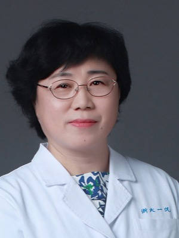

# 肖文波 Wenbo Xiao — 浙大一院放射科的实际负责人，RADAR 影像数据端的签字人

> RADAR 第 38 / 40 位作者 · 浙江大学医学院附属第一医院放射科（论文单位 8）· 倒数第三位，紧邻 [张灵](39-ling-zhang.md)（#39）与 [梁廷波](40-tingbo-liang.md)（#40）

## 一句话画像

主任医师、放射科副主任（主持工作），==浙大一院放射科的实际负责人==，硕士生导师。科研立身之本是肾脏与肝脏的功能磁共振（BOLD MRI）和分子影像，2016 年后重心转到肝胆胰肿瘤影像与影像组学。**在 RADAR 里是唯一进入末尾通讯作者块的放射科人**——RADAR 的另外两位浙一放射科作者李志（#8）、薛星（#9）都排在最前面，这是中国医院论文的标准分工形态：年轻医生在前做具体阅片，科室负责人在后背书。

## 在 RADAR 里的位置

- **第 38 / 40 位**，署单一单位「Department of Radiology, The First Affiliated Hospital, Zhejiang University School of Medicine」（论文单位 8）。**没有达摩院 / [湖畔实验室](../sources/hupan-lab.md)的交叉任职。**
- 位次落在最后三位（肖文波 → 张灵 → 梁廷波），==构成「放射科 / 算法 / 外科」的收尾结构==。**推断**：在 RADAR 中承担放射科侧的资深负责人 / 共同通讯角色。旁证有两条——位次本身，以及在结构完全相同的 iAorta（*Nat Med* 2025）中同样位列第 38 位且**明确署了通讯邮箱**。Science 正文与 author contributions 在付费墙后，无法取证，**这条只能停在推断，置信度中等**。
- **推断**：具体贡献是训练与验证数据的获取授权、放射科阅片人力的组织、多中心影像端协调，而不是算法。依据是院内职务（RAD-CT 的 424,911 例腹部 CT 与 1500 万图文对必须经放射科负责人）、署名结构（2012 年后再未做第一作者，末位作者约 19 篇）、以及教育背景中无任何计算机 / 算法训练痕迹。详见 [../sources/zju-hospital.md](../sources/zju-hospital.md)。
- **不在 PANDA（*Nat Med* 2023）作者列表内**。PANDA 36 位作者里浙一侧只有 [章琦](01-qi-zhang.md) 和梁廷波，放射科完全没参与——PANDA 的影像基地是上海长海医院。**与达摩院这条线不是从胰腺来的，是 2025 年从血管外科（iAorta，末位通讯张鸿坤）拉进来的。**
- 与达摩院可核实的共同论文只有 2 篇：iAorta（2025-08）与 RADAR（2026）。与张灵的共同论文只有 RADAR 本身。
- 与 RADAR 第 36 位作者 [居胜红](36-shenghong-ju.md)（东南大学中大医院）的合作**早于 RADAR**：2023 年 *Radiology* 的肝细胞癌微血管侵犯 CT 影像组学多中心研究，肖文波第 14/15，末位正是居胜红。==RADAR 里「浙一放射科—东南大学中大医院」这条边不是新生的。==（另见 [../sources/grassroots-network.md](../sources/grassroots-network.md)）

## 背景与履历

职务与学历栏均为浙大一院官网口径，**抓取日 2026-09-20，该页面不显示更新时间**。

| 时间 | 单位 · 职位 | 备注 |
|---|---|---|
| 1990 年代末（**推断**）| 浙江大学医学院 硕士研究生 | 官网只写「浙江大学医学院硕士毕业」，无年份、无导师姓名。==最高学位为硕士，无博士学位== |
| ~2000 年前后（**推断**）| 浙大一院放射科 | 依据：公开简介称「从事放射诊断工作 20 余年」+ 最早可核实论文为 2002 年 |
| 2002 | 浙大一院放射科 | 《临床放射学杂志》两篇第一作者（孤立性纤维瘤影像+病理、喉癌螺旋 CT）；固定搭档是病理科 王照明 |
| 2005 | 同上 | 《中华肿瘤杂志》第一作者「腹膜后脂肪肉瘤的影像学和病理学分析」，署名单位 First Hospital, Medical College of Zhejiang University |
| 2006 | 同上 | 一年内多篇中文第一作者论文；**开始与张敏鸣（Minming Zhang）联合署名** |
| 2006–2007 | 同上 | 与肝胆胰外科 郑树森（中国工程院院士、浙一肝移植学科奠基人）合署英文个案——与浙一肝胆胰 / 移植体系最早的书面联系 |
| 2008 | 同上 | *Nephrol Dial Transplant* BOLD MRI 鉴别移植肾排异与急性肾小管坏死，第 2/8，末位为肾脏病中心主任 陈江华。**方向正式转入肾脏功能磁共振** |
| 2010 | 同上 | *Abdom Imaging* 第一作者（少脂型肝血管平滑肌脂肪瘤血流动力学）；《浙江大学学报（医学版）》两篇。同年张敏鸣的 PubMed 单位已记为**浙大二院**放射科 |
| 2012 | 同上 | *Eur J Radiol* 第一作者（BOLD MR 评价移植肾）。==此后再未做过第一作者，全面转为资深 / 通讯作者== |
| 2014–2015 | 同上 | 分子影像阶段：C5b-9 靶向 MR 探针评价 Heymann 肾炎（*PLoS One* 2015，末位通讯）；与南京中医药大学附属医院 王中秋、江苏省分子功能影像重点实验室建立长期合作 |
| 2016–2022 | 同上 | 学术重心迁到肝胆胰：胆管内乳头状肿瘤形态学分型、胰腺神经内分泌肿瘤 MRI 分级、肝细胞癌微血管侵犯影像组学。同期稳定出现在梁廷波团队的胰腺癌 / 肝癌临床研究作者列表中 |
| 2023 | 同上 | *Radiology* 肝细胞癌微血管侵犯 CT 影像组学（第 14/15，末位居胜红）——跨中心学术纽带 |
| 2025-08 | 同上 | *Nat Med* iAorta「AI-based diagnosis of acute aortic syndrome from noncontrast CT」，第 38/46，**署通讯邮箱**。==与达摩院的第一次同篇== |
| 2025-09 | 同上 | *Insights into Imaging* 非增强 CT 主动脉夹层分割框架，第 12/12 末位通讯，第一作者为科室同事 汪启东；合作方 数坤科技 |
| 2025 | 同上 | *Int J Surg*「DeepSeek 辅助 LI-RADS 分级」，第 5/6，第 6 位为陈峰；合作方含 GE Healthcare |
| 2026 | 同上 | *Science* RADAR，第 38/40 |
| 现任（2026-09-20 抓取）| 浙大一院放射科 **副主任（主持工作）**、主任医师、浙江大学医学院硕士生导师 | 国家自然科学基金评审专家；《中华放射学杂志》《临床放射学》《中国影像技术》等多本杂志审稿专家 |

**社会任职**（官网原文 8 项）：中华放射学会腹部影像专委会委员、中国医师放射协会消化专委会委员、中国肿瘤影像专委会全国委员、浙江省放射学会委员、浙江省数理医学学会放射委员会副主任委员、浙江省抗癌协会肿瘤影像专委会常委、浙江省生物医学工程学会放射委员会常委、浙江省中西医放射学委员会委员。

**成果奖项**（官网「近五年」栏原文）：科技部重大研究计划子课题 1 项、省自然基金重点项目 1 项、国家发明专利 1 项、实用新型专利 2 项、浙江省卫生厅科技进步二等奖。

## 研究方向

三个阶段，主线清晰：

- **影像-病理对照诊断（2002–2008）**：孤立性纤维瘤、腹膜后脂肪肉瘤、肝局灶性增生结节、肺上皮样血管内皮瘤等少见病的 CT / MR 表现与病理对照。学术底色就是在与病理科王照明的固定搭档关系里长出来的。
- **肾脏与肝脏功能磁共振 + 分子影像（2008–2016，科研立身之本）**：BOLD MRI（血氧水平依赖）评价移植肾急性排异 vs 急性肾小管坏死、急性肾衰氧代谢、糖尿病肾损伤，DWI 辅助；C5b-9 靶向 MR 探针、IgA 肾病靶向氧化铁纳米探针。主持课题包括国自然面上项目「膜性肾病大鼠肾小球分子屏障损伤磁探针标记和 MR 示踪」、卫生部科研基金「IgA 肾病分子屏障破坏的 MR 分子成像研究」、省科技厅重大科技专项「MR 分子成像定量评价肿瘤新生血管及肿瘤早期诊断研究」等。
- **肝胆胰肿瘤影像 + 影像组学 / AI（2016–2026）**：胰腺神经内分泌肿瘤分级、胰腺癌与神经内分泌癌鉴别、胆管 IPNB 分型、肝细胞癌微血管侵犯预测、TACE 疗效预测、胆管癌多组学预后模型；2025 年起与达摩院、数坤科技、GE Healthcare、浙江工业大学计算机学院分别有共同署名论文。
- 官网「研究方向」栏原文：「MR 功能成像对肾脏、肝脏等功能损伤评价，分子影像学在肾脏、肝胆疾病应用。」「专业擅长」栏：「擅长腹部疾病的影像诊断，尤其肝胆胰疑难病例影像诊断。」

## 代表作

| 论文 | 期刊 · 年份 | 作者位次 |
|---|---|---|
| An expert-level generalist AI for abdominal CT diagnosis（RADAR）| *Science* 2026 · PMID 42752131 | 38/40 |
| AI-based diagnosis of acute aortic syndrome from noncontrast CT（iAorta）| *Nature Medicine* 2025 · PMID 40835970 | 38/46，署通讯邮箱 |
| Segmentation-model-based framework to detect aortic dissection on non-contrast CT images | *Insights into Imaging* 2025 · PMID 40996604 | 12/12，末位通讯（合作方数坤科技）|
| Predicting microvascular invasion in hepatocellular carcinoma using CT-based radiomics model | *Radiology* 2023 · PMID 37097141 | 14/15（末位居胜红）|
| Morphological classification of intraductal papillary neoplasm of the bile duct | *Eur Radiol* 2018 · PMID 29138880 | 7/7，末位通讯 |
| C5b-9-targeted molecular MR imaging in rats with Heymann nephritis | *PLoS One* 2015 · PMID 25774523 | 10/10，末位通讯 |
| Functional evaluation of transplanted kidneys in normal function and acute rejection using BOLD MR imaging | *Eur J Radiol* 2012 · PMID 21392910 | **1/5**（末位张敏鸣）——最重要的第一作者英文论文 |
| Hemodynamic characterization of hepatic angiomyolipoma with least amount of fat | *Abdom Imaging* 2010 · PMID 19319591 | **1/5** |
| The significance of BOLD MRI in differentiation between renal transplant rejection and acute tubular necrosis | *Nephrol Dial Transplant* 2008 · PMID 18308769 | 2/8 —— ==被引最高的单篇（98 次）== |

除放射专科期刊外，还**稳定出现在浙一临床大团队的高层级论文作者列表里**：*Cancer Cell* 2025（15/17，第一作者白雪莉、末位梁廷波）、*Ann Surg* 2023 与 2026、*Hepatology* 2025、*Cancer Lett* 2025、*Eur J Nucl Med Mol Imaging* 2025。这比影像组学那条线更能说明其「浙一临床大团队固定影像端」的位置。

## 师承与关系

- **张敏鸣（Minming Zhang）**：2006–2012 年间最重要的资深合作者 / 学术引路人。仅有的两篇第一作者英文论文（2010 *Abdom Imaging*、2012 *Eur J Radiol*）末位均为张敏鸣，中文论文中张敏鸣被标为通讯。**但没有任何来源直接写明师生关系**，且张敏鸣自 2010 年起 PubMed 单位已是浙大二院放射科——两人的合作是跨院的。==不宜写成「硕导」。==
- **王照明（浙一病理科）**、**许顺良（浙一放射科老一辈）**：2002–2007 年出现频率最高的合作者，属**长期固定合作关系**（王照明是病理科，不构成放射科带教关系）。
- **浙一「外科 / 移植 — 病理 — 放射」生态里的影像端接口**：2006–2007 与郑树森合署个案 → 2008 年起与陈江华、韩飞合作移植肾 BOLD MRI → 2016 年后稳定进入梁廷波的临床研究作者网络。==RADAR 里出现在梁廷波前两位，正是这条关系链的自然结果。==
- **科室内同代人**：陈峰、楼海燕、彭志毅、阮凌翔、赵艺蕾、梁文杰同为主任医师；汪启东、应世红等为副主任医师。科室简介原文：「科室现有医护技师团队 200 余人……博士生导师 1 人，硕士生导师 5 名」——肖文波是那 5 名硕导之一。
- **RADAR 内的浙一放射科三人组**：李志（#8）、薛星（#9）在最前，肖文波在第 38 位。
- **产业侧（全部落在 2025 年）**：阿里巴巴达摩院（iAorta → RADAR）、数坤科技（主动脉夹层分割）、GE Healthcare（DeepSeek 辅助 LI-RADS）；学术侧另有浙江工业大学计算机学院（直肠癌新辅助降期预测，末位通讯）。

## 学术指标

**同名污染极其严重，任何作者聚合页给出的总数都不可用。**

- PubMed 检索 `Xiao Wenbo[Author]` 返回 **114 条**（2026-09-20 抓取），其中至少存在 **9 个同名异人聚落**：南昌航空大学光电 / 无损检测（ORCID 0000-0002-4210-660X）、重庆医科大学附属大学城医院消化外科、**天津医科大学公共卫生学院流行病与卫生统计（2022–2026 仍高产，是污染聚合页的最大来源）**、香港大学化学系、北京工商大学人工智能学院、湖南农业大学、南方医科大学医学遗传学等。
- 按作者本人单位过滤后，**可归属本人的 PubMed 论文约 75 篇**（严格口径 66 篇会误排除单位字段为空的 9 条，其中就包括被引最高的那篇）。==总被引数与 h-index 因口径未定、外部引用数据库当日限流，本页不给数字。==
- **最高被引单篇 98 次**（*Nephrol Dial Transplant* 2008，OpenAlex 口径，2026-09-20 抓取）。
- 署名结构：PubMed 口径第一作者至少 5 篇（2005、2006、2010 两篇、2012），**末位作者约 19 篇**，2012 年后无第一作者——典型的「带队 + 背书」形态。
- **ORCID 0000-0001-7124-1096**。记录创建于 2020-12-20，biography、employments、researcher-urls、keywords 全部为空，名下 works 只挂了 RADAR 一条。该 ORCID 在 PubMed 上关联 6 篇（42752131、40996604、40835970、38746650、37097141、36757445），单位均为浙大一院放射科——==这是把 RADAR 这条记录锁死到本人的机读锚点==。
- **Google Scholar 个人主页未找到**（scholar.google.com 抓取返回 302）。标为 unknown，不给数字。
- OpenAlex 作者聚合页 A5101934525 的 affiliations 字段混入湖南科技大学、中南大学、衡阳师范学院、昆明医科大学、金华市农科院等无关机构，==其 works_count / cited_by_count / h-index 一概不可引用==。

## 对 Shu 意味着什么

**不是求职对象，是「中国侧腹部 CT 临床验证潜在对接人」清单上的一个名字，优先级低。** 临床放射科医师、最高学位硕士、无物理或算法训练；带的是医学影像诊断方向的硕士生；中国三甲医院放射科几乎不设独立的 medical physicist（医学物理师）编制通道，科室 200 余人是「医护技师」，所以即便有意向也给不出对口职位。

不为零的两个接口：**（一）设备与主题上的唯一实质交集**——浙一放射科官网科室简介写明装备含 GE Revolution 能谱 CT 1 台，而肖文波最早的第一作者英文论文正是「少脂型肝血管平滑肌脂肪瘤」的鉴别，本质就是脂肪含量定量问题；若将来要找一个中国侧的双能 / 能谱 CT 腹部材料分解临床验证合作方，浙一放射科是合理候选，签字的就是这个人。==但快速 kVp 切换的双能 CT 不是光子计数 CT，与 NAEOTOM Alpha 那条线不直接接续。== **（二）「临床验证怎么做」的活样本**——2025 年一年内与达摩院、数坤、GE 三家分别出论文，每次站的都是「读者研究 + 多中心外部验证」那一侧；RADAR 与 iAorta 的评价设计（多中心、下沉到县区级医院、非增强 CT）值得在写自己论文的 clinical validation 段落时抄结构，而不是抄模型。

真正值得花时间的是 RADAR 作者表里的另一批人：达摩院美国的张灵、吕乐、[夏英达](20-yingda-xia.md)，以及 [谢雨彤](12-yutong-xie.md)（MBZUAI）、[吴琦](14-qi-wu.md)（Adelaide）这些有海外教职、有招人习惯的。肖文波属于「查清楚了、可以放下」的那一类。

## 未解决

- **本科院校、本科与硕士的入学 / 毕业年份、硕士导师姓名**——中英文公开来源全部查不到。
- **出生年份、晋升主任医师的年份、出任放射科副主任（主持工作）的年份**——查不到。「副主任（主持工作）」是否已转正为科主任，官网页面无更新时间，无法核实。
- **是否有海外进修 / 访学经历**——官网简介极简，未提；不能据此断定没有。
- **RADAR 中是否为共同通讯**——Science 正文与 author contributions 在付费墙后（science.org 返回 403），Europe PMC 记录无通讯作者字段，无预印本可替代。只有位次与 iAorta 的同构位置两条旁证。
- **RADAR 的外部验证站点是否经由浙大一院医联体网络、放射科侧是否由其协调**——浙大一院官网确有医联体 / 专科联盟板块，但没有任何名单把那 8 家基层医院列为成员，也无材料把协调人指向具体某人。双重推断，仅作参考。
- **浙大四院（义乌）署名的 3 篇归属未决**：PMID 32093990、37052011 只挂浙大四院；32116989 带双单位（浙大四院神经内科 + 浙大一院放射科），可能就是本人，也可能是第三个同名者。
- 除 RADAR 外，与章琦（#1）之间是否还有其他共同论文，未逐一核对。
- 中文侧的深度履历（知网作者页、新闻报道、访谈）未被系统检索过，教育与晋升时间线的空白主要源于此，不代表这些信息不存在。

## 来源

- https://www.zy91.com/department/doctor/74/18 — 浙大一院官网 肖文波 个人页（职称、院内职务、学历、研究方向、成果奖项、社会任职）
- https://www.zy91.com/department/dept/73/51 — 浙大一院官网 放射科科室页（简介、设备、人才名单与职称层级）
- https://www.zy91.com/department/doctor_list?dept_id=51 — 浙大一院放射科医师名单
- https://www.haodf.com/doctor/2353816159.html — 好大夫在线 肖文波（课题清单、中英论文并列；未经本人认领的二手聚合页，仅与官网 + PubMed 三方互证时使用）
- https://pubmed.ncbi.nlm.nih.gov/42752131/ — RADAR, *Science* 2026（第 38/40）
- https://doi.org/10.1126/science.aec6129 — RADAR DOI（Crossref 元数据含 ORCID 与单位）
- https://pubmed.ncbi.nlm.nih.gov/40835970/ — iAorta, *Nat Med* 2025（第 38/46，署通讯邮箱）
- https://pubmed.ncbi.nlm.nih.gov/40996604/ — *Insights into Imaging* 2025 主动脉夹层分割（末位通讯，数坤科技）
- https://pubmed.ncbi.nlm.nih.gov/37097141/ — *Radiology* 2023 肝癌微血管侵犯（第 14/15，末位居胜红）
- https://pubmed.ncbi.nlm.nih.gov/18308769/ — *Nephrol Dial Transplant* 2008 BOLD MRI 移植肾（第 2/8，被引最高）
- https://pubmed.ncbi.nlm.nih.gov/21392910/ — *Eur J Radiol* 2012（第一作者，末位张敏鸣）
- https://pubmed.ncbi.nlm.nih.gov/19319591/ — *Abdom Imaging* 2010（第一作者，少脂型肝血管平滑肌脂肪瘤）
- https://pubmed.ncbi.nlm.nih.gov/20387243/ — 《浙江大学学报（医学版）》2010（中文作者串与 PubMed 英文串逐一对应）
- https://pubmed.ncbi.nlm.nih.gov/15949426/ — 《中华肿瘤杂志》2005（最早的 PubMed 收录第一作者论文）
- https://pubmed.ncbi.nlm.nih.gov/41072417/ — *Cancer Cell* 2025（第 15/17，末位梁廷波）
- https://pubmed.ncbi.nlm.nih.gov/37985692/ — PANDA, *Nat Med* 2023（36 位作者中无 Xiao）
- https://orcid.org/0000-0001-7124-1096 — ORCID（2020-12-20 创建，内容基本为空）
- https://openalex.org/A5101934525 — OpenAlex 作者页（同名合并污染，指标不可引用）
- 照片：https://www.zy91.com/department/doctor/74/18
