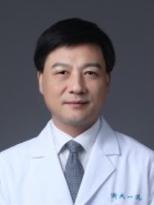

# 梁廷波 Tingbo Liang — 浙大一院院长，RADAR 的末位通讯

> RADAR 第 40 / 40 位作者 · 浙大一院肝胆胰外科 + 浙江省胰腺病研究重点实验室 + 教育部胰腺疾病国际合作联合实验室 · **末位通讯 / 临床侧总负责人**

## 一句话画像

肝胆胰外科医生出身的医院院长，不是影像人，更不是算法人。**1984—1989 年在河南封丘县李庄人民医院做了整整五年普外科住院医师**，从乡镇卫生院考进浙江，一路做到浙大一院院长、第十四届全国人大代表。RADAR 这篇论文里，==最不可替代的不是任何一段代码，而是"谁有权限把一家 5000 床三甲医院十年的影像与报告库打通给外部企业训练模型"==——而签在末位的就是这个人。

## 在 RADAR 里的位置

- **第 40 / 40 位，末位通讯**。论文给标的三个单位（肝胆胰外科、浙江省胰腺病研究重点实验室、教育部胰腺疾病国际合作联合实验室）正是三个实职，无第二人可能。
- 与第一作者 [章琦](01-qi-zhang.md) 单位完全相同，**首尾夹住整篇论文的临床端**。AI 侧资深作者 [张灵](39-ling-zhang.md) 排第 39。
- **推断**的具体承担：① 数据准入与合规——424,911 例增强腹部 CT + 1500 万 anatomy-wise 图文对全部来自临床报告库，这一级授权只能由院领导推动；② 多中心组织——外部验证的 10 家医院里 8 家在浙大一院的托管 / 分院 / 对口支援体系内，是院方的行政资产（→ [grassroots-network.md](../sources/grassroots-network.md)）；③ 26 位放射科医生的 reader study 的跨院协调。
- **几乎肯定没有碰模型。** 算法侧的实际负责人是达摩院的 [张建鹏](02-jianpeng-zhang.md) 与 [张灵](39-ling-zhang.md)，影像科侧对口是 [肖文波](38-wenbo-xiao.md)。

### 与 PANDA 及其余达摩院 × 浙大一院论文的重合

| 论文 | 年份 | 本人位次 | 同在的 RADAR 作者 |
|---|---|---|---|
| PANDA（*Nat Med*, PMID 37985692）| 2023 | 34 / 36，通讯 | 章琦 33、张灵 35（当时署达摩院**纽约**）、夏英达 2 |
| 肝脏恶性肿瘤 AI（*Nat Med*, PMID 42618635）| 2026 | 26 / 28，通讯 | 章琦 24、张灵 27（署**华盛顿 DC**）|
| RADAR（*Science*）| 2026 | **40 / 40** | 章琦 1、张灵 39 |

> [!insight] 一条产品线的三次迭代
> 单病种非增强 CT 筛查（PANDA）→ 单器官多病种（肝脏 AI）→ 全腹部 18 器官 146 征象的通用模型（RADAR）。
> 「章琦 + 梁廷波（浙大一院）+ 张灵（达摩院）」在三篇里位次同构；PANDA 与 *Nat Med* 2026 有 PubMed 通讯字段直接支撑，**RADAR 的这一层是按位次同构作的「推断」**（RADAR 的 PubMed 记录不含任何邮箱字段），且 *Nat Med* 2026 的通讯作者群比三人宽。

另一条制度性纽带：*Gut* 2023（PMID 36113977，末位通讯）里 [章琦](01-qi-zhang.md) 的挂靠单位逐字为 **「阿里巴巴—浙江大学未来数字医疗联合研究中心」**——浙大与阿里之间有一个正式命名的合建机构，这是这条合作线的制度载体，不是偶然署名。

## 背景与履历

| 时间 | 单位 · 职位 | 备注 |
|---|---|---|
| 1965-10 | 生于河南封丘 | 汉族，中共党员 |
| 1981-09 – 1984-07 | 新乡医学院 医疗系（今河南医药大学）| 非重点院校起步 |
| **1984-08 – 1989-08** | **河南省封丘县李庄人民医院 · 普通外科住院医师** | ==整整五年乡镇基层==。专访自述"经常拿着听诊器，骑着自行车，走村串户为村民看病" |
| 1989-09 – 1992-07 | 浙江医科大学 · 外科学硕士 | 人生转折点：从河南乡镇考进浙江，普外转肝胆胰。校方来源用今名写作"浙江大学医学院"（浙医大 1998 年并入浙大）|
| 1992-07 – 2011-11 | 浙大一院 · 住院医师 → 主治 → 副主任医师 → 教授、博导 | 1992–2000 的具体升迁年份未公开 |
| 1999-09 – 2002-06 | 浙江大学医学院 · 外科学博士（在职）| 导师姓名未见任何公开来源 |
| 约 2000 – 2011-11 | 浙大一院 · 肝胆胰外科副主任 | 起始月份仅单一来源 |
| 2005-06 – 2011-11 | 浙大一院 · **副院长** | 与上一行为兼任 |
| **2011-11 – 2018-12** | **浙大二院 · 副院长；肝胆胰外科主任、器官移植中心主任** | ==这两个「主任」职务只属于浙大二院这七年，不是现任头衔==。浙大二院肝胆胰外科是彭淑牖建立的科系 |
| 2016 | 推动成立 浙江省胰腺病研究重点实验室 | 场地 2624 ㎡，依托肝胆胰外科 9 个病区、340 余张床位 |
| **2018-12-17** | 回浙大一院 · **党委书记**（兼普外与肝胆胰外科学科带头人）| 同日裘云庆任常务副院长 |
| 2019-08 | 发起"小黄人"儿童肝移植公益项目 | |
| 2023-02 | **第十四届全国人大代表**（浙江省代表团）| |
| **2025-07-28 至今** | **浙大一院 · 院长、党委副书记** | 领导班子调整，党委书记由顾国煜接任 |

**荣誉与人才头衔**：国家杰出青年科学基金 · 教育部长江学者特聘教授（**两次**，含抗疫特岗学者）· 卫生部有突出贡献中青年专家 · 国家百千万人才工程 · 浙江省特级专家 · 浙江省万人计划杰出人才 · 浙江大学"求是"特聘教授 · 国务院特殊津贴 · 浙江省优秀共产党员 · 浙江省担当作为好干部 · **白求恩奖章** · **美国医学与生物工程院会士（AIMBE Fellow，2025）** · **美国外科医师协会会员（FACS）**。

**科技奖励**：以**第一完成人**获省部级一等奖 **3 项**——教育部科技进步一等奖、浙江省自然科学奖一等奖、浙江省科技进步奖一等奖；另以**主要完成人**获**国家科技进步二等奖 1 项**。

**学术兼职（医院官网口径）**：中国研究型医院学会副会长、该学会加速康复外科专业委员会主任委员 · 中华医学会外科学分会胰腺外科学组委员 · 中国医师协会胰腺病学专业委员会副主任委员 · 中国抗癌协会胆道肿瘤专业委员会副主任委员 · 浙江省医学会副会长、器官移植专业委员会主任委员 · 浙江省医师协会胰腺病专业委员会主任委员。

### ⚠️ 两次院士增选，均未当选

- **2023**：入围中国科学院院士增选有效候选人，未当选。
- **2025-08-20**：再度入围（生命科学和医学学部），**推荐人为西湖大学校长、中科院院士施一公**。
- **2025-11-21**：当选名单公布，==不在其中==；同为浙大系的邵逸夫医院蔡秀军当选。
- **下一轮增选是 2027 年。** RADAR 于 **2026-09** 发表。

> 以上四条只是把公开事实按时间并排摆出。**不对动机作任何推断。** 更多背景 → [zju-hospital.md](../sources/zju-hospital.md)。

## 研究方向

- **肝胆胰复杂疾病的外科治疗 + 肝移植**——临床主业，浙大个人主页自述方向的第一、第三条。
- **胰腺良恶性肿瘤与胰腺炎**；胰腺癌的转化研究（肿瘤免疫微环境、代谢重编程、异质性图谱）。
- 技术节点：首创针对中国胰腺癌人群的 **mFOLFIRINOX** 全身治疗方案；建立"联合自体小肠移植的胰腺癌根治手术技术体系"（2019 年首例，至 2024 年近 60 例）；2020-03 完成"全球首例多米诺移植"。
- **医学影像 AI 里的角色是"临床资源方 + 通讯作者"，不是研究者。** 在所有达摩院系列论文里提供的是病例队列、临床标注体系、多中心组织与临床解释，不提供模型。
- 临床体量（受访与院方宣传口径，**无独立核实**）：主刀肝胆胰手术 8000 余例、肝移植近千例；胰腺癌手术切除率"由 15% 提高至 67%"、5 年生存率"23.3%"（腾讯专访 2025-05-22 自述）；校友网对同一成果另给一组数字（毒副作用较国际传统方案减少 50%、中晚期患者手术机会增加 30%、受益患者近 5000 人）。同一成果两套口径，引用必须标出处。

## 代表作

| 论文 | 期刊 · 年份 | 作者位次 |
|---|---|---|
| An expert-level generalist AI for abdominal CT diagnosis（RADAR）| *Science* 393(6817):eaec6129, 2026 | **40 / 40，末位通讯** |
| Large-scale AI-guided liver malignancy diagnosis: multicenter study and a single-arm trial | *Nature Medicine*, 2026（PMID 42618635）| 26 / 28，共同通讯 |
| Large-scale pancreatic cancer detection via non-contrast CT and deep learning（PANDA）| *Nature Medicine*, 2023（PMID 37985692）| 34 / 36，共同通讯 |
| Mass cytometry-based peripheral blood analysis for early detection of solid tumours | *Gut*, 2023（PMID 36113977）| 30 / 30，末位通讯 |
| Viral load dynamics and disease severity in patients infected with SARS-CoV-2 in Zhejiang province | *BMJ*, 2020 | 位次未核实；Google Scholar 引用最高的一篇（1911）|
| The gluconeogenic enzyme PCK1 phosphorylates INSIG1/2 for lipogenesis | *Nature* 581:100-105, 2020（PMID 32322062）| 16 / 18；末位通讯为浙大吕志民，属合作而非主导 |
| Pembrolizumab 联合化疗治疗晚期胆道癌（KEYNOTE-966）| *The Lancet*, 2023 | 中国研究者之一，位次未逐一核实 |
| Liver transplantation for hepatocellular carcinoma: Hangzhou experiences（"杭州标准"）| *Transplantation* 85(12):1726-32, 2008（PMID 18580463）| 7 / 8（第一作者郑树森）。⚠️ 该文 **2019 年被 *Transplantation* 撤稿**（撤稿通知 PMID 31348443）；撤稿理由未在 PubMed 元数据中给出，此处不作任何判断 |

## 师承与关系

**一句话：这是浙医大—浙大一院外科学血统里"从基层一路考上来"的本土学者，没有海外博士或博士后训练记录，也没有跟随任何人迁移；本人就是这条谱系的当代节点。**

- **向上：导师查不到。** 硕士、博士导师姓名在浙大个人主页、校友网、医院官网、多篇人物专访里均未披露。唯一的硬证据只是 2008 年"杭州标准"一文中郑树森第一、本人第 7，说明 1990—2000 年代确实在郑树森的肝移植团队内部——**"郑树森是导师"属推断，不作结论**；"彭淑牖是导师"同样只有"2011 年接管其所在科室"这一间接关联，**亦属推断，不采信**。
- **横向：没有迁移。** 全部履历都在浙江大学系统内（浙大一院 → 浙大二院 → 浙大一院）。这与达摩院侧作者的"海外—回流"路径（[谢雨彤](12-yutong-xie.md) Adelaide → MBZUAI、[夏英达](20-yingda-xia.md) 达摩院华盛顿）完全相反，→ [damo-lineage.md](../sources/damo-lineage.md)。
- **向下：谱系是往下长的。** 中文报道称已培养百余名博士与硕士（宣传口径）。[章琦](01-qi-zhang.md) 是体系内的核心研究骨干，在 PANDA、*Gut* 2023、*Nat Med* 2026、RADAR 里都与之成对出现（章琦在前，本人压末位）。另有 Xu Han（浙大一院肝胆胰外科）同时出现在 PANDA 与 *Nat Med* 2026。
- 平行合作线：与浙大生命科学院吕志民的代谢—肿瘤合作（*Nature* 2020 PCK1），属资源型参与。
- RADAR 里的外部学术合作者是东南大学中大医院放射科的 [居胜红](36-shenghong-ju.md)。

## 学术指标

| | 值 |
|---|---|
| Google Scholar 总引用 | **34,100** |
| h-index | **87** |
| i10-index | **472** |

均为 **2026-09-20 抓取**（profile 名逐字为 "Tingbo Liang 梁廷波"，zju.edu.cn 验证邮箱）。前五高被引全部落在浙大一院临床团队，无外领域混入。

- **ORCID 不给出**：以 "Tingbo Liang" 检索返回 5 条记录，全部无单位、无 credit-name，无法判定哪一个是本人。给错不如不给。
- **Semantic Scholar 不可用**：authorId 2243009026 只挂 52 篇 / 1096 引 / h=14，是碎片化的同名分身 profile，与 Google Scholar 差两个数量级。
- **论文篇数口径矛盾**：有官网原文支撑的只有"以第一或通讯作者发表 SCI 论文 150 余篇"（浙大一院医生页）；网络上另有 400 余篇 / 200 余篇 / 89 篇三个互不相容的数字，均不引用。PubMed 以 `Liang Tingbo[Author]` 检索计数 560 篇，含合著与未去重同名，只能当上界参考。
- 同名污染程度：**低**。PubMed 最近 200 篇的单位首段全部落在浙大一院肝胆胰 / 胰腺 / 移植这一个机构簇内，未出现第二个机构的 Tingbo Liang；RADAR 全部 40 位作者中 Liang 姓仅此一人。

## 对 Shu 意味着什么

**直接价值低，间接价值高。** 技术栈零重叠——器官是肝胆胰不是冠脉，不做重建、不做材料分解、不做影像物理；组里招的是临床医学博士，不招影像物理博后；现任院长 + 全国人大代表，行政负荷极高，**不是会回陌生邮件的人，发邮件是浪费子弹**。

但这一页值得当**尺子**用：RADAR 能拿到 424,911 例，靠的不是算法而是末位这个签字的人。Shu 做 PVAT/FAI 和水脂分解，瓶颈从来不是方法，是"谁给数据、谁给阅片人、谁给外部中心"——挑下一站 PI 时该问的正是这一条。另外 **RADAR 的评估形式可以直接抄**（26 位放射科医生 reader study、AI 辅助后敏感度 +约 10%、内部 + 多中心外部验证、下沉到县医院验证泛化），这与 Slomka EAT 那条结论一致：**抄评估形式，不抄模型**。

**真要接触这条线，入口不是这里**：技术侧找 [张建鹏](02-jianpeng-zhang.md)，影像科侧找 [肖文波](38-wenbo-xiao.md) 或 [章琦](01-qi-zhang.md)，北美侧找 [张灵](39-ling-zhang.md) 与 [夏英达](20-yingda-xia.md)——**达摩院在华盛顿 DC 有实体组，那才是 2026 年 9 月毕业后唯一能解决工作许可的门**（→ [damo-hiring.md](../sources/damo-hiring.md)）。这一页的作用是证明这条链是真的，不是提供可联系人。

## 未解决

- **硕士与博士导师姓名**：全部公开来源均未披露；2002 年博士学位论文题目与指导教师也检索不到。
- **浙江大学医学院副院长是否为现任**：浙大个人主页与医院现任领导页都不含此职，仅见于一个未更新的第三方专家页。存疑。
- **何梁何利基金奖、全国创新争先奖、谈家桢生命科学奖**：医院官网与校友网的荣誉清单里都没有这三项，也未找到原始获奖名单（何梁何利官网目标路径 404）。零来源支撑，故未写入正文。
- **白求恩奖章授予年份**：专访确认已获得（标题逐字为"对话『白求恩奖章』获得者梁廷波"，2025-05-22），文中未写年份。
- **1992-07 – 2000 年的具体职务与升迁年份**：校友网只笼统带过。
- **"肝胆胰外科副主任（约 2000 起）""副院长（2005-06 起）"的精确起止月份**：单一来源，未复核。
- **RADAR 中的具体分工全部为推断**：论文正文与 Methods 在付费墙后，author contributions 无可抓取版本。
- **临床体量数字**（8000 余例手术、近千例肝移植、切除率 15%→67%、5 年生存 23.3%、培养百余名研究生）：均为受访与院方宣传口径，无独立核实。
- 百度百科返回安全校验 / 403，未能抓取，本页所有结论均不依赖该来源。

## 来源

- https://person.zju.edu.cn/0012056 （浙大个人主页中文版，更新于 2026-03-19）
- https://person.zju.edu.cn/en/0012056 （英文镜像，同工号）
- https://scholar.google.com/citations?hl=en&user=MWljcPYAAAAJ
- https://www.zy91.com/general/leader （浙大一院现任领导）
- https://www.zy91.com/department/doctor/74/328 （浙大一院医生页）
- https://en.zy91.com/department/liang
- http://www.xxmu.edu.cn/xyh/info/1038/1513.htm （河南医药大学 / 原新乡医学院 校友网优秀校友页，逐段履历的原始出处）
- http://www.cn-healthcare.com/api/third/article/512620 （2018-12 任命通稿）
- https://finance.sina.com.cn/stock/stockzmt/2025-07-28/doc-infhzpnv0158814.shtml （2025-07-28 领导班子调整）
- http://www.npc.gov.cn/npc/c2/kgfb/202302/t20230225_423685.html （第十四届全国人大代表名单，浙江省代表团）
- https://aimbe.org/college-of-fellows/directory/ （AIMBE Fellow 名录，2025）
- https://news.qq.com/rain/a/20250522A06ANP00 （白求恩奖章专访）
- https://www.workercn.cn/c/2024-08-19/8331121.shtml
- https://doctor.peopledailyhealth.com/like/item/1485
- https://cpms.ssap.com.cn/skwx_cmr/expertsDetail?authorID=475164&SiteID=23
- https://ori.hangzhou.com.cn/ornews/content/2026-09/19/content_9311231.htm
- https://pubmed.ncbi.nlm.nih.gov/42752131/ （RADAR）
- https://pubmed.ncbi.nlm.nih.gov/42618635/ （肝脏恶性肿瘤 AI）
- https://pubmed.ncbi.nlm.nih.gov/37985692/ （PANDA）
- https://pubmed.ncbi.nlm.nih.gov/36113977/ （*Gut* 2023）
- https://pubmed.ncbi.nlm.nih.gov/32322062/ （*Nature* 2020 PCK1）
- https://pubmed.ncbi.nlm.nih.gov/18580463/ · https://pubmed.ncbi.nlm.nih.gov/31348443/ （杭州标准原文与撤稿通知）
- https://github.com/alibaba-damo-academy/damo-radar
- 照片：https://person.zju.edu.cn/0012056
