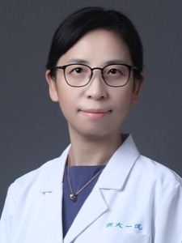
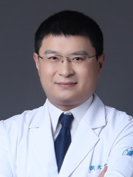
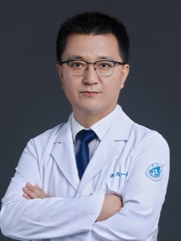
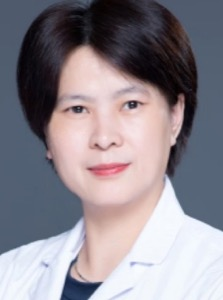
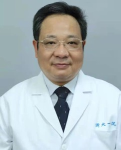

# 其余 25 位作者

> RADAR（*Science* 2026）40 位作者里，15 位核心作者各有单独一页（见 [../README.md](../README.md#15-位核心作者)），其余 25 位合在这里。
> 条目比核心作者页短；在读学生和县医院医生的公开资料很少，缺的信息在条目末尾用「查不到」标出，不凑。
> 照片只在所在医院 / 学校的官方个人页上直接有头像时才取，所以大多数人没有。

## 速查

| # | 姓名 | 分组 | 身份 |
|---:|---|---|---|
| 4 | Zilin Lu | 达摩院研究员与在读学生 | **西工大计算机学院在读博士**，达摩院实习。共一。ORCID 教育栏写 NWPU |
| 5 | 常琬星 Wanxing Chang | 达摩院研究员与在读学生 | 达摩院算法工程师。共一 |
| 6 | Haonan Ding | 浙大一院的临床团队 | 浙大一院肝胆胰外科**硕士生**（ORCID employments）。共一 |
| 7 | Cao Chen | 浙大一院的临床团队 | 浙大一院肝胆胰外科，推断为章琦组研究生/在培医师 |
| 8 | 李志 Zhi Li | 浙大一院的临床团队 | 浙大一院放射科 主治医师 |
| 9 | 薛星 Xing Xue | 浙大一院的临床团队 | 浙大一院放射科（ORCID 自述 2018-08 起受雇） |
| 10 | Sinuo Wang | 达摩院研究员与在读学生 | Adelaide AIML 博士生（导师吴琦、谢雨彤），在达摩院实习 |
| 11 | Shaoteng Zhang | 达摩院研究员与在读学生 | **西工大计算机学院在读博士**，达摩院实习 |
| 15 | Zhongyi Shui | 达摩院研究员与在读学生 | 浙大-西湖大学联合培养博士生（推断） |
| 17 | Zhilin Zheng | 达摩院研究员与在读学生 | 达摩院算法研究员（2022 起持续正式署名，非实习） |
| 18 | Yanjie Zhou | 达摩院研究员与在读学生 | 达摩院算法研究员；论文另写作 Yan-Jie Zhou |
| 21 | Hongkan Wang | 浙大一院的临床团队 | 浙大一院肝胆胰外科，深度参与早期临床试验（GCP） |
| 23 | 马涛 Tao Ma | 浙大一院的临床团队 | 浙大一院肝胆胰外科主任医师；**兵团第一师医院党委副书记兼院长**、中组部第十一批援疆领队 |
| 24 | 彭杰 Jie Peng | 外部验证医院 | 兵团第一师医院 医学影像中心主任、副主任医师 |
| 25 | 王晓光 Xiaoguang Wang | 外部验证医院 | 嘉兴一院 **党委委员、副院长**、主任医师 |
| 26 | 丁健 Jian Ding | 外部验证医院 | 嘉兴一院放射科 **副主任**、副主任医师 |
| 27 | 高玉明 Yuming Gao | 外部验证医院 | 绩溪县人民医院 **院长**、主任医师 |
| 28 | 叶华震 Huazhen Ye | 外部验证医院 | 景宁县人民医院放射科 **副主任（主持工作）** |
| 29 | 刘义平 Yiping Liu | 外部验证医院 | 嵊州市人民医院放射科 **主任**、主任医师 |
| 30 | 陈东杰 Dongjie Chen | 外部验证医院 | 海宁市人民医院普外科三（肝胆胰脾疝）。职称未查到 |
| 31 | 倪兆敏 Zhaomin Ni | 外部验证医院 | 安吉县人民医院放射科 主任医师 |
| 32 | 宁建文 Jianwen Ning | 浙大一院的临床团队 | 浙大一院急诊科；**浙大一院安吉分院党委副书记、院长** |
| 33 | 张微 Wei Zhang | 浙大一院的临床团队 | 浙大一院肝胆胰外科主任医师、肝移植中心副主任；兼良渚分院 |
| 34 | 刘剑 Jian Liu | 外部验证医院 | 北仑区人民医院（浙大一院北仑分院）**院长**、主任医师 |
| 37 | Jianfeng Zhang | 达摩院研究员与在读学生 | 达摩院医学影像研究员（CT-SAM3D、Med-Query 作者）。与达摩院院长张建锋同音，非同一人 |

---

## 一、达摩院研究员与在读学生

8 人。算法侧的执行层：达摩院的正式研究员，加上从西工大、Adelaide、浙大-西湖过来实习的博士生。

这四位都不是 RADAR 的决策者，而是真正把模型训出来、把结果评出来的那层人力。两条互不相干的来路在这里合流：#4 与 #11 来自[夏勇](13-yong-xia.md)在西北工业大学计算机学院的课题组，由已在达摩院的师兄[张建鹏](02-jianpeng-zhang.md)带进来实习；#5 是 2024 年从上海科技大学硕士毕业直接入职的算法工程师，也是 RADAR 代码仅有的三位作者之一；#17 则是 2021 年前后跟着吕乐那批人从平安整体迁进达摩院的老兵。==四人里只有 #4 和 #5 是共同第一作者，#11 与 #17 不是。== 署名上还有一处要留意：#4 与 #11 在 *Science* 上的单位串是「达摩院 + 宁波市第二医院放射科」，**一个字的西北工业大学都没有** —— 连导师夏勇本人也是同样的写法。

### #4 Zilin Lu — 西工大夏勇门下在读博士，达摩院实习期间挂上 Science 共同一作

- **论文单位**：Alibaba DAMO Academy（杭州）+ Department of Radiology, Ningbo No. 2 Hospital（宁波市第二医院放射科）。==真实学术归属是西北工业大学计算机学院，论文上一字未提。== ORCID 0000-0003-2437-283X 的教育栏只有一条 Northwestern Polytechnical University；用该 ORCID 反查 Crossref 的 7 篇里，除 RADAR 外六篇的单位字段全印西工大全称。
- **现职**：西北工业大学计算机学院在读博士研究生，导师[夏勇](13-yong-xia.md)；在达摩院医疗 AI 团队实习（arXiv:2603.04022 脚注原文："The work was done during Zilin's internship at DAMO Academy."）。
- **背景**：
  - 最早可确认的论文是 2022 年 MICCAI MMMI workshop 的 M²F（第一作者，西工大署名），据此推断入学不晚于 2021—2022 年（**推断**）。
  - 2023 CVPR PEFAT（第 3 作者，被引 105，全组最高）；2024 MICCAI 两篇；2024—2025 IEEE TMI 连发多篇、IJCV 2025 PICK（第 2 作者）、JBHI 2025 PathBot。
  - 2026：IEEE TIP 一篇；arXiv:2603.04022 第一作者，达摩院实习成果，通讯[张建鹏](02-jianpeng-zhang.md)，合作者含[曹维维](03-weiwei-cao.md)、常琬星、夏勇、[张灵](39-ling-zhang.md)。
- **研究方向**：半监督 / 弱监督医学图像分割与分类、医学视觉问答、视觉—语言对齐、放射报告生成的强化学习。从 2022 年的多模态胶质瘤诊断预后，到以文本为锚点的分割与视觉问答，再到报告生成的强化学习，主线只有一条：==用文本 / 语言信号去补医学影像标注的不足== —— 正是 RADAR 的方法论内核。
- **在 RADAR 里**：第 4 位作者，**6 位共同第一作者之一**（PubMed 的 EqualContrib 字段独立确认只有前 6 位）。*Science* 官网作者页列的 CRediT 角色为 Data curation、Formal analysis、Validation、Writing - original draft（单一来源），==没有 Software==。推断：不写训练代码主干，做数据集的整理清洗、评测分析与初稿撰写，偏报告文本与诊断评测这一侧（**推断**）。不在 PANDA 作者表内，也不在达摩院平扫 CT 早筛那条 *Nature Medicine* 系列里。
- **与其他作者的关系**：[夏勇](13-yong-xia.md) → [张建鹏](02-jianpeng-zhang.md) → 招师弟来实习的典型闭环，同一条线上还有[谢雨彤](12-yutong-xie.md)、#11 Shaoteng Zhang；参见 [academic-pipeline](../sources/academic-pipeline.md)、[damo-hiring](../sources/damo-hiring.md)。西工大同门里日常合作最紧的是 Qingjie Zeng、Mengkang Lu。
- **学术指标**：Google Scholar 总被引 601、h-index 12、i10-index 13（2026-09-20 抓取，页面列 16 条），四人里最高。OpenAlex A5100647576 把华南理工脑机接口方向与 AIAA 航空方向的同名者合并了进来，那组数字不可用。
- **对 Shu**：无直接关系。处理的是重建后图像加报告文本，不碰投影域、能谱与噪声统计，人在国内也没有招人权限。唯一可用的是那篇报告生成强化学习里「诊断多样性采样、数据质量优于数量」的做法 —— 将来给材料分解或 PVAT 结果配自动化评测时可以当参考，不作为联系对象。
- **来源**：https://www.science.org/doi/10.1126/science.aec6129 , https://orcid.org/0000-0003-2437-283X , https://scholar.google.com/citations?user=ngPgM1QAAAAJ , https://openreview.net/profile?id=~Zilin_Lu2 , https://arxiv.org/abs/2603.04022 , https://api.crossref.org/works/10.1126/science.aec6129
- **查不到**：中文名（没有任何英↔中对照来源，不做拼音反推）；本科 / 硕士院校；达摩院实习的起止时间与是否已毕业；宁波市第二医院这个署名的由来。

### #5 常琬星 Wanxing Chang — 最优传输出身的达摩院算法工程师，RADAR 仅有的三位代码作者之一

- **论文单位**：Alibaba DAMO Academy（杭州）+ [湖畔实验室](../sources/hupan-lab.md)（杭州）。
- **现职**：阿里巴巴达摩院算法工程师（职级未查实）。判据是 Google Scholar 机构栏写 Alibaba DAMO Academy、2024-12 起连续以达摩院署名发论文、个人主页自 2024-07 起停更。
- **背景**：
  - 本科：电子科技大学生物医学工程。硕士：上海科技大学信息科学与技术学院计算机科学。
  - 个人主页自述 final-year master student，该页最后一次提交为 2024-07-10，把在读末年钉在 2023—2024 学年；最早的达摩院署名见于 2024-12 的 arXiv 预印本，因此推断 2024 年下半年入职（**推断**）。
  - 导师**推断**为石野（Ye Shi，上科大 YesAI 实验室负责人）与 Jingya Wang —— 依据是两篇 NeurIPS 的固定合作者，主页无 advisor 字样。Jingya Wang 的中文名「汪婧雅」只有单一来源，不当定论。
- **研究方向**：两条并行主线。(1) 上科大时期的理论底子：最优传输 + 开放世界学习 —— 通用域自适应（NeurIPS 2022 Spotlight，被引 144）、带噪标签学习（CSOT，NeurIPS 2023）。(2) 达摩院之后：3D CT 视觉—语言预训练与评测（CT-FineBench、AtomiMed、Disease-Centric VLP、RadSight）、病理全切片分析（Pixel-Mamba，ICCV 2025），并保留与中科院计算所的图神经网络合作。==这四人里唯一从理论工具跨进医学多模态工程的。==
- **在 RADAR 里**：第 5 位作者，**6 位共同第一作者之一**。*Science* 官网作者页列的 CRediT 角色多达十项、含 Software（单一来源）；==Zenodo 代码存档只署三位 creator：张建鹏、曹维维、常琬星==，两边完全吻合 —— 主力工程实现者，不是挂名。不在 PANDA 里（时间上也不可能），但几乎出现在达摩院 2026 年所有 CT 视觉语言模型的论文上，另有 *Nature Communications* 2026 脂肪肝多模态 AI 第 3 作者。技术侧的位置见 [radar-technical-teardown](../sources/radar-technical-teardown.md)。
- **与其他作者的关系**：进达摩院后同时跨两支 —— 吕乐 / Ke Yan / Dakai Jin 的病理与影像线，和[张灵](39-ling-zhang.md) / [张建鹏](02-jianpeng-zhang.md) / [曹维维](03-weiwei-cao.md) 的 RADAR 线，两支都在的人很少；见 [damo-lineage](../sources/damo-lineage.md)。
- **学术指标**：Google Scholar 总被引 211、h-index 4、i10-index 3（2026-09-20 抓取），84% 的引用集中在那两篇 NeurIPS 上。ORCID 0009-0004-0253-1830（投稿系统里作者本人认证），DBLP pid 332/1430。
- **对 Shu**：==这四人里唯一值得看一眼的，但看的是方法不是人。== 最优传输那套「带结构约束地把两个分布对齐」，正对着材料分解里仿真标定迁移到真实 NAEOTOM / Canon 数据的域偏移问题，是目前没在用的工具，CSOT 的课程式 + 结构感知 OT 值得读一遍。另外是真正写 RADAR 代码的三人之一 —— 要复现 RADAR 或问工程细节，找这里比找通讯作者准。作为求职 / 博后去向无价值：在国内、无招人权限、不做成像物理、不碰能谱与重建。
- **来源**：https://changwxx.github.io/ , https://orcid.org/0009-0004-0253-1830 , https://scholar.google.com/citations?user=07BLeI8AAAAJ , https://dblp.org/pid/332/1430.html , https://zenodo.org/records/21271172 , https://www.science.org/doi/10.1126/science.aec6129
- **查不到**：本硕的起止年份、达摩院职级。GitHub 资料 2026-09 仍写 location = Shanghai，与杭州的达摩院不一致，不据此下任何结论。

### #11 Shaoteng Zhang — 与 Zilin Lu 同门的西工大在读博士，RADAR 的评测与作图

- **论文单位**：达摩院（杭州）+ 宁波市第二医院放射科 —— 与 #4 一字不差，同样没有西北工业大学。这个写法在自己当第一作者的 arXiv:2607.09135 上被原样重复，==不是排版事故，是课题组自己的选择==。
- **现职**：西北工业大学计算机学院在读博士研究生，导师[夏勇](13-yong-xia.md)。OpenReview 档案 2022-10 注册，推断 2021 或 2022 级（**推断**）。未见明文实习脚注，但署名模式与 #4 完全一致，推断同为达摩院实习（**推断**）。
- **背景**：2022 MICCAI MLMI workshop TransWS（第一作者，被引 16）；2023 MICCAI TPRO（第一作者，被引 43，目前引用最高的一篇）；MICCAI 2025 一篇第 3 作者（与 Xiaoyu Bai、Ziyang Chen、夏勇，归属未在 Scholar 页确认）；2026-07 arXiv:2607.09135 Super-Generalist 第一作者 —— 这是 RADAR 的直接后续工作（通才模型与专科分割模型融合），通讯为夏勇 + [张建鹏](02-jianpeng-zhang.md)。
- **研究方向**：弱监督 / 文本提示驱动的病理图像分割（TransWS、TPRO），近两年转向通用医学影像理解与「通才—专才协同」。主线是用更弱的监督信号（文本提示、图像级标签、分割专家先验）去训分割与诊断模型。==这批人里唯一从数字病理切片入手、再转到 CT 的。==
- **在 RADAR 里**：第 11 位作者，**不是共同第一作者**（PubMed 的 EqualContrib 只标前 6 位）。*Science* 官网作者页列的 CRediT 角色为 Formal analysis、Validation、Visualization 三项（单一来源）—— 没有 Data curation、没有 Software、没有 Writing，在 40 位作者里属偏后的贡献梯队。推断：做评测阶段的统计分析与图表，不参与数据构建和代码主干（**推断**）。实际收获是拿到数据与 pipeline 之后独立做出了 Super-Generalist。不在 PANDA，也不在达摩院 *Nature Medicine* 那条线上。
- **与其他作者的关系**：最早两篇的第二作者就是[张建鹏](02-jianpeng-zhang.md)，从入学第一年起就在师兄的直接带教下做课题 —— 达摩院与其说是外部实习单位，不如说是师兄的组。==西工大侧在 RADAR 作者表里的全部人力只有三人==：[夏勇](13-yong-xia.md)、Zilin Lu、本人，三人共用同一个宁波市第二医院署名；[谢雨彤](12-yutong-xie.md) 出自同一条线。
- **学术指标**：Google Scholar 总被引 59、h-index 2、i10-index 2，页面仅列 4 条（2026-09-20 抓取）。ORCID 0009-0005-4976-6351，employment 只有 Northwestern Polytechnical University 一条。四人里最低，属于刚上路的阶段 —— 第一作者的 Super-Generalist 若中稿会明显改观。OpenAlex A5024569575 混入了中国矿业大学岩石力学与中科院大学微分几何两位同名者，数字不可用。
- **对 Shu**：无直接关系 —— 方向、地理位置、职权都无交集，不做任何成像物理。勉强能说的一点：TPRO 用文本提示做弱监督分割，与 PVAT 边界问题上「没有真值标注怎么办」是同一类困境的两种答案（语言先验 vs 物理先验加仿真），属于读一篇论文的价值，不是认识一个人的价值。
- **来源**：https://www.science.org/doi/10.1126/science.aec6129 , https://orcid.org/0009-0005-4976-6351 , https://scholar.google.com/citations?user=YCdOvPcAAAAJ , https://openreview.net/profile?id=~Shaoteng_Zhang1 , https://arxiv.org/abs/2607.09135 , https://pure.nwpu.edu.cn/
- **查不到**：中文名（不做拼音反推）；本科 / 硕士背景；是否已转为达摩院正式员工、是否已毕业；宁波市第二医院署名的由来。

### #17 Zhilin Zheng — 跟吕乐从平安进达摩院的正式研究员，GRAPE 与 RADAR 之间的连接点

- **论文单位**：达摩院（杭州）+ [湖畔实验室](../sources/hupan-lab.md)（杭州）。
- **现职**：达摩院算法研究员（职级未查实）。==与 #4、#11 不同，2022 年起持续以达摩院正式署名发论文，不是实习生。==
- **背景**：
  - 硕士：华东师范大学通信与电子工程学院 / 上海市多维度信息处理重点实验室，导师孙力（Li Sun）。按学号前缀推断 2017 年入学（**推断**）；本科院校未查到。
  - 2019：CVPR 一作 Disentangling Latent Space for VAE by Label Relevant/Irrelevant Dimensions（被引 73，至今最有影响的工作）；2020 ICIP 一篇。
  - 2021（平安科技 / PAII）：ICCV 2021 一作，论文页单位明确印 PingAn Technology；同年与吕乐、Shun Miao 等做胸片骨折的半监督检测。
  - 2023 起（达摩院）：*Radiology* 2023 胰腺导管腺癌淋巴结转移预测；2025 *Nature Medicine* GRAPE（平扫 CT 胃癌大规模筛查，PMID 40555751，第 3 / 58 位）；2025 *BMC Medicine* 幽门螺杆菌内镜 AI；2026 *Radiology: Artificial Intelligence* 胃肿瘤增强 CT 检出、*Medical Image Analysis* 内镜多示例学习、arXiv RadSight 与 TumorChain。
- **研究方向**：早期做生成模型的表征解耦 —— VAE 隐空间按「标签相关 / 标签无关」维度拆分、条件 VAE 的结构与风格分离、多属性图像到图像翻译。转入产业界后全部转向医学影像诊断：胰腺癌淋巴结转移、胃癌平扫 CT 筛查、胃肿瘤检出、内镜多示例学习、放射多模态理解。==四人里唯一真正做过生成模型理论的，也是唯一横跨 CT 与内镜两种模态的。==
- **在 RADAR 里**：第 17 位作者，不是共同第一作者。*Science* 官网作者页列的 CRediT 角色为 Formal analysis、Investigation、Visualization（单一来源），与连续的第 17—20 位 Yanjie Zhou、[Tony C W Mok](19-tony-c-w-mok.md)、[夏英达](20-yingda-xia.md) 完全相同 —— 推断这是达摩院内部被抽调来做评测分析与图表的一组资深工程师，本人提供的是胃与腹部病灶检测方面的既有经验（**推断**）。不带 Software、Data curation、Writing，与代码主干和数据集构建无关。
- **与其他论文的重合**：不在 PANDA 作者表内，但==是 GRAPE（*Nat Med* 2025，平扫 CT 胃癌筛查）与 RADAR 之间的连接点==；达摩院「平扫 CT + AI」这条产品线从胰腺到胃、到内镜、再到通用腹部影像，本人是少数四条线全程常驻的人之一。
- **与其他作者的关系**：迁移轨迹与吕乐同步 —— 华东师大 → 平安 PAII → 达摩院，不是独立跳槽，而是**跟随吕乐那支人马整体迁移**的一员（**推断**：时间吻合，且 2021 年的合作者 Le Lu、Shun Miao、Yirui Wang、Kang Zheng 整体是 PAII 班底、此后也都出现在达摩院论文里；无公开来源明文陈述）。达摩院医疗 AI 因此是两支血统的合流：吕乐 / [张灵](39-ling-zhang.md) 的 PAII 系（PANDA、GRAPE、[夏英达](20-yingda-xia.md)、本人）与[夏勇](13-yong-xia.md)的西工大系（[张建鹏](02-jianpeng-zhang.md)、[曹维维](03-weiwei-cao.md)、Zilin Lu、Shaoteng Zhang），==RADAR 是两支第一次在 Science 正刊上合署的产物==。详见 [damo-lineage](../sources/damo-lineage.md)。
- **学术指标**：没有可用的个人 Google Scholar 页（四人里唯一）。ORCID 0000-0002-2439-9162，仅登记 7 条 work。==同名污染极严重==：另有浙大四院神经内科、诺丁汉大学心理系、大连海军舰艇学院流体力学、环境工程重金属浸出至少四位 Zhilin Zheng，OpenAlex A5025166983 把它们全合并了，works 47 / cited 857 / h 12 一律不可用。可核实的硬数字只有 CVPR 2019 一作被引 73 与 *Nature Medicine* 2025 的第 3 位次，真实 h-index 推断在 6—8 量级（**推断**）。
- **对 Shu**：无直接关系 —— 在杭州、企业算法工程师、没有招人权限、做的是重建后图像的诊断模型。可读的是履历本身：五年内从华东师大硕士挂上 *Nature Medicine* 第 3 作者与 *Science*，靠的不是某个算法，而是吕乐把整支 PAII 队伍搬进达摩院这件事；要理解达摩院为什么能在五年里连发四篇 *Nature Medicine* 加一篇 *Science*，本人是这支队伍里一个可验证的节点。早年的 VAE 隐空间解耦与材料分解同属「把混合信号拆成可解释分量」，但一个靠学、一个靠物理约束，借鉴价值有限。
- **来源**：https://www.science.org/doi/10.1126/science.aec6129 , https://orcid.org/0000-0002-2439-9162 , https://pubmed.ncbi.nlm.nih.gov/40555751/ , https://pure.ecnu.edu.cn/ , https://github.com/alibaba-damo-academy/damo-RadSight , https://arxiv.org/abs/2607.22293
- **查不到**：中文名（没有个人主页、没有 Google Scholar、没有 GitHub，ORCID 只填了 7 条）；本科院校；从华东师大到平安、从平安到达摩院的确切年份；达摩院职级与是否带团队。

这四位是 RADAR 的**技术件供应商**：没有一个是通讯或共同一作，每个人往里带的是一个现成的、在 RADAR 之前就已经做完并发表过的模块 —— Sinuo Wang 与 Zhongyi Shui 带来 CT 视觉-语言预训练（fVLM 是 RADAR 方法线的直接前身），Yanjie Zhou 带来血管与胸腹急症 CT 加配准，Jianfeng Zhang 带来全身解剖结构分割的底座。四人全部**不在 PANDA 作者名单里**，属于 PANDA 之后才进这条产品线的一代；也全部不在 `damo-radar` 开源仓库的 3 位 contributor 之列。四人的中文名都没查到 —— 三位是在读学生或实习生，一位是达摩院不露面的工程师，中文互联网上没有公开痕迹。

### #10 Sinuo Wang — 吴琦门下的 Adelaide 博士生，Adelaide → 达摩院这条管道的活体样本

- **论文单位**：Australian Institute for Machine Learning, Adelaide University（论文单位 9；全篇只给了这一条，没给达摩院）
- **现职**：Adelaide University AIML **博士生**。导师两位，V3ALab 个人页原文写明 "Under the supervision of A/Prof. Qi Wu and Dr. Yutong Xie" —— 即 [吴琦](14-qi-wu.md)（#14）与 [谢雨彤](12-yutong-xie.md)（#12），两人都在 RADAR 作者表里
- **背景**：
  - 2021 Adelaide 电气与电子工程（Autonomous Systems）荣誉学士；2023 同校人工智能与机器学习硕士；2022 获 Executive Dean's Recognition of Academic Excellence（以上均出自 V3ALab 官方个人页）
  - 2023：随 RoboBreizh 队在法国波尔多拿下 **RoboCup@Home SSPL 世界冠军**；同年 RoboNLU（RoboCup 2023）**第一作者**
  - 2024-04 起转医学视觉-语言：PairAug（CVPR 2024，第 3 位，与谢雨彤、夏勇、吴琦同文）
  - 2025-01 起连续三篇的署名单位**直接写 DAMO Academy**（fVLM 里单位栏只有达摩院一条，无 Adelaide）：fVLM、Boosting Vision Semantic Density（ANM）、放射报告生成的强化学习（2026-03，同篇有 Zilin Lu、曹维维、Wanxing Chang、夏勇、[张灵](39-ling-zhang.md)、[张建鹏](02-jianpeng-zhang.md)）——达摩院实习或访问身份「推断」
  - 2025-09 MedCutMix **第一作者**（合作者：谢雨彤、Yuyuan Liu 牛津、吴琦）
- **研究方向**：放射影像-报告配对数据的增广与对齐 —— 一句话，做的是「怎么把有限的影像-报告数据榨出更多监督信号」这一层，不碰成像端
- **在 RADAR 里**：「推断」视觉-语言预训练与图文数据增广的算法贡献，同时是 AIML 一侧的学生代表。位次 10 紧挨着 12 谢雨彤、13 夏勇、14 吴琦，落在「西工大—Adelaide」这个学术块里，而不是临床块。是 fVLM（第 4 位）与 ANM（第 4 位）两篇 RADAR 技术前身的合著者。不在 PANDA、GRAPE、iAorta 里
- **与其他作者的关系**：导师是 [吴琦](14-qi-wu.md) 与 [谢雨彤](12-yutong-xie.md)；顺着谢雨彤 → [夏勇](13-yong-xia.md) 这条线接上达摩院的 [张建鹏](02-jianpeng-zhang.md)。本人就是 [学术管道](../sources/academic-pipeline.md) 那条「西工大出人 → Adelaide 读博 → 回流达摩院实习」链子的当期样本
- **对 Shu**：本人是同辈博士生，不是推荐人也不是合作对象，技术上与材料分解、光子计数 CT 完全不相交。==有用的是这条线背后的机构==：Adelaide AIML 的医学影像 AI 建制完整（吴琦做视觉语言、Johan Verjans 做心脏影像、Minh-Son To 是放射科医生），澳洲对国际学生的签证与工作权限明显比美国宽，这对 2026 年 9 月毕业后的去向是一个实质备选；同一条线上的谢雨彤去了 MBZUAI，也是同类选项。要花时间就花在这两位导师的页面上
- **查不到**：中文名。另有两处同名需要隔开 —— arXiv 上 2025-09 起有一批金融 / Agent 方向的 Sinuo Wang（Flash-Searcher、GAUGE、FinResearchBench II 等），合作网络与本人毫无重合；OpenAlex 还把一篇 2022 年郑州大学网络空间安全学院的评论检测论文并进了同一个 cluster，与官方履历（2021 年在 Adelaide 读本科）对不上。两者都按不同人处理
- **来源**：<https://v3alab.github.io/author/sinuo-wang/>、<https://v3alab.github.io/people/>、<https://arxiv.org/abs/2509.16673>、<https://arxiv.org/abs/2501.14548>、<https://arxiv.org/abs/2508.03742>、<https://arxiv.org/abs/2603.04022>、<https://arxiv.org/abs/2404.04960>
  照片：<https://v3alab.github.io/author/sinuo-wang/>

### #15 Zhongyi Shui — fVLM 第一作者，RADAR 视觉-语言方法线的源头

- **论文单位**：浙江大学计算机科学与技术学院（论文单位 6；全篇只给了这一条）
- **现职**：浙大-西湖大学联合培养博士生「推断」，杨林（Lin Yang）实验室。2026-08 已出现在蚂蚁集团 UI-Venus-2 技术报告 31 人名单里（第 19 位，"Venus Team, Ant Group"），方向转到 GUI Agent
- **背景**：
  - 约 2021 入学「推断」（首篇论文 2022-07 倒推）。2022–2025 全部论文双署「浙大计算机学院 + 西湖大学工学院」，到 RADAR 只剩浙大一条
  - 计算病理主力，一作至少 6 篇：End-to-End Cell Recognition by Point Annotation（MICCAI 2022）、DPA-P2PNet、Semi-supervised Cell Recognition、Prompt-driven Nucleus Instance Segmentation、Context-aware Nucleus Detection（AAAI 2026）、NuNext（2026-03）。西湖大学官方教师页把其中几篇直接列进杨林的代表论文
  - 2024 起在达摩院实习 —— fVLM 首页脚注原文：**"The work was done during Zhongyi's internship at DAMO Academy"**，同一行写着 "Correspondence to Jianpeng Zhang"
  - 2025-01 **fVLM**（arXiv 2501.14548），**ICLR 2025 Spotlight**（OpenReview 的 venue 字段即 "ICLR 2025 Spotlight"），第一作者
  - 2026-03 NuNext 一作，合作者已换成何聪辉（上海 AI 实验室）等，说明上半年就在迁移；2026-08 进蚂蚁
- **研究方向**：点监督的细胞与细胞核检测、全切片图像多示例学习、病理视觉-语言基座；2025 横向搬到 CT 视觉-语言预训练；2026 转 GUI Agent，已离开医学影像
- **在 RADAR 里**：==方法线的源头之一，不是挂名的浙大学生==。fVLM 做的正是「把 CT 按解剖区域切开、逐个解剖做对比预训练，再把解剖级对齐带来的大量假阴性校正回来」：6.9 万例病人的图文数据、15 个主要解剖、54 个诊断任务零样本平均 AUC 81.3%。RADAR 的 1500 万解剖感知图文对是同一条路线的放大版，且 fVLM 的作者串（[张建鹏](02-jianpeng-zhang.md)、曹维维、Sinuo Wang、吕乐、杨林、[叶香华](22-xianghua-ye.md)、[梁廷波](40-tingbo-liang.md)、[章琦](01-qi-zhang.md)、[张灵](39-ling-zhang.md)）几乎就是 RADAR 班底。另合著 ANM（arXiv 2508.03742，第 3 位）。位次 15 是浙大计算机块之首。不在 PANDA、GRAPE、iAorta 里
- **与其他作者的关系**：导师杨林 —— 西湖大学工学院人工智能系终身教授、人工智能与生物医学影像实验室负责人，履历按西湖大学官方教师页是 1999 西安交大本科 → 2002 西安交大硕士 → 2006/2009 罗格斯大学硕士 / 博士 → 罗格斯（2009–2011）、肯塔基（2011–2014）、佛罗里达（2014 起，2015 拿终身副教授）→ 2020 加入西湖。杨林本人也署在 fVLM 上。达摩院一侧对口的是通讯作者张建鹏、张灵、吕乐；与曹维维（#3）在 fVLM 与 ANM 两篇上互为共同作者
- **对 Shu**：==值得精读一篇论文，不值得联系一个人。== fVLM 是「不做任何像素级标注、也不做任何物理建模，直接从几十万份临床报告里学解剖级对齐」的极端样本，正好站在 Shu 整个纲领（材料分解、误差预算、噪声即信号）的反面。面试或研究陈述里「RADAR 都到专家级了，为什么还需要 CT 成像物理」是必答题，答案就在这篇的边界上：报告里从来不写的量 —— 脂肪衰减、水脂分数、噪声结构 —— 它学不到。另外此人的履历（博士 5 年、6 篇以上一作顶会、直接进大厂）是校准工业界门槛的一个干净样本
- **学术指标**：Semantic Scholar 35 篇 / 612 次被引 / h-index 13（2026-09-20 抓取；该名在全库只有一个候选，消歧干净）。ORCID 0009-0009-8052-7972，但整份记录只登记了 Science 这一篇。OpenAlex 把此人拆成 10 个碎片 cluster，不可用
- **查不到**：中文名（Shui 是罕见姓，但没有任何来源把拼音与汉字拼起来）；本科与硕士院校；入学与毕业年份
- **来源**：<https://arxiv.org/abs/2501.14548>、<https://openreview.net/forum?id=nYpPAT4L3D>、<https://www.westlake.edu.cn/faculty/lin-yang.html>、<https://arxiv.org/abs/2508.03742>、<https://arxiv.org/abs/2603.07098>、<https://arxiv.org/abs/2609.00028>、<https://api.semanticscholar.org/graph/v1/author/search?query=Zhongyi%20Shui>

### #18 Yanjie Zhou（论文写作 Yan-Jie Zhou）— 从中科院自动化所整组迁进达摩院的血管急症 CT 主力

- **论文单位**：阿里巴巴达摩院（杭州）+ [湖畔实验室](../sources/hupan-lab.md) + 浙江大学计算机科学与技术学院（论文单位 4、5、6，三重挂靠）
- **现职**：达摩院医疗 AI 算法研究员「推断」（署名顺序是达摩院在前、湖畔在后，但没有岗位级别的公开证据）；浙大计算机学院那一挂的确切身份未查实
- **背景**：
  - 2019–2023：中国科学院自动化研究所「复杂系统管理与控制国家重点实验室」+ 国科大人工智能学院。手术机器人视觉方向：RASNet（EMBC 2019，第 6 位）、RAUNet（ICONIP 2019，第 7 位）、多导丝端点定位（IEEE TBME 2022，第 6 位）、TR-GAN（IEEE TMI 2022，第 9 位）。这一段全是中后位合著，无一作
  - 2023-07 首次以达摩院 + 湖畔署名：MICCAI 2023 early accept 的皮肤病多任务鉴别诊断，**第一作者**
  - 2024 起加挂浙大计算机学院
  - 这不是个人跳槽而是整组迁移：共同作者 Chen-Chen Fan 同时出现在自动化所一侧（arXiv 2105.06270，与侯增广同文）与达摩院一侧（arXiv 2410.18610，与徐敏丰、吕乐同文），本人在这两篇里都在
- **研究方向**：早期是手术器械分割、导丝端点定位、操作技能建模；转达摩院后是平扫与增强 CT 的血管和胸腹急症 —— 急性主动脉综合征、肺栓塞、胸部 CT 心血管风险预测，同时参与多模态配准（CVPR 2024 模态无关结构表征第 6 位、UniReg 第 5 位）与零样本多模态检索（M3Ret 第 5 位）
- **在 RADAR 里**：「推断」血管与胸腹急症病种的经验输入，加多器官分割-配准的工程支持。位次 18 紧挨 19 [Tony C W Mok](19-tony-c-w-mok.md) 与 20 [夏英达](20-yingda-xia.md)，是达摩院算法班底的连号段。不在 PANDA；但在 **iAorta**（*Nat Med* 2025，第 3 / 46 位，与 [肖文波](38-wenbo-xiao.md)、[张建鹏](02-jianpeng-zhang.md)、Tony C W Mok 同框）与 MICCAI 2024 肺栓塞（与 Bizhe Bai **并列共同第一作者**，两人都带星号）里；2026 年还有一篇关于急性主动脉综合征的评论文章。不在 GRAPE 里
- **与其他作者的关系**：自动化所时期全部论文的资深位固定是侯增广、谢晓亮、周小虎、卞桂彬（团队归属可确认，一对一的导师关系查不到）；达摩院一侧对口的是徐敏丰与吕乐，浙大一侧的接口是黄正行（iAorta 的浙大侧通讯作者）。与 [Tony C W Mok](19-tony-c-w-mok.md) 在 CVPR 2024、UniReg、iAorta、肺栓塞四篇上反复同框
- **对 Shu**：同辈对标，不是引路人。==做的事情是「同一批胸腹 CT 扫描、另一种读出方式」==：在平扫 CT 上筛主动脉夹层与肺栓塞，数据来源也是浙一。想看「工业界怎么把一批临床 CT 变成产品」，这条履历是最贴的样本；同时它提醒一件事 —— 达摩院要的是分割 / 配准 / 视觉语言的工程能力，成像物理背景在这条路上是差异化优势，但不是入场券。技术上与材料分解、水脂分解、光子计数 CT 不相交
- **学术指标**：没有可用的单人指标（2026-09-20 抓取）。OpenAlex 的同名 cluster 混进了江南大学、徐州医学院、江阴市人民医院等无关同名者，Semantic Scholar 的候选实为武汉一个神经科团队，都不可用。按逐篇核对，本人约 12–15 篇，含 Science 1 篇、*Nature Medicine* 1 篇、IEEE TMI / TBME / TNNLS 各 1 篇、MICCAI 2 篇（1 篇一作、1 篇共同一作）、CVPR 1 篇。无 ORCID
- **查不到**：中文名（拼音 Yanjie 可对应多种写法，没有来源就不猜）；是否在自动化所拿到学位；浙大那一挂到底是联培博士还是博士后
- **来源**：<https://arxiv.org/abs/2307.08308>、<https://arxiv.org/abs/2407.11529>、<https://arxiv.org/abs/2402.18933>、<https://arxiv.org/abs/2503.12868>、<https://pubmed.ncbi.nlm.nih.gov/40835970/>、<https://pubmed.ncbi.nlm.nih.gov/35148262/>

### #37 Jianfeng Zhang — 达摩院的解剖分割底座工程师；与达摩院院长张建锋同音，不是同一人

- **论文单位**：阿里巴巴达摩院（杭州）+ [湖畔实验室](../sources/hupan-lab.md)（论文单位 4、5）
- **现职**：达摩院（杭州）医学影像研究员「推断」。==注意同音不同人：阿里巴巴达摩院院长、湖畔实验室主任张建锋与此人拼音相同，履历完全不相干。==「达摩院 + 湖畔实验室」这两条单位是达摩院杭州组的标准署名，RADAR 里的 Wanxing Chang（#5）、Zhilin Zheng（#17）、[Tony C W Mok](19-tony-c-w-mok.md)（#19）署的一模一样，它不指向任何职务
- **背景**（公开痕迹只有论文轨迹，八年里**没有一篇第一作者**，固定是 Heng Guo 的第二作者或团队中后位 —— 典型的底座工程师位置）：
  - 2022-08 最早一篇：腹部多器官分割的概率 V-Net（arXiv 2208.01382，第 3 / 5 位，与徐敏丰、Heng Guo、Ke Yan、吕乐）
  - 2022-12 **Med-Query**：用 query embedding 做 9 自由度解剖实例解析，第 2 / 5 位（IEEE JBHI，2024 年录用，2025 年 29(1):383–395）
  - 2023-07 Parse and Recall 肺结节良恶性预测（MICCAI 2023，第 3 / 11 位；一作是 [张建鹏](02-jianpeng-zhang.md)，同篇还有 [叶香华](22-xianghua-ye.md)、[张灵](39-ling-zhang.md)）
  - 2024-03 **CT-SAM3D**（arXiv 2403.15063）：1204 例 CT、107 个全身解剖结构训练的可提示 3D 分割模型，第 2 / 9 位，AAAI 2025
  - 2025-03 持续学习驱动的全身精细解剖分割（arXiv 2503.12698，第 12 / 34 位，同篇有 Alan Yuille 与 Ronald Summers）
  - 2025 CT 皮下脂肪体积与椎管扩大成形术后颈椎后凸的 AI 分析（*Computer Assisted Surgery*，第 5 / 9 位，排在自己部门负责人徐敏丰之前）
  - 2025-06 GRAPE 胃癌平扫 CT 筛查（*Nat Med*，第 52 / 58 位）；2026-09 RADAR 第 37 / 40 位
- **研究方向**：3D CT 的全身解剖结构分割与实例解析。CT-SAM3D 不是把 SAM 硬改到医学图像上，而是在 3D 上重做可提示分割：渐进且空间对齐的点提示编码 + 跨 patch 提示，解决 3D patch 训练下提示响应不准、大器官要点太多次的问题。Med-Query 走的是先估 9 自由度姿态、再检测-分割的路线
- **在 RADAR 里**：「推断」解剖分割底座。RADAR 覆盖 18 个腹部器官、146 种以上病症，解剖分割与实例解析是前置步骤，而这正好是此人全部产出的内容。同一套技能也解释了出场规律 —— 出现在 GRAPE（胃癌，需要胃与周边器官分割）与 RADAR，却**不出现在 iAorta**（主动脉，*Nat Med* 2025，46 位作者里没有此人）。不在 PANDA 里
- **与其他作者的关系**：长期固定搭档是 Heng Guo（五篇共同署名里多数是 Heng Guo 一作、此人二作）、Ke Yan、徐敏丰、吕乐、Dakai Jin；与 [Tony C W Mok](19-tony-c-w-mok.md) 在 CT-SAM3D 同文，与 [张建鹏](02-jianpeng-zhang.md)、[叶香华](22-xianghua-ye.md)、[张灵](39-ling-zhang.md) 在 MICCAI 2023 同文。==此人是 [RADAR ↔ MedSAM 两跳人事链](../sources/radar-vs-medsam.md) 的终点==：Jun Ma / Bo Wang 在 FLARE22 挑战赛报告里与 Heng Guo 同一张作者表 → Heng Guo 与此人在 Med-Query 共同署名 → RADAR
- **对 Shu**：两点具体的。一是 **CT-SAM3D 是能直接拿来用的东西** —— Apache-2.0，权重与那套增强版 TotalSeg++ 数据集（107 个结构）都挂在 ModelScope 上，还带一个准实时的交互式分割工具；PCAT / 冠脉周围脂肪这类必须先把器官与脂肪腔分出来的工作，可以省掉自己训一个分割网络这一步。二是那篇颈椎后凸论文做的就是 **CT 皮下脂肪体积测量**，与 Shu 的脂肪定量是同一类读出，值得看一眼工业界这边怎么把体积当终点指标用（以及为什么这样一篇只落在一本影响力很低的外科期刊上）
- **学术指标**：无可用指标（2026-09-20 抓取）。OpenAlex 的 Jianfeng Zhang 聚类跨几十个机构、几百篇论文，污染到完全不能用。可核的口径只有两个：PubMed 里「Zhang Jianfeng[Author] AND (Alibaba OR Hupan)[Affiliation]」共 3 条（RADAR、GRAPE、*Computer Assisted Surgery*）；arXiv 上与 Heng Guo / Ke Yan / 徐敏丰 / 吕乐 / Dakai Jin 任一人共同署名的共 5 篇。无 ORCID
- **查不到**：中文名（Jianfeng 可对应建锋 / 建峰 / 剑锋 / 健峰 等多种写法，没有来源就不猜）；教育背景、入职时间、职级 —— 没有任何个人主页、机构名录或中文报道
- **来源**：<https://arxiv.org/abs/2403.15063>、<https://github.com/alibaba-damo-academy/ct-sam3d>、<https://arxiv.org/abs/2212.02014>、<https://pubmed.ncbi.nlm.nih.gov/39283775/>、<https://arxiv.org/abs/2208.01382>、<https://arxiv.org/abs/2307.10824>、<https://arxiv.org/abs/2503.12698>、<https://pubmed.ncbi.nlm.nih.gov/41389372/>、<https://pubmed.ncbi.nlm.nih.gov/40555751/>

---

## 二、浙大一院的临床团队

8 人。肝胆胰外科、放射科、急诊科。其中两位同时是外派医院的一把手 —— 外部验证中心是靠这条行政线接进来的。

这四位全部出自浙大一院肝胆胰外科 —— [章琦](01-qi-zhang.md) 与 [梁廷波](40-tingbo-liang.md) 的科室，也是 RADAR 临床侧的主力科室。先说清楚一条结构事实：==RADAR 的临床接口不在放射科，而在一个外科科室==；6 位共同第一作者里有 2 位来自这里（章琦第 1 位、Haonan Ding 第 6 位），其余 4 位出自达摩院 / 湖畔实验室 / 浙大计算机体系。四人的分工梯度很清楚：两位年轻研究者（#6、#7）在病例与标注这一层，#21 是早期临床试验的执行端，#33 张微则是站点层面的人 —— 论文标的第二单位杭州市余杭区第一人民医院就是浙大一院良渚分院，而这家"外部验证医院"的党委书记正是张微本人。合起来看，这一批人说明 RADAR 临床侧的能力在数据、报告、金标准和院际组织，不在算法。

### #6 Haonan Ding — 六位共同第一作者中最年轻的一位：在读硕士

- **论文单位**：浙大一院肝胆胰外科（单位 1，全文唯一单位）
- **现职**：硕士研究生，2023-09 入学、无终止日期（ORCID employments，本人认领并已验证邮箱的自述记录）
- **背景**：
  - 2023-09 起在浙江大学医学院附属第一医院读硕士；ORCID 的 educations 段为空，本科院校、专业、导师均无公开记录
  - PubMed 中确属本人的论文共 4 篇，最早一篇是 2025 年，全部为中间作者或共一
- **研究 / 临床方向**：肝细胞癌的临床 AI 与影像组学 —— 术前增强 CT 预测肿瘤微坏死、整合临床 + 影像 + 外周免疫特征的 HCC 检出模型；兼做肝癌免疫微环境的基础实验（CD19+ 巨噬细胞）。属"临床医生做 AI 应用"这一路线，不碰成像物理、重建或算法底层。
- **在 RADAR 里**：第 6/40 位，**共同第一作者**（PubMed XML 的 EqualContrib 标在第 1–6 位，与作者行的 # 号一致）。6 位共一里来自浙大一院临床侧的是两位 —— [章琦](01-qi-zhang.md)（第 1 位）与 Haonan Ding（第 6 位）。承担的具体环节（报告清洗、金标准判读还是读者研究组织）论文正文未给；从位次、单一临床单位与既往全部是临床队列工作推断为临床数据与评估侧（**推断**）。不在 PANDA 作者名单，与达摩院团队只在 RADAR 一篇上同列。
- **与其他作者的关系**：4 篇论文的通讯作者全部是章琦与梁廷波，固定同署者包括 Cao Chen（#7）、王阳阳、Wanyue Cao、Hongbin Ge。导师归属为章琦组（**推断** —— 纯由合著网络倒推，无官方导师页、研究生名录或学位论文佐证）。
- **对 Shu**：无直接关系 —— 做的是肝癌临床 AI 应用，不触及成像物理、材料分解或能谱，职级上也提供不了任何位置。唯一的旁证价值：这条"临床报告弱监督"赛道的共同第一作者可以由在读硕士担任，==说明门槛在数据与组织，不在算法==。
- **来源**：https://orcid.org/0009-0003-2297-1887 ，https://pubmed.ncbi.nlm.nih.gov/42752131/ ，https://pubmed.ncbi.nlm.nih.gov/39878177/ ，https://pubmed.ncbi.nlm.nih.gov/41238794/ ，https://pubmed.ncbi.nlm.nih.gov/41748561/
- **查不到**：中文名（浙大一院肝胆胰外科官网 86 人名录中姓丁者只有丁超峰，无匹配项，故不作任何拼写推测）、本科院校、导师姓名。同名干扰重：PubMed "Ding Haonan" 共 17 条，多数属完全不同的人（口腔科、交通工程、竹产业、光纤传感等），不可用姓名计数做指标。

### #7 Cao Chen — 肿瘤微坏死这条主线上的固定中段作者

- **论文单位**：浙大一院肝胆胰外科（单位 1，全文唯一单位）
- **现职**：未查到。不在浙大一院官网肝胆胰外科 86 人专家名录内，但该名录并非"副高及以上"门槛（其中含主治医师、副主任护师、副主任技师与"百人计划"研究员），==因此不能据此反推职级==，学生 / 在培 / 主治一概未知。
- **背景**：
  - PubMed 按单位筛出确属本人的论文 8 篇，最早 2023 年，**全部为中间作者，无第一或通讯作者论文**
  - 无 ORCID、无个人主页；教育背景、院校、导师、年份全部无公开记录
- **研究 / 临床方向**：肝细胞癌"肿瘤微坏死（tumor micronecrosis）"一条线连做四篇 —— 病理标志物（*J Hepatocell Carcinoma* 2023）→ 并入分期系统（*Cancer Letters* 2024）→ 术前增强 CT 影像组学预测（*npj Precision Oncology* 2025）→ 肝切除后预后标志（*HBPD Int* 2026）；兼及胰腺囊性肿瘤低通量基因组分型（*Ann Surg Oncol* 2023）与胰腺癌纳米给药（*J Control Release* 2025）。属临床病理-影像关联研究，不涉成像物理。
- **在 RADAR 里**：第 7/40 位，紧随共一组之后。推断为临床侧的病例与标注贡献者：既往工作全是病理判读与 CT 对照的临床队列研究，正对应 RADAR 训练与评测所需的报告和金标准整理能力（**推断**，正文未给分工）。不在 PANDA 作者名单；与达摩院团队只在 RADAR 一篇上同列。
- **与其他作者的关系**：8 篇论文的末位 / 通讯全部是章琦或梁廷波，长期与王阳阳（多篇第一作者）、Hongbin Ge、Xu Sun、Mao Ye 同署。与 Hongkan Wang（#21）在 2026 *Nature* CAR-T（两人第 8、9 位相邻）、2025 *npj Precision Oncology*、RADAR 三篇上同时出现 —— 两人是章琦临床班底里配合固定的一对。2026 *Nature* 那篇的 Cao Chen 与 RADAR 这位是否同一人，依据是单位字符串完全一致且同组，属高可信**推断**。
- **对 Shu**：无直接关系。用的是现成影像组学特征，不触及 CT 成像物理、材料分解或能谱；职级未知且几乎确定没有招人或推荐能力。
- **来源**：https://pubmed.ncbi.nlm.nih.gov/42752131/ ，https://pubmed.ncbi.nlm.nih.gov/42457964/ ，https://pubmed.ncbi.nlm.nih.gov/38272344/ ，https://pubmed.ncbi.nlm.nih.gov/41238794/ ，https://pubmed.ncbi.nlm.nih.gov/37249723/ ，https://www.zy91.com/content/get_doctor?page=1&cid=60&cur=15&dept_id=5
- **查不到**：中文名（官网名录中姓陈者为陈康杰、陈琦、陈荣高、陈怡文、陈伟，无匹配项）、职称、学历、导师。==同名污染极重==：PubMed 中挂浙江单位的 "Chen Cao" 逾百条，绝大多数不是本人；另有一位国内知名的同名学者在病毒学领域，与本人毫无关系，切勿合并。

### #21 Hongkan Wang — 从胃肠菌群转到肝癌细胞治疗的临床试验执行端

- **论文单位**：浙大一院肝胆胰外科（单位 1，全文唯一单位）
- **现职**：未查到；无 ORCID、无个人主页，不在官网肝胆胰外科名录内。"深度参与早期临床试验"这一点由两项首次人体 / I 期试验的署名支撑，职称本身仍属未知。
- **背景**：
  - 2016–2017：三篇署名浙大一院的胃肠 / 结直肠方向论文 —— 益生菌合生元治疗慢传输型便秘的随机对照试验（*Nutrients* 2016，5/9）、结直肠术后 CRP/白蛋白比值预测并发症（*World J Surg Oncol* 2017，3/9）、慢传输型便秘患者粪菌对胃肠动力的调节（*Sci Rep* 2017，6/12）。固定同署者是葛小龙、丁超、田宏亮，末位作者李宁
  - 2017：*World J Gastroenterol* 胃癌术后血清白蛋白下降预测短期并发症（末位作者管文贤）。**本人在该文的单位不详** —— PubMed 只收录了首条单位字符串，而该字符串明确只涵盖另外五位作者
  - 2018：*Curr Pharm Biotechnol* 肠道菌群-5-羟色胺与胃肠动力综述（4/6，末位王先法）
  - **2019–2023：约五年英文发表空窗**，原因未知
  - 2024 起：转入肝胆胰外科的细胞治疗与早期临床试验
- **研究 / 临床方向**：前后两段截然不同 —— 前期是胃肠 / 结直肠外科（肠道菌群、慢传输型便秘、术后并发症的炎症指标预测），后期是 GPC3 靶向 dnTGFβRII 装甲 CAR-T 治疗肝细胞癌（C-CAR031）与小分子 c-Myc 降解剂 WBC100 的实体瘤首次人体试验，并参与肝癌影像组学。贯穿两段的共同点是临床试验与队列的**执行端**，不是实验室或算法端。
- **在 RADAR 里**：第 21/40 位，正落在达摩院算法作者段与浙大一院各临床科室段的交界处（前一位是 [夏英达](20-yingda-xia.md)，后一位是 [叶香华](22-xianghua-ye.md)）。推断为病例组织与临床终点层面的贡献者，依据是近期工作全部是浙大一院肝癌病人的临床试验与影像组学，具备病例级数据组织经验（**推断**，正文未给分工）。不在 PANDA 作者名单，与达摩院体系仅 RADAR 一篇交集。
- **与其他作者的关系**：C-CAR031 的 I 期试验摘要（*JCO* 2024）第一作者是章琦，其正刊版 2026 *Nature*（9/35）末位作者是梁廷波；与 Cao Chen（#7）三篇同署。即同属章琦—梁廷波的临床研究班底。
- **对 Shu**：无直接关系。方向是肝癌细胞治疗与临床试验执行，与 CT 成像物理、材料分解、光子计数零交叉。
- **来源**：https://pubmed.ncbi.nlm.nih.gov/42752131/ ，https://pubmed.ncbi.nlm.nih.gov/42457964/ ，https://pubmed.ncbi.nlm.nih.gov/41238794/ ，https://pubmed.ncbi.nlm.nih.gov/27690093/ ，https://pubmed.ncbi.nlm.nih.gov/28348415/ ，https://ascopubs.org/doi/10.1200/JCO.2024.42.16_suppl.4019
- **查不到**：中文名、学历、职称、导师；2019–2023 发表空窗的原因。另注：PubMed 全库该姓名仅 8 条，"2016–2018 那批"与"2024–2026 那批"是同一人属**推断**（姓名极罕见且早期三篇的单位就写作浙大一院），但无 ORCID 或主页可锁定，因此任何按姓名汇总的引用数与 h 指数都不可用。

### #33 张微 Wei Zhang — 浙大一院肝移植中心副主任，同时是"外部验证医院"余杭一院的党委书记

- **论文单位**：浙大一院肝胆胰外科（单位 1）+ 杭州市余杭区第一人民医院普外科（单位 23）—— ==全文唯一同时挂这两家的作者==
- **现职**：浙大一院肝胆胰外科**主任医师**、**肝移植中心副主任**、浙江大学移植医学硕士生导师；**2024-05-01 起兼任浙大一院良渚分院（杭州市余杭区第一人民医院）党委书记**。官网记录：女，博士。
- **背景**：
  - 1994-09 – 1999-06 浙江大学医学院 临床医学（MD）
  - 2002-09 – 2007-06 浙江大学医学院 博士
  - 2004-01 – 2006-01 美国耶鲁大学医学院 血管生理与移植医学；医院官网写作"美国耶鲁大学移植免疫博士后"（**自述口径**，这两年落在浙大博士在读期内）
  - 2007-04 – 2007-06 法国南特大学医学院附属医院 INSERM 国家重点实验室 访问学者
  - 官网"从事器官移植临床 20 年"；主持国家自然科学基金面上项目 81773070（ROS-MAPK-SOCS1 通路与肝移植术后肝癌复发）、浙江省自然科学基金 LY15H160017
  - 学会职务：中国医师协会器官移植分会移植管理委员会秘书长兼委员；中华医学会器官移植分会移植感染学组委员、围手术管理学组委员
  - 2024-05-01 从浙大一院庆春院区赴良渚上任；2026-01 余杭一院通过浙江省二级甲等综合性医院等级评审
- **研究 / 临床方向**：肝移植临床与移植免疫 —— 肝癌肝移植、肝移植术后胆道并发症、移植感染与排斥；基础侧做 ROS–MAPK–SOCS1 通路（SOCS1 通过降低核内 CyclinD1/CDK4 复合物的稳定性阻断 G1-S 转换，*Aging* 2020 通讯作者）。近两年的通讯作者论文是急诊 ABO 血型不相容肝移植的胆道狭窄代价（*Ther Clin Risk Manag* 2026）与肝移植围手术期毛霉菌病的 mNGS 早期诊断（*Int J Infect Dis* 2026）。转任分院书记后，工作重心明显转向医院管理（制度重塑、创伤 / 胸痛 / 卒中三大中心建设、重症前移）。==全部学术产出都是移植临床，不碰成像物理、重建或能谱。==
- **在 RADAR 里**：第 33/40 位，落在论文后段的外部合作医院集群（嘉兴、绩溪、景宁、嵊州、海宁、安吉、北仑等）之中。这里有一个对理解 RADAR 组织方式很关键的点：==论文标的第二单位余杭区第一人民医院并不是一家独立外院，而是浙大一院良渚分院==（2022-10 起由浙大一院全面运营管理），而这家"外部验证医院"的党委书记就是本人 —— 外部站点的对接人是浙大一院派驻的自己人。同一模板的还有 #23 马涛（浙大一院肝胆胰外科 + 新疆兵团第一师医院，且是受援医院院长）。定位是站点负责人而非动手的人（**推断**），不太可能参与算法或标注细节。详见 [../sources/grassroots-network.md](../sources/grassroots-network.md)。不在 PANDA 作者名单，RADAR 是与达摩院体系的唯一交集。
- **与其他作者的关系**：出自浙大一院郑树森的肝移植谱系 —— 第一作者与通讯作者论文多次以郑树森为末位，共署卫生部多器官联合移植研究重点实验室等平台，同期共署者含叶于富、耿磊、严盛、王伟林、周琳、谢海洋等移植核心成员。海外一支是耶鲁，并与美国移植外科医生 John Fung 合著过免疫抑制方案综述（*HBPD Int* 2017，第一作者）。现处在 [梁廷波](40-tingbo-liang.md)—[章琦](01-qi-zhang.md) 主政的体系内，并被派往托管的区级医院。2026 年两篇通讯作者论文的共同作者含金鹏波、张运涛，以及一位署名余杭一院的 Jiameng Qi —— 两院之间人员流动的又一旁证。
- **同名提示**：==Wei Zhang / 张微 是极高频重名==。余杭区第一人民医院**口腔科另有一位署名 Wei Zhang**（*Cytotechnology* 2026, PMID 42181670），单位字符串与论文单位 23 字面完全相同，却与本人无关；杭州另有一位产科的张薇。唯一可靠的区分点是"浙大一院肝胆胰外科 + 余杭一院普外科"这对双单位。任何按姓名汇总的文献计量指标都不可用。
- **对 Shu**：基本无直接关系 —— 不做定量 CT，与材料分解 / 光子计数 / 冠脉周围脂肪零交叉，也提供不了博后位置。唯一的条件性价值在一种假设情境下成立：若将来需要中国侧的临床 CT 数据或一个可落地的多中心验证站点，这是"数据与场地的行政入口"型人物（托管型区级医院一把手 + 浙大一院主任医师），不是学术合作者。以 2026-09 毕业找下一站的目标衡量，==优先级最低，不建议投入联系成本==。
- **来源**：https://www.zy91.com/department/doctor/74/335 ，https://pubmed.ncbi.nlm.nih.gov/41579937/ ，https://pubmed.ncbi.nlm.nih.gov/42116830/ ，https://pubmed.ncbi.nlm.nih.gov/32096766/ ，https://pubmed.ncbi.nlm.nih.gov/28119255/ ，https://tidenews.com.cn/news.html?id=3342288 ；照片：https://www.zy91.com/department/doctor/74/335
- **查不到**：本科与博士阶段的导师姓名；ORCID 与 Google Scholar 公开主页均未查到（官网自述"第一作者的文章累计影响因子达 31.347"）。另有一篇 2014 年 *J Hepatol*（末位郑树森，2026 年撤稿）第 3 位署名 Wei Zhang，是否即本人无直接证据，不作事实使用。

这四位都是浙大一院的临床医生，没有一个碰算法——RADAR 的代码存档（Zenodo record 21271172）创作者栏只有张建鹏、曹维维、常琬星三人。李志与薛星是放射科的中青年阅片主力，并排在第 8、9 位，紧跟外科临床组、在达摩院算法组之前；科室负责人[肖文波](38-wenbo-xiao.md)则压在第 38 位——这是中国医院论文的标准形态：年轻医生在前做具体阅片，科室负责人在后背书。马涛与宁建文是另一类人：浙大一院编制，同时在外派医院当一把手（兵团第一师医院院长、安吉分院院长）。==RADAR 的外部验证中心不是算法团队一家家谈来的，是沿着"浙大一院派出去的院长"这条行政线接进来的==（详见 [../sources/grassroots-network.md](../sources/grassroots-network.md)）。

### #8 李志 Zhi Li — 浙大一院放射科主治医师，腹部影像组学的多中心外部验证熟手

- **论文单位**：浙江大学医学院附属第一医院放射科（论文单位 8），与薛星同挂一个单位
- **现职**：主治医师。不在浙大一院官网放射科"专家介绍"名单（2026-09-20 抓取，当前 15 人：肖文波、陈峰、楼海燕、彭志毅、阮凌翔、赵艺蕾、钟百书、周先勇、梁文杰、应世红、周华、黄强、龚绍林、史玉书、徐敬峰，其中楼海燕为主任医师）——该名单只收开专家门诊的医师，最密集的合作者冯湛、张瑞同样不在其中，因此不构成否定
- **背景**：
  - 最早可核实的浙大一院放射科署名是 2020 年《浙江大学学报（医学版）》的 COVID-19 胸部 CT 分型研究（第 2 作者，陈峰通讯、[梁廷波](40-tingbo-liang.md)末位），这也是与梁廷波最早的直接交集
  - 2021—2023 转向腹部影像组学并开始做通讯作者：Front Oncol 2021（一作）、Abdom Radiol 两篇 2022（末位通讯）、Eur Radiol 2023 直肠癌 MSI 多参数 MRI 多中心研究（一作，含外部验证）
  - 2024—2026 扩到肝细胞癌微血管侵犯、肝癌免疫微环境与抗 PD-1 疗效、直肠癌深度学习"模拟增强 MRI"（Abdom Radiol 2026，第 3 作者）
  - 中文侧可查到的科室痕迹：《放射学实践》非影像专业住院医师规培文章（刘锦鹏、黄强、熊兵、李志、许立功…，单位浙大一院放射科）
- **研究 / 临床方向**：腹部 CT/MRI 影像组学与 AI 辅助诊断——胃癌与直肠癌微卫星不稳定状态术前预测、胰腺实性假乳头状瘤侵袭性、肝细胞癌微血管侵犯。方法上高度依赖商业影像组学平台（多篇与深睿医疗 Chencui Huang 合作）
- **在 RADAR 里**：第 8 位。位置卡在外科临床组之后、算法组之前，**推断**承担腹部 CT 的参考标准阅片与标注复核等临床侧贡献（论文正文与作者贡献声明在付费墙后，无直接证据）。**不在 PANDA 作者列表**——PANDA 的浙大一院方只有韩序、[章琦](01-qi-zhang.md)、梁廷波三人，全是肝胆胰外科，放射科一个都没有
- **与其他作者的关系**：科室负责人是[肖文波](38-wenbo-xiao.md)（#38，放射科副主任主持工作），两人合署过至少三篇腹部影像组学论文；学术上处在陈峰（放射科前任主任）与肖文波的科室体系内，固定合作者还有冯湛、许立功、张瑞
- **对 Shu**：无直接方法学交集（不做成像物理、不做重建）。唯一可借的是评价体系——连年"多中心 + 外部验证集 + 通讯作者把关"的路数，正是水脂/WLP 工作从仿真走向真实 CT 时需要的那种验证形式；真要在腹部临床场景落地材料分解，这类科室医师是数据与阅片端的对接人，不是导师
- **查不到**：本硕博院校、年份与导师；引用数与 h-index（ORCID 未绑定，Google Scholar 无可验证主页）。按单位逐条核对 PubMed 得到 12 篇（2020—2026，含 RADAR），是自行判读的下限，不是数据库自带的作者页计数
- **来源**：https://www.zy91.com/department/doctor_list?dept_id=51 、https://pubmed.ncbi.nlm.nih.gov/32391664/ 、https://pubmed.ncbi.nlm.nih.gov/36282309/ 、https://pubmed.ncbi.nlm.nih.gov/35391567/ 、https://fsxsj.tjh.com.cn/reader/view_abstract

### #9 薛星 Xing Xue — 浙大一院放射科，临床试验的固定影像判读医师

- **论文单位**：浙江大学医学院附属第一医院放射科（论文单位 8）
- **现职**：ORCID 0000-0002-1154-1393 自述 2018-08-01 起受雇于浙大一院放射科，至今无终止日期；==本人已在 ORCID 主动认领 RADAR==。同样不在官网放射科"专家介绍"15 人名单内
- **背景**：
  - 2015-09 — 2018-06：浙江大学硕士研究生（ORCID 自填）。2017 年已与黄强合作发表放射科住院医师规培评价体系系列文章
  - 2018 年集中出手：Biomed Res Int 肺磨玻璃结节影像组学（一作）、Medicine 前纵隔平滑肌肉瘤病例报告（一作）、Contrast Media Mol Imaging 的 Evans Blue 综述（第 2 作者）
  - 2019 年起角色稳定为"临床试验的影像评估医师"：CISPD3 胰腺癌随机 II 期试验（Ann Surg Oncol 2023，第 7 位）、18F-FAPI-04 PET/CT 系列（J Nucl Med 2024、EJNMMI 2025）、GPC3 CAR-T（Nature 2026，第 12 位）
  - 2022：BMC Urol 腹膜后交织状血管瘤影像（一作，末位通讯为黄强）
- **研究 / 临床方向**：腹部（肝、胰、腹膜后）影像诊断与影像组学；实体瘤治疗疗效的独立影像判读；Gd-EOB-DTPA 增强 MRI 肝胆期信号强度与直方图定量评估肝储备功能
- **在 RADAR 里**：第 9 位，紧接李志。过去七八年的固定角色就是为临床研究做独立影像判读，**推断**在 RADAR 中同样承担腹部 CT 的参考标准阅片与征象标注/裁决这类临床侧贡献。论文公开摘要写明的口径是 18 个解剖结构、146 种影像征象、26 名放射科医师参与的 reader study，但具体谁做哪一块无从取证。**不在 PANDA**，与达摩院此前论文亦无重合
- **与其他作者的关系**：与[肖文波](38-wenbo-xiao.md)（#38）多次合署；稳定小组是陈峰、黄强、楼海燕（主任医师）、冯湛。另有一条更值得注意的线——与孔德兴（浙江大学求是特聘教授、浙大应用数学研究所、浙江师范大学数理医学院院长、浙大一院双聘博导）合作过大鼠肝脏缺血再灌注模型的超高 b 值 MR 扩散成像课题，==是放射科里少数横跨"临床影像—数理建模"界面的人==
- **对 Shu**：本人作为求职或博后目标价值为无。两点有限用处：(a) 用 Gd-EOB-DTPA 肝胆期信号强度做肝功能定量，与用材料分解做组织成分定量是同一类问题的两种解法，可作写作时的对照文献；(b) 孔德兴那一脉（浙大应用数学所 + 浙师大数理医学院）是通向国内"数理医学 / 医学影像数学"圈子的线索，若日后考虑国内学术岗位，比临床科室更值得看
- **查不到**：职称（ORCID 的 employment 条目 role-title 为空，医院官网与第三方名录均无此人）；是否读过博士；本科院校与出生年。硕士导师未查实——第一/第二作者论文末位多为陈峰，**推断**出自陈峰一脉，但有反例（BMC Urol 2022 末位是黄强），且无任何材料直接写明导师。引用数与 h-index 亦未查到；PubMed 按单位核对得 23 篇（2016—2026），是自行判读的下限
- **来源**：https://orcid.org/0000-0002-1154-1393 、https://pubmed.ncbi.nlm.nih.gov/35599311/ 、https://pubmed.ncbi.nlm.nih.gov/30009172/ 、https://pubmed.ncbi.nlm.nih.gov/37052821/ 、http://thorac.dxy.cn/article

### #23 马涛 Tao Ma — 浙大一院肝胆胰外科主任医师，同时是兵团第一师医院院长、中组部援疆领队

- **论文单位**：浙大一院肝胆胰外科（论文单位 1）**＋** 新疆生产建设兵团第一师医院普外科（阿克苏，论文单位 13）——双单位署名
- **现职**：浙大一院肝胆胰外科**主任医师、副教授、硕士生导师**，院内职务为**国际交流部副主任**；同时是中组部第十一批（第二期）医疗人才"组团式"**援疆领队**，2024 年 11 月赴疆，任**新疆生产建设兵团第一师医院党委副书记、院长**。==论文给的第二个单位就是这家医院的普外科，所以这不是学术挂名，是实际的双重职务，而且是受援医院一把手。==详见 [../sources/grassroots-network.md](../sources/grassroots-network.md)
- **背景**：
  - 2012-06 浙江大学医学院博士毕业，2012-08 参加工作
  - 2017—2018 年论文署"浙江大学医学院附属第二医院 + 浙江省胰腺疾病重点实验室"，官网奖项栏有"2017 年 浙医二院先进工作者"；2019 年起单位整体切换为浙大一院，奖项栏同时有"2019 年 浙大一院先进工作者"。**推断**随梁廷波团队从浙二迁入浙一（梁廷波 2018-12 任浙大一院党委书记，时间点吻合）
  - 2018：树兰人才基金（器官移植青年人才海外研修支持计划）、第十六届全国胰腺学术研讨会优秀论文奖；2020：浙江省科技进步一等奖（排名第 5）
  - 2025：在第一师医院主刀完成南疆首例腹腔镜胰十二指肠切除术等多项"新疆首例"，并在四团分院、阿瓦提县人民医院、新和县人民医院设立外科名医工作室
- **研究 / 临床方向**：肝胆胰良恶性肿瘤与肝移植、腹腔镜/微创胰十二指肠切除、胰瘘与术后出血等并发症管理；基础与转化侧做 USP9X 与自噬介导的胰腺癌化疗耐药、IL-18 抑制肝切除后再生。代表作多为第一作者：Cancer Lett 2018、Int J Surg 2019（全国多中心 C 级胰瘘）、Liver Transpl 2020、Hepatology 2025、Ann Surg 2025；另有 Cancer Cell 2025（第 6 位）
- **在 RADAR 里**：第 23 位。RADAR 把兵团第一师医院拆成两个单位号（13 普外科 = 马涛，14 放射科），这正是一个外部验证中心"临床牵头人 + 影像执行人"的标准配置。**推断**其角色是把该院作为地理与设备分布上最极端的外部验证中心引入研究，负责该中心的伦理、数据出口与临床落地，本人不是影像或算法作者。**不在 PANDA**，也与达摩院此前论文无重合——==进来不是因为算法，是因为手上有阿克苏那家医院==
- **与其他作者的关系**：[章琦](01-qi-zhang.md)（#1，共同一作）、马涛（#23）、[梁廷波](40-tingbo-liang.md)（#40，末位通讯）是同一支肝胆胰外科团队的上中下三代；固定合作圈还有白雪莉、陈伟、劳梦一
- **对 Shu**：无直接关系——外科医生兼医院管理者，与成像物理、材料分解、光子计数没有任何方法学交集。间接价值只有一条：这份履历示范了中国大型医院"临床科室掌握数据入口、算法方由此获得多中心外部验证"的运作方式，日后若要在国内做真实 CT 的多中心验证，对接的是这类人而不是影像物理学者
- **查不到**：博士导师姓名（"随梁廷波团队迁移"有署名与奖项两条硬证据，"梁廷波是其导师"纯属推断）；本科院校、出生年；援疆三年任期是否延续。医院官网个人简介正文仍写"副主任医师"且成果栏停在 2019 年，职称栏与各家新闻稿一致为主任医师。引用数与 h-index 未查到，PubMed 按单位核对得 49 篇（2017—2026）
- **来源**：https://www.zy91.com/department/doctor/74/343 、http://www.bt.chinanews.com.cn 、http://zdygb.zju.edu.cn 、https://pubmed.ncbi.nlm.nih.gov/30118840/ 、https://pubmed.ncbi.nlm.nih.gov/31195148/

### #32 宁建文 Jianwen Ning — 浙大一院急诊科副主任医师，同时是浙大一院安吉分院院长

- **论文单位**：浙大一院急诊科（庆春院区，论文单位 22）
- **现职**：**副主任医师、医学博士**（消化内科）；行政职务为**浙大一院安吉分院（＝安吉县人民医院）党委副书记、院长**，兼湖州市卫健委党委委员、科技特派员。学会任职：浙江省医学会中毒学分会委员、省医学会院前急救学组委员、省中西医结合学会职业病专委会委员
- **背景**：
  - 1997-07 参加临床工作，2006 年入职浙大一院，先后在消化内科和急诊医学做临床、教学与科研二十余年
  - 消化内科博士，师从浙大一院消化内科教授季峰。2005—2017 年在季峰门下产出消化内科系列研究：肝上皮样血管内皮瘤、幽门螺杆菌相关增生性胃息肉随机对照（WJG 2006）、胃肠间质瘤与超声内镜、大黄素减轻重症急性胰腺炎肠黏膜损伤（HBPD Int 2017，一作，季峰末位）
  - 2016：浙江省公益技术研究计划项目（编号 2016C37120，负责人）
  - 2020 年起 PubMed 单位改为急诊科：COVID-19 聚集性病例临床特征（Front Public Health 2022）、老年肝癌在线风险分层模型 OHCCPredictor（Hepatol Int 2024）
  - 2025-10 已以安吉县人民医院院长身份出席全国县市医院肿瘤防治专题会
- **研究 / 临床方向**：急危重症与中毒救治（官网"研究方向"栏原文"急危重症、中毒的救治"）；重症急性胰腺炎等消化系统急危重症的综合救治、急慢性胃炎与胃溃疡的内镜诊治。早期研究主线是中药单体（大黄素、GGA）在重症急性胰腺炎肠黏膜与肺损伤中的保护机制
- **在 RADAR 里**：第 32 位，两条角色互不排斥，均为**推断**。(a) RADAR 有一部分外部测试是训练时被排除的**急腹症**场景，急诊科的这个署名对应的就是这一块；(b) 安吉县人民医院是 10 家外部验证医院之一（论文单位 21，#31 倪兆敏所在的放射科就在这家医院），==该中心的接入由分院院长这条行政线促成==。**不在 PANDA**
- **与其他作者的关系**：与 #31 倪兆敏是同一家医院的院长与放射科医师——安吉这一条边是院内关系，不是学术合作关系。与[虞朝辉](35-chaohui-yu.md)（#35，浙大一院消化内科）同出一个大科室，但两人在 PubMed 上没有共同发文记录，因此进入 RADAR 的通道**推断**不是消化内科，而是急诊科 + 安吉分院这两条线。同构的还有 #34 刘剑（北仑区人民医院院长），见 [../sources/grassroots-network.md](../sources/grassroots-network.md)
- **对 Shu**：无直接关系——急诊科临床医生兼县级医院院长，与 CT 成像物理、材料分解、光子计数 CT 完全无交集
- **查不到**：出生年与本科院校；1997—2006 这九年的任职单位；博士入学与毕业年份；任安吉分院院长的起始年月（只能确定 2025-10 已在任）。引用数与 h-index 未查到，ORCID 0000-0002-5572-9013 是空壳（无教育、无任职、认领作品 0 篇）；官网成果栏自述"发表 SCI 收录论文 3 篇"与 PubMed 实际收录的 11 篇口径不一致
- **来源**：https://www.zy91.com/department/doctor/74/47 、https://pubmed.ncbi.nlm.nih.gov/28823375/ 、https://pubmed.ncbi.nlm.nih.gov/20015440/ 、https://pubmed.ncbi.nlm.nih.gov/36699884/ 、https://pubmed.ncbi.nlm.nih.gov/37067674/

---

## 三、外部验证医院

9 人，来自 8 家医院。除嘉兴一院外，全部在浙大一院的托管 / 分院 / 对口支援体系内。

这四位是 RADAR 外部验证网络在三家医院里的**本院负责人**：兵团第一师医院医学影像中心主任、嘉兴一院副院长与放射科副主任、绩溪县人民医院院长。作者位次紧挨着（24–27），论文单位编号也紧挨着（14–17）。三家医院与浙大一院的关系却完全不同：兵团第一师医院是浙大医学院及 6 家附属医院的**对口支援 + 跨省医联体**单位（2016-08 起），绩溪县人民医院是**浙大一院绩溪分院**（2021-09-01 起，紧密型重点托管，浙大一院省外唯一分院），而嘉兴一院是市级三甲，==与浙大一院没有查到托管关系——它和宁波市第二医院是 10 家外部医院里仅有的两家体系外单位==（见 [../sources/grassroots-network.md](../sources/grassroots-network.md)）。9 个基层 / 外院站点里，「普外科 1 人 + 放射科 1 人」成对署名的只有兵团第一师医院（马涛 + 彭杰）与嘉兴一院（王晓光 + 丁健）**两家**，其余 7 家都是单人。四个名字都是高频重名，以下只写论文单位对得上的那一位。

### #24 彭杰 Jie Peng — 兵团第一师医院医学影像中心主任、副主任医师

- **论文单位**：Department of Radiology, The First Division Hospital of Xinjiang Production and Construction Corps, Akesu, Xinjiang（论文单位 14）。该院中文科室设置里「放射科」与「CT 核磁科」是并列两科，彭杰出自 CT 核磁科；与论文英文署名 Department of Radiology 的对应，来自彭杰作为**医学影像中心主任**的统括身份（**推断**）。
- **现职**：新疆生产建设兵团第一师医院（阿克苏）**医学影像中心主任**（2024-08 兵团胡杨网报道时已在任）、**副主任医师**；好大夫在线资料另载「CT 核磁科副主任」。2016 年起任新疆生产建设兵团医学会医学影像学分会委员。
- **背景**：
  - 2003-06 石河子大学医学院临床医学专业（医学影像方向）**本科**毕业，同年进该院 CT 核磁科任住院医师，此后一直在本院。
  - 2020-06 起带领影像中心团队连续 23 次参加兵团「新影力」读片大赛。
  - 2021-07 该院医共体建成**一体化影像中心**，靠互联互通的数字化设备与云平台实现医共体内影像资源共享；2022-08 添置进口 1.5T 超导大孔径磁共振。
  - 2024-08 日均审核 50 余份 CT / MR / DR 报告，参与塔里木大学、阿克苏职业技术学院医学院带教，办过三期兵团继续教育学习班。
  - 论文数有两版自述：好大夫写「国内多家期刊发表学术论文 7 篇」，胡杨网写「自担任副主任医师以来，共撰写论文 6 篇、专著一部，主持完成师级科研项目 1 项、院级科研项目 1 项」。口径不同，可并存。
- **临床方向**：心脏及周围血管的 CT 诊断、CT 与磁共振功能成像诊断（自述）。PubMed 以该院署名共 **3 篇**（2026-09-20 抓取）：2021 *World Neurosurgery* 脑胶质瘤 DCE-MRI（3 人小文，末位通讯）、2025-12 *Front Neurol* 静息态功能磁共振 + 三维卷积网络评估卒中功能（第 3/8，浙大医学院附属儿童医院生物医学工程系与复旦华山康复科合作；**推断**为同一人）、RADAR。==是临床影像诊断者，不是方法学研究者。==
- **在 RADAR 里**：第 24/40 位。**推断**承担该院外部验证站点的影像侧对接——放行本院 CT 数据、组织放射科医师参与阅片对照；依据是影像中心主任的职务，以及 2021 年起该院已有一体化影像中心与云平台这一批量导出的技术前提。与 PANDA（*Nat Med* 2023）**无重合**，与 iAorta、GRAPE 等达摩院联名论文也无重合，RADAR 是唯一交集。
- **与其他作者的关系**：同院普外科的 **#23 马涛**是浙大一院肝胆胰外科主任医师、中组部浙江大学第十一批第二期医疗人才「组团式」**援疆领队**，2024-11 赴疆，现任该院党委副书记、**院长**。即：这家受援医院的一把手是浙大一院派去的人，彭杰是影像侧的本地负责人，两人构成 9 个站点中仅有的两对「普外 + 放射」之一。
- **对 Shu**：无直接关系——本科学历的地州级影像科主任，不带研究生、不做成像物理（无材料分解、无光子计数、无定量 CT）。唯一的间接用处：这是「一套 CT 方法真正落到基层要经过哪些人和哪些制度接口」的清晰样本（影像中心主任 + 医共体云平台 + 援疆双挂的一把手），写临床转化路径时比综述具体。
- **查不到**：晋升副主任医师的年份；是否有研究生阶段或上级医院进修；无 ORCID，无可归属的 Google Scholar 账号（「Jie Peng」在 OpenAlex 上作者消歧失效，故不给引用数与 h-index）。医院官网的公开页面未能取得。
- **来源**：https://m.haodf.com/doctor/9031968921/xinxi-jieshao.html ，https://www.huyangnet.cn/content/2024-08/25/content_1910244.html ，https://pubmed.ncbi.nlm.nih.gov/32992057/ ，https://pubmed.ncbi.nlm.nih.gov/41323228/ ，https://pubmed.ncbi.nlm.nih.gov/42752131/

### #25 王晓光 Xiaoguang Wang — 嘉兴一院党委委员、副院长、主任医师；四人中唯一的研究型 PI

- **论文单位**：Department of Surgery, Affiliated Hospital of Jiaxing University（论文单位 15）= 嘉兴大学附属医院 = 嘉兴市第一医院；论文沿用旧称写作「嘉兴学院附属医院」。
- **现职**：嘉兴大学附属医院（嘉兴市第一医院）**党委委员、副院长**，**主任医师**，嘉兴大学教授，浙江中医药大学硕士生导师。中国医药教育协会医疗机器人发展促进分会常务委员、浙江省抗癌协会胰腺癌专委会常务委员；浙江省医坛新秀、嘉兴市「351」重点学科带头人培养对象。
- **背景**：
  - 2008 年毕业于**浙江大学**临床医学（学位层次未写明）。
  - 2018–2025 在嘉兴市第二医院（嘉兴学院附属第二医院）外科 / 肝胆胰外科，任肝胆外科副主任医师、胰腺病专科主任、科教科副科长（主持工作）。
  - 2023-12-30 牵头「普适性溶酶体靶向蛋白降解纳米平台的开发及其在胰腺癌治疗中的应用研究」入选浙江省「尖兵」「领雁」研发攻关计划。
  - 2025 年起论文单位出现嘉兴大学附属医院，2026-03 学校导师页确认副院长身份——**推断**为一次跨院升迁而非平调，确切时点无人事公告。
  - 科研经费（导师页口径）：国家中医药综合改革示范区科技共建重大项目 90 万元、浙江省「尖兵领雁 +X」590 万元、省基础公益研究计划 20 万元，「累计科研经费逾千万元」；专利含乳腺癌筛查试剂盒、**智慧医疗资源调度方法**、胰腺穿刺引流器。
- **研究方向**：肝胆胰疾病的基础与临床转化——胰腺癌 / 肝癌 / 胰腺炎精准诊疗、肿瘤免疫微环境调控、纳米药物递送、**智能医学**。代表作：*ACS Nano* 2026（第 1/16，第一作者）、*Signal Transduct Target Ther* 2025（通讯位）、*Pancreatology* 2026（末位通讯）、*Cell Prolif* 2026 胰腺癌与胆囊癌类器官两篇。中西医结合课题（电针、α-细辛脑、灵芝三萜）来自嘉兴大学作为浙江中医药大学硕士联合培养基地这一身份。
- **在 RADAR 里**：第 25/40 位。**推断**是嘉兴站点的临床（外科）负责人与行政放行人——跨院数据出库需副院长一级签字。==这不是被动挂名==：本人有智能医学方向、医疗机器人学会常委身份、智慧医疗调度专利，且 2025 年已与同一团队做过一篇 AI 论文。与 PANDA **无重合**，但与 [梁廷波](40-tingbo-liang.md) 网络是**连续三篇**：*Gut* 2023（第 17/30）→ *Int J Surg* 2025 HCC 人工智能模型（第 29/33）→ *Science* 2026 RADAR，三篇末位通讯均为梁廷波，[章琦](01-qi-zhang.md) 均在列。
- **与其他作者的关系**：同院放射科 **#26 丁健**是与之配对的第二位嘉兴作者。2008 年的浙大临床医学出身，是理解王晓光反复进入梁廷波多中心网络的直接线索（**推断**）——嘉兴一院本身与浙大一院没有托管关系，这条边靠的是人，不是分院制度。
- **对 Shu**：形式上四人中唯一可能招人的——导师页公开写招「人工智能医疗」方向，接受生物医学工程背景。但招的是**硕士**，团队实际产出是分子机制 + 纳米递送 + 类器官，没有任何成像物理，**不作为去向候选**。真正有用的是这条履历本身：它说明 RADAR 的「基层合作者」不是同质的一层，里面有千万级经费、*ACS Nano* 一作的研究型 PI，不能一概按挂名的数据提供方来读。
- **查不到**：2008 年浙大毕业的学位层次与导师；ORCID 0000-0003-0466-9580 **未录入任何作品**，因此 PubMed 以嘉兴单位署名的 57 篇（2026-09-20 抓取）只能算**上界**——其中有主题完全不相干的条目无法排除同名污染。
- **来源**：https://medicine.zjxu.edu.cn/info/1133/6716.htm ，https://m.haodf.com/doctor/6964639672/xinxi-jieshao.html ，https://orcid.org/0000-0003-0466-9580 ，https://pubmed.ncbi.nlm.nih.gov/42439015/ ，https://pubmed.ncbi.nlm.nih.gov/36113977/ ，https://pubmed.ncbi.nlm.nih.gov/39878177/ 。照片：https://medicine.zjxu.edu.cn/info/1133/6716.htm

### #26 丁健 Jian Ding — 嘉兴一院放射科副主任、副主任医师

- **论文单位**：Department of Radiology, Affiliated Hospital of Jiaxing University（论文单位 16），与 #25 王晓光同院。
- **现职**：嘉兴市第一医院放射科**副主任**、**副主任医师**；该院住院医师规范化培训放射科**教学主任**（2025）。
- **背景**：
  - 中文简介（2025）写「从事放射诊断工作 10 余年」，**推断**约 2012–2015 年进入放射诊断岗位。
  - 2021-01 以**第一作者**在 *Quantitative Imaging in Medicine and Surgery* 发表特发性肠系膜静脉硬化症的临床与 CT 影像特征，合著者全部是同院放射科同事。
  - 中文自述指标：近五年主持市级课题 1 项、教改课题 1 项，专利 3 项，论文 5 篇（中华与 SCI 各 1 篇）。
  - ORCID **0009-0002-8031-970X**，2025-01 建档，至今只录入 RADAR 一篇作品。
- **临床方向**：**腹部疾病的 CT 与磁共振诊断**——这是丁健唯一的个人学术标签，而它恰好与 RADAR 的全部内容重合。另参与两条合作线（前列腺多参数 MRI 未配准情况下的跨模态风险分层；取栓后脑高密度影的多模态恶性脑水肿 / 出血转化预测），均非主线。
- **在 RADAR 里**：第 26/40 位。**推断**是嘉兴站点的放射科读片负责人——以科室副主任兼住培教学主任的身份组织本院医师参与阅片对照、提供影像与标注。一条佐证：ORCID 建档于 2025-01 且**只录了 RADAR 这一篇**，这是被要求提供 ORCID（*Science* 投稿流程）才会发生的行为。与 PANDA 及其他达摩院联名论文均无重合。
- **文献坑**：*Front Med* 2026 那篇（PMID 42620714）把丁健的单位错印成「浙江省立同德医院放射科」，2026 年的勘误件（PMID 42751162）改回嘉兴。==做合著网络分析必须用勘误版==，否则会把这位作者错分到杭州。
- **与其他作者的关系**：嘉兴站点的接口人是同院的王晓光（#25），不是丁健。嘉兴一院放射科原有的外部学术源头在上海（科室对外挂钩复旦华山，同科室有医师自述师从华山李铭），而 RADAR 这条边走的是本院外科的浙大通道（**推断**）。
- **对 Shu**：无直接关系——方向虽写着「腹部 CT / MR」，但那是读片诊断，与材料分解 / 水脂分解 / 光子计数 CT / 冠周脂肪定量这条成像物理线没有技术交集；无方法学产出、无招生资格、无实验室。与王晓光的对照倒是有用：同一家医院、同一篇 *Science*，一个是千万经费的 PI，一个把这篇当作生涯里唯一一次国际署名。
- **查不到**：学历、毕业院校、导师、入职年份全部无公开记录（医院官网的公开页面未能取得）。无 Google Scholar；「Jian Ding」在 OpenAlex 上作者消歧失效，不给引用数与 h-index。PubMed 以嘉兴单位署名共 5 条（2026-09-20 抓取），其中一条是勘误件。
- **来源**：https://orcid.org/0009-0002-8031-970X ，https://pubmed.ncbi.nlm.nih.gov/33532275/ ，https://pubmed.ncbi.nlm.nih.gov/41696070/ ，https://pubmed.ncbi.nlm.nih.gov/42751162/ ，https://pubmed.ncbi.nlm.nih.gov/42752131/

### #27 高玉明 Yuming Gao — 绩溪县人民医院院长、主任医师

- **论文单位**：Department of General Surgery, Jixi County People's Hospital, Xuancheng, Anhui（论文单位 17）。==这是四人中唯一的安徽站点==，也是 RADAR 外部中心里唯一的省外分院：绩溪县人民医院自 **2021-09-01** 起是**浙大一院绩溪分院**（紧密型重点托管，浙大一院省外唯一分院）。
- **现职**：绩溪县人民医院**院长**（至迟 2023-07 已在任，绩溪县政府官网 2026-03-10 仍载「院长高玉明」）、**主任医师**。医院官网医生页仍写「副院长、普外科主任」，**推断**为旧版未更新，两种职务也可能并存。宣城市医学会普外科分会副主任委员，县第十届政协委员。
- **背景**：
  - **本科**，1995-07 毕业（毕业院校未查到），方向普外科及胸外科，毕业即入绩溪县人民医院。
  - 1996-06 至 1997-06 进修于芜湖弋矶山医院普外科；2003-05 至 2004-05 进修于安徽省立医院胸外科、普外科。==两轮省内龙头医院进修就是高玉明的全部「师承」==，没有研究生阶段。
  - 荣誉：宣城市科学技术二等奖、绩溪县科技进步一等奖、安徽省五一劳动奖章、安徽省卫健委卫生健康杰出人才、享受宣城市政府特殊津贴、绩溪县第四批拔尖人才。
  - 2023-07 主持该院紧密型县域医共体工作会议；2025-04-28 以院长身份受邀在第七届中国医共体大会分享绩溪经验；2025 年两次带队赴旌德县人民医院交流指导。
- **临床与管理方向**：普外及胸外疾病的诊断与手术、胃肠道肿瘤腹腔镜手术、肝胆疾病腹腔镜微创治疗。近年的公开活动主线其实是**紧密型县域医共体建设**，不是临床研究——PubMed 3 篇全部是多中心研究的中间位次，**0 篇第一作者、0 篇通讯**。
- **在 RADAR 里**：第 27/40 位。**推断**是绩溪站点的病例供给与行政放行人——县级公立医院的影像与病历对外提供需院长一级签字。绩溪只挂了普外科一人、没有放射科作者，**推断**它贡献的是病例与结局数据，而不是本院独立的读片对照。与 PANDA **无重合**；与梁廷波网络是同一槽位的三连：*Gut* 2023（第 21/30）→ *Int J Surg* 2025（第 28/33）→ *Science* 2026（第 27/40），三篇末位通讯均为 [梁廷波](40-tingbo-liang.md)。对 RADAR 的技术内容**推断无贡献**——无影像、无 AI、无方法学产出。
- **与其他作者的关系**：进这张网的制度前提是绩溪的分院身份，不是个人学术关系。把 *Gut* 2023 / *Int J Surg* 2025 / RADAR 三篇的基层名单并排看，重复出现的是同一批县市级医院（绩溪、嵊州、海宁、嘉兴），==说明 RADAR 的外部验证网络不是为这篇论文新建的，而是 2022 年起就在运行的既有临床协作网的第三次调用==。
- **对 Shu**：无直接关系——本科学历的县医院院长，无研究方向、无实验室、无招生资格、与 CT 成像物理零交集。方法论上有一条可借走的经验：多中心验证里，外部站点的署名权往往给到院长 / 科主任这一级的**行政放行人**，而拿到这个签字的前提是那家医院此前已经在你的体系里；梁廷波团队 2022 年起铺网、2026 年才收 *Science*，这个时间尺度本身值得记住。
- **查不到**：毕业院校；由副院长升任院长的任免时点；无 ORCID（9 位同名者全在工科单位），无 Google Scholar，OpenAlex 无任何含绩溪的机构匹配，**引用数与 h-index 不可得**。官网所列两项科技奖对应的具体项目名称未查到；医院官网的公开页面未能直接取得，官网口径的履历字段经第三方索引读到。
- **来源**：https://www.jxxyy.com.cn/doctor/1943479755609624578-1.html ，https://www.haodf.com/doctor/4646235986.html ，https://pubmed.ncbi.nlm.nih.gov/36113977/ ，https://pubmed.ncbi.nlm.nih.gov/39878177/ ，https://pubmed.ncbi.nlm.nih.gov/42752131/

这五位是 RADAR 的基层临床作者：每人都是所在医院在这篇论文里的**唯一**署名者，而五家医院**全部在浙大一院的托管 / 分院体系内** —— 北仑（2008，浙大一院首家托管合作医院）、景宁（2013，民族分院）、嵊州（全面托管）、海宁（2019 起全面托管，挂"海宁院区"）、安吉（2019 起增挂安吉分院）。四位是科室层面的临床医生，第五位刘剑本人就是浙大一院派驻的分院院长。
==也就是说，RADAR 的"外部中心"不是随机抽样的独立医院，而是末位通讯[梁廷波](40-tingbo-liang.md)自己医院的下沉网络。== 外部验证只掉 1.8 个点（146 征象平均 AUC 0.913 → 8 个外部中心 0.895），其中有多少来自模型泛化、有多少来自这些医院与本部共享的技术指导、进修医生与报告模板，是个真问题（**推断**，论文正文与补充材料未核实）。机构层面的完整取证见 [../sources/grassroots-network.md](../sources/grassroots-network.md)。
五位的姓名拼音在 PubMed 上都是高频重名（"Jian Liu" 尤甚），下面只写论文单位对得上的那一位。

### #28 叶华震 Huazhen Ye — 景宁县人民医院放射科副主任（主持工作）、副主任医师

- **论文单位**：Department of Radiology, People's Hospital of Jingning She Autonomous County, Lishui, Zhejiang（论文单位编号 18）
- **现职**：放射科**副主任（主持工作）**、副主任医师。2014 年 11 月列入浙江省卫生高级专业技术资格评审名单，由主治医师申报副主任医师，专业类别"放射医学"。接任科室副主任的年份查不到。
- **背景**：
  - 2007 年前已在该院放射科 —— 2007 年浙江省放射学学术会议论文《低张水灌肠 CT 扫描在结肠癌诊断中的应用》第 2 作者，第 1 作者是该院影像中心主任潘昌远
  - 2013：《中国基层医药》两篇第一作者（脑内型海绵状血管瘤 CT/MRI 20(14):2207-2209；肝血管平滑肌脂肪瘤超声与 CT 对照 20(5):747-748）
  - 2016：《磁共振扩散加权成像在老年前列腺癌诊断中的应用价值》，中国老年学杂志 36(8):1895-1897，与潘昌远、梅淼华、燕东亮共同署名，被引 11 次 —— **个人被引最高的一篇，且是中文核心期刊**
  - 2018：《MSCT 在胃癌术前分期及术后随访中的应用探讨》，临床医药文献电子杂志
  - 2023 年后转为单人署名的中文开放获取综述（HRCT 间质性肺病、低剂量 CT 肺结节、乳腺癌放射组学），单位统一写"景宁畲族自治县人民医院（县域医共体）"。这批刊物门槛很低，不构成学术指标
- **医院**：二级、180 床。2013 年起挂牌**浙大一院民族分院**，是"双下沉、两提升"体系里唯一的民族自治县分院；2021 年进入浙江省医疗卫生"山海"提升工程。==2024-02-22 阿里"医疗 AI 多癌早筛公益项目"在丽水启动，首批部署的两家医院之一就是景宁县人民医院==（另一家是丽水市中心医院），产品"达医智影"，平扫 CT 覆盖 13 个病种 —— 也就是说这个科室在 RADAR 发表前两年就已经在用阿里的影像 AI。
- **研究 / 临床方向**：县医院通科影像诊断，腹部 CT、神经、胸部都做，没有独立的方法学方向。
- **在 RADAR 里**：**推断**为景宁站点的影像数据提供者兼读片医师 —— 景宁的唯一作者，单位精确到放射科，无 AI 或方法学背景。与 PANDA、iAorta、GRAPE 均无重合；RADAR 是在 PubMed 上唯一一篇署名论文（全库 "Ye Huazhen" 命中 10 篇，其余 9 篇分属福建两位同名者与 Torrens University Australia 一位同名者）。
- **与其他作者的关系**：2007–2018 的中文论文几乎都与潘昌远绑定，但潘昌远不在 RADAR 名单上。与浙大一院是纯机构关系：2013 年签约后浙大一院向景宁派驻专家（官方口径"5 年 432 人次"），2017 年时浙大一院方面称帮扶完成了"三步走"的第一步"输血期"。
- **对 Shu**：无直接关系 —— 通科县医院放射科医师，产出是定性诊断报告，与材料分解 / 光子计数 CT / 冠脉周围脂肪零交集。
- **查不到**：学历、毕业院校、年龄、导师全部无来源；接任科室副主任的具体年份（《畲乡报》那条只有版面索引，正文页打不开）。
- **来源**：https://pubmed.ncbi.nlm.nih.gov/42752131/ ，医联媒体·景宁畲族自治县人民医院就医指南 https://mzyy.yilianmeiti.com/3151/ ，CNKI 会议论文库 https://cpfd.cnki.com.cn/ ，万方 https://globe.wanfangdata.com.hk/ ，浙江省 2014 年卫生高级专业资格申报评审名单 http://www.51gaoji.com/zhejiang/ ，机构与阿里早筛项目见 [../sources/grassroots-network.md](../sources/grassroots-network.md)

### #29 刘义平 Yiping Liu — 嵊州市人民医院放射科主任、主任医师

- **论文单位**：Department of Radiology, Shengzhou People's Hospital, Shaoxing, Zhejiang（论文单位编号 19）
- **现职**：放射科**科室主任**、主任医师、本科学历；**嵊州市医学重点学科放射科带头人**。学会职务：绍兴市抗癌协会肿瘤影像专业委员会副主任委员、绍兴市生物医学工程学会脑血管病精准诊治与创新专业委员会副主任委员、浙江省医学会放射学分会乳腺学组委员、浙江省数理医学会放射学分会委员、绍兴市医学会放射学分会常务委员等。
- **背景**：
  - 从事放射诊断、教学与研究 **37 年**（官网口径），据此倒推入行在 1988–1989 年前后（**推断**，无直接入职记录）
  - 官网明确写"多次赴**浙一、邵逸夫医院**放射科进修学习" —— 与浙大一院的技术联系是本人履历里的事实，不只是医院层面的
  - 2015：《慢性重型肝炎合并侵袭性肺真菌感染患者胸部 CT 表现》，中国全科医学 18(3):355-357，第 1 作者兼通信作者；合著者为本院传染科肖招英与**浙大一院放射科商德胜、许顺良**；被引 14 次
  - 2022-03 时仍为放射科副主任，2023-05 的报道已称"放射科主任" —— 晋升发生在这两个时点之间
  - 2024-12：主持全院双源 Force 96×2 排 CT 与 MAGNETOM Vida 3.0T 磁共振开机仪式，是绍兴县域公立医院的首台
- **医院**：三块牌子并存 —— 嵊州市人民医院 / **浙大一院嵊州分院**（全面托管）/ 绍兴文理学院附属嵊州医院。科室是嵊州市放射质控中心与放射影像会诊中心的主任单位，官网写"**每月有浙一专家来科指导**"——是常态化的月度技术输血，不是偶发合作。
- **研究 / 临床方向**：胸腹部 X 线 / CT / MR 综合应用与疑难病例诊断，尤重肺结节与乳腺。科室层面另开展肝恶性肿瘤经肝动脉载药微球栓塞化疗、高分辨率血管壁 MR、心脏 MR，以及**痛风石与泌尿系结石的双能量扫描**。
- **在 RADAR 里**：**推断**为嵊州站点的影像数据提供者与读片者，很可能兼站点负责人 —— 嵊州的唯一作者，且是科主任；科室按亚专科对接医院八个多学科诊治分中心（含**肝胆胰**），与腹部 CT 的命题直接对得上。与 PANDA 等达摩院联名论文无重合，RADAR 是在 PubMed 上的唯一一篇。
- **与其他作者的关系**：2015 年那篇论文把刘义平与浙大一院放射科的商德胜、许顺良写在同一作者串上，两人均不在 RADAR 名单。科内另有"首席顾问"卢晓林（主任医师），是资深同侪。
- **对 Shu**：几乎无。唯一一条弱关联：科室用双能量 CT 做尿酸盐 / 草酸钙结石的成分区分 —— 原理上就是材料分解，但用的是厂商黑盒后处理、输出二分类标签而不是带误差预算的组分分数。如果要写"双能量材料分解在基层的真实使用形态"这类动机段落，这是一个"临床端拿它做什么"的样本；作为人脉或合作对象，价值为零。
- **查不到**：本科院校、毕业年份、是否有研究生学历（官网只写"本科"）；晋升科主任的确切日期；许顺良的职称与资历（只能确认是该文的浙大一院放射科合著者）。
- **来源**：放射科 https://www.zdyyszfy.cn/department-navigation_xq/92.html ，专家详情（含照片）https://www.zdyyszfy.cn/department-expert_detail/43.html ，中国全科医学 2015;18(3):355-357 DOI 10.3969/j.issn.1007-9572.2015.03.027 http://www.chinagp.net/ ，潮新闻 2024-12-10 高端 CT 与磁共振开机仪式 https://www.tidenews.com.cn/ ，https://pubmed.ncbi.nlm.nih.gov/42752131/

### #30 陈东杰（可能）Dongjie Chen — 海宁市人民医院普外科三（肝胆胰脾疝外科）医师

- **论文单位**：Department of General Surgery, Haining People's Hospital, Jiaxing, Zhejiang（论文单位编号 20）
- **现职**：普外科三（肝胆胰脾疝外科）医师。**职称未查到** —— 所有报道一律只写"陈东杰医生"，没有出现主治 / 副主任 / 主任医师字样；好大夫在线收录了该院 226 位医生，其中没有这个名字，可作为资历较浅的弱旁证，但不能当结论。
- **背景**：
  - 2024-11-01 申请、2025-12-26 公开的 **CN223715749U《一种门静脉悬吊带》**，申请人海宁市人民医院，==**陈东杰是唯一发明人**==。注意这是**实用新型**（专利号尾字母 U），不是发明专利。门静脉悬吊带是肝切除 / 肝移植类手术的术中血流阻断器械，与"普外科三（肝胆胰脾疝外科）"的定位吻合
  - 2026 年 6–7 月连续三次以该科医生身份接受媒体采访，主题全是**急性胰腺炎**（抑郁性进食障碍诱发、极端节食与暴食交替、端午高发）—— 是科室对外的胰腺疾病科普口径承担者
  - 除 RADAR 外没有任何可检索到的学术发表
- **医院**：三块牌子 —— 海宁市人民医院（创建 1943 年，三乙，1050 床）/ **浙大一院海宁院区**（2019-12 签约，浙大一院**全面托管**，首轮合作期 10 年）/ 嘉兴学院附属海宁医院。科室自 1995 年起在嘉兴地区率先开展腹腔镜胆囊切除术，执行主任为许明辉。
- **研究 / 临床方向**：肝胆胰脾疝外科，重点在急性胰腺炎的诊治与病因识别（胆源性、高脂血症性、进食障碍相关）以及腹腔镜胆囊切除。无独立科研方向。
- **在 RADAR 里**：**推断**为海宁站点的外科侧数据提供者 / 临床真值确认人，而不是读片者 —— 关键线索是单位写的是 **General Surgery 而不是 Radiology**。在一个腹部 CT 模型的验证里，外科医生的典型角色是提供手术与病理确诊结果作为独立金标准（论文有"四种癌病理确诊子集 AUC 0.891–0.984"），或核对 CT 所见与术中所见是否一致。亚专科（肝胆胰）与论文的胰腺主线、与浙大一院侧主导学科（[梁廷波](40-tingbo-liang.md)、[章琦](01-qi-zhang.md)的肝胆胰外科）正好对口 —— 这解释了海宁为什么派出的是外科医生而不是放射科医生。与 PANDA 等无重合。
- **与其他作者的关系**：无个人层面的可查关系。机构层面，浙大一院自 2019 年底全面托管后直接负责海宁的学科建设，普外科三与浙大一院肝胆胰外科之间存在制度化的对口帮扶通道 —— 这才是署名的真正来路。
- **对 Shu**：无直接关系。间接用处只有一条：海宁站点同时派了外科而非只派放射科，说明金标准至少有一部分来自手术 / 病理，而不全是报告文本 —— 这对判断 RADAR 的 AUC 里有多少是真信号、多少只是"与报告文字一致"有参考价值。
- **查不到**：职称、学历、毕业院校、年龄、导师全部无来源；专利之外无任何论文。另有两条**未证实**线索不写进正文：2022 年一篇摄影专题里的"陈东杰，1993 年出生，海宁人，外科医生"（未写工作单位），以及《南湖晚报》一篇稿件的"通讯员陈东杰"（县级医院通讯员既可能是临床医生兼任，也可能是宣传科专职）。中文名定级为「可能」，正是因为缺一份医院官方名册或职称文件。
- **来源**：嘉兴在线 2026-06-05 https://www.cnjxol.com/ ，光明网转载 https://m.gmw.cn/ ，CN223715749U 一种门静脉悬吊带 https://patents.google.com/patent/CN223715749U/zh ，https://pubmed.ncbi.nlm.nih.gov/42752131/ ，托管关系见 [../sources/grassroots-network.md](../sources/grassroots-network.md)

### #31 倪兆敏 Zhaomin Ni — 安吉县人民医院放射科主任医师

- **论文单位**：Department of Radiology, Anji County People's Hospital, Huzhou, Zhejiang（论文单位编号 21）
- **现职**：放射科**主任医师**。2014 年 11 月列入浙江省卫生高级专业技术资格评审名单，由副主任医师申报主任医师，专业类别"放射医学"。==是否担任科室行政主任未查到 —— 只能写职称，不能写"科主任"。==
- **背景**：
  - 2000：第 1 作者《小肠肿瘤的 CT 诊断》，中国临床医学影像杂志 2000 年第 06 期，合作者胡红杰，被引 8 次 —— 个人被引最高
  - 2001：第 1 作者《气肿性肾盂肾炎一例》，放射学实践 2001 年第 02 期，单位署"浙江省安吉县**第一**人民医院放射科"（此后医院更名为安吉县人民医院）
  - 2000s–2010s：持续发表腹部与神经影像的个案与小样本研究（肝脏局灶性结节增生的多层螺旋 CT 表现；围生期妇女可逆性后部白质脑病综合征的**低场**磁共振表现，约 2013–2014）
  - 2026-07：仍在一线做冠状动脉 CTA，并调取 **AI 工作站**数据辅助影像诊断（与科内同侪史本功并列受访）
  - 从 2000 年就以第一作者在中文期刊发表 CT 论文，执业起点应在 1990 年代中期或更早（**推断**）
- **医院**：创建于 1959 年 1 月，二甲、848 床；**2019 年起增挂浙江大学医学院附属第一医院安吉分院**（浙大一院第九家分院）。==医院院长是同为 RADAR 作者的**宁建文**（#32），浙大一院急诊科派驻，任浙大一院安吉分院党委副书记、院长。== 也就是说安吉站点在这篇论文里是"院长 + 放射科主任医师"两人成对出现。
- **研究 / 临床方向**：**腹部 CT 是最早也最持久的方向**（小肠肿瘤 CT 良恶性鉴别、肝脏局灶性结节增生），旁及泌尿系与神经；当前公开的擅长方向是肺部肿块与肺小结节，并在做冠脉 CTA + AI 辅助诊断。一条从胶片 / 低场磁共振时代一路做到 AI 工作站的县医院资深通科放射科医师的轨迹。
- **在 RADAR 里**：**推断**为安吉站点的影像数据提供者与读片者，依据比本批其他人更强：安吉的唯一放射科作者；有 20 余年腹部 CT 诊断的发表记录，是本批五人中**唯一一位既往学术方向与论文主题直接重合**的；且本人日常就在用 AI 工作站辅助读片，正是人机协同 reader study 最需要的受试者画像。与 PANDA 等无重合，RADAR 是全库唯一一篇 PubMed 论文。
- **与其他作者的关系**：与宁建文（#32）是同院的上下级。2000 年那篇的合作者胡红杰，**推断且未核实**为邵逸夫医院放射科的胡红杰 —— 若成立，说明向省级教学医院靠拢的学术通道比 2019 年的分院关系早了近 20 年；在拿到单位证据前不要当事实用。
- **学术指标**：**ORCID 0009-0002-1640-2955**（本批五人中唯一有 ORCID 的），但这条记录是**空壳** —— educations / employments / works / fundings 全为空数组，creation-method 为 MEMBER_REFERRED，创建时间约 2026 年 2 月中旬，即投稿系统代建。它只能证明本人走完了投稿流程，==不能当成"有学术档案"的证据==。无 Google Scholar 主页；中文侧总被引约 10 次量级。（2026-09-20 抓取）
- **对 Shu**：极低，接近无 —— 没有方法学产出、没有 AI 或物理背景、不掌握岗位或经费。唯一值得记的是一条观念而非人脉：低场磁共振（2010s）→ 多层螺旋 CT → 冠脉 CTA + AI 工作站（2026）这条时间线，是"基层影像设备与算法代差"的真实切片。PCAT / FAI 工作若要论证临床可落地性，县级医院做冠脉 CTA 的实际条件（设备档次、有没有双能或光子计数、AI 工作站已经在读什么）就是必须面对的约束。倪兆敏代表的是那个约束，不是合作者。
- **查不到**：教育背景、毕业院校、学位、导师；两篇中文论文的确切发表年份；"安吉县第一人民医院 → 安吉县人民医院"的更名公告（视为同一机构，**推断**）。
- **来源**：https://orcid.org/0009-0002-1640-2955 ，浙江省 2014 年卫生高级专业资格申报评审名单 http://www.51gaoji.com/zhejiang/ ，百度健康·安吉县人民医院专家 https://health.baidu.com/ ，放射学实践 2001 年第 02 期 http://fsxsj.tjh.com.cn/ ，潮新闻《安吉"AI+医疗"智慧服务惠民生》https://www.tidenews.com.cn/ ，分院关系见 [../sources/grassroots-network.md](../sources/grassroots-network.md)

### #34 刘剑 Jian Liu — 北仑区人民医院（浙大一院北仑分院）院长、法定代表人、主任医师

- **论文单位**：Department of Surgical Oncology, The People's Hospital of Beilun District, Ningbo, Zhejiang（论文单位编号 24）
- **现职**：宁波市北仑区人民医院（浙大一院北仑分院）/ **北仑区医共体集团总院院长**，集团总院及各院区**法定代表人**（2021-11-04 起）；主任医师、医学博士、博士生导师。分管范围含全面负责医疗、教学、科研与行政后勤，具体负责**数字化改革、医共体、医院运营**。同时仍是浙江大学医学院附属第一医院肿瘤外科主任医师（原肿瘤外科副主任、原肿瘤中心副主任），==医院官网把刘剑列在"**浙一专家**"栏、门诊排班给科室加后缀"（浙大一院）"，即以浙大一院教授身份派驻出任分院院长==。学会兼职：浙江省肿瘤外科学会常委、杭州市普通外科学会副主任委员、杭州市肿瘤学会副主任委员；《中国微创外科杂志》《浙江临床医学》《浙江中西医结合杂志》编委。
- **背景**：**本批五人中唯一有完整教育链的人。**
  - 1986：中南大学湘雅医学院本科毕业，按当年分配制度直接分配到浙大一院，此后长期在肿瘤外科
  - 1989–1992：在职攻读硕士（授予单位未确认）
  - 1998–2000：公派赴**德国吕贝克医科大学**（Universität zu Lübeck）进修并攻读博士，2000 年获博士学位
  - 2003：获浙江大学汤永谦学科发展基金资助出国
  - 2021-11-04：干部大会宣布任北仑区人民医院（浙大一院北仑分院）院长，免去张幸国院长职务 —— 张幸国同为浙大一院派驻人员
  - 2024 年起：列为浙江大学研究生院"理学 +X"学科交叉研究生培养专项计划**合作导师**
  - 至今每周四上午仍出"肿瘤外科（浙大一院）"与"肿瘤外科特需"门诊 —— **院长仍在一线开腹部肿瘤门诊**
- **医院**：北仑区人民医院 = **浙大一院北仑分院（2008 年起，浙大一院首家托管合作医院）**，同时是北仑区医共体集团总院。
- **研究 / 临床方向**：官网自述四条主线 —— 消化道肿瘤的发病机制及免疫综合治疗；血行转移性甲状腺癌的临床病理特征、发病机制与防治；微创与消化道重建外科技术及器械研制；肿瘤康复与综合治疗。临床擅长**胃肠及后腹膜等腹部肿瘤**、甲状腺乳腺肿瘤、皮肤软组织肿瘤的外科与综合治疗，尤重微创外科与疑难手术。"腹部肿瘤"与 RADAR 的命题正面重合。
- **在 RADAR 里**：**推断**为北仑站点的机构负责人 / 临床落地签字人，而不是具体读片者或标注者 —— 分院院长兼法定代表人，任何在该院取数据、做验证、部署模型的项目都要经院长过手；分管范围里明写"数字化改革、医共体"；位次 34 处在基层临床作者区块末段、紧邻浙大一院与达摩院的资深作者区（35–40），这个位置在中国多中心论文里通常给站点 PI。与 PANDA 无重合 —— ==两篇论文共享的是达摩院 + 浙大一院的核心层，基层网络是 RADAR 这一篇才铺开的。==
- **与其他作者的关系**：与[梁廷波](40-tingbo-liang.md)同属浙大一院外科体系（梁的肝胆胰外科、刘的肿瘤外科），派驻分院院长这条路径与马涛（#23，浙大一院肝胆胰外科 → 兵团第一师医院院长、援疆领队）、宁建文（#32，浙大一院急诊科 → 安吉分院院长）同构 —— 三个站点的一把手都是浙大一院派出去的人。科内同侪刘小孙（浙大一院胃肠肿瘤外科，同在北仑出特需门诊）。
- ⚠️ **重名警告**：PubMed 上 "Liu Jian[Author] AND Beilun" 有 11 篇，逐篇核 affiliation 后发现**北仑区人民医院至少存在三位不同的 Jian Liu** —— 精准医学实验室那位（分子生物学与生物传感器，5 篇以上）、整形外科那位，以及外科肿瘤这位刘剑。另有一个更危险的陷阱：浙江大学海宁国际校区有一位 **Jian Liu 在做医学影像人工智能**（Zhejiang Key Laboratory of Medical Imaging Artificial Intelligence, Haining），主题和地理都极易被误认，==但 RADAR 的 Jian Liu 单位明确写的是北仑区人民医院外科肿瘤，不是同一人==。
- **对 Shu**：**本批五人中唯一值得记住名字的，但不是作为科研合作者。** 直接科研价值为零（消化道肿瘤外科，不碰成像物理）。间接价值两条：① 这是"中国式 AI 临床落地"的样本节点 —— 浙大一院教授被派去当区级分院院长、分管数字化改革与医共体、同时在 Science 论文上署名，这条机制解释了这类论文为什么能凑出几十家基层中心，判断同类论文的外部验证含金量（以及将来自己写多中心验证）必须懂；② 这条线佐证了"值得抄的是评估形式"这一判断的**边界** —— 既然外部中心全在同一母院的下沉网络内，"外部中心"这一条方法学上是打折的，真正站得住的是**病理金标准子集**和**多读者 reader study**，water/lipid 与 PCAT 工作要抄的应该是前两条，而不是"多找几家医院"。人脉与岗位价值：零。
- **查不到**：**个人代表作清单无法组装** —— "Jian Liu" 在 PubMed 上无法安全检索，除 RADAR 外没有一篇能确证属于这位刘剑；==不要用任何 PubMed 的 Jian Liu 记录填这一条的代表作，也不要填引用数或 h-index 的估计值==。无 ORCID。本科、硕士、博士导师姓名均无来源；1989–1992 在职硕士的授予单位未确认；"硕士生导师 → 博士生导师"的升格时间未定（2011 年浙大一院侧快照仍写硕导，2022 年北仑官网已写博导）。另："浙大一院对分院院长成建制轮换派驻"是**推断**，样本只有刘剑与前任张幸国两例。
- **来源**：北仑区人民医院官网「浙一专家」刘剑页（含照片）http://www.bl91.com/art/2022/3/4/art_7574_903.html ，医院领导信息 http://www.bl91.com/col/col7649/ ，门诊就诊流程 http://www.bl91.com/col/col7365/ ，好大夫在线「刘剑－浙江大学医学院附属第一医院肿瘤外科」https://www.haodf.com/ ，浙江大学研究生院「理学 +X」学科交叉研究生培养专项计划 http://www.grs.zju.edu.cn/ ，托管关系见 [../sources/grassroots-network.md](../sources/grassroots-network.md)

---

## See Also

- [../README.md](../README.md) —— 总图与 40 位作者中文名总表
- [../sources/grassroots-network.md](../sources/grassroots-network.md) —— 外部验证医院与浙大一院的托管关系
- [../sources/academic-pipeline.md](../sources/academic-pipeline.md) —— 西工大 → Adelaide → MBZUAI 学术供给线
- [../sources/damo-lineage.md](../sources/damo-lineage.md) —— NIH → 平安 PAII → 达摩院
