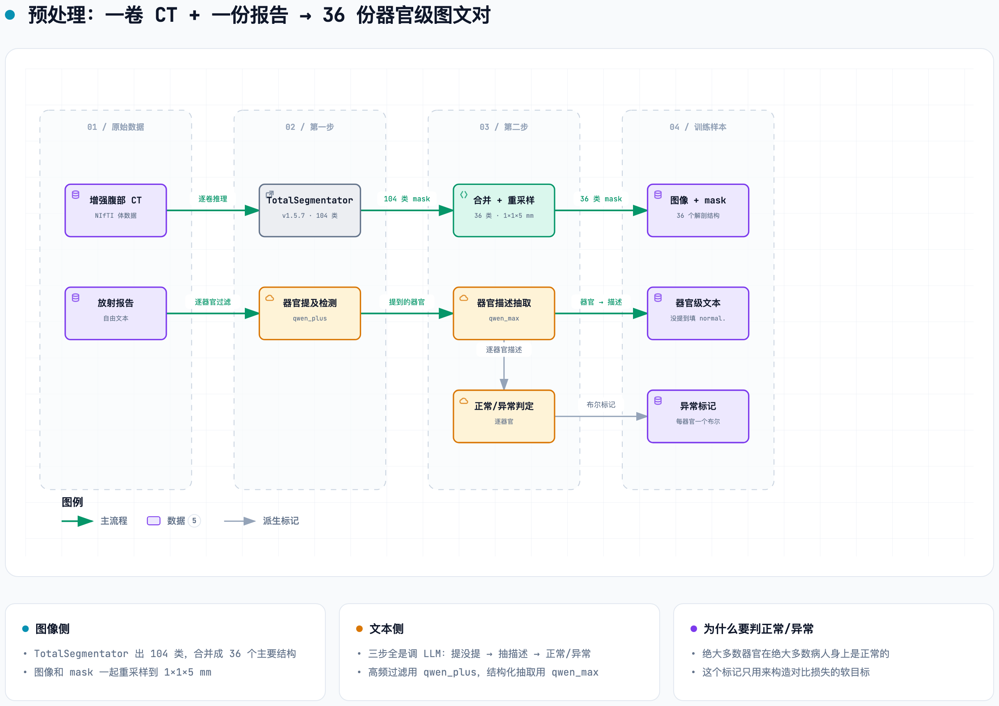
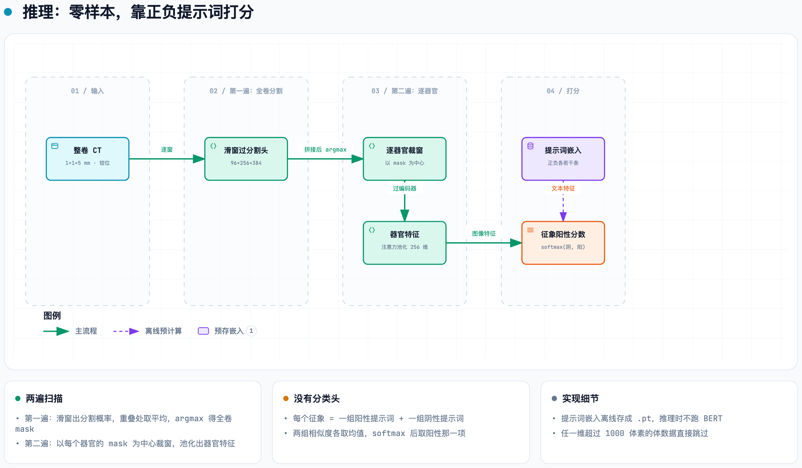

# RADAR 是怎么做出来的 —— 设备、数据、模型、训练、推理

> 全部来自**直接读代码、读仓库文档、调 API**：`alibaba-damo-academy/damo-radar`（Apache-2.0）、HuggingFace `radar-generalist/RADAR`、PyPI、GitHub API。
> Science 正文与补充材料在付费墙后，扫描协议、设备型号、伦理批件这类**只写在 Methods 里的信息这里没有**，各处已标明。
> 核对日期：2026-09-20。

---

## 一句话

RADAR = **一个 3D U-Net 编码器 + 一个 BERT**，用**图文对比学习**对齐；对齐的单位不是"整卷 CT ↔ 整份报告"，而是"**一个器官的图像特征 ↔ 报告里写这个器官的那几句话**"。器官怎么圈出来：模型自带一个 37 通道的分割头。报告怎么拆到器官：用 Qwen 解析。
==模型零件全是现成的，新东西是监督信号的造法和损失函数里的软目标。==

---

## ① 需要什么设备

### 算力

| 环节 | 官方写明的配置 | 出处 |
|---|---|---|
| **训练** | **24 张 GPU（A100 或 H20）**，每卡 batch 2，总 batch 48，**fp32**（`amp: False`），30 epoch | `docs/TRAINING.md` + `radar_config.yaml` |
| 多卡启动 | `torchrun --nproc_per_node=8 train.py`（即 3 台 8 卡机）| `docs/TRAINING.md` |
| **推理** | **单张 A100 或 H20 即可**；大规模推理建议多卡 `torchrun --nproc_per_node=8` | `docs/INFERENCE.md` |
| 预处理（分割教师）| TotalSegmentator v1.5.7，每卷一次 GPU 推理 | `docs/PREPROCESS.md` |
| 预处理（报告解析）| **不需要本地 GPU**，调 DashScope/Qwen API（按 token 付费）| 同上 |

> [!insight] 这个量级放在今天很小
> 24 张卡 × 30 epoch、不开混合精度、batch 48。==卡点从来不是算力，是 42 万份带报告的 CT。==
> 显存占用官方没写。输入 patch 是 `96 × 256 × 384` 的单通道 3D 体，fp32、U-Net 六个 stage，A100/H20（80/96 GB 级）是他们实际用的卡；更小的卡能不能跑，仓库里没有任何说法。

### 模型体积（HuggingFace `radar-generalist/RADAR` 的实际文件）

| 文件 | 大小 | 是什么 |
|---|---:|---|
| `checkpoint_radar_pretrain.pth` | **1,566 MB** | 旗舰：RAD-CT（浙大一院 42 万例）上预训练 |
| `checkpoint_radar_plus.pth` | 1,651 MB | RADAR+：在公开的 Merlin-CT-Train 上从零训练 |
| `checkpoint_radar_plus_finetuned_on_merlin.pth` | 1,651 MB | 旗舰权重在 MERLIN 上微调 |
| `checkpoint_unet.pth` | 208 MB | 只含视觉分支（U-Net）的预训练权重，训练 RADAR+ 时用来初始化 |
| `bert-base-chinese/` | 412 MB | 旗舰用的中文文本编码器 |
| `bert-base-uncased/` | 440 MB | MERLIN 分支用的英文文本编码器 |

208 MB ÷ 4 字节 ≈ **5,200 万参数**的视觉分支（估算）；两份 BERT-base 各约 1.1 亿参数（在线一份 + 动量副本一份），这就是 checkpoint 1.5 GB 的主要来源。

### 软件环境

```
Python 3.10 · torch>=1.10 · transformers==4.25 · timm==0.4.12 · fairscale==0.4.4
monai · batchgenerators · SimpleITK · nibabel · nltk · huggingface_hub
```

`transformers==4.25` 这类老版本 pin 是跟着 LAVIS 走的。环境只需要一个 conda env：

```bash
conda create -n radar python=3.10 && conda activate radar
pip install -r requirements.txt
cd download_scripts && python download_checkpoints.py && python download_auxiliary_data.py
```

### 成像设备这一侧

- 输入是**增强腹部 CT**，NIfTI 格式。覆盖范围实际是**胸腹**：146 个征象里含 10 个肺、3 个肋骨、2 个心脏、1 个骶骨。
- 重采样到 `1 × 1 × 5 mm` 之后才进模型，所以**原始层厚 ≤5 mm 即可**，薄层重建没有额外收益。
- ==扫描仪厂商/型号、kVp、对比剂期相、重建核 —— 公开材料里全都没有==（在 Science Methods 里）。外部中心已知的只有两家：余杭一院 256 排、绩溪县医院 GE 64 排 128 层（见 [grassroots-network.md](grassroots-network.md)）。

---

## ② 数据：三个数据集各管什么

| 数据集 | 规模 | 语言 | 公开吗 | 在 RADAR 里的角色 |
|---|---|---|---|---|
| **RAD-CT** | 424,911 次检查 → 150 万图文对 → **1500 万 anatomy-wise 图文对** | 中文 | ✗ 永不公开 | 旗舰模型的训练集（浙大一院）|
| 内部真实世界评测 | 39,160 例 | 中文 | ✗ | AUC 0.913（95% CI 0.911–0.915）的来源 |
| **MERLIN** | 15,331 例腹部 CT + 报告 | 英文 | ✓ Stanford AIMI | ① 旗舰模型的**外部测试集** ② RADAR+ 的**公开训练集** |

**MERLIN 是 RADAR 全部公开可复现性的载体。** RAD-CT 放不出来，所以他们用这个公开的同任务数据集把整条流水线完整演示了一遍：发布的 TotalSegmentator mask 跑的是斯坦福的 CT，Qwen 解析的是斯坦福的英文报告，`checkpoint_radar_plus.pth` 就是在它上面从零训出来的。

MERLIN 本身：*Nature* **652:1318–1328**（2026），40 位作者全部斯坦福，一作 Louis Blankemeier，通讯 **Akshay S. Chaudhari**，代码与权重 MIT 许可。

---

## ③ 预处理：把"一卷 CT + 一份报告"变成"36 份器官级图文对"

<picture>
  <source media="(prefers-color-scheme: dark)" srcset="../figures/radar-preprocess.dark.png">
  
</picture>

> 交互版 → [../figures/radar-preprocess.html](../figures/radar-preprocess.html)

每个病人最后得到：`{器官名: 描述文本}` + `{器官名: normal/abnormal}` + 整份报告。

**36 个解剖结构**（代码里以中文字符串写死）：肾上腺、主动脉、竖脊肌、脑、锁骨、大肠、十二指肠、食管、面部、股骨、胆囊、臀肌、心脏、髋关节、肱骨、髂动脉、髂静脉、髂腰肌、下腔静脉、肾、肝、肺、胰腺、门静脉、肺动脉、肋骨、骶骨、肩胛骨、小肠、脾、胃、气管、膀胱、颈椎、腰椎、胸椎。

**成本分两档是刻意的**：高频的"提没提"过滤用便宜的 `qwen_plus`，低频的结构化抽取用贵的 `qwen_max`。Qwen 属于阿里云而不是达摩院，RADAR 是跨事业部调商业 API；文档说可换成任何其他 LLM。

**第三步 normal/abnormal 是给损失函数用的**，专门用来压假阴性（见 ⑤）。报告里没提到的器官，文本直接填 `normal.`。

### TotalSegmentator 在这里的角色：离线教师

它**只在造训练标签时用一次**，推理时完全不调用 —— 模型自己带分割头（见 ④）。
钉在 v1.5.7（2023-10-17 发布；v2.0.0 是 2023-09-26，当前 PyPI 2.18.0）是因为训练数据全是按 v1 形状的 mask 对齐的，换版本等于换 pooling 几何，要重跑全部预处理并重训。

| 你要做的事 | 要装 TotalSegmentator v1.5.7 吗 |
|---|---|
| 跑发布的 checkpoint 推理 | ✗ 不需要 |
| 在 MERLIN 上复现 | ✗ 不需要（他们发布了处理好的 mask，HF 上分 part00/01/02）|
| 用自己的数据重新预处理/重训 | ✓ 需要。依赖 `nnunet-customized==1.2` + `batchgenerators==0.21`，必须单独开环境 |

💡 顺带：v2 才有的 `tissue_types` 任务（`subcutaneous_fat` / `skeletal_muscle` / `torso_fat`）v1 里没有，且是非商用许可。做脂肪/肌肉组成只能走 v2 以上。

---

## ④ 模型结构

<picture>
  <source media="(prefers-color-scheme: dark)" srcset="../figures/radar-model.dark.png">
  
</picture>

> 交互版 → [../figures/radar-model.html](../figures/radar-model.html)

### 视觉分支：nnU-Net 的编码器 + 砍薄的解码器

```python
"n_stages": 6,
"features_per_stage": [32, 64, 128, 256, 320, 320],
"kernel_sizes": [[1,3,3],[1,3,3],[3,3,3],[3,3,3],[3,3,3],[3,3,3]],
"strides":      [[1,1,1],[1,2,2],[1,2,2],[2,2,2],[2,2,2],[2,2,2]],
"n_conv_per_stage":         [2,2,2,2,2,2],   # 编码器：标准 nnU-Net
"n_conv_per_stage_decoder": [1,1,1,1,1],     # 解码器：每级只留一层卷积
"norm_op": BatchNorm3d,  "nonlin": ReLU,  "deep_supervision": True
```

- 前两个 stage 的卷积核是 `[1,3,3]`、前三个 stage 的 z 向 stride 是 1 —— **专门适配 5 mm 层厚的各向异性体**：浅层只做面内卷积，z 方向等到面内降够了才开始降。
- 解码器被砍到每级一层卷积：==它不需要一个好的分割器，只需要一个能把标签贴对的粗分割器 + 一组好的编码器特征。==
- 整个 `dynamic_network_architectures/` 是从 MIC-DKFZ 的库 vendored 进来的，RADAR 自己加的只有 `unet_lightdecoder.py` 和 `unet_decoder_light.py`。

### 三个尺度的 token 与解剖标记

最深三层 skip 的累积 stride 分别是 `(2,8,8)` / `(4,16,16)` / `(8,32,32)`。预测出的 mask 用**同样大小的核**做 `max_pool3d`：

```python
F.max_pool3d(masks, kernel_size=(2, 8, 8),   stride=(2, 8, 8))     # → organ_token_flags3
F.max_pool3d(masks, kernel_size=(4, 16, 16), stride=(4, 16, 16))   # → organ_token_flags2
F.max_pool3d(masks, kernel_size=(8, 32, 32), stride=(8, 32, 32))   # → organ_token_flags1
organ_token_flags1[i][unique_values.long() - 1] = highlight_tokens1 > 0
```

池化核等于编码器的累积步长，所以**每个 token 恰好对应一块体素**；只要这块体素里有一个属于器官 k，这个 token 就算器官 k 的。最后一行直接**拿 mask 的整数标签当数组下标** —— 模型需要的不是"一块区域"，是"第 k 号器官在哪"。

在 `[1,1,5]` mm 下，最深层一个 token = **40 mm(z) × 32 mm × 32 mm**。

### 器官特征是怎么池化出来的

**4.1 token 归属** —— 尺度 `s` 的第 `p` 个 token 对应体素块 `Ω_p^(s)`（块大小依次是 `8×32×32`、`4×16×16`、`2×8×8`），`m̂(x)` 是分割头预测的标签：

$$
F^{(s)}_{k,p} = \max_{x \in \Omega^{(s)}_{p}} \mathbf{1}\bigl[ \hat m(x) = k \bigr]
$$

WHY：把体素级 mask 变成"哪些 token 属于器官 `k`"。HOW：就是 `max_pool3d` —— 块里只要有一个体素属于器官 `k`，整个 token 就算它的。

**4.2 注意力池化** —— 器官 `k` 有一个可学习的 query `q_k`（256 维），key/value 是三个尺度里属于它的全部 token：

$$
Z_k = \bigcup_{s=1}^{3} \bigl\lbrace z^{(s)}_{p} \ :\ F^{(s)}_{k,p} = 1 \bigr\rbrace , \qquad h_k = \mathrm{softmax}\Bigl( \frac{(q_k W^{Q})(Z_k W^{K})^{\top}}{\sqrt{d_h}} \Bigr) Z_k W^{V}
$$

WHY：器官大小不一，token 数从几个到几千个不等，要压成一个定长向量。HOW：4 个头、每头 `d_h = 64`、dropout 0.1；上式写的是单头形式。注意力层 36 个器官共用，query 各用各的。

**4.3 投影并归一化** —— 每个器官有自己的一层 `Linear(256 → 256)`：

$$
v = \frac{W_k h_k + b_k}{\lVert W_k h_k + b_k \rVert_2}, \qquad t = \frac{W_t \mathrm{BERT}(\mathrm{text})_{[\mathrm{CLS}]} + b_t}{\lVert W_t \mathrm{BERT}(\mathrm{text})_{[\mathrm{CLS}]} + b_t \rVert_2}
$$

WHY：把图像和文本放进同一个 256 维单位球面，点积才有可比性。HOW：图像侧 36 套 `(W_k, b_k)`，文本侧只有一套 `(W_t, b_t)`。

### 文本分支

| checkpoint | 文本编码器 |
|---|---|
| 旗舰 `checkpoint_radar_pretrain.pth`（中文报告）| **`bert-base-chinese`** |
| RADAR+（MERLIN 英文报告）| `bert-base-uncased` |

取 `[CLS]` 向量过 `Linear(768→256)`。另有一份**动量副本**（momentum 0.995），只用来算文本之间的相似度（见 ⑤），不参与图文对齐本身。

---

## ⑤ 损失函数

### 速查

总损失，两项直接相加、无权重：

$$
\mathcal{L} = \mathcal{L}_{\mathrm{itc}} + \mathcal{L}_{\mathrm{seg}}
$$

对比项的通用形式 —— 软目标交叉熵，`Y` 逐行和为 1：

$$
\mathcal{L}(S, Y) = -\frac{1}{N} \sum_{i=1}^{N} \sum_{j=1}^{N} Y_{ij} \log \frac{\exp S_{ij}}{\sum_{l=1}^{N} \exp S_{il}}
$$

`Y = I` 时退化成标准 InfoNCE（整图分支用它）；器官级分支用软目标：

$$
Y_{ij} = \frac{\delta_{ij} + M_{ij}}{1 + \sum_{l} M_{il}}, \qquad M_{ij} = (1 - \delta_{ij}) \bigl( B_{ij} + a_i a_j \tilde P_{ij} \bigr)
$$

$$
B_{ij} = \max\bigl( (1 - a_i)(1 - a_j),\ e_{ij} \bigr), \qquad \tilde P_{ij} = \frac{\exp( \tilde t_i^{\top} \tilde t_j / \tau )}{\sum_{l=1}^{N} \exp( \tilde t_i^{\top} \tilde t_l / \tau )}
$$

分割项是负的平均 Dice：

$$
\mathcal{L}_{\mathrm{seg}} = -\frac{1}{36 B} \sum_{b=1}^{B} \sum_{c=1}^{36} \frac{2 \sum_{x} p_{b,c}(x) g_{b,c}(x)}{\max\bigl( \sum_{x} p_{b,c}(x) + \sum_{x} g_{b,c}(x),\ 10^{-8} \bigr)}
$$

---

### Known（对某个器官 `k`、某一步迭代）

| 符号 | 含义 | 代码里的名字 |
|---|---|---|
| `N` | 跨所有 GPU `all_gather` 之后、器官 `k` 完整的样本数 | `len(image_feat_all)` |
| `v_i` | 样本 `i` 的器官 `k` 图像特征，256 维，已 L2 归一化 | `image_feat` |
| `t_i` | 样本 `i` 写器官 `k` 的那段文本的特征，256 维，已 L2 归一化 | `text_feat` |
| `t̃_i` | 同一段文本过**动量** BERT 得到的特征 | `text_feat_m` |
| `a_i` | 异常标记，1 = 报告说该器官异常，0 = 正常 | `organ_abnormal_flags` |
| `e_ij` | 两段文本逐字相同则为 1 | `cl_text_input_all[:,None] == [None,:]` |
| `τ` | 可学习温度，初值 0.07，每步钳到 `[0.001, 0.5]` | `self.temp` |

### Want

一个标量损失，让 `v_i` 靠近"该靠近的" `t_j`、远离其余的 —— 关键是**谁算"该靠近的"**。

### Assumptions

- 特征都已 L2 归一化，所以点积就是余弦相似度，取值 `[−1, 1]`。
- 负例只来自当前这一步跨卡汇总的 batch（`queue_size: 0`，ALBEF 原有的负例队列关掉了）。
- 同一个 `Y` 同时用于图→文和文→图两个方向（代码里 `sim_i2t_targets = sim_t2i_targets = sim_targets`）。

### Steps

**5.1 相似度矩阵**

$$
S^{\mathrm{i2t}}_{ij} = \frac{v_i^{\top} t_j}{\tau}, \qquad S^{\mathrm{t2i}}_{ij} = \frac{t_i^{\top} v_j}{\tau}
$$

WHY：把"第 `i` 个图像和第 `j` 段文本有多像"变成 logits。HOW：两个矩阵互为转置；`τ` 越小 softmax 越尖。

**5.2 通用形式：软目标交叉熵**

$$
\mathcal{L}(S, Y) = -\frac{1}{N} \sum_{i=1}^{N} \sum_{j=1}^{N} Y_{ij} \log \frac{\exp S_{ij}}{\sum_{l=1}^{N} \exp S_{il}}
$$

WHY：先写最一般的形式，后面两个分支只是换 `Y`。HOW：对 `S` 逐行 softmax，与目标分布 `Y` 的第 `i` 行算交叉熵，再对行取平均。

**5.3 特例：`Y = I` 就是 InfoNCE**

$$
\mathcal{L}_{\mathrm{InfoNCE}} = -\frac{1}{N} \sum_{i=1}^{N} \log \frac{\exp( v_i^{\top} t_i / \tau )}{\sum_{l=1}^{N} \exp( v_i^{\top} t_l / \tau )}
$$

WHY：只有自己配对的那段文本是正例，batch 里其余 `N − 1` 段全当负例。HOW：分子是正例，分母是全部候选 —— 一个 `N` 选 1 的分类问题。

**5.4 整图分支（RADAR+ 的全局对齐）直接用 InfoNCE**

$$
\mathcal{L}_{\mathrm{whole}} = \tfrac{1}{2} \Bigl[ \mathcal{L}\bigl(S^{\mathrm{i2t}}, I\bigr) + \mathcal{L}\bigl(S^{\mathrm{t2i}}, I\bigr) \Bigr]
$$

WHY：整份报告几乎不会两两相同，硬目标够用。HOW：这里的 `v` 是一个全局 query 对**全部** token 做注意力得到的整卷特征，`t` 是整份报告的 `[CLS]`。

**5.5 器官级分支的问题：硬目标里全是伪负例**

同一个器官，绝大多数病人的文本都是 `normal.`。按 5.3，两个"肝正常"的病人互为负例、被强行推开 —— 这是错的监督。所以要重新定义"谁是正例"。

**5.6 硬正例指示 `B`：都正常，或文本逐字相同**

$$
B_{ij} = \max\bigl( (1 - a_i)(1 - a_j),\ e_{ij} \bigr)
$$

WHY：两个都正常的样本语义上等价；文本完全一样的也等价。HOW：第一项只在 `a_i = a_j = 0` 时为 1；两项取 max（代码里是相加后转 bool）。

**5.7 软正例权重 `P̃`：都异常时，按文本有多像给权重**

$$
\tilde P_{ij} = \frac{\exp( \tilde t_i^{\top} \tilde t_j / \tau )}{\sum_{l=1}^{N} \exp( \tilde t_i^{\top} \tilde t_l / \tau )}
$$

WHY：两个"都异常"不等于同一种异常 —— 肝囊肿和肝癌不该被当成正例，但两个脂肪肝应该部分算。HOW：用**动量** BERT 的文本-文本相似度做逐行 softmax；不回传梯度。分母包含 `l = i` 自己那一项（余弦 = 1，最大），所以非对角的权重天然偏小。

**5.8 合成目标矩阵并逐行归一化**

$$
M_{ij} = (1 - \delta_{ij}) \bigl( B_{ij} + a_i a_j \tilde P_{ij} \bigr)
$$

$$
Y_{ij} = \frac{\delta_{ij} + M_{ij}}{1 + \sum_{l} M_{il}}
$$

WHY：对角线（自己的配对）永远是 1 份权重，其余正例按 `M` 分享。HOW：`a_i a_j` 让软权重只在"都异常"时生效；`(1 − δ_ij)` 把 `M` 的对角线清零；最后每行除以行和。

**算例**（肝，`N = 4`，`a = (0, 0, 1, 1)`，四段文本互不相同，`τ = 0.07`；动量文本余弦：`t̃_3·t̃_4 = 0.9`，其余两两 0.3）：

$$
\tilde P_{34} = \frac{e^{0.9/0.07}}{e^{1/0.07} + e^{0.9/0.07} + 2 e^{0.3/0.07}} = 0.193
$$

$$
Y = \begin{pmatrix} 0.5 & 0.5 & 0 & 0 \cr 0.5 & 0.5 & 0 & 0 \cr 0 & 0 & 0.838 & 0.162 \cr 0 & 0 & 0.162 & 0.838 \end{pmatrix}
$$

两个正常的样本把目标**对半分**；两个描述相近的异常样本是 **84 / 16**；正常与异常之间仍然是 0 —— 继续互为负例。

**5.9 器官 `k` 的损失：两个方向取平均**

$$
\mathcal{L}_k = \tfrac{1}{2} \Bigl[ \mathcal{L}\bigl(S^{\mathrm{i2t}}, Y\bigr) + \mathcal{L}\bigl(S^{\mathrm{t2i}}, Y\bigr) \Bigr]
$$

若 `Y` 的所有元素相等（没有任何对比信息）或这个器官没有文本，跳过。

**5.10 哪些样本、哪些器官进损失**

记 `c_ik = 1` 表示样本 `i` 的器官 `k` **完整** —— 模型自己预测的 mask 不碰 patch 的六个边界面。器官 `k` 只用 `c_ik = 1` 的样本；而且整个跨卡 batch 里至少要有一例"完整且异常"，这个器官才算：

$$
\mathcal{K} = \Bigl\lbrace k \ :\ \sum_{i} a_{ik} c_{ik} \ge 1 \Bigr\rbrace , \qquad \mathcal{L}_{\mathrm{anat}} = \sum_{k \in \mathcal{K}} \mathcal{L}_k
$$

WHY：被裁掉一半的肝不该和"肝脏大小形态正常"对齐；全是正常的器官没有可学的对比。HOW：对 36 个器官**求和**而不是取平均 —— 一步里出现的器官越多，对比项越大。

**5.11 奇偶步交替**（`n` 是迭代计数）

$$
\mathcal{L}_{\mathrm{itc}}(n) = \mathcal{L}_{\mathrm{whole}} \quad \text{if } n \text{ is even (RADAR+ on)}
$$

$$
\mathcal{L}_{\mathrm{itc}}(n) = \mathcal{L}_{\mathrm{anat}} \quad \text{otherwise}
$$

WHY：全局对齐和器官级对齐共用同一个编码器，交替着训而不是加权求和。HOW：`radar_plus: False` 时每一步都是器官级。

**5.12 分割项：负的平均 soft Dice**

$$
\mathrm{Dice}_{b,c} = \frac{2 \sum_{x} p_{b,c}(x) g_{b,c}(x)}{\max\bigl( \sum_{x} p_{b,c}(x) + \sum_{x} g_{b,c}(x),\ 10^{-8} \bigr)}, \qquad \mathcal{L}_{\mathrm{seg}} = -\frac{1}{36 B} \sum_{b=1}^{B} \sum_{c=1}^{36} \mathrm{Dice}_{b,c}
$$

WHY：让分割头学会贴对 36 个器官的标签，供 ④ 的 token 标记用。HOW：`p` 是分割头的 softmax 概率，`g` 是 TotalSegmentator mask 的 one-hot（最近邻降采样到分割头的输出尺寸）；不含背景、`smooth = 0`、逐样本逐类算再平均。取值 `[−1, 0]`；某器官在预测和教师里都不存在时该项为 0。

**5.13 总损失**

$$
\mathcal{L}(n) = \mathcal{L}_{\mathrm{itc}}(n) + \mathcal{L}_{\mathrm{seg}}
$$

两项**直接相加，没有权重系数**。配置里保留了 ALBEF 的 `alpha: 0.4`，代码里还定义了 `_rampup_factor`，但这版 `forward` 里两者都没有被用到 —— ALBEF 的"动量蒸馏"被 5.6–5.8 的软目标整个替换掉了。

**5.14 动量编码器的更新**

$$
\tilde\theta \leftarrow m \tilde\theta + (1 - m) \theta, \qquad m = 0.995
$$

只作用于文本编码器和文本投影层。这一行写在**逐器官的循环里面**，所以一步迭代里会更新 `|K|` 次，等效的每步动量是 `0.995^|K|`。

> [!insight] 真正的方法贡献就是 5.6–5.8 这三个式子
> 报告监督天然带大量伪负例。==normal/abnormal 标记 + 动量文本相似度，就是为了不让模型把"同样正常"或"同样是脂肪肝"的两个病人强行推开。==
> 预处理第三步花钱调 LLM 判 normal/abnormal，钱就花在 `a_i` 这一个布尔量上。

---

## ⑥ 训练配方

| 项 | 值 |
|---|---|
| 框架 | LAVIS 的整个子树搬进仓库后改名（`lavis/models/radar_models/`）；模型注册名 `radar_pretrain` |
| 输入 | pad 到至少 `96×256×384` → **中心裁剪** `96×256×384` → HU 钳位 → 逐体 min-max 到 [0,1] |
| HU 窗 | 旗舰（RAD-CT）**[−300, 400]**；MERLIN 分支跟随 MERLIN 的设定用 **[−1000, 1000]** |
| 优化 | `init_lr 1e-4` → cosine → `min_lr 1e-6`，warmup 3000 步（起点 1e-6），weight decay 0.05 |
| 规模 | 30 epoch，总 batch 48，fp32，seed 42 |
| 队列 | `queue_size: 0` —— ALBEF 原有的 57,600 负例队列被关掉，只用跨卡 `all_gather` 的 in-batch 负例 |
| 开关 | `radar_plus: True` 开全局对齐；`radar_ft: True` 从旗舰权重微调（只加载视觉侧，**文本编码器不加载** —— 因为中文换英文）|

**6.1 输入归一化** —— 先钳位再按这一卷自己的极值拉到 `[0, 1]`：

$$
x' = \frac{\mathrm{clip}(x,\ a,\ b) - x_{\min}}{x_{\max} - x_{\min}}
$$

旗舰 `(a, b) = (−300, 400)` HU，MERLIN 分支 `(−1000, 1000)` HU；`x_min`、`x_max` 取自钳位后的整卷。

**6.2 学习率** —— 第 0 个 epoch 内按步线性 warmup（`s` 是步数，`s_w = 3000`，`η_w = 1e-6`，`η_0 = 1e-4`）：

$$
\eta(s) = \min\Bigl( \eta_0,\ \eta_w + (\eta_0 - \eta_w) \frac{s}{s_w} \Bigr)
$$

之后按 **epoch**（不是按步）余弦衰减（`e` 是 epoch 序号，`E = 30`，`η_min = 1e-6`）：

$$
\eta(e) = \eta_{\min} + \tfrac{1}{2} (\eta_0 - \eta_{\min}) \Bigl( 1 + \cos \frac{\pi e}{E} \Bigr)
$$

微调时，全局对齐那一支的参数（`query_tokens_whole`、`attention_whole`、`vision_projs_whole`）直接**用第 0 号器官的权重初始化**。

快速验证流水线能跑（仓库自带 4 例 demo 数据，不用下全量）：

```bash
cd RADAR_train && python train.py
```

全量训练要改 `lavis/datasets/datasets/caption_datasets.py:79` 的 `vis_root`，并先用 `process_img.py` 把 MERLIN 原图重采样到 `[1,1,5]`。

---

## ⑦ 推理：零样本，靠正负提示词打分

RADAR 没有分类头。146 个征象每个都是"**这个器官的图像特征，更像阳性描述还是阴性描述**"。

<picture>
  <source media="(prefers-color-scheme: dark)" srcset="../figures/radar-inference.dark.png">
  
</picture>

> 交互版 → [../figures/radar-inference.html](../figures/radar-inference.html)

**7.1 滑窗拼接** —— 窗 `w` 给出的第 `c` 类概率记 `p_c^(w)(x)`，重叠处取平均再 argmax：

$$
\bar p_c(x) = \frac{\sum_{w \ni x} p_c^{(w)}(x)}{\max\bigl(\lvert \lbrace w : w \ni x \rbrace \rvert,\ 1\bigr)}, \qquad \hat m(x) = \operatorname*{arg max}_{c}\ \bar p_c(x)
$$

WHY：单窗只覆盖 `96×256×384`，整卷要拼。HOW：窗步长 = `roi × (1 − 0.25)`。

**7.2 正负提示词打分** —— 征象 `f`（属于器官 `k`）有阳性提示词集 `P_f`、阴性提示词集 `N_f`，器官特征 `v`：

$$
s^{+} = \frac{1}{\lvert P_f \rvert} \sum_{p \in P_f} \frac{v^{\top} t_p}{\tau}, \qquad s^{-} = \frac{1}{\lvert N_f \rvert} \sum_{n \in N_f} \frac{v^{\top} t_n}{\tau}
$$

$$
\mathrm{score}_f = \frac{e^{s^{+}}}{e^{s^{+}} + e^{s^{-}}} = \sigma\bigl(s^{+} - s^{-}\bigr)
$$

WHY：没有分类头，分数就是"更像阳性描述还是阴性描述"。HOW：先在组内取均值（提示词集成），再两路 softmax；`τ` 用训练学到的温度。一个器官落在多个窗里时，各窗分数再取平均。

- 提示词嵌入是**离线算好**的：`ckpt/infer_text_embedding_radar.pt`（旗舰）/ `infer_text_embedding_merlin.pt`，推理时不跑 BERT。每个征象是**多条提示词的集成**（prompt ensemble）。
- 任何一维超过 1000 体素的体数据会被直接跳过。
- 146 个征象名和中英对照表**硬编码在 `inference_demo.py`** 里，换征象表要改代码。

```bash
cd RADAR_inference && python inference_demo.py        # 单卡，自带一个 demo NIfTI
# → RADAR_infer_results_demo.csv
```

MERLIN 测试集上用的是 MERLIN 官方发布的提示词，保证和别的模型可比。

---

## ⑧ 146 个征象、18 个器官

从 `inference_demo.py` 的 `self.test_items` 直接数：

```
大肠 18   肝 18    肾 14    胆囊 14   小肠 13   肺 10
胰腺 10   脾 8     肾上腺 6  胃 6     膀胱 6    十二指肠 5
食管 5    主动脉 4  肋骨 3   门静脉 3  心脏 2    骶骨 1        合计 146
```

征象粒度示例：`肝_肝细胞癌`、`肝_脂肪肝`、`肝_肝内胆管扩张`、`胰腺_胰管扩张`、`大肠_阑尾炎`、`小肠_梗阻`、`主动脉_主动脉夹层`、`门静脉_栓塞`、`肺_气胸`。

---

## ⑨ 公开可查的性能数字

**仓库里能复现的（MERLIN）：**

| 模型 | 设定 | AUC |
|---|---|---:|
| RADAR（旗舰）| RAD-CT 训练，**直接**在 MERLIN 测试集上零样本 | **0.883**（21 个征象平均）|
| RADAR+ | Merlin-CT-Train 上从零训练 | 0.888（anatomy）|
| RADAR+ | 旗舰权重在 Merlin-CT-Train 上微调 | **0.918**（anatomy）/ 0.876（all）|

旗舰模型在 MERLIN 上的逐项 AUC：腹主动脉瘤 0.990、肠梗阻 0.970、脾大 0.968、胸腔积液 0.957、肾囊肿 0.943、胰腺萎缩 0.936、胆囊结石 0.919、肝脂肪变 0.892 …… 最低的两项是**肺不张 0.709** 和**骨折 0.683**。

**论文里的（内部数据，无法独立复现）：** 146 征象平均 AUC 0.913（对照视觉-语言模型 0.776）；8 个外部中心 0.895；训练时排除的急腹症 0.904；26 位放射科医生、14 个中心的 reader study，人机协同敏感度提高约 10%。

| 结论 | 证据强度 | 理由 |
|---|---|---|
| MERLIN 上 0.883 | **强** | 公开数据 + 公开权重 + 公开脚本，任何人可重跑 |
| reader study（26 人 / 14 中心）| **强** | 规模真实，Science 摘要原文 |
| 急腹症 0.904 | **强** | 训练时排除，干净的分布外测试 |
| 8 外部中心 0.895 | 中强 | 泛化信号真实；但外部中心 8/10 在浙大一院自己的体系内 |
| 146 征象平均 0.913 | 弱 | 患病率差几个数量级，均值被常见又明显的征象拉高 |

---

## ⑩ 物理层面的三条边界

```python
image[image > 400] = 400
image[image < -300] = -300
image = (image - image.min()) / (image.max() - image.min() + 1e-8)
```

| 边界 | 机制 | 后果 |
|---|---|---|
| **地板 −300 HU** | 肺实质 −700～−900 HU、空气 −1000 HU 全部钳到 −300 | 气胸与正常肺在输入里数值相同；10 个肺征象只能靠几何推 |
| **天花板 400 HU** | 钙化、骨、浓对比剂全部饱和 | "钙化"退化成"有没有饱和体素"，密度大小的信息没有了 |
| **逐体 min-max** | 归一化用的是这一卷自己的 min/max | 绝对 HU 标度不进网络 |
| **z 向各向异性** | 5 mm 层厚 + 最深 token 40×32×32 mm | 一个 8 mm 病灶 ≈ 最深 token 体积的 1/125 |

MERLIN 上最低的两项正好对上：**骨折 0.683**（天花板）、**肺不张 0.709**（地板）。

> [!insight] 这不是缺陷，是这条路线的定义
> RADAR 把 CT 当成一张**带解剖标签的灰度图**。它能到 0.913，恰恰说明大部分常见腹部征象不需要定量密度。
> ==反过来，凡是需要定量密度的（脂肪分数、碘浓度、材料组成、部分容积边界），输入里已经没有那个信息了 —— 原理上到不了，不是工程没做好。==

---

## ⑪ 依赖的健康状况

| 依赖 | 归属 | 用得多深 | 状态（2026-09-20）|
|---|---|---|---|
| **LAVIS** | Salesforce，BSD-3 | 整个子树搬进仓库改名；ALBEF 的超参原样保留 | ⚠️ **2026-09-18 已归档**，最后一次实质提交 2024-11-18 |
| **dynamic-network-architectures**（nnU-Net）| MIC-DKFZ，Apache-2.0 | 整包 vendored + 自加两个轻解码器文件 | ✅ 活跃 |
| **MONAI** | Project-MONAI，Apache-2.0 | 只用了 4 个符号：`transforms`、`dense_patch_slices` 等纯几何工具 | ✅ 活跃 |
| **3D-ResNets-PyTorch** | kenshohara，MIT | 致谢里列了，`resnet_vl.py` 在仓库里但**推理链和训练链都没有 import** | 2021-01 后无更新 |
| **TotalSegmentator v1.5.7** | 巴塞尔大学医院，Apache-2.0 | 仅离线造标签 | v1 线已停；当前 2.18.0 |
| **Qwen / DashScope** | 阿里云，商业 API | 仅离线解析报告 | 可替换为任意 LLM |

---

## ⑫ 许可

| | |
|---|---|
| GitHub 代码 | **Apache-2.0** |
| HuggingFace 权重 | **CC BY-NC-SA 4.0** —— 禁商用 + 相同方式共享 |
| MERLIN 数据 | Stanford AIMI 的数据使用协议；代码/权重 MIT |

==研究复现没问题，进产品线不行。==

---

## ⑬ 想自己跑一遍：最短路径

```
A. 只看效果（1 张 A100/H20，约 2 GB 权重）
   pip install -r requirements.txt → download_checkpoints.py → python inference_demo.py

B. 在公开数据上复现 0.883（需申请 MERLIN）
   下载 MERLIN → transform_report_to_json.py / transform_label_to_json.py
   → python inference_merlin_testset.py → python calc_metrics_merlin_testset.py

C. 在 MERLIN 上训练 RADAR+（官方用 24 卡；卡少就是慢，batch 变小会影响 in-batch 负例数量）
   下载 HF 上的 resized_masks part00-02 并合并 → process_img.py 重采样原图
   → 改 caption_datasets.py:79 → torchrun --nproc_per_node=8 train.py

D. 换成自己的数据（这一步才需要 TotalSegmentator v1.5.7 + LLM API）
   TotalSegmentator v1.5.7 → process_img_mask.py → 三个 report 解析脚本 → 同 C
```

⚠️ D 这条路对**报告语言**敏感：文本编码器要和报告语言匹配（中文 `bert-base-chinese` / 英文 `bert-base-uncased`），换语言时视觉侧权重可以继承，文本侧必须重训。

---

## 对 Shu 的工作意味着什么

**可以直接拿走的：解剖单元化。** 用现成的自动分割器把整卷 CT 切成解剖单元，所有下游量在单元上汇总 —— 这一步不含任何学习参数。几百例的材料分解数据可以照做：water/lipid/protein 分数、噪声、误差预算按解剖结构汇总，统计功效从"几百个 ROI"变成"几百 × N 个单元"，同时去掉手画 ROI 的读者间变异。

**不能拿走的：它对分割精度的态度。** RADAR 把 mask 池化到 40×32×32 mm 照样工作，因为它只要"这堆 token 属于肝"。材料分解里，==边界就是部分容积效应，边界就是信号本身==。

**值得抄的是软目标的思路。** "同样正常的两例不该互相排斥" —— 任何用弱标签做对比学习的场景都会遇到同一个问题。

**报告监督到不了定量物理量。** 146 个征象里有"脂肪肝"，输出是一个与报告文字一致的概率。没有任何一份放射报告会写"脂肪分数 0.62"。

---

## 公开材料里查不到的

- 扫描仪型号、kVp、对比剂期相、重建核、原始层厚分布
- RAD-CT 的时间跨度、来自哪几家医院、伦理批件号
- 146 个征象各自的阳性例数
- 对照的视觉-语言模型具体是哪几个
- 训练实际用时、显存占用
- 旗舰模型训练时是否开了 `radar_plus`（发布的 `radar_config.yaml` 是 MERLIN 分支的配置）

---

## See Also

- [radar-vs-medsam.md](radar-vs-medsam.md) —— 与 MedSAM 的关系
- [grassroots-network.md](grassroots-network.md) —— 外部验证中心
- [../data/raw/dependency-stack-evidence.md](../data/raw/dependency-stack-evidence.md) —— 依赖核查的原始命令与输出
- [../README.md](../README.md)
