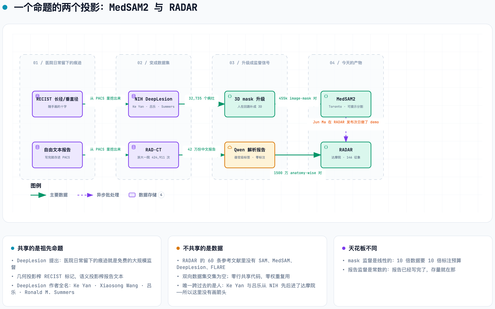

# RADAR ↔ MedSAM：到底什么关系

> 证据来自 GitHub / HuggingFace API、Crossref、OpenAlex、PubMed 与两边仓库的源码。核对日期：2026-09-20。

---

## 一句话

**两个模型之间没有关系；两个团队之间有关系。** 这两句要分开说。

---

## ① 最活的一条：Jun Ma 在 RADAR 发布第二天给它做了 demo

==RADAR 发布后第二天的事。==

```
2026-09-18          用户 jizhang02 在 damo-radar 开 issue #1 "Online tool?"
2026-09-19 03:17:41 UTC   JunMa11 创建 HF Space  junma/RADAR-demo
2026-09-19 03:49:16 UTC   JunMa11 在 issue #1 回帖："Here you go: https://huggingface.co/spaces/junma/RADAR-demo"
                          ↑ 建完 Space 到贴出来，间隔 32 分钟
```

可复核：

```bash
curl -sL "https://api.github.com/repos/alibaba-damo-academy/damo-radar/issues/1/comments"
curl -sL "https://huggingface.co/api/spaces/junma/RADAR-demo"
```

Space 元数据：`author: junma`，`sdk: gradio`，`title: "RADAR Abdominal CT Demo"`，`license: cc-by-nc-sa-4.0`，tags 含 `abdominal-ct` / `vision-language` / `RADAR`。

> [!insight] 这不是合作，是两种组织模式的活体标本
> **达摩院出模型和临床数据；多伦多这边出可用性、benchmark 和社区基础设施。**
> 别人放出权重，Jun Ma 48 小时内包一个可点的 Gradio demo 出来 —— 而且 license 字段老老实实填了 `cc-by-nc-sa-4.0`，尊重了 RADAR 权重的非商用条款。
> ✓ 这条连接是**单向的、下游的、即时的**。它不是学术合作，是生态位分工。

---

## ② 人事连接链：两跳，首跳是真实共同署名

```
Bo Wang / Jun Ma
   │  FLARE22 挑战赛报告  Lancet Digital Health 6(11):e815, 2024
   │  DOI 10.1016/S2589-7500(24)00154-7
   │  Crossref 作者表共 37 位：#1 Jun Ma · #33 Heng Guo · #37 Bo Wang
   ▼
Heng Guo（达摩院）
   │  Med-Query: Steerable Parsing of 9-DoF Medical Anatomies, IEEE JBHI 2024
   │  DOI 10.1109/JBHI.2024.3461951
   │  五位作者全部署 "DAMO Academy, Alibaba Group, Hangzhou, China"
   │  Heng Guo · Jianfeng Zhang · Ke Yan · Le Lü · Minfeng Xu
   ▼
Jianfeng Zhang  = RADAR 第 37 位作者（达摩院 + 湖畔实验室）
   ▼
RADAR
```

**路径长度 2，首跳是同一个作者表里的直接共同署名，全程在腹部 CT 解析这一个子领域内。**

⚠️ 查这篇的作者表要用 **Crossref**（37 位）。Europe PMC 的记录被截断到 29 位，Heng Guo 不在里面。两个来源的 affiliation 字段都是空的，所以他在这一篇上署的单位查不到 —— 他的达摩院身份来自 Med-Query。

### 机构级而非个人级：达摩院确实参加了 FLARE22

FLARE22 获奖页原文（我 curl 的）：

```
Code   : https://github.com/alibaba-damo-academy/Med_Query
Docker : docker pull miccaiflare/damomia
```

✓ 代码仓库在**达摩院官方 org 下**，不是个人 fork —— 这是机构层面的参赛。

反向也成立：达摩院的 **Alice（ICCV 2023）** 用 FLARE22 的 2000 例无标注 CT 做预训练。
**→ 这是双向的基础设施关系：达摩院的系统被放在 Wang Lab 策划的数据和指标下评测；Wang Lab 策划的数据反过来喂了达摩院的预训练。**

---

## ③ 论文层面：模型零关系，团队之间有零星互引

RADAR 的 60 条正文参考文献（Crossref 取，52 个 DOI 逐条解析 + 8 条 unstructured 逐字读）：

✗ 没有 SAM · 没有 MedSAM · 没有 MedSAM2 · 没有 DeepLesion · 没有 FLARE · 没有 AbdomenCT-1K
✓ 分割侧只引 **nnU-Net**（10.1038/s41592-020-01008-z）和 **TotalSegmentator**（10.1148/ryai.230024）

唯一沾边的一条：RADAR 引用了 **PANORAMA**（*Lancet Oncology* 2025, DOI 10.1016/S1470-2045(25)00567-4），该文 144 位作者里有 **Jun Ma、Bo Wang、Alan Yuille**。引的是"胰腺癌检测的既有临床证据"，不是 Wang Lab 的技术。

反向：**MedSAM2 引了 PANDA**（作者含 Ling Zhang、Le Lu、Qi Zhang、Tingbo Liang），但在正文只出现两次，都是列举性质，零比较、零基线、零讨论。

还有一条容易漏的：**RADAR 的第 2 作者 Jianpeng Zhang 领衔的综述**（*Computer Science Review* 2025, DOI 10.1016/j.cosrev.2024.100721，223 条参考文献）**引用了 MedSAM**，共同作者 Qi Wu、Yutong Xie、Yong Xia 全是 RADAR 作者。
→ "论文没引"不等于"团队不关注"。

---

## ④ 数据谱系：共同祖先是 DeepLesion，但这座桥只单向承重

<picture>
  <source media="(prefers-color-scheme: dark)" srcset="../figures/deeplesion-lineage.dark.png">
  
</picture>

> 🖼 上图是静态导出。**交互版（几何方向 / 语义方向 / 连接的是人，三个导览视图）→ [../figures/deeplesion-lineage.html](../figures/deeplesion-lineage.html)**
> 图源 [../figures/deeplesion-lineage.dataflow.json](../figures/deeplesion-lineage.dataflow.json)。

⚠️ 图里**故意没有画**一条从 DeepLesion 指向 RADAR 的箭头 —— 画了就等于暗示有数据通路，而事实恰恰相反：跨过去的只有人（Ke Yan 与吕乐从 NIH 先后进了达摩院），数据一份都没过去。

**DeepLesion 提出的核心命题是：医院日常留下的痕迹就是免费的大规模监督。** 两条线是这一个命题的两个投影 —— 一个榨几何，一个榨语义。

⚠️ 但"共同祖先"不等于"有关系"：

- DeepLesion 被引 **587 次**。按"用了 DeepLesion 就算有关系"的标准，587 个研究组全都和达摩院有关系。
- 判定关系的正确检验是**反向**：RADAR 用了 Wang Lab 的什么？→ **零**。整仓 grep 零命中，60 条参考文献零命中。
- ==一条只能单向承重的桥不是桥。==

**另一方面，** RADAR 作者 Jianfeng Zhang 与 **Ke Yan、Le Lu 在 Med-Query 上直接共同署名**。所以"RADAR 团队 ↔ DeepLesion 作者"不是间接的人员流动，是直接的共同发表。
→ 只不过这条通向**达摩院内部**，不通向多伦多。

### 顺带澄清一个极易混淆的点

达摩院自己有一个叫 **SAM** 的东西：**Self-supervised Anatomical eMbedding**（IEEE TMI 2022，`alibaba-damo-academy/self-supervised-anatomical-embedding-v2`）。
==比 Meta 的 Segment Anything Model 更早，完全无关。== 看到达摩院的文献里写 "SAM" 先确认是哪一个。

---

## ⑤ 唯一的技术正面接触点：FastSegmentator

`bowang-lab/FastSegmentator`，创建 2026-02-24，最后推送 2026-07-22。自述是 nnU-Net 和 **TotalSegmentator** 的 GPU 全链路快速推理实现，宣称在 24 个 parity-validated 模式下复现官方 TotalSegmentator 输出（headline 模式 ≥0.999 DSC）并快 2–9×。

> [!insight] RADAR 整条流水线最前端依赖的那个工具，Wang Lab 正在做它的加速替代品
> 这是两组目前唯一的技术正面接触 —— 而且是**竞争性的，不是合作性的**。

---

## ⑥ 两种路线的结构对比

| | **MedSAM / MedSAM2** | **DAMO RADAR** |
|---|---|---|
| 任务本体 | 可提示分割：人给框，模型描边 | 无提示诊断：整卷进，146 个征象概率出 |
| **责任边界** | 判断留给人 → 永不为漏诊负责 | 判断吞进去 → 要为漏诊负责 |
| 失败模式 | "你给的框我描歪了"（**可局部验收**）| "那个 8 mm 胰腺灶我没提"（**只能统计验收**）|
| 输出语义 | **class-agnostic** —— 不知道描的是肝还是脾 | 带解剖标签的征象概率 |
| 监督信号 | 人手标的 mask：455k 3D 对 + 76k 视频帧 | 报告经 LLM 解析：42 万检查 / 1500 万 anatomy-wise 对 |
| **单位监督的边际成本** | 标一个 mask 的人力（分钟/例）| 调一次 LLM 的 token 费（分钱/份报告）|
| **规模天花板** | **线性**：10 倍数据 = 10 倍预算 | **常数**：报告已经写完了，存量就在那 |
| 信号质量 | 像素级精确，但只描述"形状" | 语义级丰富，但**完全不定位** |
| 数据来源 | 公开数据再加工 + 竞赛数据 | 一家三甲医院的 PACS 存量 + 协作网络 |
| 可扩散性 | ✓ 可扩散（别人也能做同样的事）| ✗ 不可扩散（机构准入买不到）|
| 验证形式 | Dice + **标注成本下降 85%** + user study | AUC + 病理确诊子集 + 8 外部中心 + 26 人 reader study |
| **验证服务于谁** | **做研究的人**（省标注工）| **买设备的人**（换家医院还准吗、和金标准比呢、医生用了会不会更好）|
| 代码许可 | Apache-2.0 | Apache-2.0 |
| 权重许可 | ⚠️ **自相矛盾**：HF YAML 写 `cc-by-sa-4.0`（允许商用），同页正文写 "research and education purposes"（不允许）| CC BY-NC-SA 4.0（明确禁商用）|
| 权重可迁移性 | ✓ 完胜：3D Slicer 插件、Gradio、2 个 Colab、5 个 checkpoint、跨 CT/MRI/PET/超声/内镜 | ✗ 只吃增强腹部 CT，36 个器官写死在代码里（而且是中文字符串）|
| **方法可迁移性** | ✗ 已是迁移的终点（拿 SAM 2.1 微调）| ✓ **"用 LLM 把存量报告解析成 anatomy-wise 监督"任何有 PACS 的科室都能复刻** |

> [!strategy] 天花板那一行是全表最重要的
> MedSAM2 的 85% 成本下降是**把线性斜率压小**，不是**把线性变成常数**。RADAR 换的是量纲。
> ==这就是为什么 RADAR 敢做 146 个 findings，而 MedSAM2 只能做"分割"==——146 个 findings 如果要 mask 监督，光设计标注规范就是一个博士的四年。
> 代价是对称的：**报告里没有坐标。** "肝右叶见低密度灶"不告诉你它在第几层第几个像素。RADAR 靠那 36 个解剖 mask 把无坐标的文本挂到空间上 —— 解剖分割在这里扮演的是**报告文本的定位器**。

### 许可那一行，真正的差别是两个字母：NC

**共同点比差异更说明问题：两边都对代码慷慨、对权重设限。**

代码是方法，拿去用无所谓 —— 论文发了，引用拿到了。权重是**数据的压缩表示**，而数据是拿不回来的资产。

- RADAR 加 NC，是在保护医院的资产和阿里的产品线（PANDA 已拿 FDA breakthrough device designation，商业化通道必须留着）。**边界画得清清楚楚。**
- MedSAM2 没加 NC，但正文那句 "research and education only" 暴露了同样的犹豫 —— 学术组织想开放，但没想清楚下游被商业化之后自己的位置。**边界是糊的。**

==糊掉的边界对复用者其实更危险。==

---

## ⑦ 会不会合流？

### RADAR 的上游分割换成 MedSAM2？**不行，而且换了也没用。**

三条理由，从弱到强（代码依据见 [radar-technical-teardown.md](radar-technical-teardown.md)）：

① **提示问题。** MedSAM2 要 bounding box。36 个器官就是 36 个框。谁来给？要是上一个检测器，那你已经有了全自动定位，TotalSegmentator 的位置根本没被动过。

② **语义问题（决定性）。** MedSAM2 输出 class-agnostic mask。RADAR 需要的不是"一块区域"，是"**索引为 k 的那块是肝**"：

```python
organ_token_flags1[i][unique_values.long() - 1] = highlight_tokens1 > 0
```

==它直接拿 mask 的整数标签当数组下标。class-agnostic 的输出天然缺的就是这个整数。== MedSAM2 在这条链上不生产任何 RADAR 需要的信息。

③ **精度根本不重要（最反直觉的一条）。** mask 被 `F.max_pool3d` 以 `(2,8,8)` / `(4,16,16)` / `(8,32,32)` 三档压成 token 级布尔标记。最粗那档一个 token 覆盖 **8×32×32 体素 = 40×32×32 mm**。MedSAM2 相对 TotalSegmentator 多出的那几个点 Dice 会被 max-pooling 完全吃掉。

④ 而且推理时 RADAR 用的是自带的 37 通道 U-Net，**TotalSegmentator 连运行时依赖都不是**。要"换"，换的是离线的教师标签生成器 —— 那等于重新预训练整个视觉分支。投入产出比荒谬。

### MedSAM2 接上报告监督？**可行，但要绕一圈，而这个圈已经有人走过了。**

障碍是同一个：**报告不定位**。"肝右叶低密度灶"生成不了框，没有梯度路径能从文本走到 mask decoder。

可行路线只有一条：**弱定位 → 伪框 → MedSAM2 精修**。

而这正是 `CT_DeepLesion-MedSAM2` 已经做过的事 —— 只不过"弱定位"那一步不是模型给的，是**医生给的**（RECIST bookmark）。

> [!insight] 所以"会不会合流"这个问题问错了
> ==它们不会在模型层面合流，因为它们已经在思想层面是同一件事的两个投影。==
> 真正的合并点不是"RADAR 用 MedSAM2 分割"，而是**一个模型同时输出 findings 概率和该 finding 的 mask** —— 报告监督提供"是什么"，稀疏的 RECIST/bookmark 监督提供"在哪"，两种免费痕迹互补。
> 最接近的先例是 **MERLIN**（Stanford，*Nature* 2026，10.1038/s41586-026-10181-8），它已经把 segmentation 列为 model-adapted task 之一 —— 而 MERLIN 正好就是 RADAR 的外部测试集。

---

## ⑧ Wang Lab 的人事现状

| | |
|---|---|
| **Bo Wang** | 2025-06 入职 **Xaira Therapeutics**（十亿美元级 AI 制药公司）任 Head of Biomedical AI，**2026-07 升 Chief AI Scientist**。学术职位仍在（EchoJEPA 2026-02 通讯署 `Bo.Wang@uhn.ca`，UHN/UofT/Vector 三个 affiliation 都还在），但产出重心已从医学影像漂到细胞生物学（X-Cell、X-Atlas/Pisces）|
| **Jun Ma** | **已独立为 PI**：Scientist, Princess Margaret Cancer Centre；Machine Learning Lead, UHN AI Hub。2025-05-26 注册了自己的 GitHub 组织 **`medfm-flare`**（"FLARE Lab — JunMa's Lab at UHN and UofT"），20 个仓库，2026-09 仍在高频推送 |
| **实验室官网** | `wanglab.ml` **已死**（无 A 记录、无 NS 记录），Wayback 最后成功抓取 2023-06-08；`wanglab.ai` 现在是域名拍卖页 |
| **MedSAM2 仓库** | 最后一次 push **2025-07-11**，之后无更新。**没有 MedSAM3 的公开迹象** |

> [!insight] "MedSAM 是 Bo Wang 的工作"这个说法需要修正
> 证据指向 **Jun Ma 才是这条线的智力与运营中心**：MedSAM 一作、MedSAM2 共同一作、U-Mamba 一作、FLARE 系列（21→22→23→25→26）主要组织者、AbdomenCT-1K/SegLossOdyssey/SOTA-MedSeg 全在他个人账号下。Bo Wang 是资源与署名端。
> ==而影像这条线现在已经从 `bowang-lab` 迁到了 `medfm-flare`。==
> ⚠️ 另：MedSAM2 的共同一作 **Zongxin Yang 在 Harvard DBMI**，是 AOT/DeAOT 视频分割的作者 —— **MedSAM2 的视频能力来自哈佛那半边，不是多伦多。**

⚠️ Bo Wang 的 Google Scholar（总引 48,251，h=81）有明显的**同名合并污染**，条目里混进了 "Gemini 2.5"、"BLOOM 176B"、"InternVL"。引用这个 h-index 要打折。可靠的自有代表作：MedSAM（*Nat Commun* 2024，4,818 引）、SNF（*Nat Methods* 2014）、scGPT（*Nat Methods* 2024）、U-Mamba。

---

## ⑨ 对 Shu 的启示

> [!strategy] 两条路线都不能直接移植，但**可移植的东西不是同一个**

**① RADAR 的模型学不了，但它的 anatomy-token 技巧可以偷，且零成本。**

RADAR 最值钱的工程 trick 不是 VLM，是"**用一个现成的自动分割器把整卷 CT 切成解剖单元，所有下游量都在解剖单元上算**"。这个 trick 不含任何学习参数。
你几百例的材料分解数据，可以用它把每例自动切成器官，然后把 water/lipid/protein 分数、噪声、误差预算全部**按解剖结构汇总**，而不是按手画 ROI。
==这把统计功效从"几百个 ROI"放大到"几百 × N 个解剖单元"，并消除读者间变异==——而读者间变异正是 PVAT / FAI 那条线上反复撞到的东西。

**② 但有一条反向的物理警告：RADAR 对分割精度的容忍度极高，你的极低。**

RADAR 可以把 mask 池化到 40×32×32 mm 还照样工作，因为它只要"这堆 token 属于肝"。
你做材料分解，==**边界就是 partial volume effect，边界就是信号本身**==。
所以可以偷 RADAR 的"解剖单元化"，**绝不能偷它对分割质量的态度**。在边界精度上，MedSAM2 那种 promptable + human-in-the-loop 精修的范式才是对的：给一个框 → 模型给一个可以一眼验收、必要时手改的 mask → 改完回流成下一轮训练数据。
💡 **几百例恰好是 human-in-the-loop 最划算的区间** —— 太少不值得搭流程，太多人改不过来。

**③ 监督信号这一层，你处在 RADAR 的反面，而这是优势。**

RADAR 的全部设计在回答"我有海量数据但没有标签"。
你的处境是"我有少量数据但**有真值**"—— phantom 已知浓度、已知材料、已知 keV。
==已知真值在小数据上的信息密度，远高于 42 万份报告里的弱标签。==
✗ 任何让你放弃 phantom 真值去追"大数据自监督"的建议都是在往下走。
✓ 该做的是相反的事：把真值用到极致（per-rod refit、误差预算、noise-aware GLS），只在**评价形式**上学 RADAR。

**④ 真正该抄的是验证形式，不是模型。**

| | 服务于谁 | 你要说服谁？ |
|---|---|---|
| Dice + 标注成本下降 | 做研究的人 | |
| AUC + 独立金标准子集 + 多读者 + 外部中心 | 买设备的人 / 监管 | ← **这一套** |

Dice 只能回答"我省了你多少标注工"，而标注工不是临床科室的成本项，是**研究组**的成本项。
这和在 Slomka EAT pipeline 上得出的结论是同一条：**copy the evaluation form, not the model.**

---

## 未解决的（不要当成已知）

- Science 正文与 Supplementary Materials 在付费墙后（403）。核的是 Crossref 返回的 60 条正文参考文献；若补充材料另有独立编号的参考文献表，未核。
- FLARE22 那篇的 Declaration of interests 原文（Lancet 站点 403）未读到。Heng Guo 在**那一篇**上的署名单位，公开元数据为空。
- RADAR 上线三天，被引 **0**。目前没有任何第三方 benchmark 或综述把两者并置 —— "类别错误"的论证是关于当下文献状态的，不是关于未来的。
- MedSAM2 只有 arXiv v1，无同行评议版本。

---

## See Also

- [radar-technical-teardown.md](radar-technical-teardown.md) —— RADAR 源码级拆解
- [authors-affiliations.md](authors-affiliations.md) —— 40 位作者骨架表
- [../data/raw/](../data/raw/) —— 取证存档（完整 URL）
- [../README.md](../README.md)
